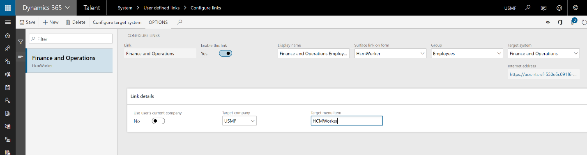
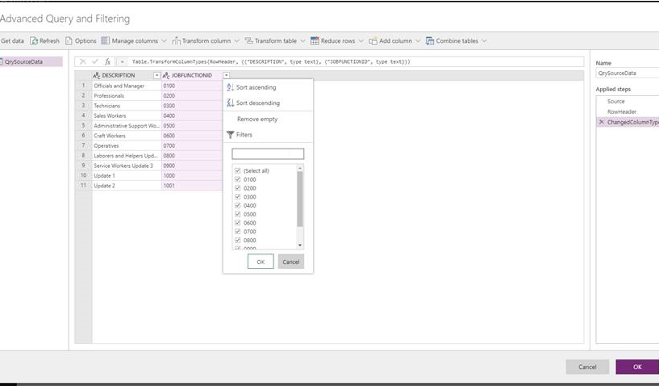
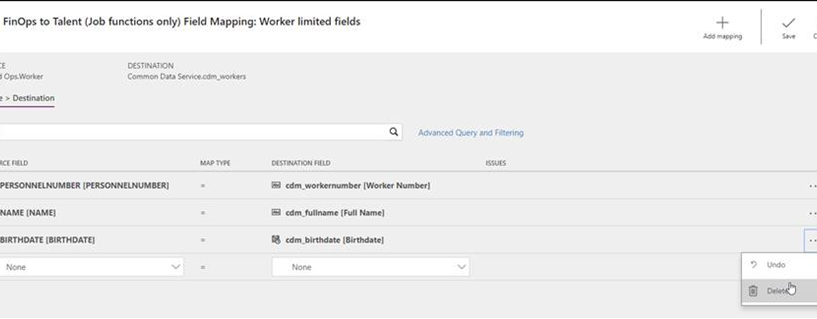
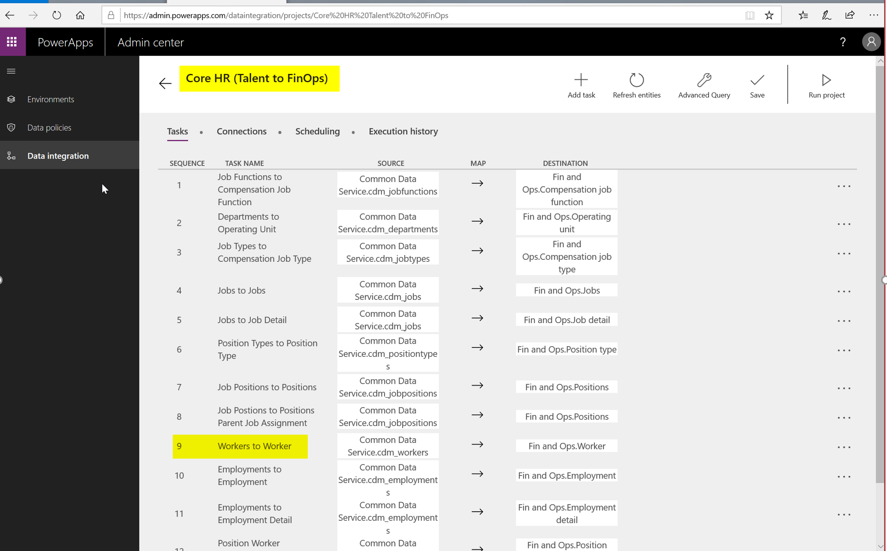
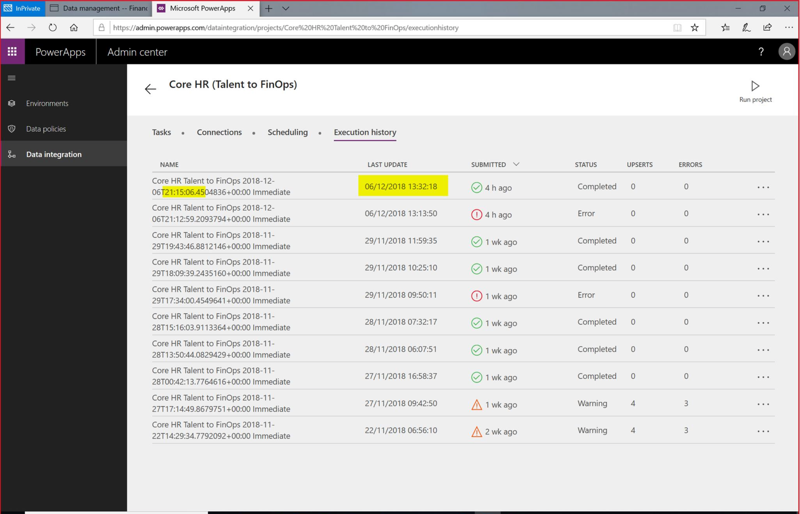
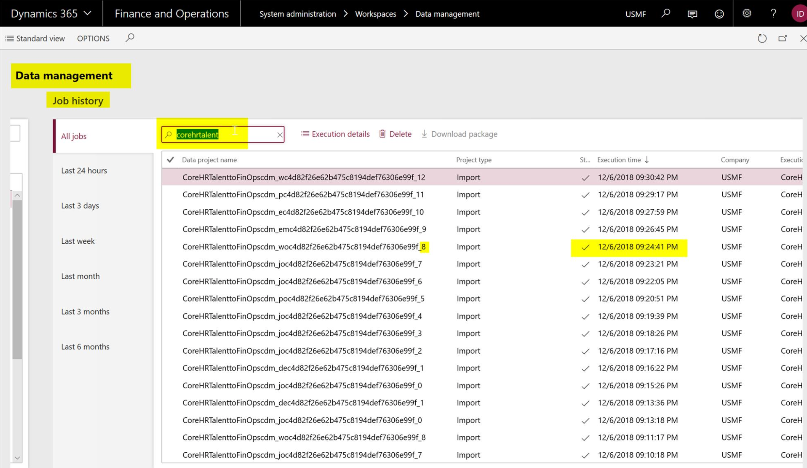
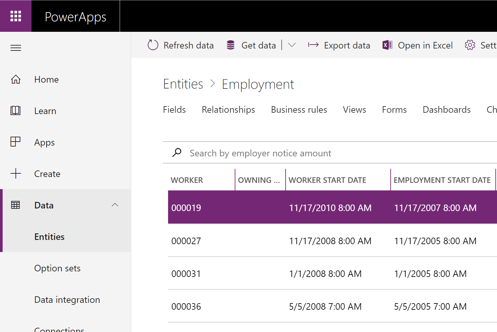
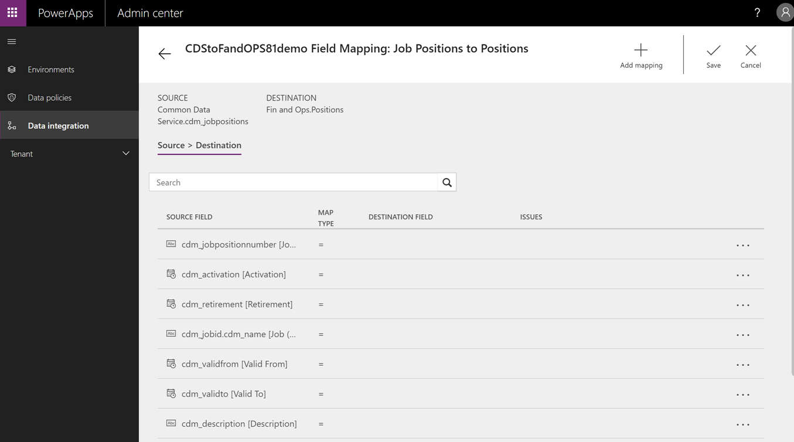

---
# required metadata

title: Dynamics 365 for Talent to Dynamics 365 for Finance and Operations integration FAQ
description: This topic explains what data is synchronized in a Talent and Finance and Operations integration.
author: Darinkramer
manager: AnnBe
ms.date: 12/28/2018
ms.topic: article
ms.prod: 
ms.service: dynamics-365-talent
ms.technology: 

# optional metadata

# ms.search.form: 
# ROBOTS: 
audience: Application User
# ms.devlang: 
ms.reviewer: josaw
ms.search.scope: Talent
# ms.tgt_pltfrm: 
ms.custom: 
ms.assetid: 
ms.search.region: Global
# ms.search.industry: 
ms.author: dkrame
ms.search.validFrom: 2018-12-31
ms.dyn365.ops.version: Talent

---

# Dynamics 365 for Talent to Dynamics 365 for Finance and Operations integration FAQ

[!include [banner](includes/banner.md)]

This topic answers common questions associated about what data is synchronized when Dynamics 365 for Talent is integrated with Dynamics 365 for Finance and Operations.

## Q: Is all data synchronized or just some data entities?

With Core HR, a subset of the data is synchronized. You can find a list of all
the entities here: (Integration from Dynamics 365 for Talent to Dynamics 365 for Finance and Operations)[talent-financeandoperations-integration.md].

For Attract and Onboard, all data is native to CDS for Apps.

## Q: Can I create a new mapping from scratch without using the templates?

Templates are the starting point. You can create your own template, but a
template is always needed when creating an integration project. You can find
more information about data integrator (DI), templates, and projects here: [Integrate data into Common Data Service for Apps](https://docs.microsoft.com/en-us/powerapps/administrator/data-integrator).

## Q: Can I map financial dimensions to transfer between Talent and Finance and Operations?

Financial dimensions aren’t currently in CDS for Apps and as a result aren’t
part of the default template. This entity is something that is planned, but no
timeline is available at this point.

For data that resides in Finance and Operations but does not exist in Talent,
link the two systems together by using **Configure Links** in Talent. For more
information on configuring links between Talent and Finance and Operations, see: [What's new or changed in Dynamics 365 for Talent Core HR (October 31, 2018)](whats-new-talent-october-31.md).

## Q: Often when I import employees, they go into inactive workers in Finance and Operations. Why?

You may get this error if employees don’t have an active employment detail
record in Talent. To verify, navigate to **Personnel Management \> Employees \> Employment History \> Date Manager**, and verify there is an active employment detail record.

## Q: If we select to map only a subset of fields, will changes made to non-mapped fields trigger a sync?

Data sync follows the execution schedule. The integration will pick up a record
if any field in the record changes regardless whether the field is part of
integration mapping or not.

## Q: How can I send only active worker changes and not the terminated records?

With the use of "Advanced query", you can filter and reshape source data before
passing it into the destination.

## Q: Can I specify which fields to send to Finance and Operations for a specific entity?

Fields can be added or removed from the integration task. Not all data fields
that exist on the CDS for Apps (CDS 2.0) entity will be populated from Core HR.
Additional data may be populated via PowerApps.

## Q: I set up integration as a batch job but Talent lost connection to the destination system. How can I send the same set of changes to the destination system?

No special setup is required for exception handling. The Data Integrator will
automatically catch and report errors happened at the source and destination and will
allow manual retries. However, it doesn’t allow manual data correction. If data
needs massaging, that should happen either at the source or the destination.

## Q: Can I set up bi-directional integration?

No, integration is currently one-way (Talent to Finance and
Operations). We have a default template available to send data from Talent to
Finance and Operations.

## Q: Can I allow record deletion as part of my integration?

No, Data Integrator will not capture deleted records for data transfer. Only
data creation and updates (UPSERT) are currently included.

## Q: Can I rerun the errored execution? If so, will it send a full file or only the changes?

The first run of Data Integrator is always a full run. Subsequent runs are
based on change tracking. When an error run is executed, it extracts the records
in scope of the run and sends out the most recent changes from CDS.

## Q: When I save the project, I get the error: “Project has mapping errors”. What do I do?

Check the setup of your integration keys, make any required changes to the setup, then refresh the entities in the project.

When the default template is used, the integration keys will be
automatically imported. This issue may occur when new tasks are added to
the existing template.

## Q: If I have N number of legal entities where workers have employments, do I need to create a mapping for each of them?

Yes, for each legal entity in Finance and Operations, you'll need a separate
integration project in the data integration.

## Q: I need to transfer data which is not part of the default template provided by Microsoft. Can this be done? If so, how?

Yes, fields can be added to or removed from the existing template. The template can be modified to include additional data from other CDS for Apps entities. The entity must be in CDS for Apps for it to be included in the
template. 

## Q: I just started with newly created Finance and Operations and Talent environments, and I am getting the error "The data value violates integrity constraints." Why?

Reasons for this error can include:

- The data transfer resulted in duplicate records extraction at source (CDS).

- The data transfer has null values for fields that are mandatory in Finance and
Operations. Verify the data that is in CDS and meets the requirements of Finance and
Operations.

## Q: If there are execution errors and the Employee ID didn't sync, how do I navigate to the right history job which has the failed employee record?

Data Integrator will create multiple projects in Finance and Operations. The
relationship between the Data Integrator task and the Finance and Operations project
is one to one.

Trace the time from the Data Integrator execution history and look for the index -1
project in Finance and Operations. If the task number is 9 in Data Integrator, the index in Finance and Operations is 8.

1. Capture the task index from Data Integrator (in our example it is "9".)

2. Track the execution time of the project.

3. In Finance and Operations, identify index - 1. In this example, the
project with suffix "8" and execution time of index "0" project matches with
the execution time in Step 2.

## Q: After integrating Talent and Finance and Operations, I don’t see my Talent data in Finance and Operations. What do I do?

The integration to Finance and Operations is a two-step process. First, verify
that the Talent data is updated and available in CDS. This is a near real-time
sync and can be verified in PowerApps by looking at the data within the data
entities.

If the data is not appearing as expected in CDS, verify that the entity is
supported in the integration. To include additional data in CDS, a change will be required on the Microsoft side.

If the entity is supported and the data is available in CDS, verify the mapping
is correct in Data Integrator. If the integrator mapping looks good, then
verify the data management jobs have successfully run. Errors may occur during
the execution of the batch jobs. For more information on Data Management, see the
documentation in the link at the bottom of this page.

## Q: The addresses for my employees are incorrect after I import them into Finance and Operations. What should I do?**

The number sequence for **Location ID** uses the same pattern in both Talent and
Finance and Operations. The number sequence needs to be unique on both sides so
there are not address collisions when integrating data from CDS to Finance and
Operations.

During implementation of Talent, verify that the number sequences are not the same in
Talent and Finance and Operations. Validate that all number sequences are not
identical where data may be maintained in both systems.

## Q: When creating my connection set, I am unable to see the connection in the Connection drop down. What do I do?

Make sure when creating your connections, you choose Dynamics 365 for Operations (currently in preview) and Common Data Service.

## Q: When syncing employments, I get the errors “CompanyInfo_FK doesn’t exist" or “The value '12/31/2154 11:59:59 pm' in field 'Employment end date' is not found in the related table 'Employment'.” What should I do?

Ensure that you are mapping to the correct legal entities. Legal entity syncing
is not part of the default template, so it is expected that each legal
entity that is present in Talent and CDS is also present in Finance and Operations.
Also, make sure that you are selecting the correct legal entities for the
associated Connection Set.

## Q: After setting up my project, the field mapping on the Finance and Operations side seems to be empty. What should I do?

Refresh the data entities in Finance and Operations: **Data management \> Framework
Parameters \> Entity settings \> Refresh entity list.** This should take a couple
of minutes to complete, then you should see those mappings. This issue occurs when brand new projects are spun up.

## For more information

- Data Integrator (DI): 

  - [Integrate data into Common Data Service for Apps](https://docs.microsoft.com/en-us/powerapps/administrator/data-integrator)

  - [Data Integrator error management and troubleshooting](https://docs.microsoft.com/en-us/powerapps/administrator/data-integrator-error-management)

  - [Responding to DSR requests for system-generated logs in PowerApps, Microsoft Flow, and Common Data Service for Apps](https://docs.microsoft.com/en-us/powerapps/administrator/powerapps-gdpr-dsr-guide-systemlogs)

- Data Management:

  - [Data management](https://docs.microsoft.com/en-us/dynamics365/unified-operations/dev-itpro/data-entities/data-entities-data-packages?toc=/fin-and-ops/toc.json)
