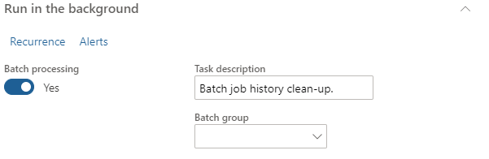
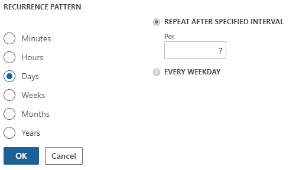

---
# required metadata

title: Resolve performance issues with Microsoft Dynamics 365 Talent by cleaning up the batch job history
description: This topic explains how to resolve performance issues with Microsoft Dynamics 365 Talent by cleaning up the batch job history.
author: andreabichsel
manager: AnnBe
ms.date: 09/23/2019
ms.topic: article
ms.prod: 
ms.service: dynamics-365-talent
ms.technology: 

# optional metadata

# ms.search.form: 
audience: Application User
# ms.devlang: 
ms.reviewer: anbichse
ms.search.scope: Core, Talent
# ms.tgt_pltfrm: 
ms.custom: 
ms.assetid: 
ms.search.region: Global
# ms.search.industry: 
ms.author: anbichse
ms.search.validFrom: 2019-09-23
ms.dyn365.ops.version: Platform update 24
---

# Resolve performance issues by cleaning up the batch job history

[!include [banner](../includes/banner.md)]

**Issue**

You're experiencing performance issues with Microsoft Dynamics 365 Talent.

**Cause**

Excessive batch job history can cause performance issues.

**Resolution**

Clean up your batch job history. We recommend cleaning up your batch job history weekly, but you might need to run it more or less frequently, depending on your environment. Likewise, the following procedure contains our recommended settings, but you can change these depending on your needs.

1. In Talent, select **System administration**.

2. In the **Search** bar, enter **Batch job history clean-up**.

   

3. In **History limit (days)**, enter **30**.

   

4. Select **Run in the background** and then select **Recurrence**.

   

5. Under **Define recurrence**, set the **Start date** and **Start time** to occur during off-hours or the weekend, and then select **NO END DATE**. 

   

6. Under **RECURRENCE PATTERN**, select **Days** and set **REPEAT AFTER SPECIFIED INTERVAL** to **7**.

   

7. Select **OK**.

8. Change any other parameters under **Run in the background** as necessary, and then select **OK**.

