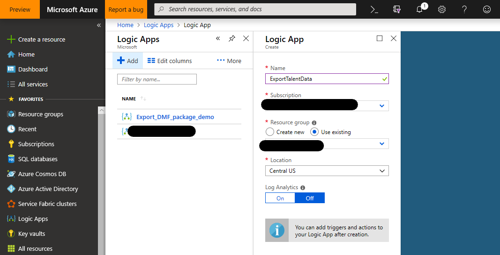
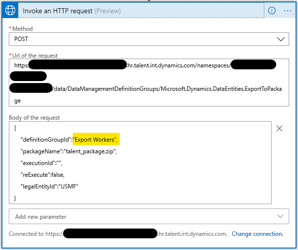
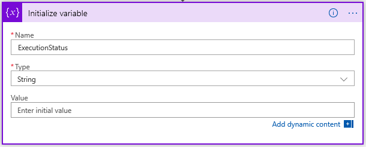
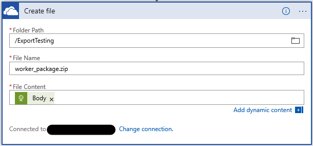

---
# required metadata

title: Tutorial - Recurring Data Export using Azure Logic App
description: This tutorial demonstrates how to create an Azure Logic App that exports data from Dynamics 365 for Talent on a recurring schedule.
author: gregboyko 
manager: AnnBe
ms.date: 02/19/2019
ms.topic: article
ms.prod: 
ms.service: dynamics-365-talent
ms.technology: 

# optional metadata

# ms.search.form:
audience: IT Pro
# ms.devlang: 
ms.reviewer: josaw
ms.search.scope: Talent, Core
# ms.tgt_pltfrm: 
# ms.custom: [used by loc for topics migrated from the wiki]
ms.search.region: Global
# ms.search.industry: [leave blank for most, retail, public sector]
ms.author: gboyko
ms.search.validFrom: 2019-01-01
ms.dyn365.ops.version: Talent January 2019 update
---

# Tutorial - Recurring data export using Azure Logic App

[!include[banner](../includes/banner.md)]

This tutorial demonstrates how to create an Azure Logic App that exports data from Dynamics 365 for Talent Core HR on a recurring schedule. The tutorial makes use of Talent Core HR's DMF Package REST API to export the data. Once the data has been exported, the Logic App saves the exported data package to a OneDrive for Business folder.

## Business scenario

Exporting data to a downstream system on a recurring schedule is a common business scenario for Dynamics 365 integrations. In this tutorial, we will be exporting all Worker records from Talent and saving that list of Workers in a OneDrive for Business folder.

> [!TIP]
> The specific data being exported and the destination of the exported data are only examples, and can be easily changed to suit your business needs.

## Technologies used

This tutorial makes use of the following technologies:

- [Dynamics 365 for Talent](https://dynamics.microsoft.com/en-us/talent/overview/) Core HR - The master data source for Workers that will be exported
- [Azure Logic Apps](https://azure.microsoft.com/en-us/services/logic-apps/) - orchestration and scheduling of the recurring export
  - [HTTP with Azure AD](https://docs.microsoft.com/en-us/connectors/webcontents/) Connector
  - [OneDrive for Business](https://docs.microsoft.com/en-us/azure/connectors/connectors-create-api-onedriveforbusiness) Connector
- [DMF package REST API](../dev-itpro/data-entities/data-management-api.md) - to trigger the export and monitor the export progress
- [OneDrive for Business](https://onedrive.live.com/about/en-us/business/) - The destination for the exported data package

## Prerequisites

Before beginning this exercise, you will need:

- A Dynamics 365 for Talent Core HR environment with Administrator-level permissions in the environment
- An [Azure subscription](https://azure.microsoft.com/en-us/free/) for hosting the Azure Logic App

## The exercise

At the conclusion of this exercise, you will have completed an Azure Logic App that is connected to your Dynamics 365 for Talent Core HR environment and your OneDrive for Business account. The Logic App will export a data package from Talent Core HR, wait for the export to complete, download the exported data package, and save the data package in your chosen OneDrive for Business folder.

The completed Logic App will look similar to the following:


### Step 1: Create a data export project in Core HR

In Core HR, create a data export project that exports Workers. Name the project **Export Workers**, ensure that **Generate data package** is set to **Yes**. Add a single entity (Worker) to the project, exporting in the format of your choice (we use Excel in this tutorial).


> [!IMPORTANT]
> Remember the name of the data export project. It will be used later when creating the Logic App.

### Step 2: Create the Azure Logic App

The bulk of this exercise is creating the Logic App, which you will complete over the next several steps.

1. Create a Logic App in Azure Portal



2. In the Logic Apps Designer, start with a blank Logic App.
3. Add a [Recurrence Schedule trigger](https://docs.microsoft.com/en-us/azure/connectors/connectors-native-recurrence) to execute the Logic App every 24 hours (or on your chosen schedule).


4. Call the [ExportToPackage](../dev-itpro/data-entities/data-management-api#exporttopackage) DMF REST API to schedule the export of your data package.

    - Use the **Invoke an HTTP request** action from the HTTP with Azure AD Connector
    - Base Resource URL: The URL of your Talent environment (do not include path/namespace info)
    - Azure AD Resource URI: http://hr.talent.dynamics.com

> [!NOTE]
> The Talent Core HR service does not yet provide a Connector that exposes these APIs. We instead call the APIs using raw HTTPS requests through the HTTP with Azure AD Connector, which uses Azure Active Directory for authentication/authorization to Talent.


  - Signin to your Talent environment through the HTTP AAD connector
  - Set up an HTTP POST request to call the **ExportToPackage** DMF REST API
    - **Method**: POST
    - **Url of the request**: https://\<hostname\>/namespaces/\<namespace_guid\>/data/DataManagementDefinitionGroups/Microsoft.Dynamics.DataEntities.ExportToPackage
    - **Body of the request**:

```JSON
{
    "definitionGroupId":"Export Workers",
    "packageName":"talent_package.zip",
    "executionId":"",
    "reExecute":false,
    "legalEntityId":"USMF"
}
```



> ![TIP]
> You may wish to rename each step in your Logic App to something more meaningful than the default name of **Invoke an HTTP request** (e.g. **ExportToPackage** for this step)

5. [Initialize a variable](https://docs.microsoft.com/en-us/azure/logic-apps/logic-apps-create-variables-store-values#initialize-variable) to store the Execution Status of the ExportToPackage request.



6. Wait until the Execution Status of the data export has succeeded

    - Add [Until loop](https://docs.microsoft.com/en-us/azure/logic-apps/logic-apps-control-flow-loops#until-loop) that repeats until the value of the **ExecutionStatus** variable is **Succeeded**.
    - Add a **Delay** action that waits 5 seconds before polling for the current execution status of the export


> ![NOTE]
> Set the limit count to 15 to allow a maximum of 75 seconds (15 iterations * 5 seconds) of wait time for the export to complete. Adjust as necessary if your export takes longer.

> ![IMPORTANT]
> This sample does not perform error checking. The GetExectuionSummaryStatus API can return non-successful terminal states other than **Succeeded**. See the API documentation for more details.

  - Add an **Invoke HTTP request** action to call the [GetExecutionSummaryStatus](../dev-itpro/data-entities/data-management-api#getexecutionsummarystatus) DMF REST API and set the **ExecutionStatus** variable to the result from the **GetExecutionSummaryStatus** response.
    - **Method**: POST
    - **Url of the request**: https://\<hostname\>/namespaces/\<namespace_guid\>/data/DataManagementDefinitionGroups/Microsoft.Dynamics.DataEntities.GetExecutionSummaryStatus
    - **Body of the request**: body('Invoke_an_HTTP_request').value

> [!NOTE] You may need to enter the Body value in code view or the function editor
  


> ![IMPORTANT]
> The value for the **Set Variable** action (*body('Invoke_an_HTTP_request_2').value*) will be different than the value for the **Invoke HTTP request 2** body value, even though the designer will render the values the same way.

7. Get the download URL of the exported package
   
  - Add an **Invoke HTTP request** action to call the [GetExportedPackageUrl](../dev-itpro/data-entities/data-management-api#getexportedpackageurl) DMF REST API.
    - **Method**: POST
    - **Url of the request**: https://\<hostname\>/namespaces/\<namespace_guid\>/data/DataManagementDefinitionGroups/Microsoft.Dynamics.DataEntities.GetExportedPackageUrl
    - **Body of the request**: {"executionId": body('GetExportedPackageURL').value}


8. Download the exported package

  - Add an HTTP GET request (a built-in [HTTP connector action](https://docs.microsoft.com/en-us/azure/connectors/connectors-native-http)) to download the package from the URL returned in the previous step.
    - **Method**: GET
    - **URI**: body('Invoke_an_HTTP_request_3').value (may need to enter through code view or function editor in designer)


> ![NOTE]
> This request does not require any additional authentication since the GetExportedPackageUrl API returns a URL that includes a SAS token granting access to download the file.

9. Save the downloaded package using the [OneDrive for Business](https://docs.microsoft.com/en-us/azure/connectors/connectors-create-api-onedriveforbusiness) connector.

  - Add a OneDrive for Business [Create File](https://docs.microsoft.com/en-us/connectors/onedriveforbusinessconnector/#create-file) action
    - Connect to your OneDrive account if necessary
    - **Folder Path**: \<pick a folder\>
    - **File Name**: worker_package.zip
    - **File Content**: Body of the previous step (dynamic content)



### Step 3: Test your Logic App

To test your Logic App, press the **Run** button in the designer. You will see the steps of your logic app start executing. After 30-40 seconds, your Logic App should complete, with the result being a new package file containing the exported workers in your OneDrive for Business folder.

If any of the steps report a failure, click on the failed step in the designer and examine the INPUTS and OUTPUTS for the step, debugging and adjusting the step as necessary to correct errors.


## Summary

In this tutorial, you learned how to use a Logic App to export data from Talent Core HR and save the exported data into a OneDrive for Business folder. Use this and modify the steps as necessary to suit your business needs.
