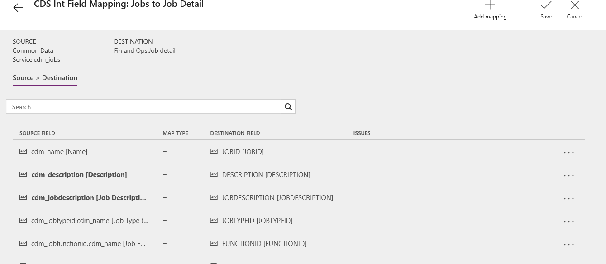

---
# required metadata
title: What's new or changed in Dynamics 365 Talent - Core HR (December 14, 2018)
description: This topic describes features that are either new or changed in Microsoft Dynamics 365 Talent - Core HR.
author: Darinkramer
manager: AnnBe
ms.date: 12/14/2018
ms.topic: article
ms.prod: 
ms.service: dynamics-365-talent
ms.technology: 

# optional metadata

ms.search.form: 
# ROBOTS: 
audience: Application User
# ms.devlang: 
ms.reviewer: anbichse
ms.search.scope: Talent
# ms.tgt_pltfrm: 
ms.custom: 
ms.assetid: 
ms.search.region: Global
# ms.search.industry: 
ms.author: dkrame
ms.search.validFrom: 2018-12-14
ms.dyn365.ops.version: Talent

---
# What's new or changed in Dynamics 365 Talent - Core HR (December 14, 2018)

[!include [rename-banner](~/includes/cc-data-platform-banner.md)]

**Build 8.1.2085**

This topic describes features that are either new or changed in Core HR.

## Changes

### US - ACA (Affordable Care Act) support for tax year 2018 1095-B and 1095-C forms

Each year, Applicable Large Employers (ALEs) must provide each full-time employees with a 1095-C. In addition, if the employer provides self-insured coverage they must provide the 1095-C (if they are an ALE) and a 1095-B (if they are a small employer) to any employee, full-time or part-time, covered under one of their offered health plans. This feature provides printable forms for both the 1095-C and 1095-B.

### During import SubmittedByPersonId field on HcmPerfJournalEntity is ignored

When importing/exporting performance journal entries, the **Submitted by** field is ignored. With this change, the value **imported/exported** will reflect the value in the table during the export, when importing the system will be updated with the value supplied in the import file.

### Analytics tab on 'Leave and absence' workspace displays "OpenConnectionError" error for non-system Admin roles

With this update, no errors will be issued when opening the **Analytics** tab on the **Leave and Absence** workspace.

### Employee self-service, Position Hierarchy drill-down from tile fails to get parent node

A change has been made to correct the error "Getting the parent node failed" when the position hierarchy has been personalized to appear on an existing workspace and a position is selected in the hierarchy.  

### Must be System Admin to see the Payroll tab in the Position page

A change has been made to include the correct security elements in the existing privilege: "Maintain payroll worker and position detail". With this change, by default, the Payroll Administrator will have access to the Payroll fields on the Position page.

### Error when submitting performance review to manager and the %Reviews.PerfPeriod% placeholder is used in the Submission instructions

A change has been made that corrects the "Null Reference" error when using the %Reviews.PerfPeriod% placeholder in the Submission instructions.

### Workforce Power BI report shows error when worker seniority date is a leap day

With this change, leap days are now supported in Power BI.

### Integration between Core HR and Attract

A change has been made to update the integration between Core HR and Attract related to candidates to hire. For candidates to hire to be visible in the **Personnel Management** workspace, the following Common Data Service entities are used:

Job Application
- Status Reason needs to be set to Offer Accepted
-	Provides Candidate and Job Opening

Candidate
-	Provides Candidate information

Job Opening
-	Provides Job Opening ID and Job Opening Participants

Job Opening Participants
-	Provides Hiring Manager

When a candidate is added to Personnel Management, the candidate can now also be dismissed using a new option available on the candidate card.

## Coming soon

### Leave and absence: Future leave and forecasting leave balances

With the changes being made to allow for employees to forecast time off and request future time off requests without impacting their current time off balances, the way the time off balances are displayed is also changing. 

The available balance currently displayed is the amount of time off available for requests including accruals through today and all approved leave requests to the end of time. 

When the ability to forecast is released, the balance displayed changes to  be the current balance of time off including accruals through today and requests through today. Employees and managers will see these updated balances in employee and manager self-service on the **Time off** card and in the **Time off balances** window. HR managers will see these updated balances in the **People** workspace and in the employee’s **Assigned leave plans** window.

## Known issue

### Mapping errors in the integration with Finance

The following issues have been identified in the current template for integrating Talent with Dynamics 365 Finance. A new template will be published soon and will be applied to all new integration projects that are created. For existing integration projects, the task mappings can be updated. Refer to the following table for updated mappings. 

>[!NOTE]
> The Job Positions to Positions Parent Job Assignment task does not integrate data. This is an issue that is currently being researched. There is no workaround in the current mapping. 

The Departments to Operating unit task needs the following mappings updated.

| Existing source field          | New source field |
| -------------------------------|------------------|
| cdm_description (Description)  | cdm_name (Name)  |

An additional mapping also needs to be added. Select the last **None** field to add the following mapping.

| Source field                   | Destination field    |
| -------------------------------|----------------------|
| cdm_description (Description)  | NAMEALIAS (NAMEALIAS)|

The updated mappings should look like the following image.

The Jobs to Job Detail task needs the following mappings updated.

| Existing source field          | New source field                   |
| -------------------------------|------------------------------------|
| cdm_name (Name)                | cdm_description (Description)      |
| cdm_name (Description)         | cdm_jobdescription(Job Description)|

The updated mappings should look like the image below.

The Workers to Work task needs the following mappings updated.

| Existing source field                 | New source field                               |
| --------------------------------------|------------------------------------------------|
| cdm_emailaddress1 (Email Address 1)   | cdm_primaryemailaddress (Primary Email Address |
| cdm_telephone1 (Telephone 1)          | cdm_primarytelephone (Primary Telephone)       |

The Gender field transform also needs to be updated. Select the **fn** (function) map type for Gender and update the following value mappings.

| Common Data Service value                   | Finance and Operations value                     |
| ----------------------------|--------------------------------------------------|
| 75440000                    | Male                                             |
| 75440001                    | Female                                           |
| 75440002                    | None                                             | 
| 75440003                    | NonSpecific                                      |

The updated mappings should look like the following images.

