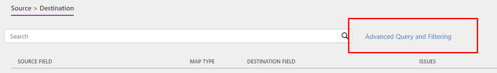
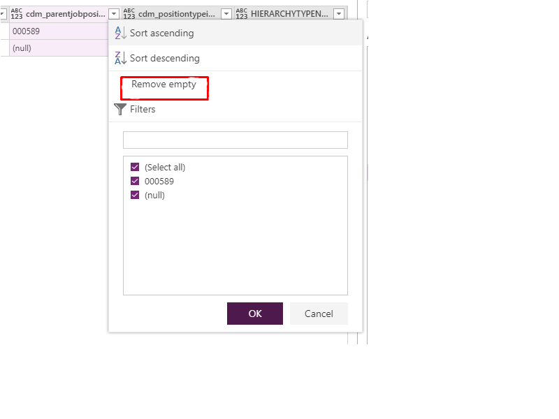

---
# required metadata

title: What's new or changed in Dynamics 365 for Talent (February 27, 2019)
description: This topic describes features that are either new or changed in Microsoft Dynamics 365 for Talent.
author: Darinkramer
manager: AnnBe
ms.date: 02/27/2019
ms.topic: article
ms.prod: 
ms.service: dynamics-365-talent
ms.technology: 

# optional metadata

ms.search.form: 
# ROBOTS: 
audience: Application User
# ms.devlang: 
ms.reviewer: josaw
ms.search.scope: Talent
# ms.tgt_pltfrm: 
ms.custom: 
ms.assetid: 
ms.search.region: Global
# ms.search.industry: 
ms.author: dkrame
ms.search.validFrom: 2019-02-27
ms.dyn365.ops.version: Talent

---
# What's new or changed in Dynamics 365 for Talent (February 27, 2019)

[!include [banner](includes/banner.md)]

This topic describes features that are either new or changed in Dynamics 365 for Talent.

## Changes in Attract
There are minor bug fixes included with this release.

## Changes in Onboarding
There are minor bug fixes included with this release.

## Changes in Core HR
**Build 8.1.2163**

### Add custom fields menu item to System Administration
Navigation to the **Custom fields** menu has been added to the **System administration** workspace.

### Hide import and create option for new mobile applications
Creation of new mobile apps is not currently supported within Talent. The option to create new mobile experiences has been removed from the menu. 

### Variable Compensation Award (DMF Entity) 
In this release, a Variable Compensation Award (DMF Entity) is now available for export.

### UK addresses display in Analytics as Switzerland addresses
With this release, addresses will be displayed by city and will correct issues where visualizations misrepresented where an employee is located.

### Workforce PowerBI report shows error when workers seniority date is on Leap Day
A fix has been made to in PowerBi to account for seniority dates that fall on February 29. 

### Employee Fixed Comp, Employee Variable Awards, Employee Variable Plans (enrollments) allow for custom fields
Employee Fixed Comp, Employee Variable Awards, and Employee Variable Plans (enrollments) now allow for custom fields to be added. With this change, you can now track additional information on Employee fixed and Variable compensation plans that aren't there by default. Custom fields can be entered and updated through the user interface or through the entities provided. 

### Other miscellaneous bug fixes
Other minor bug fixes are included with this release.

## Coming soon

###  Advanced compensation security (Fixed and Variable)
In many organizations, the compensation and benefits managers may only have access to certain compensation records. They may be for executives or regional based employees. With this change, HR can manage and maintain the compensation plans for different employee populations in the organization. Fixed and Variable plans can be assigned security roles which will determine the access to the plans and the employee data related to the plans (for example, salary, bonus records, etc.). Only the roles with the given access will be able to process compensation for those employees.

###  Platform update 24
See additional details for Platform update 24 [here](https://docs.microsoft.com/en-us/dynamics365/unified-operations/fin-and-ops/get-started/whats-new-platform-update-24).

### Enable employee fixed compensation for future position assignments
It is typical that employees join an organization with a future start date. This change enables defining fixed compensation for employees with future position assignments. 

## Known Issues

### Changes to Core HR integration template (Talent CDS to Finance and Operations)
The template for Core HR has been updated to an Advanced Query template. This means the Advanced Query will be enabled by default for projects created using this template. It also means that any default mapping functions (shown as FN in the mappings) will only be visible in the Advanced Query editor.

See additional details about mapping errors [here](https://docs.microsoft.com/en-us/dynamics365/unified-operations/talent/whats-new-talent-december-14).

Below are the steps to take to update your existing template. To use the new template, create a new project and select the new Talent integration template.

- *Job Positions to Positions*: Remove this mapping.
- *Job Positions to Positions Parent Job Assignment*: Remove this mapping.
- *Job Positions to Base Position*: Add new mapping for CDS entity Job Positions to Finance and Operations entity Base Position.
Move this to position 7 in the sequence.

- *Job Positions to Position Details*: Add a new mapping for CDS entity Job Positions to Finance and Operations entity Position Details.
Move this to position 8 in the sequence.

- *Job Positions to Position Durations*: Add a new mapping for CDS entity Job Positions to Finance and Operations entity Position Durations.

- *Job Positions to Position Hierarchies*: Add a new mapping from CDS entity Job Positions to Finance and Operations entity Position Hierarchies. Click **Advanced Query** to enable your advanced query for your project.

Add the following mappings.

Click the **Advanced Query and Filtering** link.

Find the cdm_parentjobpositionid.cdm_jobpositionnumber column and click the button on the right.

Click **Remove empty** in the dropdown dialog.

Click **Add column > Add conditional column** to add a default Value Transform for HIERARCHYTYPENAME. 

In the **Add conditional column** dialog, enter the name of the new column: HIERARCHYTYPENAME.

Fill in both **Then** and **Otherwise** with what should be the default value: Line; using any field and value for **If** and **equal to**. 

Click **OK** to close the **Advanced Query and Filtering** dialog.

On the **Mapping task** page, pick the newly created column as the source to create another mapping for HIERARCHYTYPENAME.  

