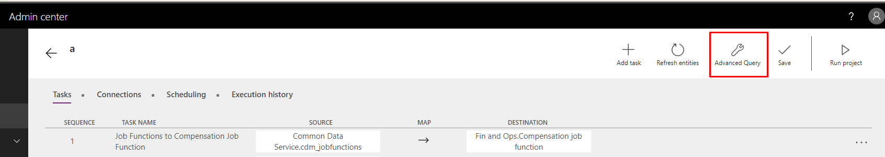
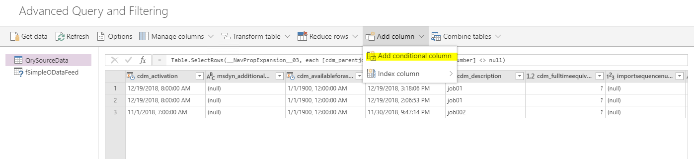
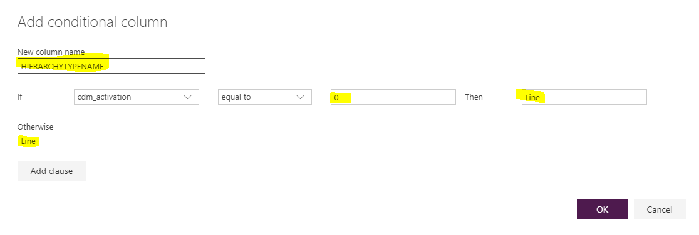

---
# required metadata

title: What's new or changed in Dynamics 365 Talent (February 27, 2019)
description: This topic describes features that are either new or changed in Microsoft Dynamics 365 Talent.
author: Darinkramer
manager: AnnBe
ms.date: 02/27/2019
ms.topic: article
ms.prod: 
ms.service: dynamics-365-talent
ms.technology: 

# optional metadata

ms.search.form: 
# ROBOTS: 
audience: Application User
# ms.devlang: 
ms.reviewer: anbichse
ms.search.scope: Talent
# ms.tgt_pltfrm: 
ms.custom: 
ms.assetid: 
ms.search.region: Global
# ms.search.industry: 
ms.author: dkrame
ms.search.validFrom: 2019-02-27
ms.dyn365.ops.version: Talent

---
# What's new or changed in Dynamics 365 Talent (February 27, 2019)

[!include [rename-banner](~/includes/cc-data-platform-banner.md)]

This topic describes features that are either new or changed in Microsoft Dynamics 365 Talent.

## Changes in Attract

This release includes minor bug fixes for Dynamics 365 Talent: Attract.

## Changes in Onboard

This release includes minor bug fixes for Dynamics 365 Talent: Onboard.

## Changes in Core HR

Changes described in this secition apply to build number 8.1.2163

### Add a Custom fields menu item to System administration

Navigation to the **Custom fields** menu has been added to the **System administration** workspace.

### Hide the import and create options for new mobile applications

Currently, new mobile apps can't be created in Talent. The option to create new mobile experiences has been removed from the **Mobile app** menu.

### Variable Compensation Award (DMF entity)

In this release, a **Variable Compensation Award** Data Management Framework (DMF) entity is now available for export.

### UK addresses appear in the personnel management analytics page as Swiss addresses

In this release, addresses are shown by city. This release corrects issues where visualizations misrepresented an employee's location.

### The Workforce Power BI report shows an error when a worker's seniority date is on leap day

A fix has been made in Microsoft Power BI to account for seniority dates that fall on February 29.

### Employee fixed compensation, Employee variable awards, Employee variable plans (enrollments) allow for custom fields

Custom fields can now be added for employee fixed Compensation, employee variable awards, and employee variable plans (enrollments). You can now track more information about employee fixed and variable compensation plans, in addition to the information that is available by default. Custom fields can be entered and updated through either the user interface or through the entities that are provided.

### Other miscellaneous bug fixes

This release includes other minor bug fixes.

## Coming soon

### Advanced compensation security (Fixed and variable)

In many organizations, compensation and benefits managers might have access only to specific compensation records. These records might be for executives or regional employees. This change will let Human resources (HR) manage and maintain the compensation plans for different employee populations in the organization. Security roles that can be assigned to fixed and variable plans will determine the access to those plans and the employee data that is related to them (for example, salary information and bonus records). Only the roles that have the specified access will be able to process compensation for those employees.

### Platform update 24 for Finance and Operations

For more information about Platform update 24 for Microsoft Dynamics 365 Finance and Operations (March 2019), see [Preview features in Finance and Operations platform update 24 (March 2019)](https://docs.microsoft.com/dynamics365/unified-operations/fin-and-ops/get-started/whats-new-platform-update-24).

### Make employee fixed compensation available for future position assignments

It's typical that employees who join an organization have a future start date. This change will let fixed compensation be defined for employees who have future position assignments.

## Known issues

### Changes to the Core HR integration template (Talent Common Data Service to Finance)
The template for Core HR has been updated to an "advanced query template". Therefore, by default, the advanced query will be available for projects that are created by using this template. Additionally, any default mapping functions will be visible only in the advanced query editor. (Default mapping functions appear as "FN" in the mappings.)

For more information about mapping errors, see [What's new or changed in Dynamics 365 Talent: Core HR (December 14, 2018)](https://docs.microsoft.com/dynamics365/unified-operations/talent/whats-new-talent-december-14).

To use the new template, create a new project, and select the new Talent integration template.

To update your existing template, follow these steps.

1. Update the following mappings:

    - **Job Positions to Positions:** Remove this mapping.
    - **Job Positions to Positions Parent Job Assignment:** Remove this mapping.
    - **Job Positions to Base Position:** Add a new mapping from the **Job Positions** Common Data Service entity to the **Base Position** Finance and Operations entity. Move it to position 7 in the sequence.

        

    - **Job Positions to Position Details:** Add a new mapping from the **Job Positions** Common Data Service entity to the **Position Details** Finance and Operations entity. Move it to position 8 in the sequence.

        

    - **Job Positions to Position Durations:** Add a new mapping from the **Job Positions** Common Data Service entity to the **Position Durations** Finance and Operations entity.

        

    - **Job Positions to Position Hierarchies:** Add a new mapping from the **Job Positions** Common Data Service entity to the **Position Hierarchies** Finance and Operations entity. Select **Advanced Query** to make your advanced query available for your project.

       

2. Add the following mappings.
    
    

    1. cdm_jobpositionnumber cdm_jobspositionnumb... = POSITIONID
       cdm_parentjobpositionid.cdm-jobpositionnumb... = PARENTPOSITIONID
       cdm_validfrom cdm_validfrom = VALIDFROM
       cdm_validto cdm_validto = VALIDTO
       
    2. Select the **Advanced Query and Filtering** link next to the **Search** field.  

    3. Find the **cdm_parentjobpositionid.cdm_jobpositionnumber** column, and select the down arrow button on the right side of it.

    4. In the dialog box that appears, select **Remove empty**.

    5. Select **Add column \> Add conditional column** to add a default value transform for HIERARCHYTYPENAME.

        

    6. In the **Add conditional column** dialog box, enter **HIERARCHYTYPENAME** as the name of the new column.
    7. In the **If** part of the condition, select any field, use **equal to** as the relationship, and enter any value. In the ***Then** and **Otherwise** parts of the condition, specify what the default value should be. In this case, enter **Line** in both parts.

        

    8. Select **OK** to close the **Advanced Query and Filtering** dialog box.
    9. On the **Mapping task** page, select the new column as the source to create another mapping for HIERARCHYTYPENAME.

        
