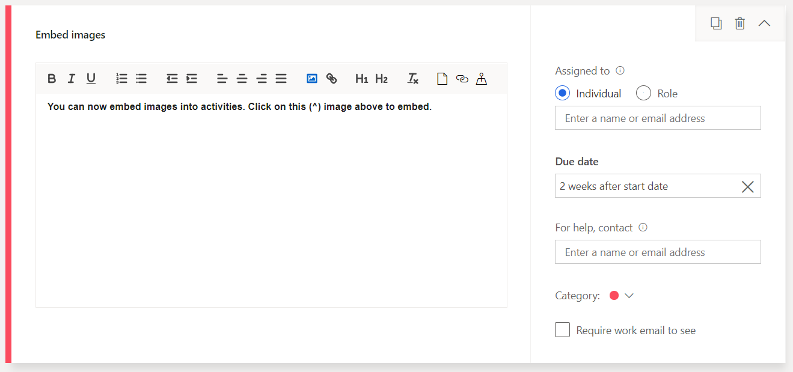

---
# required metadata

title: What's new or changed in Dynamics 365 Talent (March 26, 2019)
description: This topic describes features that are either new or changed in Microsoft Dynamics 365 Talent.
author: Darinkramer
manager: AnnBe
ms.date: 03/26/2019
ms.topic: article
ms.prod: 
ms.service: dynamics-365-talent
ms.technology: 

# optional metadata

ms.search.form: 
# ROBOTS: 
audience: Application User
# ms.devlang: 
ms.reviewer: anbichse
# ms.search.scope: Talent
# ms.tgt_pltfrm: 
ms.custom: 
ms.assetid: 
ms.search.region: Global
# ms.search.industry: 
ms.author: dkrame
ms.search.validFrom: 2019-03-26
ms.dyn365.ops.version: Talent

---
# What's new or changed in Dynamics 365 Talent (March 26, 2019)

[!include [rename-banner](~/includes/cc-data-platform-banner.md)]

This topic describes features that are either new or changed in Dynamics 365 Talent.

## Changes in Attract

### Enhancements to interview scheduling
The following enhancements are available in interview scheduling.

- Recruiters or hiring managers can now manually trigger a reminder for an interviewer to submit their feedback. The associated email template for the reminder is configurable as well.
- While sharing the interview summary with the candidate, the interview scheduler can choose to hide the names of the interviewers and also choose to hide rows from the interview summary view.

## Changes in Onboard

### Embedded images in activities
You can now embed images directly into activities. In addition to being able to copy and paste images from the web, you can upload images from your local file system. The size of the activity is limited to 1 MB. If the image is too large, resize and try to upload again.

This release includes minor bug fixes for Dynamics 365 Talent: Onboard.

## Changes in Core HR
**Build 8.1.2210**

### Custom field support available for select entities in Common Data Service 

The following Common Data Service entities now support customer fields created in Talent:

- Worker
- Ethnic origin
- Veteran status
- Language code
- Job
- Job type
- Job function
- Position
- Position type
 
### Employment history not displayed chronologically
With this change, the employment history page now displays employment records chronologically, independent of company. You can also use sorting options to sort by company.

### Fixed compensation plans don't appear when restricting user by company in security.
In this release, fixed compensation plans now appear when restricting users by company in security. All security settings will be honored, and fixed plans will appear for those companies the user has permissions to access. 

### Can't delete Job records using Open in Excel option in Talent
With this release, you can now remove job records by using the **Open in Excel** option in Talent.

### Upgrade to Common Data Service
Deadlines to upgrade to Common Data Service are quickly approaching. Sign in to the Power Apps Admin center to determine if your database needs to be upgraded. For more information about deadlines and necessary steps to upgrade, see [Upgrade to Common Data Service](https://docs.microsoft.com/common-data-service/upgradecds/introduction-upgrade-cds).

## In preview

For information about enabling preview features, see [Access preview features in Microsoft Dynamics 365 Talent](./access-preview-feature.md).

### Allow reason codes to be specified on leave types
Organizations might need additional information related to time off requests. To get this information, employees need to include a reason code on their time off requests. With this release, you can now specify the reason codes associated with a given leave type and enable employees to select a reason code on their time off requests.

### Configure reason codes to be required when submitting time off for certain leave types
Organizations might require reason codes to be set on specific leave types when employees submit time off. This may be required based on a regulatory requirement in their country/region or a company policy. This release provides the ability for HR to specify which leave types require a reason code. This will be enforced when employees submit time off requests where the leave requires a reason code.

## Coming soon

###  Advanced compensation security (fixed and variable)
In many organizations, compensation and benefits managers might only have access to certain compensation records. These could be for executives or regional employees. With this change, HR can manage and maintain the compensation plans for different employee groups in the organization. You can assign security roles to fixed and variable plans that determine access to the plans and the employee data related to the plans, such as salary or bonus records. Only the roles granted with access can process compensation for these employees.

###  Email support for alerts
With Platform update 25 for Finance and Operations, users can create alert rules that automatically dispatch email notifications to contacts when triggered by an event. 

### Duplicate employee checks: User interface changes
With this change, duplicates are detected as you enter name fields, and a status displays the number of duplicates found. You can select the provided link to open a new page to evaluate whether to use the detected match. To avoid interrupting data entry, the duplicates form doesn't open automatically.
