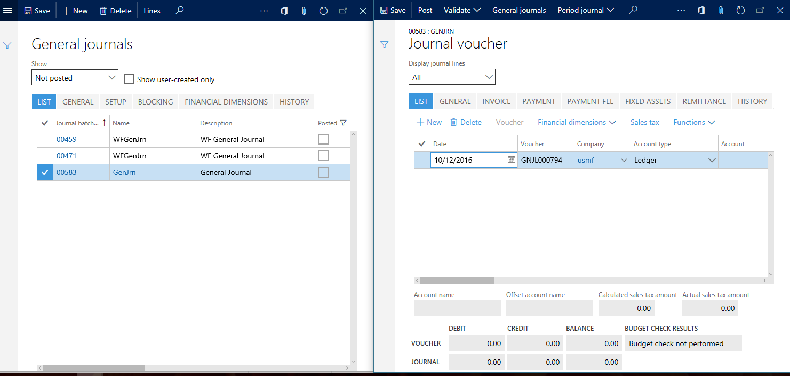

---
# required metadata

title: Display pages side-by-side using the Open in New Window icon
description: This article explains how to display pages side-by-side in Microsoft Dynamics 365 for Operations.
author: aneesmsft
manager: AnnBe
ms date: 2017-04-04
ms.topic: article
ms.prod: 
ms.service: Dynamics365Operations
ms.technology: 

# optional metadata

# ms.search.form: 
# ROBOTS: 
audience: Application User
# ms.devlang: 
# ms.reviewer: 71
ms.search.scope: AX 7.0.0, Operations, Core
# ms.tgt_pltfrm: 
ms.custom: 17611
ms.assetid: fc589d76-3927-4486-ab83-e86b9b47ba2c
ms.search.region: Global
# ms.search.industry: 
ms.author: aneesa
ms.search.validFrom: 2016-02-28
ms.dyn365.ops.version: AX 7.0.0

---

# Display pages side-by-side using the Open in New Window icon

This article explains how to display pages side-by-side in Microsoft Dynamics 365 for Operations.

Microsoft Dynamics 365 for Operations helps you perform tasks efficiently. In some cases, you may want to view multiple pages side-by-side to complete tasks quickly. As an example, you might want to validate or enter lines in more than one journal. Typically, to do this you would have to go back and forth between the page that displays a list of journals, and the page that displays lines for a given journal. However, the **Open in new window** feature enables you to display these pages side-by-side so that you can perform your tasks quickly. Continuing with the example mentioned above, when viewing the lines, you can click the **Open in new window** icon.  Clicking the **Open in new window** icon opens the lines page in a new, pop-up browser, and then navigates the original browser back in history to the page that displayed the list of journals. You can then display both pages side-by-side. When you are done viewing a journal, you can change the selected journal on the journal list page, and the lines page in the pop-up window will automatically display the lines of the newly selected journal.  The dynamic linking and refreshing happens due to the relations that exist between the data that is backing these pages. If the system is not aware of the relation between the data, the pop-up window will not refresh automatically in response to a change in the window it originated from. Some pages have multiple views such as the Grid view, Header view, and Details view. The **Open in new window** icon causes the entire page to be opened in the new browser window. Therefore, you cannot keep two views of the same page side-by-side using the **Open in new window** feature. However, almost all such pages have a navigation list that you can use to switch between records and achieve a similar experience. Before using the **Open in new window** feature, you should configure your browser's pop-up blocker to allow pop-ups from the URL of the Dynamics 365 for Operations site. As an example, you could allow pop-ups from "\*.dynamics.com". The **Open in new window** feature is only available when there is more than one page open in the window. Also, the pop-up window automatically closes when there are no more pages open (that is, when the last page in that window is closed). Dynamics 365 for Operations also closes open pages when you navigate to a different area in the application. Therefore, if you have pop-up windows open and navigate to a different area in the application, the pop-up windows are automatically closed because the pages in those windows were closed by the system. The top bar in the pop-up windows displays information about the company the page was opened in and is read-only. The pop-up windows also rely on the main Dynamics 365 for Operations browser window. If the main window is closed or refreshed, all open pop-up windows will become read only. This means that you can still view the information in these windows, but you will not be able to interact with it.

