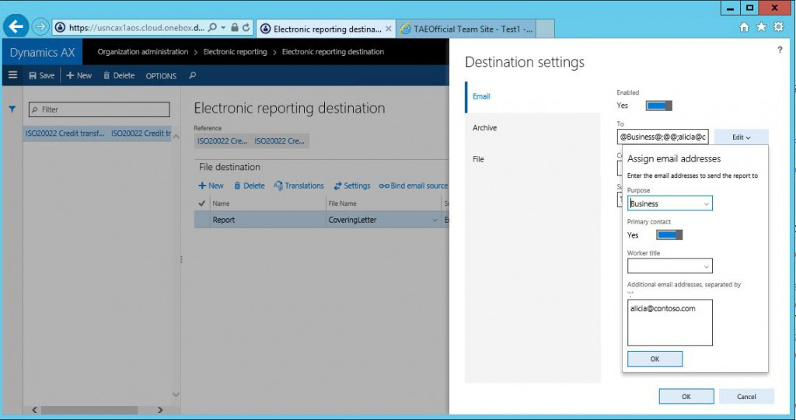

---
# required metadata

title: Electronic reporting destinations
description: You can configure a destination for each Electronic reporting (ER) format configuration and its output component (a folder or a file). Users who are granted appropriate access rights can also modify destination settings at run time. This article explains ER destination management, the types of destinations that are supported, and security considerations.
author: ShylaThompson
manager: AnnBe
ms.date: 2016-07-01 15 - 47 - 33
ms.topic: article
ms.prod: 
ms.service: Dynamics365Operations
ms.technology: 

# optional metadata

ms.search.form: DocuType, ERSolutionTable
# ROBOTS: 
audience: Application User
# ms.devlang: 
# ms.reviewer: 71
ms.search.scope: AX 7.0.0, Operations
# ms.tgt_pltfrm: 
ms.custom: 97423
ms.assetid: b1f32cb9-dba8-41f5-94a6-bb8b9ffb384b
ms.search.region: Global
# ms.search.industry: 
ms.author: mrolecki
ms.dyn365.intro: May-16
ms.dyn365.version: AX 7.0.1

---

# Electronic reporting destinations

You can configure a destination for each Electronic reporting (ER) format configuration and its output component (a folder or a file). Users who are granted appropriate access rights can also modify destination settings at run time. This article explains ER destination management, the types of destinations that are supported, and security considerations.

Electronic reporting (ER) format configurations usually contain at least one output component: a file. Typically, configurations contain multiple file output components of different types (for example, XML, TXT, or XLSX) that are grouped into either a single folder or multiple folders. ER destination management lets you preconfigure what occurs when each component is run. By default, when a configuration is run, the user is shown a dialog box that can be used to save or open the file. The same behavior is also used when you import an ER configuration and don't configure any specific destinations for it. After a destination is created for a main output component, that destination overrides the default behavior, and the folder or file is sent according to the destination's settings.

## Availability and general prerequisites
The ER destinations functionality is not available in the Microsoft Dynamics AX 7.0 (February 2016) release. Therefore, you must install one of the following prerequisites:

-   Microsoft Dynamics AX application version 7.0.1 (May 2016)
-   ER destination management [application hotfix](https://fix.lcs.dynamics.com/issue/results/?q=3160213)

You can set up destinations only for ER configurations that have been imported, and for the formats that are available on the **Electronic reporting configurations** page.

## Overview
The ER destination management functionality is available at **Organization administration** &gt; **Electronic reporting**. Here, you can override the default behavior for a configuration. Imported configurations aren't shown here until you click **New** and then, in the **Reference** field, select a configuration to create destination settings for. \[caption id="attachment\_886303" align="alignnone" width="640"\] Electronic reporting destinations\[/caption\] After you have created a reference, you can create a file destination for each folder or for a file. \[caption id="attachment\_886103" align="alignnone" width="640"\] Electronic reporting file destinations\[/caption\] **Note:** You can create one file destination for each output component of the same format, such as a folder or a file that is selected in the **File Name** field. You can then enable and disable the destinations for the file destination separately in the **Destination settings** dialog box. The **Settings** button is used to control all the destinations for a selected file destination. In the **Destination settings** dialog box, you can control each destination separately by setting the **Enabled** option for it. \[caption id="attachment\_886373" align="alignnone" width="640"\] Electronic reporting destination settings\[/caption\]

## Destination types
Various types of destinations are supported. You can disable or enable all types at the same time. In this way, you can either do nothing or send the component to all configured destinations. The following sections describe the destinations that are supported.

### Email destination

Set **Enabled** to **Yes** to send an output file by email. After this option is enabled, you can edit the email subject and specify the email recipients. Email configuration for ER is done just as it's done for the print management feature in Microsoft Dynamics 365 for Operations.

#### Email addresses

When you click **Edit** for the **To** or **Cc** field, you are shown a dialog box where you can enter fixed email addresses. You can also select the contact type for a customer or a vendor to get an email address that depends on the document context. \[caption id="attachment\_888983" align="alignnone" width="640"\] Assign email addresses for email electronic reporting destination\[/caption\] To use non-fixed email addresses, you must select the email source type for a file destination. The supported values are **Customer** and **Vendor**. You can then use the **Bind email source** and **Unbind email source** functions to attach to the file destination a formula that represents a customer or vendor account. Note that formulas are specific to the ER configuration.

#### Bind email source

Use this function to find an appropriate account, its contact type, and eventually the email address to use in an email destination. In the **Formula** field, enter a document-specific reference to a customer or vendor party type. Instead of typing, you can find the data source node that represents the customer or vendor account, and then click **Add data source** to update the formula. For example, if you use the ISO 20022 Credit Transfer configuration, the node that represents a vendor account is **'$PaymentsForCoveringLetter'.Creditor.Identification.SourceID**. Otherwise, enter any string value, such as **DE-001**, to save a formula. \[caption id="attachment\_888993" align="alignnone" width="640"\] Destination formula designer – Vendor representation in ISO 20022 Credit Transfer configuration\[/caption\]

#### Unbind email source

Use this function to remove the email source type and the formula that was built for the email source. **Note:** A Simple Mail Transfer Protocol (SMTP) server must be configured and available. You can specify your SMTP server in Dynamics 365 for Operations at **System administration** &gt; **Setup** &gt; **Email** &gt; **Email parameters**.

### Archive destination

You can use this option to send output to either a Microsoft SharePoint folder or Microsoft Azure Storage. Set **Enabled** to **Yes** to send output to a destination that is defined by the selected document type. Only document types where the group is set to **File** are available for selection. You define document types at **Organization administration** &gt; **Document management** &gt; **Document types**. The configuration for ER destinations is the same as the configuration for the document management system. \[caption id="attachment\_888823" align="alignnone" width="640"\] Document type – Group and location fields\[/caption\] The location determines where the file is saved.

#### SharePoint

You can save a file in a designated SharePoint folder. You define the default SharePoint server at **Organization administration** &gt; **Document management** &gt; **Document management parameters**, on the **SharePoint** tab. After the SharePoint folder is configured, you can select it in the document type as the folder where the ER output will be saved. \[caption id="attachment\_888833" align="alignnone" width="640"\] Document type – SharePoint folder selection\[/caption\]

#### Azure Storage

When the document type location is set to **Archive directory**, you can save a file to Azure Storage.

### File destination

Set **Enabled** to **Yes** to see the open or save dialog box when the configuration has finished running. **Hint:** To override the default behavior (that is, the dialog box for a configuration), you can create a destination reference and a file destination for the main output component, and then disable all the destinations.

## Security considerations
Two types of privileges and duties are used for ER destinations. One type controls the ability to maintain the overall destinations that are configured for a legal entity (that is, access to the **Electronic reporting destinations** page). The other type controls the ability of an application user to override, at run time, the destination settings that are configured by an ER developer or ER functional consultant.

| Role (AOT name)                     | Role name                                  | Duty (AOT name)                     | Duty name                                                        |
|-------------------------------------|--------------------------------------------|-------------------------------------|------------------------------------------------------------------|
| ERDeveloper                         | Electronic reporting developer             | ERFormatDestinationConfigure        | Configure electronic reporting format destination                |
| ERFunctionalConsultant              | Electronic reporting functional consultant | ERFormatDestinationConfigure        | Configure electronic reporting format destination                |
| PaymAccountsPayablePaymentsClerk    | Accounts payable payments clerk            | ERFormatDestinationRuntimeConfigure | Configure electronic reporting format destination during runtime |
| PaymAccountsReceivablePaymentsClerk | Accounts receivable payments clerk         | ERFormatDestinationRuntimeConfigure | Configure electronic reporting format destination during runtime |

**Note:** Two privileges are used in the preceding duties. These privileges have the same names as the corresponding duties: **ERFormatDestinationConfigure** and **ERFormatDestinationRuntimeConfigure**.

## Frequently asked questions
### I have imported electronic configurations, and I see them on the Electronic reporting configurations page. But why I don't see them on the Electronic reporting destinations page?

Make sure that you click **New** and select a configuration in the **Reference** field. On the **Electronic reporting destinations** page, you can see only configurations that destinations have been configured for.

### Is there any way to define which Azure Storage account and Azure Blob storage is used?

No. The default Azure Blob storage that is defined and used for the document management system is used.

### What is the purpose of File in the destination settings? What does that setting do?

The **File** destination is used to control a dialog box. If you enable this destination, or if no destination is defined for a configuration, you see a save or open dialog box after an output file is created.

### Can you give an example of the formula that refers to a vendor account that I can send email to?

The formula is specific to the ER configuration. For example, if you use the ISO 20022 Credit Transfer configuration, you can use **'$PaymentsForCoveringLetter'.Creditor.Identification.SourceID** or **model.Payments.Creditor.Identification.SourceID** to get an associated vendor account.

### One of my format configurations contains multiple files that are group into one folder (for example, Folder1 contains File1, File2, and File3). How do I set up destinations so that Folder1.zip isn't created at all, File1 is sent by email, File2 is sent to SharePoint, and I can open File3 immediately after the configuration is run?

The prerequisite is that your format must be available in ER configurations. If you have your format, open the **Electronic reporting destination** page, and create a new reference to this configuration. You must then have four file destinations, one for each output component. Create the first file destination, give it a name such as **Folder**, and select a file name that represents a folder in your configuration. Then click **Settings**, and make sure that all the destinations are disabled. For this file destination, the folder won't be created. By default, because of hierarchical dependencies between files and parent folders, the files will behave in the same way. In other words, they won't be sent anywhere. To override that default behavior, you must create three more file destinations, one for each file. In the destination settings for each, you must enable the destination that the file should be sent to.

See also
--------

[Electronic reporting overview](general-electronic-reporting.md)

