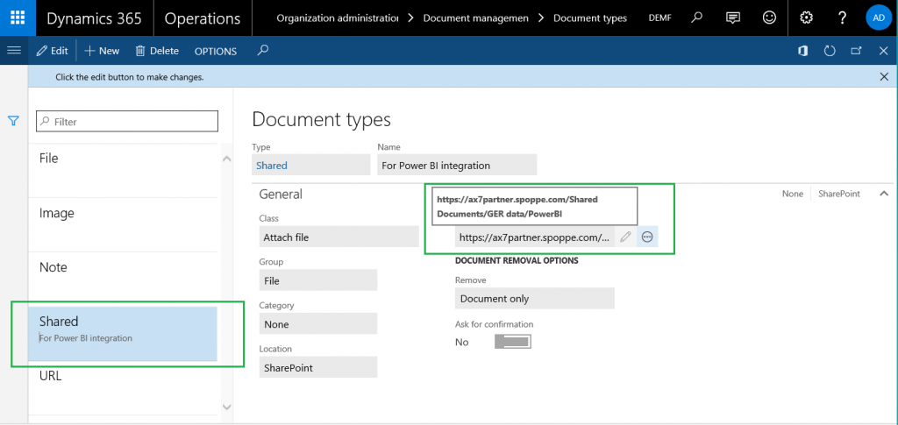
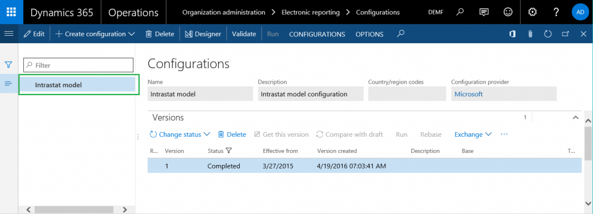
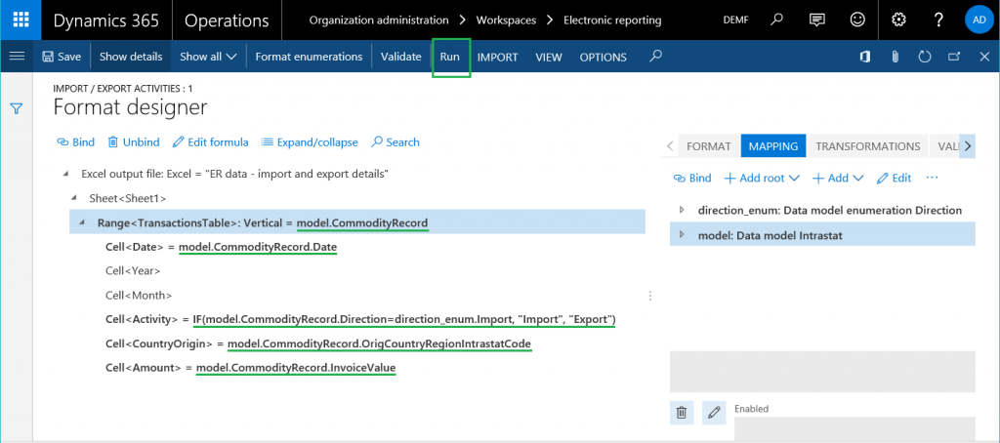
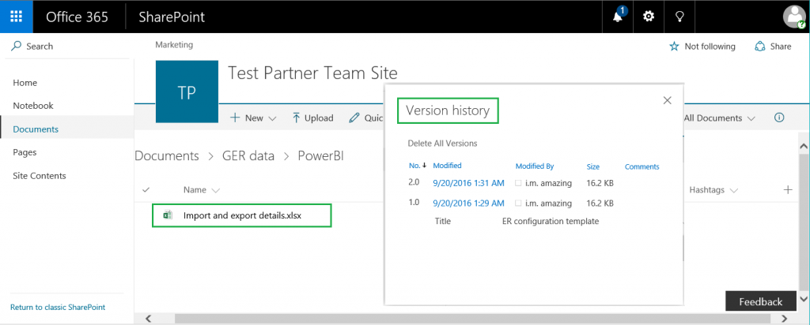
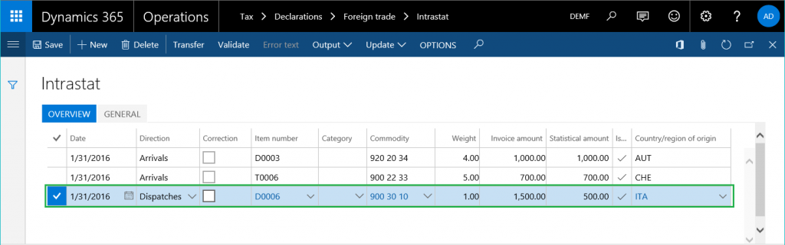

---
# required metadata

title: Set up Electronic reporting to provide Power BI with data from Dynamics 365 for Operations
description: This topic explains how you can use your Electronic reporting (ER) configuration to arrange the transfer of data from your instance of Dynamics 365 for Operations to Power BI services. As an example, this topic uses Intrastat transactions as business data that must be transferred. The Power BI map visualization uses this Intrastat transaction data to present a view for analysis of company import/export activities on the Power BI report.
author: kfend
manager: AnnBe
ms.date: 2016-10-31 13 - 22 - 29
ms.topic: article
ms.prod: 
ms.service: Dynamics365Operations
ms.technology: 

# optional metadata

# ms.search.form: 
# ROBOTS: 
audience: Application User, Developer, IT Pro
# ms.devlang: 
# ms.reviewer: 71
ms.search.scope: Operations, Core
# ms.tgt_pltfrm: 
ms.custom: 220314
ms.assetid: 2685df16-5ec8-4fd7-9495-c0f653e82567
ms.search.region: Global
# ms.search.industry: 
ms.author: nselin
ms.search.validFrom: 2016-11-30
ms.dyn365.ops.version: Version 1611

---

# Set up Electronic reporting to provide Power BI with data from Dynamics 365 for Operations

This topic explains how you can use your Electronic reporting (ER) configuration to arrange the transfer of data from your instance of Dynamics 365 for Operations to Power BI services. As an example, this topic uses Intrastat transactions as business data that must be transferred. The Power BI map visualization uses this Intrastat transaction data to present a view for analysis of company import/export activities on the Power BI report.

Overview
--------

Microsoft Power BI is a collection of software services, apps, and connectors that work together to turn external sources of data into coherent, visually immersive, and interactive insights. Electronic reporting (ER) lets users of Microsoft Dynamics 365 for Operations easily configure data sources and arrange the transfer of data from Dynamics 365 for Operations to Power BI. The data is transferred as files in the OpenXML worksheet (Microsoft Excel workbook file) format. The transferred files are stored on a Microsoft SharePoint Server that has been configured for that purpose. The stored files are used in Power BI to make reports that include visualizations (tables, charts, maps, and so on). Power BI reports are shared with Power BI users, and they are accessed in Power BI dashboards and on Dynamics 365 for Operations pages. This topic explains the following tasks:

-   Configure Dynamics 365 for Operations.
-   Prepare your ER format configuration to get data from Dynamics 365 for Operations.
-   Configure the ER environment to transfer data to Power BI.
-   Use transferred data to create a Power BI report.
-   Make the Power BI report accessible in Dynamics 365 for Operations.

## Prerequisites
To complete the example in this topic, you must have the following access:

-   Access to Dynamics 365 for Operations for one of the following roles:
    -   Electronic reporting developer
    -   Electronic reporting functional consultant
    -   System administrator
-   Access to the SharePoint Server that is configured for use with Dynamics 365 for Operations
-   Access to the Power BI framework

## Configure document management parameters
1.  On the **Document management parameters** page, configure access to the SharePoint Server that will be used in the company that you're signed in to (the DEMF company in this example).
2.  Test the connection to the SharePoint Server to make sure that you've been granted access. 
3.  Open the configured SharePoint site. Create a new folder where ER will store Excel files that have the business data that the Power BI reports require as a source of Power BI datasets.
4.  In Dynamics 365 for Operations, on the **Document types** page, create a new document type that will be used to access the SharePoint folder that you just created. Enter **File** in the **Group** field and **SharePoint** in the **Location** field, and then enter the address of the SharePoint folder. 

## Configure ER parameters
1.  In the **Electronic reporting** workspace, click the **Electronic reporting parameters** link.
2.  On the **Attachments** tab, select the **File** document type for all the fields.
3.  In the **Electronic reporting** workspace, make the required provider active by clicking **Set active**. For more information, play the **ER Select service provider** task guide.

## Use an ER data model as the source of data
You must have an ER data model as the source of business data that will be used on Power BI reports. This data model is uploaded from the ER configurations repository. For more information, see [Download Electronic reporting configurations from Lifecycle Services](download-electronic-reporting-configuration-lcs.md), or play the **ER Import a configuration from Lifecycle Services** task guide. Select **Intrastat** as the data model that will be uploaded from the selected ER configurations repository. (In this example, version 1 of the model is used.) You can then access the **Intrastat** ER model configuration on the **Configurations** page. 

## Design an ER format configuration
You must create a new ER format configuration that uses the **Intrastat** data model as the source of business data. This format configuration must generate output results as electronic documents in OpenXML (Excel file) format. For more information, play the **ER Create a configuration for reports in OPENXML format** task guide. Name the new configuration **Import / export activities**, as shown in the following illustration. Use the [ER data - import and export details](./media/er-data-import-and-export-details.xlsx) Excel file as a template when you design the ER format. (For information about how to import a format template, play the task guide.)  To modify the **Import / export activities** format configuration, follow these steps.

1.  Click **Designer**.
2.  On the **Format** tab, name the file element for this format **Excel output file**. 
3.  On the **Mapping** tab, specify the name of the Excel file that will be generated whenever this format is run. Configure the related expression to return the value **Import and export details** (the .xlsx file name extension will be added automatically). 
4.  Add a new data source item for this format. (This enumeration will be required for further data binding.)
    1.  Name the data source **direction\_enum**.
    2.  Select **Data model enumeration** as the data source type.
    3.  Refer to the **Direction** data model enumeration.

    
5.  Complete the binding of elements of the **Intrastat** data model and elements of the designed format, as shown in the following illustration. 

After it's run, the ER format generates the output result in Excel format. It sends the details of the Intrastat transactions to the output result, and separates them as transactions that describe either import activities or export activities. Click **Run** to test the new ER format for the list of Intrastat transactions on the **Intrastat** page (**Tax** &gt; **Declarations** &gt; **Foreign trade** &gt; **Intrastat**).  The following output result is generated. The file is named **Import and export details.xlsx**, as you specified in the format settings. 

## Configure the ER destination
You must configure the ER framework to send the output result of the new ER format configuration in a special way.

-   The output result must be sent to the folder of the selected SharePoint Server.
-   Each execution of the format configuration must create a new version of same Excel file.

On the **Electronic reporting** page (**Organization administration** &gt; **Electronic reporting**), click the **Electronic reporting destination** item, and add a new destination. In the **Reference** field, select the **Import / export activities** format configuration that you created earlier. Follow these steps to add a new file destination record for the reference.

1.  In the **Name** field, enter the title of the file destination.
2.  In the **File name** field, select the name **Excel output file** for the Excel file format component.

Click the **Settings** button for the new destination record. Then, in the **Destination settings** dialog box, follow these steps.

1.  On the **Power BI** tab, set the **Enabled** option to **Yes**.
2.  In the **SharePoint** field, select the **Shared** document type that you created earlier.

## Schedule execution of the configured ER format
On the **Configurations** page (**Organization administration** &gt; **Electronic reporting** &gt; **Configurations**), in the configurations tree, select the **Import / export activities** configuration that you created earlier. Change the status of version 1.1 from **Draft** to **Complete** to make this format available for use.  Select the completed version of the **Import / export activities** configuration, and then click **Run**. Note that the configured destination is applied to the output result that is generated in Excel format. Set the **Batch processing** option to **Yes** to run this report in unattended mode. Click **Recurrence** to schedule the required recurrence of this batch execution. The recurrence defines how often the updated data will be transferred from Dynamics 365 for Operations to Power BI.  After it's configured, you can find the ER report execution job on the **Batch jobs** page (**System administration &gt; Inquiries &gt; Batch jobs**).  When this job is run for the first time, the destination creates a new Excel file that has the configured name in the selected SharePoint folder. Every subsequent time that the job is run, the destination creates a new version of this Excel file. 

## Create a Power BI dataset by using the output result of the ER format
Sign in to Power BI, and either open an existing Power BI group (workspace) or create a new group. Either click **Add** under **Files** in the **Import or Connect to Data** section, or click the plus sign (**+**) next to **Datasets** in the left pane.  Select the **SharePoint – Team sites** option, and then enter the path of SharePoint Server that you're using (**https://ax7partner.spoppe.com** in our example). Then browse to the **/Shared Documents/GER data/PowerBI** folder, and select the Excel file that you created as the source of data for the new Power BI dataset.  Click **Connect**, and then click **Import**. A new dataset is created that is based on the selected Excel file. The dataset can also be added automatically to the newly created dashboard.  Configure the refresh schedule for this dataset to force a periodic update. Periodic updates enable the consumption of new business data that comes from Dynamics 365 for Operations via periodic execution of the ER report through new versions of the Excel file that are created on the SharePoint Server.

## Create a Power BI report by using the new dataset
To create a new Power BI report, click the **Import and export details** Power BI dataset that you created. Then configure the visualization. For example, select the **Filled map** visualization, and configure it as follows:

-   Assign the **CountryOrigin** dataset field to the **Location** field of the map visualization.
-   Assign the **Amount** dataset field to the **Color saturation** field of the map visualization.
-   Add the **Activity** and **Year** dataset fields to the **Filters** fields collection of the map visualization.

Save the Power BI report as **Import and export details report**.  Note that the map shows the countries/regions that are mentioned in the Excel file (Austria and Switzerland in this example). These countries/regions are colored to show the proportion of invoiced amounts for each. Update the list of Intrastat transactions. The export transaction that originated from Italy is added.  Wait for the next scheduled execution of the ER report and the next scheduled update of the Power BI dataset. Then review the Power BI report (select to show import transactions only). The updated map now shows Italy. 

## Access Power BI report in Dynamics 365 for Operations
Set up the integration between Dynamics 365 for Operations and Power BI. For more information, see [Configuring Power BI integration for workspaces](configure-power-bi-integration.md). On the **Electronic reporting** workspace page that supports Power BI integration (**Organization administration** &gt; **Workspaces** &gt; **Electronic reporting workspace**), click **Options** &gt; **Open report catalog**. Select the **Import and export details** Power BI report that you created, to show that report as an action item on the selected page. Click the action item to open the Dynamics 365 for Operations page that shows the report that you designed in Power BI. 

See also
--------

[Electronic reporting destinations](electronic-reporting-destinations.md)

[Electronic reporting overview](general-electronic-reporting.md)

