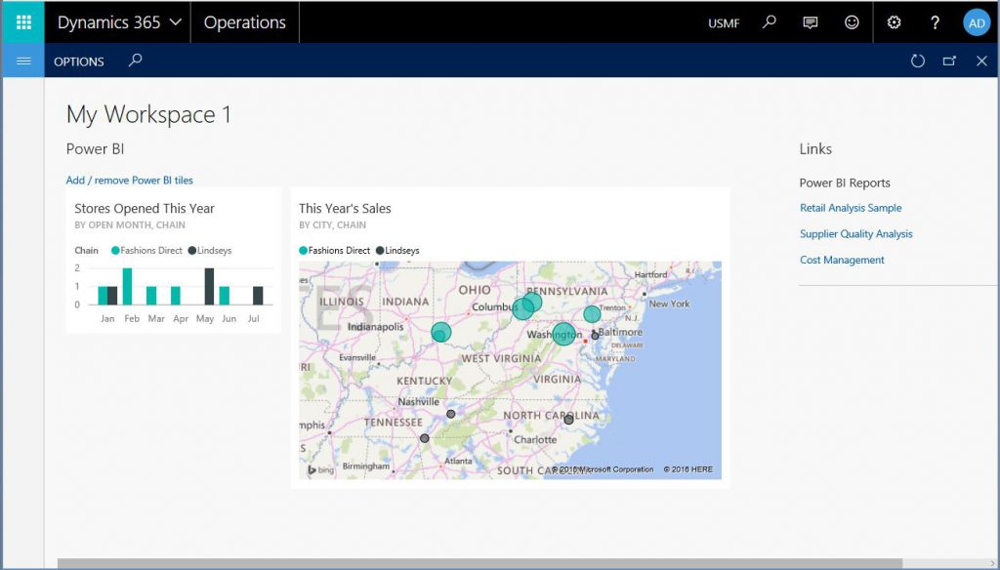

---
# required metadata

title: Pin Power BI reports to workspaces
description: Microsoft Dynamics 365 for Operations uses Power BI for data exploration. This topic explains how you can pin full-page Power BI reports to workspaces in Dynamics 365 for Operations to give your users an interactive data exploration experience.
author: sericks007
manager: AnnBe
ms.date: 2017-01-05 15 - 13 - 20
ms.topic: 
ms.prod: 
ms.service: 
ms.technology: 

# optional metadata

# ms.search.form: 
# ROBOTS: 
audience: IT Pro
# ms.devlang: 
# ms.reviewer: 71
ms.search.scope: Operations, Platform, AX Platform
# ms.tgt_pltfrm: 
ms.custom: 265844
ms.assetid: a0011a12-a1eb-46bd-8d28-e532fec14e09
ms.search.region: Global
# ms.search.industry: 
ms.author: milindav
ms.search.validFrom: 2016-05-31
ms.dyn365.ops.version: Platform update 1

---

# Pin Power BI reports to workspaces

Microsoft Dynamics 365 for Operations uses Power BI for data exploration. This topic explains how you can pin full-page Power BI reports to workspaces in Dynamics 365 for Operations to give your users an interactive data exploration experience.

This topic assumes that you're familiar with the feature that lets you pin Microsoft Power BI tiles to a workspace. For more information, see [Power BI integration](power-bi-integration.md#embedding-power-bi-visuals-in-the-dynamics-ax-client). If you're a developer who is creating a workspace, to let users pin Power BI tiles to the workspace, embed the Power BI tile control.

## Pin Power BI reports to workspaces
Microsoft Dynamics AX platform update 1 (May 2016) introduced the capability to pin Power BI reports to workspaces. Power BI reports can be added to any workspace that contains a **Links** section. In other words, the reports can be added to most of the out-of-box workspaces that are included in the product. To enable Power BI reports and tiles, you must configure Power BI to work with Microsoft Dynamics 365 for Operations. This one-time operation must be completed by an administrator in a Dynamics 365 for Operations environment. For instructions, see [Configuring Power BI integration for workspaces](configure-power-bi-integration.md#register-your-dynamics-ax-deployment-as-a-web-app-in-the-azure-portal). After you've configured Power BI to work with Dynamics 365 for Operations, open the **Ledger budgets and forecasts** workspace in the client. In the workspace, click the **Options** tab. Notice that this tab contains buttons to open the (Power BI) tile catalog and the (Power BI) report catalog. Click **Open report catalog**. A dialog box that contains a list of reports appears. The list of reports comes from the reports that you have in your Power BI account. If you open PowerBI.com in a browser, you will see that the same list of reports is used across your Power BI dashboards. Select some reports, as shown in the following illustration, and then click **OK** to continue.  Next, scroll to the bottom of the **Links** section in the workspace. Notice that a new section for Power BI reports has been added to your links. 

## Fullpage Power BI reports in the client
You can open and run Power BI reports in the Dynamics 365 for Operations client. The functionality resembles the functionality for running Microsoft SQL Server Reporting Services (SSRS) reports. To run a Power BI report, in the **Links** section, click the link for one of the Power BI reports. For this example, click the **Retail Analysis Sample** link. The Power BI report is opened in the client in a full-page view, as shown in the following illustration. This report is interactive. As you click regions of the report, the remaining visuals react to your selection.  You can filter the data on the report by using the filter pane. The following illustration shows the report after filters have been applied.  You can also open this report on PowerBI.com and make changes. You can then save the modified report as another copy that has a different name, and even pin the new report to the workspace.

## Power BI in usercreated workspaces
So far, we have described how to add Power BI tiles and reports to "developer-created" workspaces. Developer-created workspaces are workspaces that are created by Microsoft (that is, they are built into the product), by your independent software vendor (ISV) or partner, or by in-house developers. However, in Microsoft Dynamics AX platform update 1 (May 2016), users can create new workspaces by using the personalization capabilities of the client. To create a new workspace, on the home page (or the dashboard), right-click the tile for a workspace, and then click **Add a workspace**. A new workspace is created. New workspaces are named **My Workspace 1**, **My Workspace 2**, and so on. You can change the name later. Click the workspace that you just created. You can now add Power BI tiles and reports by using the same options that we discussed earlier. The following illustration shows an example. 

