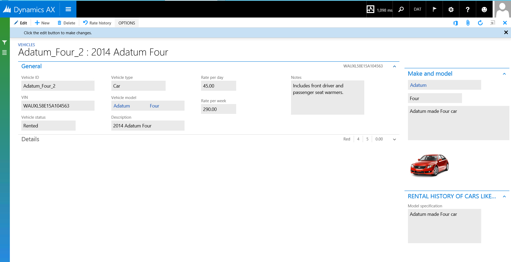
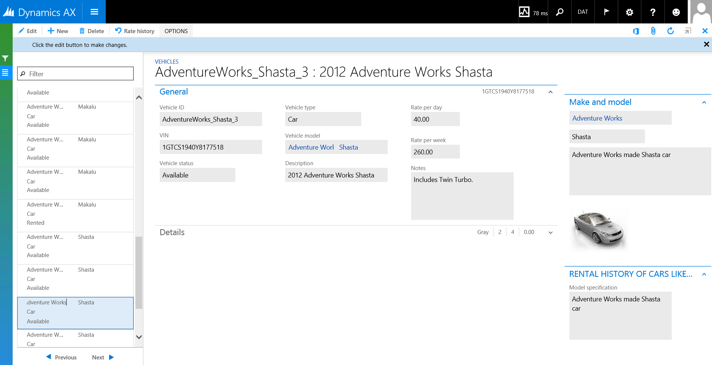

---
# required metadata

title: Add contextual BI to forms
description: In this tutorial you'll model a form part that displays the previous rental history of vehicles. You'll add the form part to the Vehicles form using a DynaLink. When the user views a vehicle record, the part displays relevant rental history. 
author: sericks007
manager: AnnBe
ms.date: 2017-04-04
ms.topic: article
ms.prod: 
ms.service: Dynamics365Operations
ms.technology: 

# optional metadata

# ms.search.form: 
# ROBOTS: 
audience: Developer
# ms.devlang: 
ms.reviewer: annbe
ms.search.scope: AX 7.0.0, Operations
# ms.tgt_pltfrm: 
ms.custom: 24571
ms.assetid: 7c878bad-028d-4134-a83f-10386cf7c72e
ms.search.region: Global
# ms.search.industry: 
ms.author: milindav
ms.search.validFrom: 2016-02-28
ms.dyn365.ops.version: AX 7.0.0

---

# Add contextual BI to forms

In this tutorial you'll model a form part that displays the previous rental history of vehicles. You'll add the form part to the Vehicles form using a DynaLink. When the user views a vehicle record, the part displays relevant rental history. 

Prerequisites
-------------

This tutorial requires you to access the Microsoft Dynamics 365 for Operations environment using Remote Desktop, and be provisioned as an administrator on the Dynamics 365 for Operations instance. For more information, see [Access Microsoft Dynamics 365 for Operations Instances](..\dev-tools\access-instances.md).

## Key concepts
-   **Aggregate measurements** - Similar to **perspectives** and **Cubes** from earlier versions of Microsoft Dynamics 365 for Operations, aggregate measurements let you model and consume aggregate data in Dynamics 365 for Operations.
-   **Aggregate data entities** - Aggregate data can be consumed in building charts and other controls. Using the model driven approach, you have the ability to create data entities by directly referencing aggregate measurements and aggregate dimensions. These entities are referred to as **Aggregate data entities**. Aggregate data entities are read-only data entities used for reporting purposes.
-   **Contextual BI** - Contextual BI refers to providing required insights as a part of the user experience so that the user has relevant insights to not only achieve the task, but be highly productive during the course of the day.
-   **Embedded BI -** Embedded BI refers to analytic content being embedded within the Dynamics 365 for Operations user experience. Contextual BI and embedded BI teams are closely related. Contextual BI implies the added notion that the context of analytic context revolves around the data or the task.
-   **Self-service BI** - Self-service BI refers to enabling to user to tweak existing and/or create new analytic content such as reports, KPIs, and dashboards.

## Setup
### Install demo data

If this is the first tutorial you’re working on, follow the steps in the **Appendix** section at the end of this article to install demo data.

### Import the lab 10.2 project

This tutorial works on Fleet Management model.

1.  Download the Fleet Management sample from <https://github.com/Microsoft/FMLab>, save it to **C:**, and unzip it.
2.  In Visual Studio, on the **Dynamics 365 for Operations** menu, click **Import Project**.
3.  In the **Import Project** window, next to the **Filename** text box, click the ellipsis button.
4.  In the Select the file to import window, browse to **C:\\FmLab\\Lab 10-2** folder, click **Add contextual BI to forms –Before Lab.axpp**, and then click **Open**.
5.  Select the **Overwrite Elements** option, and then click **Ok**.
6.  Open the project **BIR102 Adding contextual BI - Before Lab.** Double-click the **FMVehicle** form in Solution Explorer.

## Review the FMVehicle form
1.  In this tutorial, the **FMVehicle** form has been modified with a part that shows the rental history of vehicles that are the same make. The form part has been added to the **FMVehicle** form.
2.  In Solution Explorer, double-click the **FMVehicle** form. The form designer will open as shown below. Notice the newly added form part. 

    

3.  Select the form part reference node **FMVehicleRentalsAndRevenue\_Part**, right-click, and then select **Properties**. Notice following properties in the part reference

    | **Property name**        | **Value**                          | **Notes** |
    |--------------------------|------------------------------------|-----------|
    | **Name**                 | FMVehicleRentalsAndRevenue\_Part   |           |
    | **Menu item name**       | FMBIVehicleRentalsAndRevenue\_Part |           |
    | **Data source**          | FMVehicle                          |           |
    | **Data source relation** | FMVehicle.VehicleModel             |           |
    | **Run mode**             | Local                              |           |

**Note:** In this case, the form part should refresh asynchronously when information about a vehicle, shown in the grid, changes in the parent form. We've selected the **FMVehicleModel** table to be the data source that relates the main form and the part.

## Review the form part to display vehicle model data
Next, we will review the form part.

1.  In Solution Explorer, select and double-click the form part **FMBIVehicleRentalsAndRevenue\_Part**.
2.  The form part will be appear in the Form designer as shown below. 
    
    

3.  Select **DataSources** &gt; **FMVehicleModel**, right-click, and then select **Properties**.
4.  Review the following properties.

    | **Property name** | **Value**      | **Notes** |
    |-------------------|----------------|-----------|
    | **Table**         | FMVehicleModel |           |
    | **Link type**     | Delayed        |           |

    **Note:** You could have used other DynaLink types. In this case, we want the form part to refresh asynchronously. So we have selected Delayed as the DynaLink type.
5.  Next, select the project node, right-click, and then select **Rebuild**. Press **Ctrl+F5** to run the form. You will see the modified Vehicle form.
6.  Expand the **Rental history of Cars like this** part by clicking the Down Arrow beside the part. 
    
7.  Select and click a record to view detailed information about the record.
8.  To see context being passed to the form part, select the **List** icon on the bottom left and navigate through the records. You will see the part display model specification for each of the cars shown on the page. 
    

## Adding contextual BI to the form part using an aggregate data entity
In this section, you’ll model an aggregate data entity. Next, you will add the Aggregate Data entity into the form part and then populate a chart.

### Model an Aggregate data entity that shows the Number of Rentals by Vehicle model by month

1.  Select the project node **BIR102 Adding contextual BI**, right-click, and then select **Add** &gt; **New Item**.
2.  In the **Add new item** wizard, select **Dynamics 365 for Operations Artifacts** &gt; **Analytics** &gt; **Aggregate Data entity**. Enter the name **FMBIRevenueByVehicleModelbyMonth**, and select **Add**. The Aggregate Data Entity designer will be displayed.
3.  Associate the aggregate Data entity **FMBIRevenueByVehicleModelbyMonth** with the aggregate measurement **FMAggregateMeasurements** as follows:
    1.  Select the **DataSource** node.
    2.  Right-click, and select **Properties**.
    3.  Select **FMAggregateMeasurement** as the property value for **Measurement property**.
    4.  Save the aggregate data entity. You will notice the measurement **FMAggregateMeasurements** shown under the **DataSource** node, as shown below. You can expand the aggregate measurement so that you can see each of the fields. 
         
        
        **Note:** An aggregate data entity can reference only one aggregate measurement. You can’t define aggregate data entities that reference multiple aggregate measurements.

4.  Add a measure field to the data entity from the aggregate measurement. Multi-select **NoRentals** and **TotalRevenue** measures by clicking on both of them while pressing the **Ctrl** key.
5.  Use the drag-and drop operation to move the measures into the **Fields** node. Two fields will be created in the aggregate data entity **FMBIRevenueByVehicleModelbyMonth**, as shown below. 
    
6.  Right-click the **Fields** node of **FMBIRevenueByVehicleModelbyMonth**, and then select **New &gt;** **Mapped Field**.
7.  Add a dimension attribute as a field. Right-click the **Fields** node of **FMBIRevenueByVehicleModelbyMonth**, and then select **Mapped Field.**
8.  Enter the following property values.

    | **Property name**      | **Value**        | **Notes** |
    |------------------------|------------------|-----------|
    | **Name**               | VehicleModel     |           |
    | **Measure Group**      | FMRentalCharges  |           |
    | **Dimension**          | FMVehicle        |           |
    | **Attribute**          | VehicleModel     |           |
    | **Extended Data type** | FMVehicleModelId |           |

    **Note:** Where discoverable, extended data types that are associated with measures and dimension attributes will be defaulted by the system in the Extended Data type property. You can change the defaults where required.
9.  Define another dimension attribute by using dragging and dropping a Dimension. Expand **Data Source &gt; FMAggregateMeasurements &gt; FMRentalCharges &gt; Dimensions**. Select the **RentalStartDate** dimension.
10. Drag and drop the dimension into the **Fields** node. Notice that the field properties have been initialized by the drag-and-drop operation. Modify the following default properties.
    -   Select **Month** as the **Attribute** property
    -   Modify the **Name** property to **RentalMonth**

11. Note that the aggregate data entity **FMBIRevenueByVehicleModelbyMonth **contains 4 fields. All measures that are added to aggregate data entities will be grouped by the dimension attributes added as fields.
12. Save the aggregate data entity. Re-build the project.
    -   Make sure that **Synchronize database** is enabled with the build under **Project** properties.
    -   You can also synchronize the database after the build if you have not enabled the above setting.

13. Launch **Application Explorer**. Click **AOT** &gt; **Data Model** &gt; **Aggregate DataEntities**. The aggregate data entity that you defined should appear in the node.

**NOTE:** Aggregate data entities are currently reflected within an Aggregate DataEntities node. In the future, they will be shown within the **Data Entities** node. 

### Add the Aggregate Data Entity to the form part data source

1.  Select the newly defined aggregate data entity **FMBIRevenueByVehicleModelbyMonth** in Solution Explorer. Drag-and-drop the aggregate data entity to the **Data sources** node of the form part.
2.  Select the aggregate data entity **FMBIRevenueByVehicleModelbyMonth** in the Data sources node. Right-click, and then select **Properties**. Review the following properties. You do not need to modify defaults.
    | **Property name** | **Value**                        | **Notes** |
    |-------------------|----------------------------------|-----------|
    | **Name**          | FMBIRevenueByVehicleModelbyMonth |           |
    | **Table**         | FMBIRevenueByVehicleModelbyMonth |           |
    | **Link type**     | Delayed                          |           |

    **Note:** You could have used other DynaLink types. In this case, we want the parts that are built using the AggregateData Entity to be refreshed based on the record selection in the **FMVehicleModel** table.
3.  Next, you will relate the Aggregate Data entity and the **FMVehicleModel** table in the form data source.
4.  Save the form.

### Define a relationship between data sources in the form part

In the previous step, we have added the Aggregate Data Entity to the form as a data source. However, the aggregate data entity and the main table **FMVehicleModel** are not related to each other. This would prevent the **FMVehicleModel** record context from being passed to any of the controls built using the aggregate data entity.

1.  Expand the **Data sources &gt; FMBIRevenueByVehicleModelbyMonth &gt; methods** node in the form part. Right-click and select **Override &gt; init**.
2.  An Init method will be added to the table. The Code editor will launch with the init() method definition.
3.  Copy and paste the  following code into the body of the init() method **after **super( )****
    1.  this.queryBuildDataSource().addDynalink(fieldNum(FMBIRevenueByVehicleModelbyMonth, VehicleModel), FMVehicleModel, fieldNum(FMVehicleModel, Model));

4.  The completed method definition should be as follows ********

         public void init()
         {
               super(); 
               this.queryBuildDataSource().addDynalink(fieldNum(FMBIRevenueByVehicleModelbyMonth, VehicleModel), FMVehicleModel, fieldNum(FMVehicleModel, Model));
         }

5.  Save the class, and then build the project.

## Model a chart in the form part
Model a chart within the form part by using the data in the temp table.

1.  Click in the Form Designer window of **FMBIVehicleRentalsAndRevenue\_Part**. On the right, select the **FormGroupControl** node of the Form designer, right-click, and then select **New** &gt; **Chart**. A chart control will be added to the form part.
2.  Select **SysChart1**, the root node of the chart, and then enter following properties.

    | **Property name**  | **Value**         | **Notes** |
    |--------------------|-------------------|-----------|
    | **Name**           | RentalHistory     |           |
    | **Height mode**    | Size to available |           |
    | **Width mode**     | Size to available |           |
    | **Legend enabled** | False             |           |

3.  Expand the **Bindings** node, and select **SysBuildChartDataSet1** node. Right-click, and select **Properties**. Enter the following property values.

    | **Property name** | **Value**                        | **Notes** |
    |-------------------|----------------------------------|-----------|
    | **Name**          | NumRentalsByMonth                |           |
    | **Data source**   | FMBIRevenueByVehicleModelbyMonth |           |
    | **Categories**    | RentalMonth                      |           |

4.  Expand the **Series** node, and select the **SysBuildChartMeasure1** node. Right-click, and then select **Properties**. Enter the following property values.

    | **Property name** | **Value**         | **Notes** |
    |-------------------|-------------------|-----------|
    | **Name**          | NumRentals        |           |
    | **Binding**       | NumRentalsByMonth |           |
    | **Chart Type**    | Column            |           |
    | **Value**         | NumRentals        |           |

5.  Save the form part and rebuild.
6.  Press **Ctrl+F5** to preview the form. You will see a chart for the record that is selected in the grid. 
     
    **Note:** If the chart doesn’t contain any data, complete the following steps.
7.  Close all instances of the browser and rerun the form
8.  Verify all instances of the browser and rerun the form

## Appendix
### Installing the demo data

To work with the sample, you must install the provided demo data.

1.  Open Internet Explorer, and navigate to your Dynamics 365 for Operations instance base URL.
    -   On the cloud environment, the base URL is obtained from LCS
    -   On a local VM, the base URL is [https://usnconeboxax1aos.cloud.onebox.dynamics.com](https://usnconeboxax1aos.cloud.onebox.dynamics.com/en/)
2.  Sign in.
3.  On the dashboard, scroll to the far right, and in the **Fleet Management** section, click the **Fleet setup** tile.
4.  On the **Setup** form, click **Load demo data**.
5.  If you’re prompted to reload the base data, click **Yes**.
6.  When the data is finished loading, click **Close**.
7.  Click **Show navigation pane** on the navigation bar. 

    

