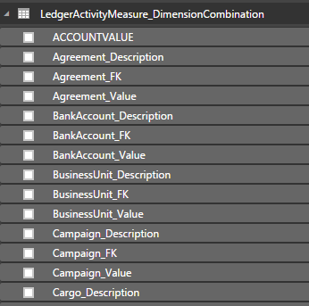
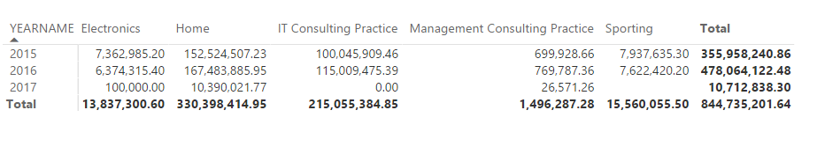

---
# required metadata

title: Add financial dimensions into aggregate measurements
description: This feature enables a power user to include financial dimensions in ready-made Power BI reports.
author: MilindaV2 
manager: AnnBe
ms.date: 06/16/2017
ms.topic: article
ms.prod: 
ms.service: Dynamics365Operations
ms.technology: 

# optional metadata

# ms.search.form:  
audience: Developer, IT Pro
# ms.devlang: 
# ms.reviewer: sericks
# ms.search.scope: Operations Platform
# ms.tgt_pltfrm: 
# ms.custom: 
ms.assetid: c04e0a7b-1747-4b88-b729-fd820f8ab600
ms.search.region: Global 
# ms.search.industry: 
ms.author: milindav
ms.dyn365.intro: 2017-06-30
ms.dyn365.version: Platform update 8
---

# Add financial dimensions into aggregate measurements

[!include[banner](../includes/banner.md)]

This feature enables a power user to include financial dimensions in ready-made Power BI reports. Power users can also create new Power BI reports using financial dimensions.

Financial dimensions are user-defined, configuration data that enables the (Ledger) chart of accounts to retain additional information. By adding financial dimensions, a user can configure additional data fields to be included with the chart of accounts as well as with financial reports. This enables the ledger chart of accounts to be sliced and diced with those fields. This is very powerful in financial reporting - you may want to explore Ledger data using the newly added financial dimensions. Since no financial dimensions are included in the ready-made Power BI reports when they are shipped, you would need to include these additional fields in the ready-made reports.

Once financial dimension fields are included in the report, the report can be shared with other users. Users can modify existing visuals, such as charts, by including all or some of the financial dimension fields.

**NOTE:** This feature is enabled in Dynamics 365 for for Finance and Operations, Enterprise edition July 2017 update. Platform update 8 or later is also required. 

How does this feature work?
===========================

Entity store is an operational data warehouse that enables power users to author reports. Whenever Entity store is refreshed, all available financial dimensions are included in the Entity store. Let’s consider an example from the **Ledger Activity** aggregate measurement which contains General Ledger journal-level details.

With this change, the following tables are populated in the Entity store when it is refreshed. Tables that have changed are highlighted.

LedgerActivityMeasure\_LedgerActivityMeasureGroup

LedgerActivityMeasure\_TransactionDate

LedgerActivityMeasure\_Currency

LedgerActivityMeasure\_FiscalPeriodDateAggregtateDimension

LedgerActivityMeasure\_LedgerFactDimension

LedgerActivityMeasure\_ FiscalYearOffsetDimension

LedgerActivityMeasure\_MainAccount

**LedgerActivityMeasure\_DimensionCombination**

LedgerActivityMeasure\_Ledger

LedgerActivityMeasure\_MainAccountCategory

LedgerActivityMeasure\_Company

LedgerActivityMeasure\_MainAccountLegalEntity

**LedgerActivityMeasure\_Agreement**

**LedgerActivityMeasure\_BankAccount**

**LedgerActivityMeasure\_BusinessUnit**

**LedgerActivityMeasure\_Campaign**

**LedgerActivityMeasure\_Cargo**

**LedgerActivityMeasure\_Cargo\_CN**

\<more tables…\>

Notice that for each of the financial dimensions that are defined in your system, you may see a corresponding table in the Entity store.

If you examine the **LedgerActivityMeasure\_DimensionCombination** table, you will notice that the list of fields has been expanded to include additional fields. Each newly added field corresponds to a financial dimension. For an example, you will notice additional fields as follows:

**Agreement\_FK**

**Agreement\_Description**

**Agreement\_Value**

**BankAccount\_FK**

**BankAccount\_Description**

**BankAccount\_Value**

**BusinessUnit\_FK**

**BusinessUnit\_Description**

**BusinessUnit\_Value**

\<more fields with a tuple corresponding to each financial dimension\>

Suppose a user defines a new financial dimension with the name **vendor**. When the Entity store is later refreshed, a new table is added to the Entity store with the following name: **LedgerActivityMeasure\_Vendor**

The table **LedgerActivityMeasure\_DimensionCombination** will also contain a new set of fields as follows:

**Vendor\_FK**

**Vendor\_Description**

**Vendor\_Value**

How a Power BI report author can write reports using financial dimensions
=========================================================================

A business user can create a new report using financial dimensions using Power BI desktop. Existing reports that contain financial dimensions can be refreshed to include additional fields into the report.

Let’s create a Power BI desktop report using the Ledger Activity measure group. 

1. In a development environment, connect to the Entity store database using the Power BI desktop tool. 
2. Select the following tables

**LedgerActivityMeasure\_LedgerActivityMeasureGroup**

**LedgerActivityMeasure\_FiscalPeriodDateAggregtateDimension**

**LedgerActivityMeasure\_DimensionCombination**

3. Using the manage relationships option in Power BI desktop, define relationships with the following table fields:

- Define a Join between **LedgerActivityMeasure\_LedgerActivityMeasureGroup.LEDGERDIMENSION** and **LedgerActivityMeasure\_DimensionCombination.DIMENTIONCOMBINATIONRECID**

- Define a Join between **LedgerActivityMeasure\_LedgerActivityMeasureGroup.LEDGERGREGORIANDATEID** and **LedgerActivityMeasure\_FiscalPeriodDateAggregateDimension.LEDGERPERIODGREGORIANDATEID**

4. Create a matrix report using the **Sales** and **YearName** fields. You should see a report as follows:

5. Next let’s add financial dimension values. 

6. Expand the **LedgerActivityMeasure\_DimensionCombination** table in the fields list in PowerBI desktop. You will notice the list of dimension fields expanded into table fields as shown below.

7. Include the **BusinessUnit\_Description** field in the report. Your report should now show Sales by Business unit as follows:

8. Notice that you have the **BusinessUnit\_description** as well **BusinessUnit\_Value** fields. The value field enables you to get a numerical value which can be used to sort columns.

9. Define a new financial dimension and refresh Entity store. 

10. On completion of refresh, you can right-click on the **LedgerActivityMeasure\_DimensionCombination** table and select “**Refresh Data**”. Notice that the newly defined Financial dimension is reflected in the list of fields available for reporting.

11. You can include the newly added financial dimension fields in the report.

Creating reports with expanded Financial dimension tables
---------------------------------------------------------

As we discussed earlier, new tables also got created in the Entity store. Each financial dimension field is also added to a newly created table. Newly created tables contain individual fields for the name, value, and description.

Notice that the newly created tables contain a key that can be used to join them with the **LedgerActivityMeasure\_DimensionCombination** table used to create the report. If you want to use fields from these additional tables, you can simply include them in the report and relate them using the keys.

1. Open the report created previously. Let us add a financial dimension table to the report.

2. Select “**Recent Sources**” option from the Power BI desktop menu. Select the AXDW data connection. Table navigator will be displayed.

3. Select the table **LedgerActivityMeasure\_LegalEntity** to the report.

**NOTE:** If you are using a development or demo environment, you will see this table because **LegalEntity** is a financial dimension defined in demo data. If you are working with your own data, you will see tables corresponding to financial dimensions you have defined.

4. Now we will relate the newly selected table to existing tables already present within the report. Open the **Manage relationships** dialog in the report.

5. Join **LedgerActivityMeasure\_DimensionCombination.LegalEntity\_FK** to **LedgerActivityMeasure\_LegalEntity.KEY\_**

If you had chosen a different Dimension table, you would need to relate the corresponding **FieldName\_FK** field from the Combination table to the **KEY\_** field in the Dimension table.

How a developer can enable Financial dimensions
===============================================

For a user to see expanded financial dimensions in the Entity store, a developer must enable the use of financial dimensions in aggregate measurements. It is a best practice to include financial dimensions when modeling any aggregate measurement that involves financial data. This can be achieved by creating an aggregate dimension based on “**Financial dimension tables”.** Such an Aggregate dimension, ie. the Aggregate dimension created using “Financial dimension tables” will be expanded at runtime as we saw above.

What are “**Financial dimension tables”**?

We consider the base tables that contain Financial dimension data, as “Financial dimension tales” namely, **DimensionAttributeValueCombination** or **DimensionAttributeValueSet.**

If you use a table, a view or an Entity based on these two tables, then the fields of the aggregate dimension will be expanded at runtime.

Let’s consider the example from the **LedgerActivityMeasure** aggregate measurement.

**DimensionCombination** is an aggregate dimension modeled using the base table **DimensionAttributeValueCombination.** In this case, the developer has referenced the Aggregate dimension with the measure group **LedgerActivityMeasureGroup**.

At runtime, new dimension fields are added (ie. **DimensionCombination** table is expanded) as new Financial dimensions are defined in the system.

Creating role playing financial dimensions
------------------------------------------

When reporting with Ledger data, you may require reporting on primary and offset accounts. For an example, in case of a Ledger transaction that involves transferring an amount from one account to another, the primary account would be the **From account** while the offset account is the **To account**. This pattern is known as Role playing dimensions.

You need both primary and offset accounts to be associated with transaction data. This means, you would need to expand Financial dimension fields of both primary and offset accounts. Let’s see how this requirement can be achieved.

See the example below

We have modeled two dimension references for the **LedgerActivityMeaureGroup**. First reference, **DimensionCombination** is joined using the **LedgerDimension** field. We have seen this pattern previously in the document.

The second reference, **OffsetDimensionCombination** is another reference to the same dimension. We have re-used the **DimensionCombination** Aggregate dimension with a new name. In the second case, we can join using the **OffsetLedgerDimension** field.

At runtime, the system will expand both these dimensions with additional fields thereby enabling you to report on primary and offset dimension fields.

