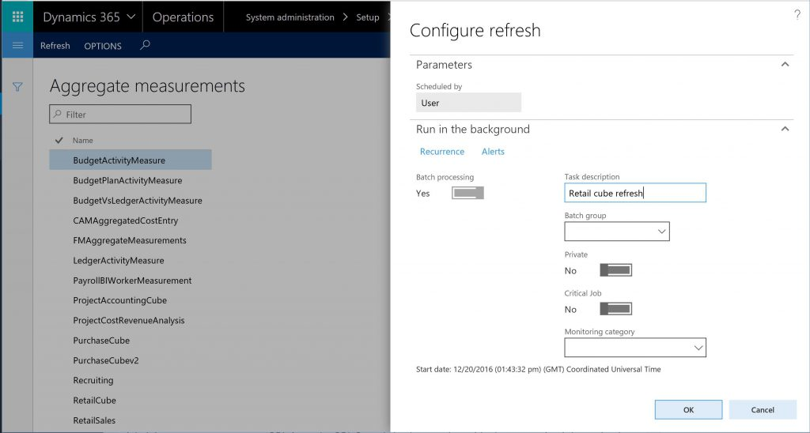

---
# required metadata

title: Authoring Analytical Reports using Power BI Desktop
description: This topic walks you through the process of authoring  Power BI reports using the local Entity Store database. 
author: sericks007
manager: AnnBe
ms.date: 06/20/2017
ms.topic: article
ms.prod: 
ms.service: dynamics-ax-platform
ms.technology: 

# optional metadata

# ms.search.form: 
# ROBOTS: 
audience: Developer, IT Pro
# ms.devlang: 
ms.reviewer: sericks
ms.search.scope: Operations, Platform, UnifiedOperations, AX Platform
# ms.tgt_pltfrm: 
ms.custom: 265864
ms.assetid: e253a57a-979b-4ca5-8e09-2bfce97395a5
ms.search.region: Global
# ms.search.industry: 
ms.author: milindav
ms.search.validFrom: 2016-05-31
ms.dyn365.ops.version: Platform update 1

---

# Authoring Power BI reports using Power BI Desktop

[!include[banner](../includes/banner.md)]

If you are a power user or a business analyst, you probably create many reports for your organization. Perhaps you create these reports in Microsoft Excel by formatting and relating data before sharing it with others. People in your organization may even come to you when they need modifications in the report.  This solution offers an easy way to author rich, interactive reports.  As a report writer, you can use Power BI Desktop as the reporting tool and the reports you create can be published to PowerBI.com.  You can read more about Power BI Desktop in [Create stunning reports and visualizations with Power BI Desktop](https://powerbi.microsoft.com/en-us/desktop) 

## Accessing the local Entity Store using DirectQuery
With Dynamics 365 for Operations, you can author Power BI reports by using OData end points exposed via data entities. Despite its limitations, this approach continues to be supported with Entity store for legacy solutions. DirectQuery is now the preferred method for sourcing data for analytical solutions.  For more information on the benefits and limitations of DirectQuery review the article [here](https://powerbi.microsoft.com/en-us/documentation/powerbi-desktop-use-directquery/).

Using Power BI Desktop, you can create a report in your development or test environment by connecting directly to the local Entity Store DB.  When you are satisfied with the report you can migrate this report to your production environment with the help of your administrator.  Let’s see how this is done….

### Step 1)  Populate the local Entity Store DB
For this example, we'll stage the aggregate models consumed by the Retail analytical solution into the local Entity store.  The models used by the Retail application are defined in the RetailCube aggregate measurement. 

1) Launch Microsoft Finance and Operations client and navigate to the Entity store form **System Administration > Setup > Entity Store**. 
2) Select RetailCube Aggregate measurement, and then select the Refresh button on the menu. 
3) Provide a name for the job that will be run in the background, and then select the **OK** button

Here's a screen shot of the Administrator dialog used configure the frequency of aggregate model refreshes

You can monitor the progress of the job used to stage the data using the batch job monitoring form **System administration > Database > batch jobs**.  After the data is populated into the Entity store (it should take a minute or so with demo data), you are ready to write
reports. 
 

### Step 2)  Connect to the local Entity Store DB
1) Launch **Power BI Desktop**.  If available, you may need to download and apply updates to Power BI Desktop. 
2) On the Power BI Welcome page, select the **Get data** icon. 

   Alternatively, when Power BI Desktop launches, you can select **Get Data > SQL Server** from the menu. 
   

3) In the **SQL Server Database** dialog box, enter **.** as server name, **AxDW** as the database name, and then select DirectQuery option. 

Here are the settings that allows Power BI Desktop to access the local Entity Store DB

**Note:** Import option is NOT supported at this time.

5) Select the **OK** button. 
6) Next you will see the **Navigator** dialog box. This enables you to select tables and views from the Entity store that you want to report on. 
7) Enter Retail in the Search box to filter entities that are related to the RetailCube aggregate measurement.
8) Select the **RetailCube_RetailTransDetailsView** table shown in the navigator, and then select the **Load** button. 

You are now ready to author a report. You can drag and drop measures and fields into the canvas and explore data and trends interactively.  

Here's a basic report sourced from the local Entity Store DB

Power BI Desktop also supports creating calculations and lets you combine data from multiple aggregate measurements.  Within minutes, you'll be creating analytical reports using data in the local development environment. Once satisfied with the , you can migrate it to the production environment so that your users can use this report to interact with production data.

## Validate reports in a demo environment

The report is shown with the demo or test data in your developer environment. You can continue to publish this report to your PowerBI.com account and pin it to the Finance and Operations client if you want to integrate the report into a demo environment.  If you want to preview this report with demo data, see the "Publish a report from your demo environment to your PowerBI.com account" section in [Power BI content in LCS from Microsoft and your partners](https://docs.microsoft.com/en-us/dynamics365/unified-operations/dev-itpro/analytics/power-bi-content-microsoft-partners).

