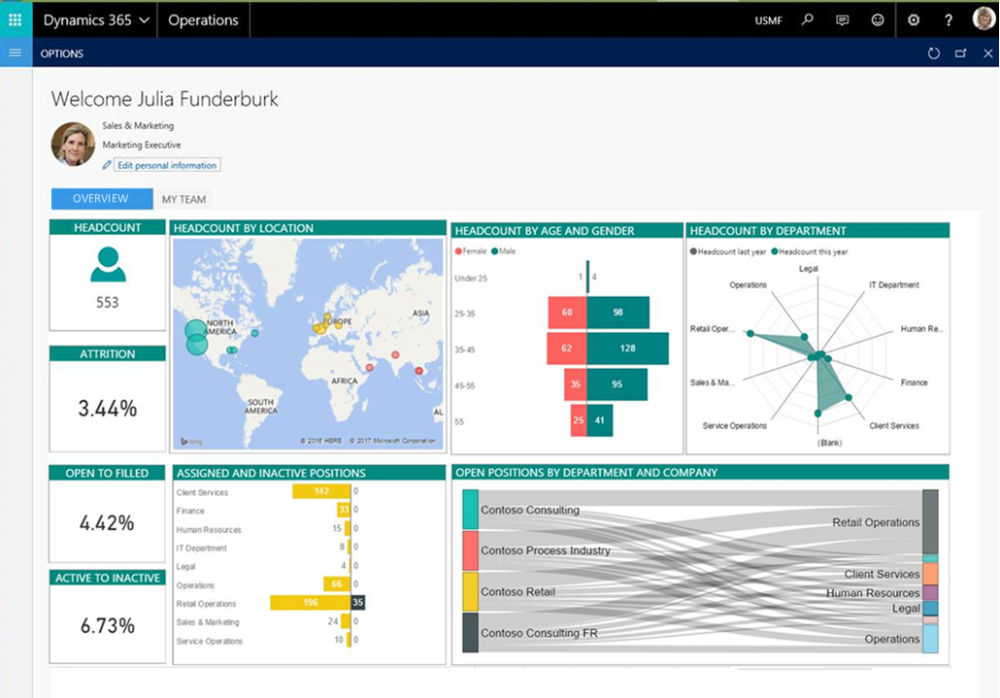
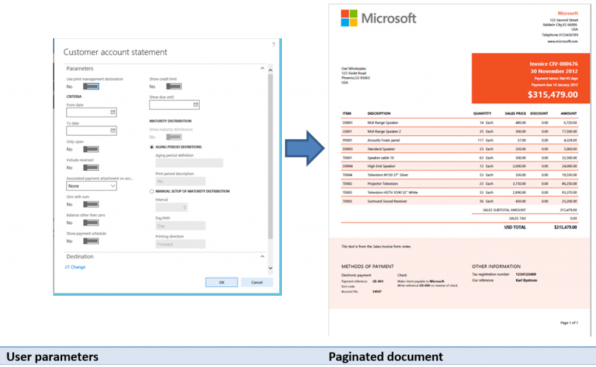

---
# required metadata

title: Intelligence
description: This topic points you to resources that you can use to learn more about the business intelligence and reporting tools available in Microsoft Dynamics 365 for Finance and Operations, Enterprise edition.
author: sericks007
manager: AnnBe
ms.date: 09/06/2017
ms.topic: index-page
ms.prod: 
ms.service: dynamics-ax-platform
ms.technology: 

# optional metadata

# ms.search.form: 
# ROBOTS: 
audience: Application User, IT Pro
# ms.devlang: 
ms.reviewer: sericks
ms.search.scope: AX 7.0.0, Operations, UnifiedOperations
# ms.tgt_pltfrm: 
ms.custom: 27681
ms.assetid: c4624bc8-3661-49e6-9cb4-87778acdc302
ms.search.region: Global
# ms.search.industry: 
ms.author: sericks
ms.search.validFrom: 2016-02-28
ms.dyn365.ops.version: AX 7.0.0

---

# Intelligence

[!include[banner](../includes/banner.md)]

This topic points you to resources that you can use to learn more about the business intelligence and reporting tools available in Microsoft Dynamics 365 for Finance and Operations, Enterprise edition. 

## Get started
- [Information access and reporting](information-access-reporting.md)
- [Tech Talk: Reporting options](https://www.youtube.com/watch?v=NzZONjKs5xA) (video)

Working with aggregate data
---------------------------

-   [Analytics](analytics.md)
-   [In-memory, real-time aggregate models replace SSAS cubes](..\migration-upgrade\in-memory-real-time-aggregate-models.md)
-   [Modeling and using aggregate data](model-aggregate-data.md)
-   [Migrate an upgraded Dynamics AX 2012 R3 sales cube to the entity store](..\migration-upgrade\migrate-upgraded-cube-entity-store.md)

## Self-service reporting
-   [Power BI integration](power-bi-integration.md)
-   [Configuring Power BI integration for workspaces](configure-power-bi-integration.md)
-   [Create a Power BI report by using Microsoft Dynamics 365 for Finance and Operations data](create-powerbi-report-data.md)
-   [Create a Power BI report and dashboard](create-powerbi-report-dashboard.md)
-   [Retail Channel Performance Power BI content](retail-channel-performance-dashboard-power-bi-data.md)
-   [Financial Performance Power BI content](financial-performance-power-bi-content-pack.md)
-   [Sales and profitability performance Power BI content](sales-profitability-performance-content-pack.md)
-   [Use an Electronic reporting configuration to provide Power BI with data from Finance and Operations](general-electronic-reporting-report-configuration-get-data-powerbi.md)

## Analytical workspaces
Finance and Operations delivers interactive reports that seamlessly integrate into application workspaces. By using rich infographics and visuals supported by Power BI (including the large number of controls provided by third parties), workspaces can provide a highly-visual, yet interactive experience for users. 

Users can interact with data by simply clicking or touching visuals on the page. They can see the cause and effect, perform simple what-if operations without leaving the workspace. Thanks to stunning yet interactive visuals, your users will have fun exploring data and discovering hidden trends. 

 
 
 To learn more, see:
 - [Embedded Power BI in workspaces](embed-power-bi-workspaces.md)
 - [Power BI Embedded integration](power-bi-embedded-integration.md)
 - [Add analytics to workspaces by using Power BI Embedded](add-analytics-tab-workspaces.md)
 - [Power BI content](power-bi-home-page.md)
 - [Publish analytical applications on Power BI](publish-apps-powerbi.md)
 - [Help secure analytical workspaces and reports by using Power BI Embedded](secure-analytical-workspaces.md)

## Business documents and printing
Reporting solutions are often used to capture and communicate the details of business transactions. As such, this requires a reporting solution capable of producing physical manifestations of business data using existing devices like network printers. Example applications of business documents include sales invoice, customer statements, and checks. Learn more about the enhancements to the document reporting service in Document Reporting Services overview. 

 

To learn more, see [Document Reporting Services overview](document-reporting-services.md).

## Electronic reporting
Electronic reporting (ER) is the tool to use to configure electronic document formats in accordance with the legal requirements of various countries/regions. Example applications of electronic reporting include financial auditing, tax reporting, and electronic invoicing.

 

To learn more, see [Electronic reporting overview](general-electronic-reporting.md). 

## Financial reporting
Standard financial reports are provided using the default main account categories in Finance and Operations. Use the report designer to create or modify traditional financial statements, such as income statements and balance sheets and share the results with other members of your organization. Example applications of electronic reporting include balance sheets, cash flow, and summary trial balance year over year.

 

To learn more, see [Financial reporting for Finance and Operations](financial-reporting-intro.md). 

## Technical reference reports
The following reports provide reference information about the objects in Finance and Operations. 

- [Aggregate data entities report](aggregate-data-entities-report.md)
- [Aggregate measurements report](aggregate-measurements-report.md)
- [Data entities report](../data-entities/data-entities-report.md)
- [Key performance indicators (KPIs) report](key-performance-indicators-report.md)
- [License codes and configuration keys report](../sysadmin/license-codes-configuration-keys-report.md)
- [SQL Server Reporting Services reports report](SSRS-report.md)
- [Workflow types report](/dynamics365/unified-operations/fin-and-ops/organization-administration/workflow-types-report)

