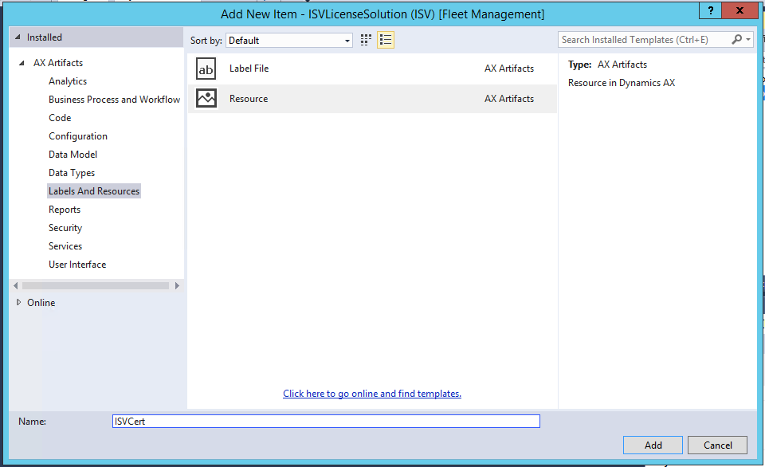
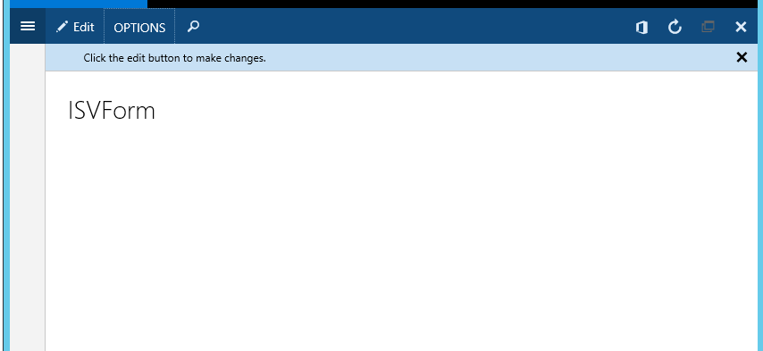
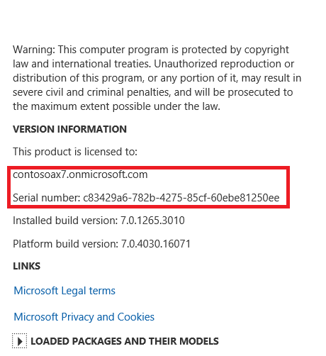
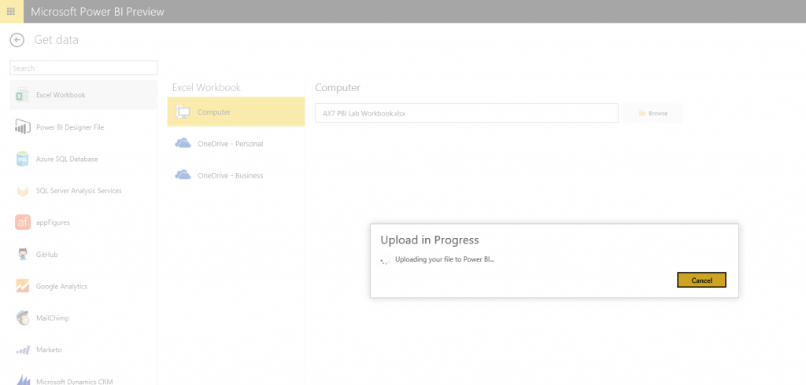

---
# required metadata

title: Create a Power BI report and dashboard
description: This tutorial guides you though the process of creating a basic Power BI report and explains how to start to create a dashboard on PowerBI.com.
author: clwesene
manager: AnnBe
ms.date: 04/04/2017
ms.topic: article
ms.prod: 
ms.service: Dynamics365Operations
ms.technology: 

# optional metadata

# ms.search.form: 
# ROBOTS: 
audience: IT Pro
# ms.devlang: 
# ms.reviewer: 71
ms.search.scope: AX 7.0.0, Operations
# ms.tgt_pltfrm: 
ms.custom: 31021
ms.assetid: 4246f101-d8f6-4d20-9844-d24678a15bca
ms.search.region: Global
# ms.search.industry: 
ms.author: cwesene
ms.search.validFrom: 2016-02-28
ms.dyn365.ops.version: AX 7.0.0

---

# Create a Power BI report and dashboard

This tutorial guides you though the process of creating a basic Power BI report and explains how to start to create a dashboard on PowerBI.com.

Key concepts
------------

-   **Power BI** – The cloud-based analytics visualization platform that is used to extract, transform, and present data from Microsoft Dynamics 365 for Operations (and other systems), so that users can interact with the data and share it.
-   **Microsoft Power Query for Excel** – The Microsoft Excel–based tool that you can use to extract and transform data from Dynamics 365 for Operations (through OData feeds) into an Excel-based data model that is used in Power BI reporting.
-   **Self-service BI** – Tools and processes that let users create or modify analytic content such as reports, key performance indicators (KPIs), and dashboards.

## Supported platforms and environments
Excel and the latest version of Power Query are required. Note the following points:

-   Both 32-bit and 64-bit versions of Microsoft Office are supported. However, the 64-bit version is recommended for optimal performance.
-   Both Microsoft Office 2013 and Microsoft Office 2016 can be used for self-service scenarios, and to build Power BI reports, dashboards, and organizational content packs. Currently, Office 2013 is required for the development of Power BI content packs. If you intend to publish your content through the Power BI service as a content pack, you must use Office 2013.

## Before you start: Download and install Power Query
1.  Download Power Query [Microsoft Power Query for Excel](http://www.microsoft.com/en-gb/download/details.aspx?id=39379). You must find out which version of Excel you have. Depending on the version that is installed, you must select either the 64-bit version or the 32-bit version of Power Query.
2.  Start Excel, and verify that the **Power Query** tab is available.
3.  Enable the Microsoft SQL Server Power Pivot for Excel add-in and the Power View add-in.

View the OData feed in your web browser
=======================================

1.  Start a web browser, and enter the URL that is used to access your Dynamics 365 for Operations deployment. This URL will be in the following format: https://*yourenvrionment*.cloudax.dynamics.com
2.  Sign in by entering your credentials, if you aren't already signed in.
3.  To validate that data entities are exposed by using the OData v4 endpoint, add a suffix of “data” to the URL. The URL should now be in the following format: https://*yourenvironment*.cloudax.dynamics.com/data
4.  If you’re using Internet Explorer, you must download the JSON file before you can view it. To view the JSON file, you must have Microsoft Visual Studio or a similar tool. If you’re using Chrome, you can view the feed in your browser window. 

    

Access OData endpoints in Power Query
=====================================

1.  Start Excel.
2.  On the **Power Query** tab, click **From Other Sources** &gt; **From OData Feed**. 
    

3.  In the dialog box, enter the URL of the OData endpoint, and then click **OK**. For example, the URL will be in the following format: https://*yourenvironment*.cloudax.dynamics.com/data 
    
    

4.  Power Query requests that you authenticate the OData feed. Select **Organizational account** as the authentication method, and then click **Sign in**.  **Note:** Dynamics 365 for Operations uses Microsoft Azure Active Directory (AAD) to authenticate users. When you select **Organizational account** and enter your credentials, you're authenticated against Dynamics 365 for Operations and are presented with only the data that you have access to through the Dynamics 365 for Operations security model. Power Query displays a list of available entities.
5.  Click **Connect**. The Power Query **Navigator** pane is loaded. 

    

6.  Use the **Navigator** pane to select the following entities, and then click **Load**:
    -   FiscalCalendars
    -   GeneralLedgerActivities
    -   MainAccounts

     
    
    Power Query loads the data from Dynamics 365 for Operations into the Excel data model. Depending on the size of the data set, this process might require some time. 
    
    

7.  Double-click **MainAccounts** to load the query. 

    

8.  You can now use Power Query to perform transformations on your data set. For example, you can rename columns and transform values in the data set.
    1.  On the **Home** tab, click **Choose Columns**, select the following fields, and then click **OK**:
        -   AccountCategoryDescription
        -   MainAccountCategory
        -   MainAccountID
        -   MainAccountRecID
        -   Type
        -   Name

    2.  Rename the columns so that the names include spaces and are more readable. To rename a column, double-click the column header.
        -   **AccountCategoryDescription:** Rename to **Account Category Description**.
        -   **MainAccountCategory:** Rename to **Main Account Category**.
        -   **MainAccountID:** Rename to **Main Account ID**.

    3.  Click **Close & Load**.

9.  Optional: You can now repeat this process for the other queries to help guarantee that there is a clean data set in the data model.

## Data model optimization
In this section, we will review the Excel data model to optimize the data for reports and Power BI Q&A.

1.  On the **Power Pivot** tab, click **Manage Data Model**.
2.  Create the relationships among the three entities. On the **Design** tab, click **Manage Relationships**, and then follow these steps:
    1.  Click **Create**, and then select **GeneralLedgerActivities** as table 1 and **MainAccounts** as table 2.
    2.  Select **MainAccountRecID** as the field for both tables.
    3.  Click **OK**.
    4.  Repeat this process for the **GeneralLedgerActivities** and **FiscalCalendars** tables, and the **LedgerGregorianDateID** field.

    You should now have two relationships that join your three entities. 
    
     
    
    **Note:** Depending on your version of Office, the appearance of the **Manage Relationships** dialog box might differ slightly.
3.  Close the **Manage Relationships** dialog box.
4.  You can now hide fields that are used only for calculations or relationships from the end user. Follow these steps:
    1.  On the **GeneralLedgerActivities** tab, right-click the **MainAccountRecID** column, and then select **Hide from Client Tools**.
    2.  Repeat the previous step across all entities for fields that should not be presented to the end user.

5.  To help guarantee that values are presented correctly, set the data type and format for all fields. Select the **Expenses** column, and set the data type and format to **Decimal Number**. Repeat this step across all fields to improve the presentation in visualizations and Q&A. 
    
    

6.  You can now add a calculated measure to use in reports. Use the **Measures** pane at the bottom of the PowerPivot window to create two new measures. Follow these steps:
    1.  Click in the **Measure** pane, enter the following formula, and then press Enter: Total Expenses this year:=calculate(sum(\[Expenses\]),'FiscalCalendars'\[YearOffset\]=0)
    2.  Click in the cell below the previous cell, and enter the following formula: Total Expenses last year:=calculate(sum(\[Expenses\]),'FiscalCalendars'\[YearOffset\]=-1)

    **Note:** These formulas use the Dynamics 365 for Operations language. Both formulas sum the **Expenses** column, but each applies a different filter to your fiscal calendars on the year offset. A year offset of **0** specifies the current financial year, and a year offset of **-1** specifies last financial year. This step lets users take advantage of their custom Dynamics 365 for Operations fiscal calendars in Power BI. 
    
    

7.  Click each new measure, and set the format to **Decimal Number**. Then close the Power Pivot data model.

## Optional: Additional data model optimization
At this point, you can use the Power Pivot data model to optimize your data so that it includes additional measures that can be used in your visualizations. For example, you can add the following measures:

-   Additional calculated measures:
    -   New calculations
    -   This/last year measures
-   Synonyms for column names
-   Optimization for default field sets, and so on

## Create a report by using Power View
In this section, we will create a basic report by using Power View.

1.  On the **Insert** tab, click **Power View**. Excel loads a blank Power View report. Notice that your three entities appear in the **Power View Fields** pane on the right side.
2.  Expand **GeneralLedgerActivities**, and then click **Total Expense this year**. Notice that Power View adds the field to a table on the report. Follow these steps:
    1.  Click the table, and then, on the **Design** tab, click **Column Chart** &gt; **Stacked Column** to change the table into a column chart.
    2.  Expand the size of the column chart until it fills two-thirds of your report. To expand the chart, drag the corners. 
        
        

    3.  To add more detail to the chart, select the following fields in the Power View **Fields** pane:
        -   FiscalCalendars – Quarters
        -   FiscalCalendars – PeriodName
        -   MainAccounts – Main Account Category

    4.  If the fields in the chart don't appear as you expected, you must drag the fields in the Power View pane, and put them into the correct **Axis** and **Legend** areas.
        1.  Drag **PeriodName** to the **AXIS** area underneath **Quarter**.
        2.  Drag **Main Account Category** to the **Legend** area.

        **Note:** As you add fields from the three entities, notice that they are presented in a single visualization. This is possible because of the relationships that you previously set up in the Power Pivot data model. 
        
        

3.  You can now drill into the quarter by double-clicking the **Q1** column.
    
    

4.  In the **Click here to add a title** field, enter a title for your report.
5.  Save the Excel workbook to your local machine or to Microsoft OneDrive.

Upload the Excel workbook to PowerBI.com
========================================

In this section, we will create a dashboard by using the data model that we created in Power Query.

1.  Start your web browser, and go to <http://app.powerbi.com>.
2.  Sign in, if sign-in is required. If you don't have a Power BI license, you must activate a trial, or contact your administrator.
3.  Create a new dashboard by clicking the plus sign (**+**) next to **Dashboards**. Enter a suitable name. The blank dashboard resembles the following screen shot.
    
    

4.  Select the **Get Data** option to import data into the dashboard. A page that resembles the following screen shot appears. 

    

5.  Select **Excel Workbook**, and then click **Connect**. In the **File picker** dialog box, click **Browse**, and select the Excel model that you saved in the previous section. Then click **Connect**. 

     
    
    A blank chart icon appears in the dashboard to indicate that the data is available. 
    
    

6.  Click the blank chart icon. The Power View report that you previously authored appears. You can author additional reports and pin them to the dashboard by using PowerBI.com functionality. 

    

7.  Click the chart, and then click the **Pin** button in the upper-right corner to pin the report to your dashboard. 

    

8.  In the left navigation pane, click your dashboard to return to it. Your chart now appears in the dashboard. 
    
    

You can repeat this process to build out your dashboard.

# See also

[Power BI integration in Dynamics 365 for Operations](power-bi-integration.md)
[Configuring Power BI integration for workspaces](configure-power-bi-integration.md)

