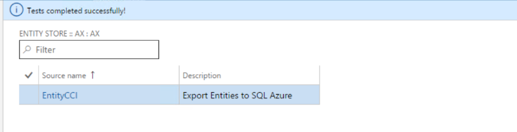

---
# required metadata

title: Export entities to your own Azure SQL database
description: This topic explains how to export entities to your own SQL Azure database.
author: MilindaV2
manager: AnnBe
ms.date: 06/16/2017
ms.topic: article
ms.prod: 
ms.service: dynamics-ax-applications
ms.technology: 

# optional metadata

# ms.search.form:  [Operations AOT form name to tie this topic to]
audience: Developer, IT Pro
# ms.devlang: 
# ms.reviewer: sericks
# ms.search.scope: Operations Platform 
# ms.tgt_pltfrm: 
# ms.custom: [used by loc for topics migrated from the wiki]
ms.search.region: Global 
# ms.search.industry: [leave blank for most, retail, public sector]
ms.author: milindav
ms.search.validFrom: 2016-08-30 
ms.dyn365.ops.version: Platform update 2 
---

# Export entities to your own Azure SQL database

[!include[banner](../includes/banner.md)]

This topic explains how to export Dynamics 365 for Operations entities to your
own SQL Azure database.

Administrators can export Dynamics 365 for Operations data entities to their own
SQL Azure database. This feature is also known as “Bring your own database” or
simply “BYOD”. BYOD feature was released with Dynamics AX platform update 2
(August 2016). Minor improvements and bug fixes have been addressed in
subsequent platform updates.

With this capability, administrators have the ability to “configure your own
database” and export one or more of the 1700+ entities available in Dynamics 365
for Operations. This feature enables you to:

1.  Define one or more SQL Azure databases for exporting entity data from
    Dynamics 365 for Operations

2.  Export all the records (full push) or export only the records that changed
    (ie. incremental push)

3.  Use rich scheduling capabilities of the Dynamics 365 for Operations batch
    framework to enable recurring exports

4.  Access the entity database using T-SQL and even extend the database by
    adding more tables yourself

Entity store or BYOD – which one?
---------------------------------

If you followed the series of [blog
posts ](https://blogs.msdn.microsoft.com/dynamicsaxbi/2016/06/09/power-bi-integration-with-entity-store-in-dynamics-ax-7-may-update/)on
Power BI integration in Dynamics 365 for Operations, you may be familiar with
Entity store, the Operational Data warehouse included with Dynamics 365 for
Operations. Entity store provides built-in integration for operational reports
with Power BI. Ready-made reports and Analytical workspaces built into Dynamics
365 for Operations client uses entity store. If you are authoring Power BI
reports using data within your Dynamics 365 for Operations environment, you
should use Entity store.

BYOD feature is recommended for following scenarios;

-   You need to export data from Dynamics 365 for Operations into your own Data
    warehouse

-   You use Analytical tools other than Power BI, these tools require access
    T-SQL access to data

-   You need to perform batch integration with other systems.

**NOTE:** Dynamics 365 for Operations does not allow T-SQL connections to the
production database. So if you are a customer upgrading from previous versions
of Dynamics AX and if you had integration solutions that required direct T-SQL
access to database, BYOD is your recommended upgrade path.

As a customer of Dynamics 365 for Operations, you have the option of choosing
both. Ready-made operational reports (especially in Spring-2017 update) leverage
embedded Power BI and Entity store. You should use ready-made operational
reports as the first choice. You can also extend the operational reports to meet
your needs. You should consider BYOD as a complementary option depending on the
need.

Create a SQL Azure database
---------------------------

Prior to starting this option, you would need to create a SQL Azure database
using Azure Management portal.

In case of “one box” developer environments, you can create a database in the
local SQL Server database. But this is strictly for development and testing
purposes only. In case of production environments, you do need to create a SQL
Azure database.

You should also create SQL user account to login to the database. Write down the
server name, database name and the SQL user ID and the password. You will need
these for the next step.

If you are using this functionality for integration with a Business Intelligence
tool, you should consider creating a SQL Azure premium database. Premium
databases support Clustered Column Store indexes (CCI), in-memory indexes which
improve the performance of read queries that are typical in analytical and
reporting workloads. If you are using this functionality to export data into a
staging database or for general integration purposes, you may use a standard
database.

Configuring the export entity option
------------------------------------

Launch Dynamics 365 for Operations client and navigate to the Data Management
area page. Once in the Data Management area page, you can select the **Configure
Entity export to Database** tile.

When selected, if you have configured any databases, you will see a list. Else
you would need to configure a new database. Select **New** and enter a
unique **Name** and a **Description**. Note that you can export entities into
multiple databases.

Next you will enter the connection string as follows:

Data Source=**\<Logical Server Name\>,**1433; Initial Catalog=**\<your DB
name\>**; Integrated Security=False; User ID=**\<SQL User ID\>**;
Password=**\<Password\>**

**Logical server name** should be similar to the nnnn.database.windows.net and
you should be able to find the logical server name from the Azure Management
portal.

After you enter the connection string, click the **Validate** button and make
sure that the connection is successful.

**Create Clustered Columnstore indexes** option optimizes the destination
database for select queries by defining Clustered Columnstore indexes (CCI) for
entities copied from Dynamics 365 for Operations. However, at this point, CCIs
are supported only on Azure SQL premium DBs, therefore, in order to enable this
option, you should have created a SQL Azure premium database.

On successful completion, you will notice the database you have configured for
Entity export listed as follows

Next you can publish one or more Entities into the newly created database by
selecting the **Publish** option from the menu.

### **Publishing Entity schema to database**

Publish form enables several scenarios including;

1.  Publishing of new Entities to the database

2.  Deleting already published entities from the DB (in case you want to
    re-create the schema)

3.  Comparison of published entities with Entity schema in Dynamics 365 for
    Operations (ie. in case new fields get added to Dynamics 365 for Operations
    in the future, you can compare the fields with your Database schema)

4.  Configuring Change tracking functionality that enables incrementally
    updating your data

Let’s consider each of the options below;

**Publish:** Publish option defines the Entity database schema on the
destination DB. When you select one or more entities and select the publish
option, a batch job is started to create the Entities in the destination
database. When the database definition job is complete, you will be notified by
a message in the InfoLog (ie. the bell icon on top right)

Actual updating of data happens when you export data. At this point you are only
creating the schema.

**Drop entity** option deletes the data and the Entity definition from the
destination DB.

**Compare source names** option lets you compare the Entity schema in
destination with the Entity schema in Dynamics 365 for Operations. This option
is used for version management. You can also use the compare option to remove
any of the unwanted columns from the destination table.

### **Configure Change tracking**

Change tracking is a feature provided with SQL Server and in SQL Azure that
enables the database to track changes being performed on tables. Change tracking
is used by the system to identify changes made to tables as transactions are
performed in Dynamics 365 for Operations.

Change tracking option in the Publish form enables you to configure how the
changes are tracked on the underlying entity.

There are several change tracking options that can be used.

| **Option**               | **What this means**                                                                                                                                                                                                                                                                                                                                                                                                                                                                               |
|--------------------------|---------------------------------------------------------------------------------------------------------------------------------------------------------------------------------------------------------------------------------------------------------------------------------------------------------------------------------------------------------------------------------------------------------------------------------------------------------------------------------------------------|
| **Enable primary table** | An Entity is comprised of several tables. In case you are interested in tracking changes that happen to the primary table of the entity, choose this option. When this option is chosen, all changes that happen to primary table are tracked (therefore the corresponding record is inserted or updated to the destination DB)  While data from the entire entity is written to the destination table, the system triggers the insert or update option only when the primary table is modified.  |
| **Enable entire entity** | Choose this option if you want all changes to the entity (including changes to all the tables that comprise the entity) to be tracked and corresponding updates to be made to destination                                                                                                                                                                                                                                                                                                         |
| **Enable custom query**  | This option enables a developer to provide a custom query that would be run by the system to evaluate changes. This option is useful when you have a complex requirement to track changes only from a selected set of fields. You can also choose this option when Entities to be exported are built using a hierarchy of nested views                                                                                                                                                            |

In order for Change tracking functionality to work, you do need to enable change
tracking option in the Dynamics 365 for Operations database. This option is
enabled by default.

In case you re-publish and Entity that exists in the destination database, the
system warns you that existing data will be deleted as a result of the new
operation.

When you confirm the publish operation, system publishes the schema to the
database subsequently and you would be notified on completion. Back in the
publish screen,

By choosing the **Show published only** option, you can display only the
entities that were published to a given destination database. Publish function
creates the entity schema in the database. You can navigate to the Database and
see the table schemas created along with corresponding indexes.

**NOTE:** Exporting composite entities into BYOD is not supported at present.
You would need to export each of the Entities within the composite.

Export data into your database
------------------------------

Once entities are published to the destination database, you can use
the **Export **function in **Data Management workspace** to move data. Export
function enables you to define a Data movement job that contains one or more
Entities.

Export form is used for exporting data from Dynamics 365 for Operations into
many target data formats. This is the same form that you would use to export
data into a CSV file. This form has the ability to support SQL Azure databases
as yet another destination.

When adding an entity for data export, you have the ability to choose
incremental export (called “incremental push”) or full push. In order for
incremental push to work, you do need to enable Change tracking in the Dynamics
365 for Operations database and specify an appropriate change tracking option as
described above.

In case you choose incremental push, whenever a new record is inserted or a
record is added, the corresponding change will be reflected in the destination
entity. As of platform update8, records deleted in source are not updated in
destination.

Full push truncates the table and inserts all the records from the chosen
Entity.

You can create a data project with multiple Entities and it can be scheduled to
execute using the Dynamics 365 for Operations batch framework. You also schedule
the data export job to run on a recurring basis by selecting the **Create
recurring data job** option.

### **Best practices and Known limitations**

There are several known limitations in this feature as of platform update 8.

**1. Incremental push does not propagate records deleted in source**: In case
records are deleted from any of the tables in the source entity. corresponding
deletes are not applied to the destination database. In case you are working
with Entities where records are deleted, recommended approach if to conduct
“full push” refresh operations periodically.

**2. Export data projects are specific to a single Legal entity:** you can not
create a single job to export data across multiple Legal entities. When creating
a data project to export data, the job exports data from the current Legal
entity. In case you need to export data from multiple Legal entities, you need
to create multiple data projects by switching Legal entities.

**3. Can not export composite Entities into BYOD:** Composite entities are not
supported at this point in time.  You need to export individual entities that
comprise the composite entity. However, you can export both the entities within
the same data project.

**4. Entities without unique keys can’t be exported with “incremental
push”:** You may face this limitation especially when trying incrementally to
export records from a few ready-made Entities. Since these Entities were
designed to enable importing data into Dynamics 365 for Operations, they do not
contain a unique key. You can’t enable change tracking for Entities that do not
contain a unique key – hence the limitation on incremental push. One workaround
is to extend the required entity and define a unique key.

