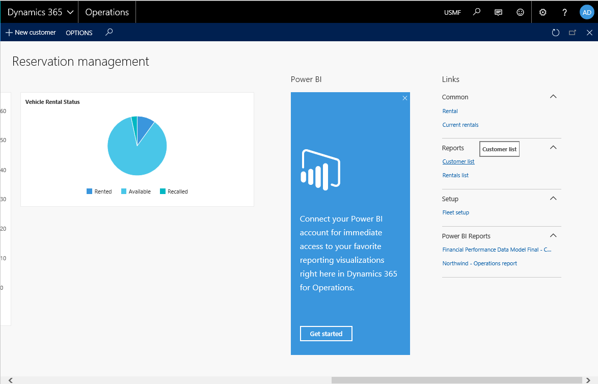

---
# required metadata

title: Extend report menu items
description: This topic shows how to extend existing application menu items so that, after only minimal code changes, navigations are redirected to a custom reporting solution. 
author: sericks007
manager: AnnBe
ms.date: 04/04/2017
ms.topic: article
ms.prod: 
ms.service: dynamics-ax-platform
ms.technology: 

# optional metadata

# ms.search.form: 
# ROBOTS: 
audience: Developer, IT Pro
# ms.devlang: 
# ms.reviewer: 2051
ms.search.scope: Operations, Platform
# ms.tgt_pltfrm: 
ms.custom: 266674
ms.assetid: 7bf76862-e320-4a81-81a4-5bda7288e573
ms.search.region: Global
# ms.search.industry: 
ms.author: tjvass
ms.search.validFrom: 2016-11-30
ms.dyn365.ops.version: Platform update 3

---

# Extend report menu items

[!include[banner](../includes/banner.md)]

This topic shows how to extend existing application menu items so that, after only minimal code changes, navigations are redirected to a custom reporting solution. 

Microsoft Dynamics 365 for Operations includes an expanded set of tools to support custom reporting solutions. This topic focuses on the process of extending existing application menu items so that, after only minimal code changes, navigations are redirected to a custom reporting solution. By using this technique, you will avoid the inconvenience of tracking down and replacing all references to an existing application report. Just extend an existing application menu item to redirect application navigations to reports that are defined in an extension model. The following illustration shows a typical application customization.

## What's important to know?
There are a few basic assumptions that you should be aware of before you apply this solution.

-   Extended menu items let you override both the display string and the target.
-   This technique can be used for all types of reports, from simple query-based reports to complex report data provider (RDP)–based reports.
-   Extended menu items are available for direct references to reports and solutions that orchestrate the reporting session by using a controller class.

## Extend report menu items
The following walkthrough shows how to use menu item extensions to redirect user navigations in the application to a custom solution. The solution includes a custom **Customer list** report for the Fleet Management application and defines all the application customizations in a pure extension model. The following illustration shows the menu item that you use to access the custom **Customer list** report. 

1.  **Create a new model for your application customizations.** For more information about extension models, see [Customization: Overlayering and extensions](..\extensibility\customization-overlayering-extensions.md).
2.  **Create a new project in Microsoft Visual Studio,** **and add your custom report.** Additionally, add all the solution artifacts. These artifacts include the RDP class or source query, the controller class, and UI builders, if they are present.
3.  **Create an extension of the menu item that is used to access the report.** In this example, the output menu item is named **FMCustomerListReport**. Use the menu item structure to find the menu item name that is exposed in the application. The following illustration shows the action in Application Explorer.
4.  **Modify the properties of the menu item extension.** Update the report design or controller reference in the menu item to direct navigations to your custom solution. **Note:** The property changes that you can make on the object depend on the original application solution. If the application report manages the solution by using a controller, a controller class is required for the report.
5.  **Rebuild the solution, and deploy the custom report.**

You've now finished extending the report menu item. Navigations to the standard menu item will now be redirected to your custom reporting solution.

