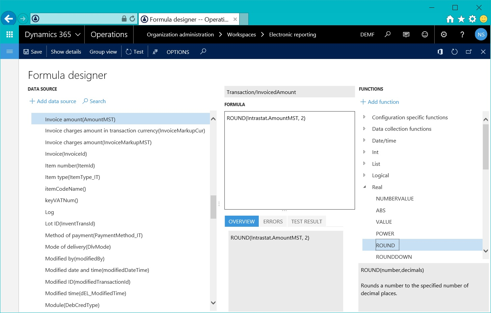
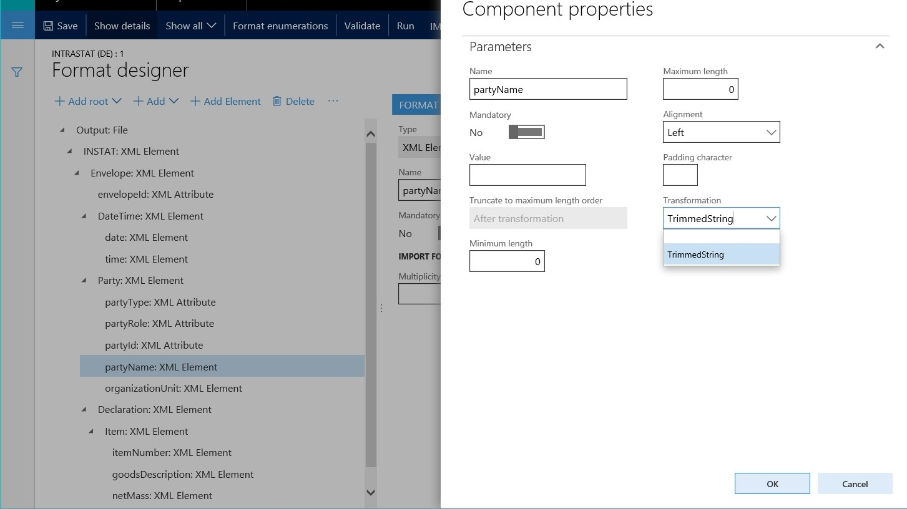
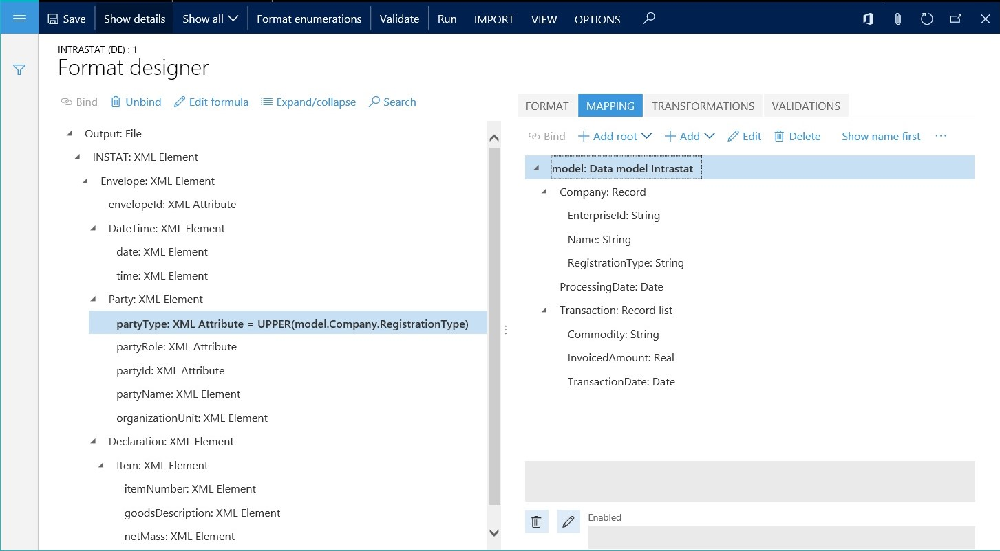
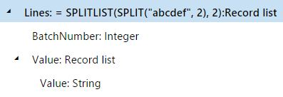
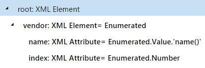
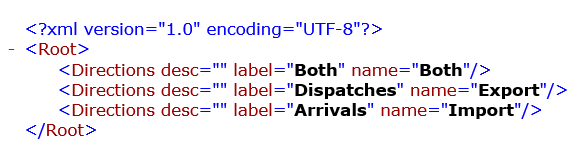

---
# required metadata

title: Formula designer in Electronic reporting
description: This topic explains how to use the formula designer in Electronic reporting (ER). When you design a format for a specific electronic document in ER, you can use Microsoft Excel–like formulas for data transformation to meet the requirements for that document's fulfillment and formatting. Various types of functions are supported -  text, date and time, mathematical logical, information, data type conversion, and other (business domain–specific functions).
author: kfend
manager: AnnBe
ms.date: 04/04/2017
ms.topic: article
ms.prod: 
ms.service: Dynamics365Operations
ms.technology: 

# optional metadata

ms.search.form: ERDataModelDesigner, ERExpressionDesignerFormula, ERMappedFormatDesigner, ERModelMappingDesigner
# ROBOTS: 
audience: Application User, IT Pro
# ms.devlang: 
# ms.reviewer: 71
ms.search.scope: AX 7.0.0, Operations, Core
# ms.tgt_pltfrm: 
ms.custom: 58771
ms.assetid: 24223e13-727a-4be6-a22d-4d427f504ac9
ms.search.region: Global
# ms.search.industry: 
ms.author: nselin
ms.search.validFrom: 2016-02-28
ms.dyn365.ops.version: AX 7.0.0

---

# Formula designer in Electronic reporting

[!include[banner](../includes/banner.md)]

This topic explains how to use the formula designer in Electronic reporting (ER). When you design a format for a specific electronic document in ER, you can use Microsoft Excel–like formulas for data transformation to meet the requirements for that document's fulfillment and formatting. Various types of functions are supported -  text, date and time, mathematical logical, information, data type conversion, and other (business domain–specific functions).

Formula designer overview
-------------------------

Electronic reporting (ER) supports the formula designer. Therefore, at design time, you can configure expressions that can be used for the following tasks at run time:

-   Transforming data that is received from a Microsoft Dynamics 365 for Operations database, and that should be populated in an ER data model that is designed to be a data source for ER formats (filtering, grouping, data type conversion, etc.).
-   Formatting data that must be sent to a generating electronic document in accordance with the layout and conditions of a specific ER format (in accordance with the requested language or culture, encoding, etc.).
-   Controlling the process of electronic document generation (enabling/disabling output of specific elements of the format, depending on processing data, interrupting document creation, throwing messages for end users, etc.).

The formula designer page can be opened when you do any of the following:

-   Bind data source items to data model components.
-   Bind data source items to format components.
-   Complete maintenance of calculated fields as part of data sources.
-   Define the visibility conditions for user input parameters.
-   Design a format's transformations.
-   Define the enabling conditions for the format's components.
-   Define the file names for the format's FILE components.
-   Define the conditions for process control validations.
-   Define the message text for process control validations.

## Designing ER formulas
### Data binding

The ER formula designer can be used to define an expression that transforms data that is received from data sources, so that the data can be populated in the data consumer at run time:

-   From Dynamics 365 for Operations data sources and run-time parameters to an ER data model.
-   From an ER data model to an ER format.
-   From Dynamics 365 for Operations data sources and run-time parameters to an ER format.

The following illustration shows the design of an expression of this type. In this example, the expression returns the value of the **Intrastat.AmountMST** field of the Dynamics 365 for Operations **Intrastat** table, after that value has been rounded to two decimal places.  The following illustration shows how an expression of this type can be used. In this example, the result of the designed expression is populated in the **Transaction.InvoicedAmount** component of the **Tax reporting model** data model.  At run time, the designed formula, **ROUND (Intrastat.AmountMST, 2)**, will round the value of the **AmountMST** field for each record of the **Intrastat** table to two decimal places, and populate the rounded value to the **Transaction.InvoicedAmount** component of the **Tax reporting** data model.

### Data formatting

The ER formula designer can be used to define an expression that formats data that is received from data sources, so that the data can be sent as part of the generating electronic document. If you have formatting that must be applied as a typical rule that should be reused for a format, you can introduce that formatting one time in a format configuration as a named transformation that has a formatting expression. This named transformation can then be linked with many format components for which the output must be formatted according to the expression that was created. The following illustration shows the design of a transformation of this type. In this example, the **TrimmedString** transformation takes incoming data of the **String** data type, and truncates leading and trailing spaces when it returns the string value.  The following illustration shows how a transformation of this type can be used. In this example, several format components that send text as output to the generating electronic document at run time refer to the **TrimmedString** transformation by name.  When format components refer to the **TrimmedString **transformation (for example, the **partyName** component in the preceding illustration) this sends text as output to the generating document. The text does not include leading and trailing spaces. If you have formatting that must be applied individually, you can introduce that formatting as an individual expression of a binding of a specific format component. The following illustration shows an expression of this type. In this example, the **partyType** format component is bound to the data source via an expression that converts incoming data from the **Model.Company.RegistrationType** field in the data source to uppercase text and sends that text as output to the electronic document. 

### Process flow control

The ER formula designer can be used to define expressions that control the process flow of generating documents. You can:

-   Define conditions that determine when a document creation process must be stopped.
-   Specify expressions that either create messages for the end user about stopped processes or throw execution log messages about the continuing process of report generation.
-   Specify the file names of generating documents, and control conditions of their creation.

Each rule of the process flow control is designed as an individual validation. The following illustration shows a validation of this type. Here is an explanation of the configuration in this example:

-   The validation is evaluated when the **INSTAT** node is created in the generating XML file.
-   If the list of transactions is empty, the validation stops the execution process and returns **FALSE**.
-   The validation returns an error message that includes the text of label SYS70894 in the user's preferred language.

 The ER formula designer can also be used to specify a file name for a generating electronic document and control the file creation process. The following illustration shows the design of a process flow control of this type. Here is an explanation of the configuration in this example:

-   The list of records from the **model.Intrastat** data source is divided into batches, each of which contains up to 1,000 records.
-   The output creates a zip file that contains one file in XML format for every batch that was created.
-   An expression returns a file name for generating electronic documents by concatenating the file name and file extension. For the second batch and all subsequent batches, the file name contains the batch ID as a suffix.
-   An expression enables (by returning **TRUE**) the process of file creation for batches that contain at least one record.

### Basic syntax

ER expressions can contain any or all of the following elements:

-   Constants
-   Operators
-   References
-   Paths
-   Functions

#### Constants

You can use text and numeric constants (values that aren't calculated) when you design expressions. For example, the expression **VALUE ("100") + 20 **uses the numeric constant 20 and the string constant “100”, and returns the numeric value **120**. The ER formula designer supports escape sequences, which means that you can specify the expression string that should be handled differently. For example, the expression **"Leo Tolstoy ""War and Peace"" Volume 1"** returns the text string **Leo Tolstoy "War and Peace" Volume 1**.

#### Operators

The following table shows the arithmetic operators that you can use to perform basic mathematical operations, such as addition, subtraction, division, and multiplication.

| Operator | Meaning              | Example |
|----------|----------------------|---------|
| +        | Addition             | 1+2     |
| -        | Subtraction Negation | 5-2 -1  |
| \*       | Multiplication       | 7\*8    |
| /        | Division             | 9/3     |

The following table shows the comparison operators that are supported, and that you can use to compare two values.

| Operator | Meaning                  | Example    |
|----------|--------------------------|------------|
| =        | Equal                    | X=Y        |
| &gt;     | Greater than             | X&gt;Y     |
| &lt;     | Less than                | X&lt;Y     |
| &gt;=    | Greater than or equal to | X&gt;=Y    |
| &lt;=    | Less than or equal to    | X&lt;=Y    |
| &lt;&gt; | Not equal to             | X&lt;&gt;Y |

Additionally, you can use an ampersand (&) as a text concatenation operator to join, or concatenate, one or more text strings into a single piece of text.

| Operator | Meaning     | Example                                        |
|----------|-------------|------------------------------------------------|
| &        | Concatenate | "Nothing to print" & ": " & "no records found" |

#### Operator precedence

The order in which the parts of a compound expression are evaluated is important. For example, the result of the expression** 1 + 4 / 2** differs, depending on whether the addition operation or the division operation is performed first. You can use parentheses to explicitly define how an expression is evaluated. For example, to indicate that the addition operation should be performed first, you can modify the preceding expression to **(1 + 4) / 2**. If the order of operations that must be performed in an expression isn't explicitly defined, the order is based on the default precedence that is assigned to the supported operators. The following tables shows the operators and the precedence that is assigned to each. Operators that have higher precedence (for example, 7) are evaluated before operators that have lower precedence (for example, 1).

| Precedence | Operators      | Syntax                                                   |
|------------|----------------|----------------------------------------------------------|
| 7          | Grouping       | ( … )                                                    |
| 6          | Member access  | … . …                                                    |
| 5          | Function call  | … ( … )                                                  |
| 4          | Multiplicative | … \* … … / …                                             |
| 3          | Additive       | … + … … - …                                              |
| 2          | Comparison     | … &lt; … … &lt;= … … =&gt; … … &gt; … … = … … &lt;&gt; … |
| 1          | Separation     | … , …                                                    |

Operators on the same line have equal precedence. If an expression includes more than one of these operators, the expression is evaluated from left to right. For example, the expression **1 + 6 / 2 \* 3 &gt; 5** returns **true**. We recommend that you use parentheses to explicitly indicate the desired order of evaluation for expressions, to make the expressions easier to read and maintain.

#### References

All data sources of the current ER component (either a model or a format) that are available during the design of an expression can be used as named references. For example, the current ER data model contains the **ReportingDate** data source, which returns a value of the **DATETIME** data type. To properly format that value in the generating document, you can reference the data source in the expression as follows: **DATETIMEFORMAT (ReportingDate, "dd-MM-yyyy")** All characters in the name of a referencing data source that don't represent a letter of the alphabet must be preceded by a single quotation mark ('). If the name of a referencing data source contains at least one symbol that doesn't represent a letter of the alphabet (for example, punctuation marks or other written symbols), the name must be enclosed in single quotation marks. Here are some examples:

-   The **Today's date & time** data source must be referred to in an ER expression as follows: **'Today''s date & time'**
-   The **name()** method of the **Customers** data source must be referred to in an ER expression as follows: **Customers.'name()'**

#### Path

When an expression references a structured data source, you can use the path definition to select a specific primitive element of that data source. A dot character (.) is used to separate individual elements of a structured data source. For example, the current ER data model contains the **InvoiceTransactions** data source, which returns a list of records. The **InvoiceTransactions** record structure contain the **AmountDebit** and **AmountCredit** fields, which return numeric values. Therefore, you can design the following expression to calculate the invoiced amount: **InvoiceTransactions.AmountDebit - InvoiceTransactions.AmountCredit**

#### Functions

The next section describes the functions that can be used in ER expressions. All data sources of the expression context (the current ER data model or ER format), and also constants, can be used as parameters of calling functions, in accordance with the list of calling function arguments. For example, the current ER data model contains the **InvoiceTransactions** data source, which returns a list of records. The **InvoiceTransactions** record structure contain the **AmountDebit** and **AmountCredit** fields, which return numeric values. Therefore, to calculate the invoiced amount, you can design the following expression that uses the built-in ER rounding function: **ROUND (InvoiceTransactions.AmountDebit - InvoiceTransactions.AmountCredit, 2)**

## Supported functions
The following tables describe the data manipulation functions that you can use to design ER data models and ER reports. The list of functions isn't fixed and can be extended by developers. To see the list of functions that you can use, access the functions pane in the ER formula designer.

### Date and time functions

| Function                                   | Description                                                                                                                                                                                                                                                                                                                                                      | Example                                                                                                                                                                                                                                                                                               |
|--------------------------------------------|------------------------------------------------------------------------------------------------------------------------------------------------------------------------------------------------------------------------------------------------------------------------------------------------------------------------------------------------------------------|-------------------------------------------------------------------------------------------------------------------------------------------------------------------------------------------------------------------------------------------------------------------------------------------------------|
| ADDDAYS (datetime, days)                   | Add the specified number of days to the specified datetime value.                                                                                                                                                                                                                                                                                                | **ADDDAYS (NOW(), 7)** returns the date and time seven days in the future.                                                                                                                                                                                                                            |
| DATETODATETIME (date)                      | Convert the specified date value to a datetime value.                                                                                                                                                                                                                                                                                                            | **DATETODATETIME (CompInfo. 'getCurrentDate()')** returns the current Dynamics 365 for Operations session date, 12/24/2015, as **12/24/2015 12:00:00 AM**. In this example, **CompInfo** is an ER data source of the **Dynamics 365 for Operations/Table** type that refers to the CompanyInfo table. |
| NOW ()                                     | Return the current Dynamics 365 for Operations application server date and time as a datetime value.                                                                                                                                                                                                                                                             |                                                                                                                                                                                                                                                                                                       |
| TODAY ()                                   | Return the current Dynamics 365 for Operations application server date as a date value.                                                                                                                                                                                                                                                                          |                                                                                                                                                                                                                                                                                                       |
| NULLDATE ()                                | Return a **null** date value.                                                                                                                                                                                                                                                                                                                                    |                                                                                                                                                                                                                                                                                                       |
| NULLDATETIME ()                            | Return a **null** datetime value.                                                                                                                                                                                                                                                                                                                                |                                                                                                                                                                                                                                                                                                       |
| DATETIMEFORMAT (datetime, format)          | Convert the specified datetime value to a string in the specified format. (For information about the supported formats, see [standard](https://msdn.microsoft.com/en-us/library/az4se3k1(v=vs.110).aspx) and [custom](https://msdn.microsoft.com/en-us/library/8kb3ddd4(v=vs.110).aspx).)                                                                        | **DATETIMEFORMAT (NOW(), "dd-MM-yyyy")** returns the current Dynamics 365 for Operations application server date, 12/24/2015, as **"24-12-2015"**, according to the specified custom format.                                                                                                          |
| DATETIMEFORMAT (datetime, format, culture) | Convert the specified datetime value to a string in the specified format and [culture](https://msdn.microsoft.com/en-us/goglobal/bb896001.aspx). (For information about the supported formats, see [standard](https://msdn.microsoft.com/en-us/library/az4se3k1(v=vs.110).aspx) and [custom](https://msdn.microsoft.com/en-us/library/8kb3ddd4(v=vs.110).aspx)). | **DATETIMEFORMAT (NOW(), "d", "de")** returns the current Dynamics 365 for Operations application server date, 12/24/2015, as **"24.12.2015"**, according to the selected German culture.                                                                                                             |
| SESSIONTODAY ()                            | Returns the current Dynamics 365 for Operations session date as date value.                                                                                                                                                                                                                                                                                      |                                                                                                                                                                                                                                                                                                       |
| SESSIONNOW ()                              | Returns the current Dynamics 365 for Operations session date and time as datetime value.                                                                                                                                                                                                                                                                         |                                                                                                                                                                                                                                                                                                       |
| DATEFORMAT (date, format)                  | Returns string representation of date using specified format.                                                                                                                                                                                                                                                                                                    | **DATEFORMAT (SESSIONTODAY (), "dd-MM-yyyy")** returns the current Dynamics 365 for Operations session date 12/24/2015 as “**24-12-2015**” according to specified custom format.                                                                                                                      |
| DATEFORMAT (date, format, culture)         | Convert the specified date value to a string in the specified format and [culture](https://msdn.microsoft.com/en-us/goglobal/bb896001.aspx). (For information about the supported formats, see [standard](https://msdn.microsoft.com/en-us/library/az4se3k1(v=vs.110).aspx) and [custom](https://msdn.microsoft.com/en-us/library/8kb3ddd4(v=vs.110).aspx)).     | **DATETIMEFORMAT (SESSIONNOW (), "d", "de")** returns the current Dynamics 365 for Operations session date 12/24/2015 as **“24.12.2015”** according to selected German culture.                                                                                                                       |

### List functions

<table>
<colgroup>
<col width="33%" />
<col width="33%" />
<col width="33%" />
</colgroup>
<thead>
<tr class="header">
<th>Function</th>
<th>Description</th>
<th>Example</th>
</tr>
</thead>
<tbody>
<tr class="odd">
<td>SPLIT (input, length)</td>
<td>Split the specified input string into substrings, each of which has the specified length. Return the result as a new list.</td>
<td><strong>SPLIT (&quot;abcd&quot;, 3)</strong> returns a new list that consists of two records that have a <strong>STRING</strong> field. The field in the first record contains the text <strong>&quot;abc&quot;</strong>, and the field in the second record contains the text <strong>&quot;d&quot;</strong>.</td>
</tr>
<tr class="even">
<td>SPLITLIST (list, number)</td>
<td>Split the specified list into batches, each of which contains the specified number of records. Return the result as a new list of batches that contains the following elements:
<ul>
<li>Batches as regular lists (<strong>Value</strong> component)</li>
<li>The current batch number (<strong>BatchNumber</strong> component)</li>
</ul></td>
<td>In the following example, the <strong>Lines</strong> data source is created as a record list of three records, which is divided into batches, each of which contains up to two records.  This shows the designed format layout, where bindings to the <strong>Lines</strong> data source are created to generate output in XML format that presents individual nodes for each batch and the records in it.  The following is the result of running the designed format. </td>
</tr>
<tr class="odd">
<td>LIST (record 1 [, record 2, ...])</td>
<td>Return a new list that is created from the specified arguments.</td>
<td><strong>LIST (model.MainData, model.OtherData)</strong> returns an empty record, where the list of fields contains all fields of the <strong>MainData</strong> and <strong>OtherData</strong> record lists.</td>
</tr>
<tr class="even">
<td>LISTJOIN (list 1, list 2, ...)</td>
<td>Return a joined list that is created from lists of specified arguments.</td>
<td><strong>LISTJOIN (SPLIT (&quot;abc&quot;, 1), SPLIT (&quot;def&quot;, 1))</strong> returns the list of six records, where one field of the <strong>STRING</strong> data type contains single letters.</td>
</tr>
<tr class="odd">
<td>ISEMPTY (list)</td>
<td>Return <strong>TRUE</strong> if the specified list doesn't contain any elements. Otherwise, return <strong>FALSE</strong>.</td>
<td></td>
</tr>
<tr class="even">
<td>EMPTYLIST (list)</td>
<td>Return an empty list by using the specified list as a source for the list structure.</td>
<td><strong>EMPTYLIST (SPLIT (&quot;abc&quot;, 1))</strong> returns a new empty list that has the same structure as the list that is returned by <strong>SPLIT</strong> function.</td>
</tr>
<tr class="odd">
<td>FIRST (list)</td>
<td>Return the first record of the specified list, if that record isn't empty. Otherwise, throw an exception.</td>
<td></td>
</tr>
<tr class="even">
<td>FIRSTORNULL (list)</td>
<td>Return the first record of the specified list, if that record isn't empty. Otherwise, return a <strong>null</strong> record.</td>
<td></td>
</tr>
<tr class="odd">
<td>LISTOFFIRSTITEM (list)</td>
<td>Return a list that contains only the first item of the specified list.</td>
<td></td>
</tr>
<tr class="even">
<td>ALLITEMS (path)</td>
<td>Return a new flattened list that represents all items that match the specified path. The path must be defined as a valid data source path to a data source element of a record list data type. The path to string, date, etc. data elements should raise an error at design time in ER expression builder.</td>
<td>If you enter <strong>SPLIT(&quot;abcdef&quot; , 2)</strong> as a data source (DS), <strong>COUNT( ALLITEMS (DS.Value))</strong> returns <strong>3</strong>.</td>
</tr>
<tr class="odd">
<td>ORDERBY (list [, expression 1, expression 2, …])</td>
<td>Return the specified list, which is sorted according to the specified arguments that can be defined as expressions.</td>
<td>When <strong>Vendor</strong> is configured as an ER data source that refers to the VendTable table, <strong>ORDERBY (Vendors, Vendors.'name()')</strong> returns the list of vendors that is sorted by name in ascending order.</td>
</tr>
<tr class="even">
<td>REVERSE (list)</td>
<td>Return the specified list in reversed sort order.</td>
<td>When <strong>Vendor</strong> is configured as an ER data source that refers to the VendTable table, <strong>REVERSE (ORDERBY (Vendors, Vendors.'name()')) )</strong> returns the list of vendors that is sorted by name in descending order.</td>
</tr>
<tr class="odd">
<td>WHERE (list, condition)</td>
<td>Return the specified list, which is filtered according to the specified condition. Unlike <strong>FILTER</strong> function, the specified condition is applied to the list in the memory.</td>
<td>When <strong>Vendor</strong> is configured as an ER data source that refers to the VendTable table, <strong>WHERE(Vendors, Vendors.VendGroup = &quot;40&quot;)</strong> returns the list of vendors that belong to the vendor group 40.</td>
</tr>
<tr class="even">
<td>ENUMERATE (list)</td>
<td>Return a new list that consists of enumerated records of the specified list, and that exposes the following elements:
<ul>
<li>Specified list records as regular lists (<strong>Value</strong> component)</li>
<li>The current record index (<strong>Number</strong> component)</li>
</ul></td>
<td>In the following example, the <strong>Enumerated</strong> data source is created as an enumerated list of vendor records from the <strong>Vendors</strong> data source that refers to the <strong>VendTable</strong> table.  Here is the format, where data bindings are created to generate output in XML format that presents individual vendors as enumerated nodes.  This is the result of running the designed format. </td>
</tr>
<tr class="odd">
<td>COUNT (list)</td>
<td>Return the number of records in the specified list, if the list isn't empty. Otherwise, return <strong>0</strong> (zero).</td>
<td><strong>COUNT (SPLIT(&quot;abcd&quot; , 3))</strong> returns <strong>2</strong>, because the <strong>SPLIT</strong> function creates a list that consists of two records.</td>
</tr>
<tr class="even">
<td>LISTOFFIELDS (path)</td>
<td>Returns a records list created from an argument of one of the following types:
<ul>
<li>Model enumeration</li>
<li>Format enumeration</li>
<li>Container</li>
</ul>
The created list will consist of records with the following fields:
<ul>
<li>Name</li>
<li>Label</li>
<li>Description</li>
</ul>
The Label and Description fields will return at run-time values based on format’s language settings.</td>
<td>The following example shows the enumeration introduced in a data model. The following example shows:
<ul>
<li>Model enumeration inserted into a report as a data source.</li>
<li>ER expression designed to use model enumeration as parameter of this function.</li>
<li>Data source of the record list type inserted into a report using the created ER expression.</li>
</ul>
 The following example shows the ER format elements that are bound to the data source of record list type that was created using the LISTOFFIELDS function.This is the result of the designed format execution.<strong>Note:</strong> Translated text for labels and descriptions is populated to ER format output in accordance with the language settings configured for parent FILE and FOLDER format elements.</td>
</tr>
<tr class="odd">
<td>STRINGJOIN (list, field name, delimiter)</td>
<td>Returns the string of concatenated values of a field from a list separated with a selected delimiter.</td>
<td>If you entered SPLIT(“abc” , 1) as a data source DS, expression STRINGJOIN (DS, DS.Value, “:”) returns “a:b:c”</td>
</tr>
<tr class="even">
<td>SPLITLISTBYLIMIT (list, limit value, limit source)</td>
<td>Splits the given list into a new list of sub-lists and returns the result in record list content. The limit value parameter specifies the value of the limit to split the origin list. The limit source parameter specifies the step which the total sum is increased on. The limit is not applied to a single item of the given list when the limit source exceeds the defined limit.</td>
<td>The following example shows the sample format using data sources. This is the result format execution that presents the flat list of commodity items.The following example shows the same format that was adjusted to present the list of commodity items in batches when a single batch must include commodities with the total weight that should not exceed the limit of 9.This is the result of the adjusted format execution. <strong>Note:</strong> The limit is not applied to the last item of the origin list as the value (11) of its limit’s source (weight) exceeds the defined limit (9). Use either the function <strong>WHERE</strong> or the <strong>Enabled</strong> expression of the corresponding format element to ignore (skip) sub-lists during the report generation (if needed).</td>
</tr>
<tr class="odd">
<td>FILTER (list, condition)</td>
<td>Returns the given list filtered for the specified condition by modifying the query. Unlike the <strong>WHERE</strong> function, the specified condition is applied at the database level to any ER data source of the Table records type.</td>
<td>FILTER (Vendors, Vendors.VendGroup = &quot;40&quot;) returns the list of only vendors belonging to the vendors’ group “40” when <strong>Vendor</strong> is configured as ER data source referring to the <strong>VendTable</strong> table</td>
</tr>
</tbody>
</table>

### Logical functions

| Function                                                                                | Description                                                                                                                                                                                                                                                                     | Example                                                                                                                                                                                                                                                      |
|-----------------------------------------------------------------------------------------|---------------------------------------------------------------------------------------------------------------------------------------------------------------------------------------------------------------------------------------------------------------------------------|--------------------------------------------------------------------------------------------------------------------------------------------------------------------------------------------------------------------------------------------------------------|
| CASE (expression, option 1, result 1 \[, option 2, result 2\] ... \[, default result\]) | Evaluate the specified expression value against the specified alternative options. Return the result of the option that is equal to the value of the expression. Otherwise, return the optionally entered default result (the last parameter that isn't preceded by an option). | **CASE( DATETIMEFORMAT( NOW(), "MM"), "10", "WINTER", "11", "WINTER", "12", "WINTER", "")** returns the string **"WINTER"** when the current Dynamics 365 for Operations session date is between October and December. Otherwise, it returns a blank string. |
| IF (condition, value 1, value 2)                                                        | Return the specified value 1 when the given condition is met. Otherwise, return value 2. If value 1 and value 2 are records or record lists, the result will have only the fields that exist in both lists.                                                                     | **IF (1=2, "condition is met", "condition is not met")** returns the string **"condition is not met"**.                                                                                                                                                      |
| NOT (condition)                                                                         | Return the reversed logical value of the specified condition.                                                                                                                                                                                                                   | **NOT (TRUE)** returns **FALSE**.                                                                                                                                                                                                                            |
| AND (condition 1\[, condition 2, ...\])                                                 | Return **TRUE** if *all* specified conditions are true. Otherwise, return **FALSE**.                                                                                                                                                                                            | **AND (1=1, "a"="a")** returns **TRUE**. **AND (1=2, "a"="a")** returns **FALSE**.                                                                                                                                                                           |
| OR (condition 1\[, condition 2, ...\])                                                  | Return **FALSE** if *all* specified conditions are false. Return **TRUE** if *any* specified condition is true.                                                                                                                                                                 | **OR (1=2, "a"="a")** returns **TRUE**.                                                                                                                                                                                                                      |

### Mathematical functions

<table>
<colgroup>
<col width="33%" />
<col width="33%" />
<col width="33%" />
</colgroup>
<thead>
<tr class="header">
<th>Function</th>
<th>Description</th>
<th>Example</th>
</tr>
</thead>
<tbody>
<tr class="odd">
<td>ABS (number)</td>
<td>Return the absolute value of the specified number (the number without its sign).</td>
<td><strong>ABS (-1)</strong> returns <strong>1</strong>.</td>
</tr>
<tr class="even">
<td>POWER (number, power)</td>
<td>Return the result of raising the specified positive number to the specified power.</td>
<td><strong>POWER (10, 2)</strong> returns <strong>100</strong>.</td>
</tr>
<tr class="odd">
<td>NUMBERVALUE (string, decimal separator, digit grouping separator)</td>
<td>Convert the specified string to a number. The specified symbol is used to separate the integer and fractional parts of a decimal number, and the specified thousands separator is also used.</td>
<td><strong>NUMBERVALUE(&quot;1 234,56&quot;, &quot;,&quot;, &quot; &quot;)</strong> returns the value <strong>1234.56</strong>.</td>
</tr>
<tr class="even">
<td>VALUE (string)</td>
<td>Convert the specified string to a number. Commas and dot characters (.) are considered decimal separators, and a leading hyphen (-) is used as negative sign. Throw an exception if other non-numeric characters are encountered in the specified string.</td>
<td><strong>VALUE (&quot;1 234,56&quot;)</strong> throws an exception.</td>
</tr>
<tr class="odd">
<td>ROUND (number, decimals)</td>
<td>Return the specified number, which is rounded to the specified number of decimal places:
<ul>
<li>If the specified decimals value is more than 0 (zero), the specified number is rounded to the specified number of decimal places.</li>
<li>If the specified decimals value is 0 (zero), the specified number is rounded to the nearest integer.</li>
<li>If the specified decimals value is less than 0 (zero), the specified number is rounded to the left of the decimal point.</li>
</ul></td>
<td><strong>ROUND (1200.767, 2)</strong> rounds to two decimal places and returns <strong>1200.77</strong>. <strong>ROUND (1200.767, -3)</strong> rounds to the nearest multiple of 1,000 and returns <strong>1000</strong>.</td>
</tr>
<tr class="even">
<td>ROUNDDOWN (number, decimals)</td>
<td>Return the specified number, which is rounded down (toward zero) to the specified number of decimal places. <strong>Note:</strong> This function behaves like <strong>ROUND</strong>, but it always rounds the specified number down.</td>
<td><strong>ROUNDDOWN (1200.767, 2)</strong> rounds down to two decimal places and returns <strong>1200.76</strong>. <strong>ROUNDDOWN (1700.767, -3)</strong> rounds down to the nearest multiple of 1,000 and returns <strong>1000</strong>.</td>
</tr>
<tr class="odd">
<td>ROUNDUP (number, decimals)</td>
<td>Return the specified number, which is rounded up (away from zero) to the specified number of decimal places. <strong>Note:</strong> This function behaves like <strong>ROUND</strong>, but it always rounds the specified number up.</td>
<td><strong>ROUNDUP (1200.763, 2)</strong> rounds up to two decimal places and returns <strong>1200.77</strong>. <strong>ROUNDUP (1200.767, -3)</strong> rounds up to the nearest multiple of 1,000 and returns <strong>2000</strong>.</td>
</tr>
</tbody>
</table>

### Record functions

| Function             | Description                                                                                                                                                                                                                                     | Example                                                                                                                                             |
|----------------------|-------------------------------------------------------------------------------------------------------------------------------------------------------------------------------------------------------------------------------------------------|-----------------------------------------------------------------------------------------------------------------------------------------------------|
| NULLCONTAINER (list) | Return a **null** record that has the same structure as the specified record list or record. **Note:** This function is obsolete. Use **EMPTYRECORD** instead.                                                                                  | **NULLCONTAINER (SPLIT ("abc", 1))** returns a new empty record that has the same structure as the list that is returned by the **SPLIT** function. |
| EMPTYRECORD (record) | Return a **null** record that has the same structure as the specified record list or record. **Note:** A **null** record is a record where all fields have an empty value (**0** \[zero\] for numbers, an empty string for strings, and so on). | **EMPTYRECORD (SPLIT ("abc", 1))** returns a new empty record that has the same structure as the list that is returned by the **SPLIT** function.   |

### Text functions

<table>
<colgroup>
<col width="33%" />
<col width="33%" />
<col width="33%" />
</colgroup>
<thead>
<tr class="header">
<th>Function</th>
<th>Description</th>
<th>Example</th>
</tr>
</thead>
<tbody>
<tr class="odd">
<td>UPPER (string)</td>
<td>Return the specified string, which is converted to uppercase letters.</td>
<td><strong>UPPER(&quot;Sample&quot;)</strong> returns <strong>&quot;SAMPLE&quot;</strong>.</td>
</tr>
<tr class="even">
<td>LOWER (string)</td>
<td>Return the specified string, which is converted to lowercase letters.</td>
<td><strong>LOWER (&quot;Sample&quot;)</strong> returns <strong>&quot;sample&quot;</strong>.</td>
</tr>
<tr class="odd">
<td>LEFT (string, number of characters)</td>
<td>Return the specified number of characters from the start of the specified string.</td>
<td><strong>LEFT (&quot;Sample&quot;, 3)</strong> returns <strong>&quot;Sam&quot;</strong>.</td>
</tr>
<tr class="even">
<td>RIGHT (string, number of characters)</td>
<td>Return the specified number of characters from the end of the specified string.</td>
<td><strong>RIGHT (&quot;Sample&quot;, 3)</strong> returns <strong>&quot;ple&quot;</strong>.</td>
</tr>
<tr class="odd">
<td>MID (string, starting position, number of characters)</td>
<td>Return the specified number of characters from the specified string, starting at the specified position.</td>
<td><strong>MID (&quot;Sample&quot;, 2, 3)</strong> returns <strong>&quot;amp&quot;</strong>.</td>
</tr>
<tr class="even">
<td>LEN (string)</td>
<td>Return the number of characters in the specified string.</td>
<td><strong>LEN (&quot;Sample&quot;)</strong> returns <strong>6</strong>.</td>
</tr>
<tr class="odd">
<td>CHAR (number)</td>
<td>Return the string of characters that is referenced by the specified Unicode number.</td>
<td><strong>CHAR (255)</strong> returns <strong>&quot;ÿ&quot;</strong>. <strong>Note:</strong> The returned string depends on the encoding that is selected in the parent FILE format element. The list of supported encodings can be found in the <a href="https://msdn.microsoft.com/en-us/library/system.text.encoding(v=vs.110).aspx">Encoding Class</a> topic.</td>
</tr>
<tr class="even">
<td>CONCATENATE (string 1 [, string 2, …])</td>
<td>Return all specified text strings, which are joined into one string.</td>
<td><strong>CONCATENATE (&quot;abc&quot;, &quot;def&quot;)</strong> returns <strong>&quot;abcdef&quot;</strong>. <strong>Note:</strong> The expression <strong>&quot;abc&quot; &amp; &quot;def&quot;</strong> also returns <strong>&quot;abcdef&quot;</strong>.</td>
</tr>
<tr class="odd">
<td>TRANSLATE (string, pattern, replacement)</td>
<td>Return the specified string, in which all occurrences of the characters in the specified pattern string are replaced by the characters at the corresponding position of the specified replacement string.</td>
<td><strong>TRANSLATE (&quot;abcdef&quot;, &quot;cd&quot;, &quot;GH&quot;)</strong> replaces the pattern <strong>&quot;cd&quot;</strong> with the string <strong>&quot;GH&quot;</strong> and returns <strong>&quot;abGHef&quot;</strong>.</td>
</tr>
<tr class="even">
<td>REPLACE (string, pattern, replacement, regular expression flag)</td>
<td>When the specified regular expression flag is <strong>true</strong>, return the specified string, which is modified by applying the regular expression that is specified as a pattern argument for this function. This expression is used to find characters that must be replaced. Characters of the specified replacement argument are used to replace characters that are found. When the specified regular expression flag is <strong>false</strong>, this function behaves like <strong>TRANSLATE</strong>.</td>
<td>  <strong>REPLACE (&quot;+1 923 456 4971&quot;, &quot;[^0-9]&quot;, &quot;&quot;, true)</strong> applies a regular expression that removes all non-numeric symbols, and returns <strong>&quot;19234564971&quot;</strong>. <strong>REPLACE (&quot;abcdef&quot;, &quot;cd&quot;, &quot;GH&quot;, false)</strong> replaces the pattern <strong>&quot;cd&quot;</strong> with the string <strong>&quot;GH&quot;</strong> and returns <strong>&quot;abGHef&quot;</strong>.</td>
</tr>
<tr class="odd">
<td>TEXT (input)</td>
<td>Return the specified input, which is converted to a text string that is formatted according to the server locale settings of the current Dynamics 365 for Operations instance. For values of the <strong>real</strong> type, the string conversion is limited to two decimal places.</td>
<td>If the Dynamics 365 for Operations instance server locale is defined as <strong>EN-US</strong>, <strong>TEXT (NOW ())</strong> returns the current Dynamics 365 for Operations session date, 12/17/2015, as the text string <strong>&quot;12/17/2015 07:59:23 AM&quot;</strong>. <strong>TEXT (1/3)</strong> returns <strong>&quot;0.33&quot;</strong>.</td>
</tr>
<tr class="even">
<td>FORMAT (string 1, string 2[, string 3, ...])</td>
<td>Return the specified string, which is formatted by substituting any occurrences of <strong>%N</strong> with the <em>n</em>th argument. The arguments are strings. If an argument isn't provided for a parameter, the parameter is returned as <strong>&quot;%N&quot;</strong> in the string. For values of the <strong>real</strong> type, the string conversion is limited to two decimal places.</td>
<td>In this example, the <strong>PaymentModel</strong> data source returns the list of customer records via the <strong>Customer</strong> component and the processing date value via the <strong>ProcessingDate</strong> field.  In the ER format that is designed to generate an electronic file for selected customers, <strong>PaymentModel</strong> is selected as a data source and controls the process flow. An exception is thrown for end users when a selected customer is stopped for the date when the report is processed. The formula that is designed for this type of processing control can use the following resources:
<ul>
<li>Dynamics 365 for Operations label SYS70894, which has the following text:
<ul>
<li><strong>For the EN-US language:</strong> &quot;Nothing to print&quot;</li>
<li><strong>For the DE language:</strong> &quot;Nichts zu drucken&quot;</li>
</ul></li>
<li>Dynamics 365 for Operations label SYS18389, which has the following text:
<ul>
<li><strong>For the EN-US language:</strong> &quot;Customer %1 is stopped for %2.&quot;</li>
<li><strong>For the DE language:</strong> &quot;Debitor '%1' wird für %2 gesperrt.&quot;</li>
</ul></li>
</ul>
Here is the formula that can be designed: FORMAT (CONCATENATE (@&quot;SYS70894&quot;, &quot;. &quot;, @&quot;SYS18389&quot;), model.Customer.Name, DATETIMEFORMAT (model.ProcessingDate, &quot;d&quot;)) If a report is processed for the <strong>Litware Retail customer</strong> on December 17, 2015, in the <strong>EN-US</strong> culture and the <strong>EN-US</strong> language, this formula returns the following text, which can be presented as an exception message for the end user: &quot;Nothing to print. Customer Litware Retail is stopped for 12/17/2015.&quot; If the same report is processed for the<strong> Litware Retail customer</strong> on December 17, 2015, in the <strong>DE</strong> culture and the <strong>DE</strong> language, this formula returns the following text, which uses a different date format: &quot;Nichts zu drucken. Debitor 'Litware Retail' wird für 17.12.2015 gesperrt.&quot; <strong>Note:</strong> The following syntax is applied in ER formulas for labels:
<ul>
<li><strong>For labels from Dynamics 365 for Operations resources:</strong> <strong>@&quot;X&quot;</strong>, where X is the label ID in the Application Object Tree (AOT)</li>
<li><strong>For labels that reside in ER configurations:</strong> <strong>@&quot;ER_LABEL:X&quot;</strong>, where X is the label ID in the ER configuration</li>
</ul></td>
</tr>
<tr class="odd">
<td>NUMBERFORMAT (number, format)</td>
<td>Return the string representation of the specified number in the specified format. (For information about the supported formats, see <a href="https://msdn.microsoft.com/en-us/library/dwhawy9k(v=vs.110).aspx">standard</a> and <a href="https://msdn.microsoft.com/en-us/library/0c899ak8(v=vs.110).aspx">custom</a>.) The context that this function is run in determines the culture that is used to format numbers.</td>
<td>For the EN-US culture, <strong>NUMBERFORMAT (0.45, &quot;p&quot;)</strong> returns <strong>&quot;45.00 %&quot;</strong>. <strong>NUMBERFORMAT (10.45, &quot;#&quot;)</strong> returns <strong>&quot;10&quot;</strong>.</td>
</tr>
<tr class="even">
<td>NUMERALSTOTEXT (number, language, currency, print currency name flag, decimal points)</td>
<td>Returns the number spelled out (converted) to text strings in the defined language. The language code is optional: when it is defined as empty string, the running context language code (defined for a generating folder or file) will be used instead. The currency code is optional. When it is defined as empty string, the company currency is taken. Note, the <strong>Print currency name</strong> parameter and the <strong>Decimal points</strong> parameter are analyzed for the following language codes only: <strong>CS</strong>, <strong>ET</strong>, <strong>HU</strong>, <strong>LT</strong>, <strong>LV</strong>, <strong>PL</strong>, <strong>RU</strong>. Note, the <strong>Print currency name</strong> parameter is analyzed for only Dynamics 365 for Operations companies with country's context that supports currency's declension.</td>
<td>NUMERALSTOTEXT (1234.56, &quot;EN&quot;, &quot;&quot;, false, 2) returns “One Thousand Two Hundred Thirty Four and 56” NUMERALSTOTEXT (120, &quot;PL&quot;, &quot;&quot;, false, 0) returns “Sto dwadzieścia” NUMERALSTOTEXT (120.21, &quot;RU&quot;, &quot;EUR&quot;, true, 2) returns “Сто двадцать евро 21 евроцент”</td>
</tr>
<tr class="odd">
<td>PADLEFT (string, length, padding chars)</td>
<td>Returns a string of a specified length in which the beginning of the current string is padded with specified characters.</td>
<td>PADLEFT (“1234”, 10, “ “) returns the text string “      1234”</td>
</tr>
<tr class="even">
<td>TRIM (string)</td>
<td>Returns given text after truncating leading and trailing spaces, and removes multiple spaces between words. </td>
<td><strong>TRIM ("     Sample     text     ")</strong> returns <strong>"Sample text".</strong></td>
</tr>
</tbody>
</table>

### Data collection functions

Function

Description

Example

FORMATELEMENTNAME ()

Returns the name of the current format’s element. Returns empty string when the flag **Collect output details** of the current files is turned off.

Refer to the **ER Use data of format output for counting and summing** (part of the **Acquire/Develop IT service/solution components** business process) Task guide to learn more about these functions' usage.

SUMIFS (key string for summing, criteria range1 string, criteria value1 string \[, criteria range2 string, criteria value2 string, …\])

Returns a sum of values of nodes (with name defined as a key) of XML, which has been collected during this format execution and satisfies the entered conditions (pairs of range and value). Returns zero value when the flag **Collect output details** of the current files is turned off.

SUMIF (key string for summing, criteria range string, criteria value string)

Returns a sum of values of nodes (with name defined as a key) of XML, which has been collected during this format execution and satisfies the entered condition (range and value). Returns zero value when the flag **Collect output details** of the current files is turned off.

COUNTIFS (criteria range1 string, criteria value1 string \[, criteria range2 string, criteria value2 string, …\])

Returns number of nodes of XML, which has been collected during this format execution and satisfies the entered conditions (pairs of range and value). Returns zero value when the flag **Collect output details** of the current files is turned off.

COUNTIF (criteria range string, criteria value string)

Returns number of nodes of XML, which has been collected during this format execution and satisfies the entered condition (range and value). Returns zero value when the flag **Collect output details** of the current files is turned off.

COLLECTEDLIST (criteria range1 string, criteria value1 string \[, criteria range2 string, criteria value2 string, …\])

Returns a list of values of nodes of XML, which has been collected during this format execution and satisfies the entered conditions (range and value). Returns an empty list when the flag **Collect output details** of the current files is turned off.

### Other (business domain–specific) functions

| Function                                                                         | Description                                                                                                                                                                                                                                                        | Example                                                                                                                                                                                                                                                                                                       |
|----------------------------------------------------------------------------------|--------------------------------------------------------------------------------------------------------------------------------------------------------------------------------------------------------------------------------------------------------------------|---------------------------------------------------------------------------------------------------------------------------------------------------------------------------------------------------------------------------------------------------------------------------------------------------------------|
| CONVERTCURRENCY (amount, source currency, target currency, date, company)        | Convert the specified monetary amount from the source currency to the target currency by using the settings of the specified Dynamics 365 for Operations company on the specified date.                                                                            | **CONVERTCURRENCY (1, "EUR", "USD", TODAY(), "DEMF")** returns the equivalent of one euro in US dollars on the current session date, based on settings for the DEMF company.                                                                                                                                  |
| ROUNDAMOUNT (number, decimals, round rule)                                       | Round the specified amount according to the specified rounding rule and the specified number of decimal places. **Note:** The rounding rule must be specified as a value of the Dynamics 365 for Operations **RoundOffType** enumeration.                          | If the **model.RoundOff** parameter is set to ****Downward****, **ROUNDAMOUNT (1000.787, 2, model.RoundOff)** returns the value **1000.78**. If the **model.RoundOff** parameter is set to either **Normal** or **Rounding-up**, **ROUNDAMOUNT (1000.787, 2, model.RoundOff)** returns the value **1000.79**. |
| CURCredRef (digits)                                                              | Return a creditor reference, based on the digits of the specified invoice number.                                                                                                                                                                                  | **CURCredRef ("VEND-200002")** returns **"2200002"**.                                                                                                                                                                                                                                                         |
| MOD\_97 (digits)                                                                 | Return a creditor reference as a MOD97 expression, based on the digits of the specified invoice number.                                                                                                                                                            | **MOD\_97 ("VEND-200002")** returns **"20000285"**.                                                                                                                                                                                                                                                           |
| ISOCredRef (digits)                                                              | Return an ISO creditor reference, based on the digits and alphabetic symbols of the specified invoice number. **Note:** To eliminate symbols from alphabets that aren't ISO-compliant, the input parameter must be translated before it's passed to this function. | **ISOCredRef ("VEND-200002")** returns **"RF23VEND-200002"**.                                                                                                                                                                                                                                                 |
| CN\_GBT\_AdditionalDimensionID (string, number)                                  | Get the additional financial dimension ID. Dimensions are represented in this string as IDs separated by commas. Numbers define the requested dimension’s sequence code in this string.                                                                            | CN\_GBT\_AdditionalDimensionID ("AA,BB,CC,DD,EE,FF,GG,HH",3) return “CC”                                                                                                                                                                                                                                      |
| GetCurrentCompany ()                                                             | Returns the code of the current logged company.                                                                                                                                                                                                                    |                                                                                                                                                                                                                                                                                                               |
| CH\_BANK\_MOD\_10 (digits)                                                       | Returns a creditor reference as MOD10 expression based on digits of the given invoice number.                                                                                                                                                                      | CH\_BANK\_MOD\_10 ("VEND-200002") returns 3                                                                                                                                                                                                                                                                   |
| FA\_SUM (fixed asset code, value model code, start date, end date)               | Returns the prepared data container of a fixed asset amounts for a period.                                                                                                                                                                                         | FA\_SUM ("COMP-000001", “Current”, Date1, Date2) returns the prepared data container of the fixed asset "COMP-000001" with the value model “Current” for a period from Date1 to Date2.                                                                                                                        |
| FA\_BALANCE (fixed asset code, value model code, reporting year, reporting date) | Returns the prepared data container of a fixed asset balances. Reporting year must be specified as a value of the Dynamics 365 for Operations enumeration **AssetYear**.                                                                                           | FA\_SUM ("COMP-000001", “Current”, AxEnumAssetYear.ThisYear, SESSIONTODAY ()) returns the prepared data container of balances for the fixed asset "COMP-000001" with the value model “Current” on the current 365 for Operations session date.                                                                |

### Functions list extension

ER lets you extend the list of functions that are used in ER expressions. Some engineering efforts are required. For detailed information, see [Extending the list of Electronic reporting functions](general-electronic-reporting-formulas-list-extension.md).

See also
--------

[Electronic Reporting overview](general-electronic-reporting.md)

[Extend the list of Electronic reporting (ER) functions](general-electronic-reporting-formulas-list-extension.md)

