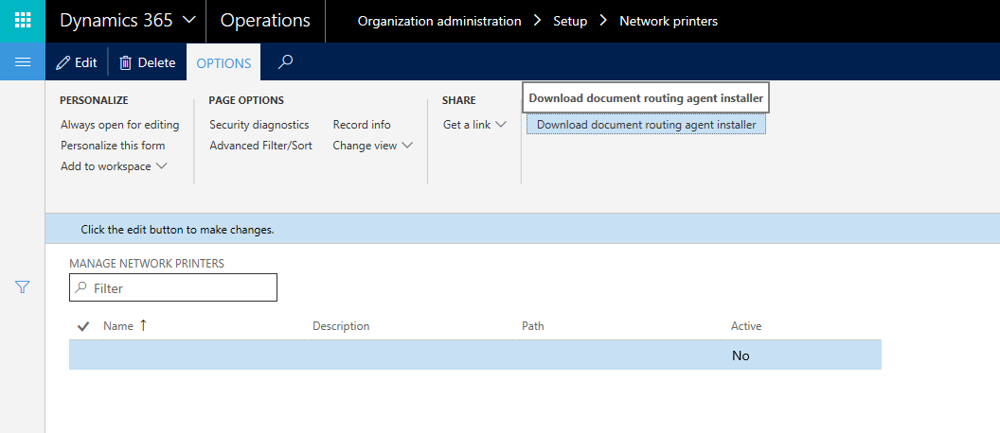
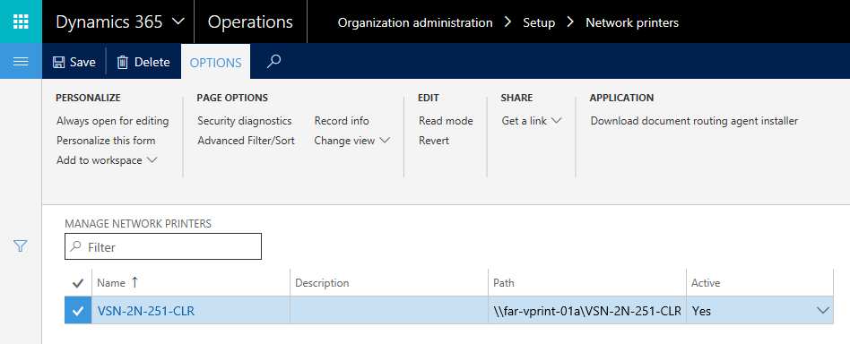

---
# required metadata

title: Install the Document Routing Agent to enable network printer devices
description: This article describes how to install and configure the Document Routing Agent for deployments of Microsoft Dynamics 365 for Operations.
author: sericks007
manager: AnnBe
ms.date: 04/04/2017
ms.topic: article
ms.prod: 
ms.service: dynamics-ax-platform
ms.technology: 

# optional metadata

# ms.search.form: 
# ROBOTS: 
audience: IT Pro
# ms.devlang: 
# ms.reviewer: 71
ms.search.scope: AX 7.0.0, Operations
# ms.tgt_pltfrm: 
ms.custom: 98663
ms.assetid: cd017bfd-2eba-4e8a-ab9b-a0ce393c2108
ms.search.region: Global
# ms.search.industry: 
ms.author: tjvass
ms.search.validFrom: 2016-02-28
ms.dyn365.ops.version: AX 7.0.0

---

# Install the Document Routing Agent to enable network printer devices

[!include[banner](../includes/banner.md)]

This article describes how to install and configure the Document Routing Agent for deployments of Microsoft Dynamics 365 for Operations.

What's important to know?
-------------------------

-   Microsoft Dynamics 365 for Operations offers a downloadable application that you can use to enable network printing scenarios.
-   You can enable network printers for specific companies by using in-client administrative pages.
-   Access to network printing resources requires Active Directory Domain Services (AD DS) authentication.
-   The Microsoft Azure Active Directory (Azure AD) account that is used to configure the Document Routing Agent must share the same domain as the Azure tenant.
-   The application requires Adobe Acrobat Viewer.
-   The client is supported only on Windows 8.1 and Windows 10, or on Microsoft Windows Server 2012 R2.
-   RTM & Platform Update 1 deployments require .NET 4 on the client
-   Platform Update 2 or later require .NET 4.62 on the client machine

Network printers that are registered for Dynamics 365 for Operations applications can be used by all legal entities (also known as companies) that are defined in the environment. Network printer settings are company-specific. Therefore, administrators can restrict access, based on the user's active company. For example, users in the active company might have access to all the network printers that are registered by the Document Routing Agent. However, users in another company won't have access to those printers until access is explicitly enabled for that company.

## Key concepts
This article will help you with the following tasks:

-   Identify the chief components that are involved in the support for network printing in Dynamics 365 for Operations applications.
-   Learn about the function of the Document Routing Agent.
-   Configure the Document Routing Agent to work against an existing Dynamics 365 for Operations application.
-   Use administration pages to manage access to network printers.

## Install the Document Routing Agent
Dynamics 365 for Operations applications use the Document Routing Agent to manage the spooling of documents to network printer devices. You can obtain the client by using direct links that are embedded in the web application. Use the following procedure to download the application to your local computer. You will then be able to access both local and network printers that are connected to your computer, from a single deployment of Dynamics 365 for Operations.

1.  Open the **Manage network printers** page (**Organization administration** &gt; **Setup** &gt; **Network printers**).
2.  On the **Options** tab, in the **Application** group, click **Download document routing agent installer**. 
    
    

3.  Run the downloaded file to begin the installation process.
4.  Complete the setup process.

After the application is installed, you can begin to register local printers as network printers for the Dynamics 365 for Operations applications.

## Configure the Document Routing Agent
Use the following procedure to configure the client application so that it can communicate with the Azure services that host the documents that are in-flight.

1.  Close all browser instances that are running the Dynamics 365 for Operations application, to reset local Azure authentication tokens.
2.  On your desktop, run the Document Routing Agent.
3.  On the toolbar, click **Settings**. 
    
    

4.  Add the following settings:
    -   **Application ID** – The ID that is unique to the application and should be entered automatically.
    -   **Dynamics 365 for Operations URL** – The base URL of the Dynamics 365 for Operations application.
    -   **Azure AD tenant** – The domain name of the Azure AD.

5.  Click **OK**.
6.  Click **Sign In** to sign in to your account. **Note:** The account must share the same domain as the Azure AD that is associated with the Dynamics 365 for Operations application. The Document Routing Agent is now ready to process documents.

After you've successfully signed in, the **Printers** button becomes available on the toolbar.

## Register network printers in Dynamics 365 for Operations
Before you complete this procedure, make sure that you've installed all the network printers on the local host computer. All the printer devices that are installed will be available for service registration. Be sure to select only the printers that you want to expose in the Dynamics 365 for Operations applications.

1.  On the toolbar, click **Printers**.
2.  Select the printers to make available in the Dynamics 365 for Operations applications. 
    
    

3.  Specify a default name for the printer.
4.  Click **OK**.

After you've completed this procedure, the selected printer devices are registered in the Dynamics 365 for Operations application's network printer catalog. System administrators can now enable the printers for access from within the application.

## Administer network printers
Use client pages to manage access to the network printers that have been registered by one or more Document Routing Agents. Network printers are uniquely identified by their path. Therefore, printers are listed one time, even if they have been registered by more than one Document Routing Agent. Use the following procedure to activate the Application Object Server (AOS) network printers.

1.  Open the **Manage network printers** page (**Organization administration** &gt; **Setup** &gt; **Network printers**). 

    
    
2.  Edit the existing entries that are mapped to each network printer. As part of your changes, edit the connection path.
3.  To include a printer as an option in the **Print Destinations** field, set the **Active** field to **Yes**.

Congratulations, you're done. The network printers can now be used in the Dynamics 365 for Operations application.

## Frequently asked questions
###### Does the Document Routing Agent have to be installed on each computer where a user connects by using a browser?

No. Client installations of the Document Routing Agent can be shared by individuals who access the provisioned Dynamics 365 for Operations environment. We recommend that you install agents on one or more Print Servers or other domain-hosted clients that have access to network printers.

###### If the Document Routing Agent belongs on a network Print Server, why doesn't the client run as a service?

We agree. Our research and development (R&D) team is actively working to enhance the agent so that it runs as a Microsoft Windows service that can be managed by using Windows PowerShell commands.

###### Will Microsoft add support for Microsoft Windows Server 2008 servers?

Not at this time. There are several hard dependencies on Azure capabilities that are available only in Windows Server 2012 R2.

###### Does the user who installs the Document Routing Agent have to be part of a Dynamics 365 for Operations security group?

Yes. To access the agent installation links, the user must be part of the **Document routing client** security role.

