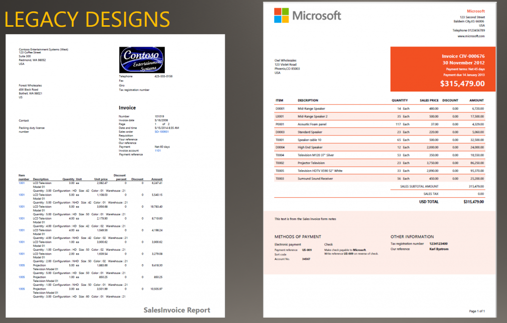
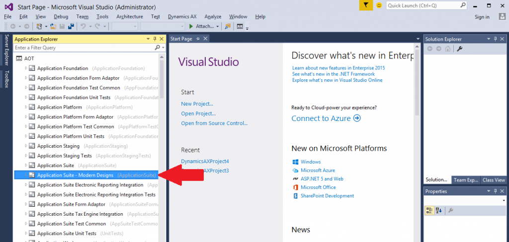

---
# required metadata

title: Install report design templates
description: This articles describes how to install the modern report design templates in the application suite. You can use these samples to create graphically rich business documents that have flexible header and footer branding.
author: sericks007
manager: AnnBe
ms.date: 04/04/2017
ms.topic: article
ms.prod: 
ms.service: dynamics-ax-platform
ms.technology: 

# optional metadata

# ms.search.form: 
# ROBOTS: 
audience: Developer, IT Pro
# ms.devlang: 
# ms.reviewer: 71
ms.search.scope: AX 7.0.0, Operations
# ms.tgt_pltfrm: 
ms.custom: 82783
ms.assetid: 96676acf-a86b-4296-81db-b6ad6b4a46fb
ms.search.region: Global
# ms.search.industry: 
ms.author: tjvass
ms.search.validFrom: 2016-02-28
ms.dyn365.ops.version: AX 7.0.0

---

# Install report design templates

[!include[banner](../includes/banner.md)]

This articles describes how to install the modern report design templates in the application suite. You can use these samples to create graphically rich business documents that have flexible header and footer branding.

Introduction
------------

This article introduces a new set of developer tools that take the form of report designs for several core business documents in the application suite. These report designs have been re-imagined so that flexible branding in the header and footer is rendered for publicly facing documents when transactions are generated in Microsoft Dynamics 365 for Finance and Operations. The following illustration shows how a legacy design for a sales invoice differs from a modern sales invoice. 

## Why aren't these designs the default designs for the application suite reports?
There are two primary reasons why we are maintaining the legacy solutions for Finance and Operations:

-   **Modern designs don't include code.** Although the legacy solutions use embedded Microsoft Visual Basic (VB) code to recognize configuration keys and honor regulatory requirements that vary by region, the modern designs offer much less flexibility. The benefit of a simple design that has minimal code behind it comes at the expense of reusability across regions.
-   **Modern designs aren't available for all business documents.** There is a gap between supported business documents and the availability of a modern design. Although the legacy designs aren't as aesthetically pleasing, they provide a sense of consistency.

**Important:** These simple modern designs are **not** recommended for all types of deployments. They are intended for cases where the customer doesn't require run-time control over the layout of the document through existing application configuration settings.

## Apply the modern designs
The report designs have been bundled into a model file and posted to Microsoft Dynamics Lifecycle Services (LCS), so that you can easily access them from your existing subscription. Use the following procedure to obtain the report design solutions and install them in your local development environment. After you've installed them, you must apply some customizations to incorporate the new report designs for the appropriate scenarios. Follow these steps to install the modern report designs for the application suite.

1.  Download the ApplicationSuiteModernDesigns model file from the **Shared asset library** page on LCS. Sign in to [Microsoft Dynamics Lifecycle Services](https://lcs.dynamics.com/) to access the deployment dashboard, and then save the model file to a location that is accessible from the development environment. 
2.  Import the model file into your local development environment. To install a model file in a Finance and Operations development environment, use the ModelUtil.exe tool and the **-import** directive. Here is an example.

        ModelUtil.exe -import -metadatastorepath=[path of the metadata store] -file=[full path of the file to import]

    1.  Navigate to the **C:\AOSService\PackagesLocalDirectory\bin** folder.
    2.  Run the following command.

            ModelUtil.exe -import -metadatastorepath=C:\AOSService\PackagesLocalDirectory -file="E:\Test\AppSuiteModernDesigns.axmodel"

    For more information about how to import model files, see [Distribution of models: How to export and import a model](..\dev-tools\models-export-import.md). After you've imported the model file, start Microsoft Visual Studio 2015 to verify that the new collection appears under the **AOT** node in Application Explorer. 

3.  Follow these steps to incorporate the modern report design into an existing application suite report:
    1.  Create a project that contains the application suite report.
    2.  Copy the **DocuBrandDetailsDS** data set, and paste it into the collection of data sets.
    3.  Copy the **Modern** design, and paste it into the collection of existing report designs.
    4.  Build and deploy the updated application suite report, which now includes the modern report design.

    By adding the modern report design to the existing report, you can reuse both the parameter handling and the data provider that the out-of-box solution uses.
4.  Update the **Controller** object to add references to the new report design. Search for code that resembles the following code. This code is often nested in the **preModify** method of the **Controller** object.

        // select the report design
        this.parmReportName(ssrsReportStr(CustAccountStatementExt, DesignName));

    At this point, you should be able to access the modern report designs from the application. Be sure to perform thorough test validations on these design templates before you deploy to production environments.

