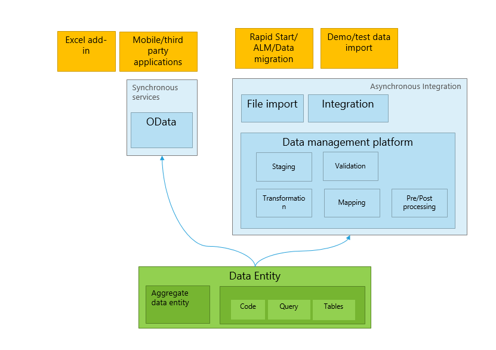
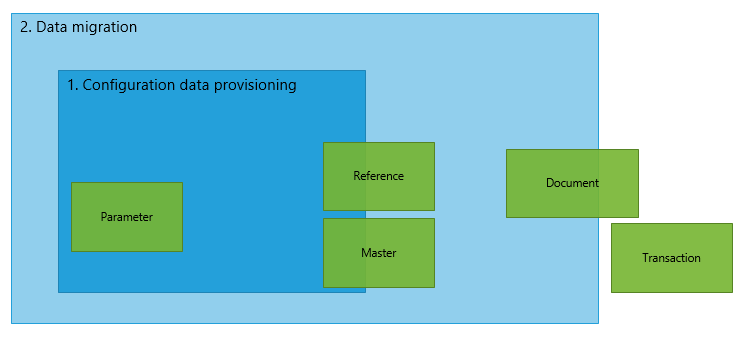

---
# required metadata

title: Data entities
description: This topic defines and provides an overview of data entities. It includes information about the capabilities of data entities, the scenarios that they support, the categories that are used for them, and the methods for creating them.
author: RobinARH
manager: AnnBe
ms.date: 04/04/2017
ms.topic: article
ms.prod: 
ms.service: Dynamics365Operations
ms.technology: 

# optional metadata

# ms.search.form: 
# ROBOTS: 
audience: Developer
# ms.devlang: 
# ms.reviewer: 2051
ms.search.scope: AX 7.0.0, Operations
# ms.tgt_pltfrm: 
ms.custom: 22051
ms.assetid: 89ee656f-3a91-42cd-a189-11744cd2415b
ms.search.region: Global
# ms.search.industry: 
ms.author: kuntalme
ms.search.validFrom: 2016-02-28
ms.dyn365.ops.version: AX 7.0.0

---

# Data entities

[!include[banner](../includes/banner.md)]

This topic defines and provides an overview of data entities. It includes information about the capabilities of data entities, the scenarios that they support, the categories that are used for them, and the methods for creating them.

Overview
--------

A *data entity* is an abstraction from the physical implementation of database tables. For example, in normalized tables, a lot of the data for each customer might be stored in a customer table, and then the rest might be spread across a small set of related tables. In this case, the data entity for the customer concept appears as one de-normalized view, in which each row contains all the data from the customer table and its related tables. A data entity encapsulates a business concept into a format that makes development and integration easier. The abstracted nature of a data entity can simplify application development and customization. Later, the abstraction also insulates application code from the inevitable churn of the physical tables between versions. **To summarize:** Data entity provides conceptual **abstraction** and **encapsulation** (de-normalized view) of underlying table schemas to represent key data concepts and functionalities.

### Capabilities

A data entity has the following capabilities:

-   It replaces diverging and fragmented concepts of AXD, Data Import/Export Framework (DIXF) entities, and aggregate queries with single concept.
-   It provides a single stack to capture business logic, and to enable scenarios such as import/export, integration, and programmability.
-   It becomes the primary mechanism for exporting and importing data packages for Application Lifecycle Management (ALM) and demo data scenarios.
-   It can be exposed as OData services, and then used in tabular-style synchronous integration scenarios and Microsoft Office integrations.

### Entity example

A consumer wants to access data that is related to a customer object, but this data is currently scattered across multiple normalized tables, such as DirParty, CustTable, LogisticPostalAddress, and LogisticElectronicAddress. Therefore, the process of reading and writing customer data is very tedious. Instead, the following customer entity can be designed to encapsulate the entire underlying physical schema into a single de-normalized view. This enables simpler read/write operations and also enables abstraction of any internal interaction between the tables.  

### Supported scenarios

Data entities support all the following scenarios.

#### Integration scenarios

##### Synchronous service (OData)

Data entities enable public application programming interfaces (APIs) on entities to be exposed, which enables synchronous services. Synchronous services are used for the following purposes:

-   Office integration
-   Third-party mobile apps

##### Asynchronous integration

Data entities also support asynchronous integration through a data management pipeline. This enables asynchronous and high-performing data insertion and extraction scenarios. Here are some examples:

-   Interactive file-based import/export
-   Recurring integrations (file, queue, and so on)

#### Business intelligence

-   Aggregate data
-   Standardized key performance indicators (KPIs)

#### Application Lifecycle Management

Besides integration and business intelligence (BI) scenarios, data entities also initially support two critical ALM scenarios. The following two progressive levels of an ALM scenario show the scope of coverage by data entities. 

##### Configuration data provisioning

A system implementer will use both a guided data collection wizard and bulk data input mechanisms to **bootstrap the initial deployment** (or module) with configuration data through Microsoft Dynamics Lifecycle Services (LCS). Configuration primarily targets to cover the following entity categories:

-   All of Parameter
-   Reference
-   System parameter
-   Number sequence
-   Currency

##### Data migration from legacy or external systems

After the initial deployment is up and running, the system implementer will **migrate existing data assets of the customer** into Microsoft Dynamics 365 for Operations, especially the following assets:

-   Master data (for example, customers and vendors)
-   Subsets of documents (for example, sales orders)

## Categories of entities
Entities are categorized based on their functions and the type of data that they serve. The following are five categories for data entities.

### Parameter

-   Functional or behavioral parameters.
-   Required to set up a deployment or a module for a specific build or customer.
-   Can include data that is specific to an industry or business. The data can also apply to broader set of customers.
-   Tables that contain only one record, where the columns are values for settings. Examples of such tables exist for Account payable (AP), General ledger (GL), client performance options, workflows, and so on.

### Reference

-   Simple reference data, of small quantity, that is required to operate a business process.
-   Data that is specific to an industry or a business process.
-   Examples include units, dimensions, and tax codes.

### Master

-   Data assets of the business. Generally, these are the "nouns" of the business, which typically fall into categories such as people, places, and concepts.
-   Complex reference data, of large quantity. Examples include customers, vendors, and projects.

### Document

-   Worksheet data that is converted into transactions later.
-   Documents that have complex structures, such a several line items for each header record. Examples include sales orders, purchase orders, open balances, and journals.
-   The operational data of the business.

### Transaction

-   The operational transaction data of the business.
-   Posted transactions. These are non‑idempotent items such as posted invoiced and balances. Typically, these items are excluded during a full dataset copy.
-   Examples include pending invoices.

## Building an entity
There are multiple ways to create an entity. For example, you can use a wizard, or you can build an entity from a table.

#### Building an entity by using a wizard

The simplest way to build an entity is to use a wizard. This wizard lets you select a root data source and expand to other related data sources, and then select fields for the entity. To start the wizard, add a new item of type **Data entity** to your project. For step-by-step instructions for using the wizard to build an entity, see [DM101 - Building and consuming Data Entities](build-consuming-data-entities.md). The following table provides information about the properties that you set for an entity in the wizard.

| Property                            | Description                                                                                                                                                                                 |
|-------------------------------------|---------------------------------------------------------------------------------------------------------------------------------------------------------------------------------------------|
| Primary data source                 | The root data source (table or view) that is used to construct the entity. You can add more related data sources, based on this root data source.                                           |
| Data entity name                    | The name of the entity.                                                                                                                                                                     |
| Entity category                     | Thy type of entity. Entity categories are similar to table groups for tables. The available categories include **Parameter**, **Reference**, **Master**, **Document**, and **Transaction**. |
| Public entity name                  | The public resource name for the entity.                                                                                                                                                    |
| Public collection name              | The public resource set name.                                                                                                                                                               |
| Enable public API                   | Select this option to enable the entity for OData services.                                                                                                                                 |
| Enable data management capabilities | Select this option to enable the entity for asynchronous integrations such as data import/export and connector integration.                                                                 |
| Staging table                       | The name of the staging table that will be generated for the entity. The staging table is used in asynchronous integrations and high-volume scenarios.                                      |

##### Adding data sources

When you build an entity, you start with a root data source. However, you can add additional data sources. You can either manually add new data sources, or select a surrogate foreign key field in the root data source to automatically expand the required data sources.

##### Output

When you compete the wizard, it produces the following two items:

-   Data entity
-   Staging table (optional, if data management was enabled)

#### Building an entity from a table

You can quickly create an entity from a table, and then customize the properties, data sources, and fields later. Right-click the table, and then select **Addins** &gt; **Create data entity**. 

