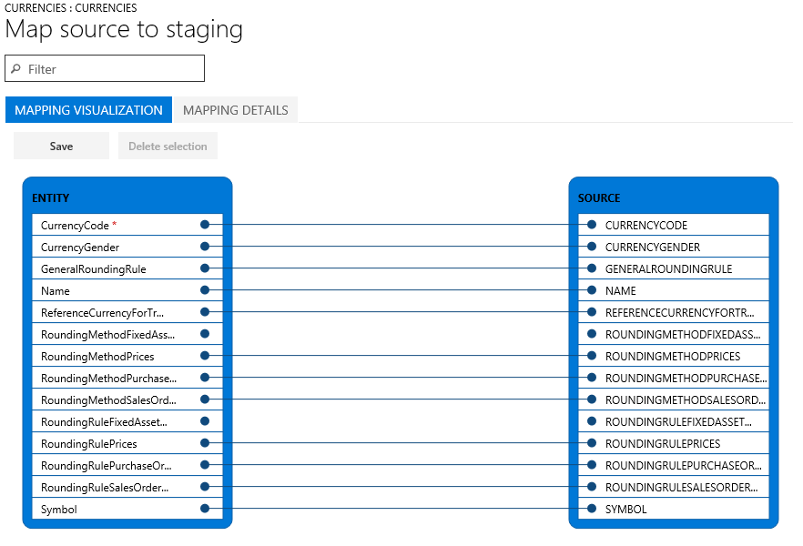

---
# required metadata

title: Data import and export jobs
description: 
author: Sunil-Garg
manager: AnnBe
ms.date: 08/28/2017
ms.topic: article
ms.prod: 
ms.service: dynamics-ax-platform
ms.technology: 

# optional metadata

# ms.search.form: 
# ROBOTS: 
audience: Application user
# ms.devlang: 
ms.reviewer: margoc
ms.search.scope: AX 7.0.0, Operations, UnifiedOperations
# ms.tgt_pltfrm: 
ms.search.region: Global
# ms.search.industry: 
ms.author: sunilg
ms.search.validFrom: 2016-02-28
ms.dyn365.ops.version: AX 7.0.0

---

# Data import and export jobs

[!include[banner](../includes/banner.md)]

To create and manage data import and export jobs, use the Data management workspace. By default, the data import and export process creates a staging table for each entity in the target database. Staging tables let you verify, cleanup, or convert data before moving it.  

## Data import/export process 
When you export or import data, you perform the following steps: 
2. Create an import or export job that: 
   - Defines the project category
   - Identifies the entities to import or export
   - Sets the data format for the job
   - Sequences the entities, so that they are processed in logical groups, and in an order that makes sense
   - Determines whether to use staging tables
3. Validate that source and target data are mapped correctly.
4. Verify the security for your import or export job. 
5. Run the import or export job.
6. Validate that the job ran as expected.
7. Clean up the staging tables. 

## Create a data import or export job
A data import or export job can be run once, or run many times. You can save your jobs as 

### Choose a project category
We strongly recommend that you take time to choose an appropriate project category for your import or export job. Project categories can help you manage related jobs, and more easily validate that you've chosen the right job to run. Categories include Project, Configuration, Integration, and Other. 

### Choose entities
You can add specific entities to an export job, or choose a template to apply. Templates populate a job with a list of entities. The **Apply template** option is available after you have given the job a name, and saved it. 

### Choose a data format
When you select an entity, you must choose the format of the data that will be exported or imported. Formats are defined using the Data sources setup tile. Many organizations start from the formats that ship in the demo data set, which include: 
- AX (data to be imported or exported in the same format as Finance and Operations)
- ColonSeparated
- CSV
- Excel
- Package 

### Sequence entities
Entities can be sequenced in a data template or in import and export jobs. When you are running a job that contains more than one data entity, it is important to ensure that the data entities are properly sequenced. The primary reason for sequencing entities is to address any functional dependencies among entities. If entities don’t have any functional dependencies, then they can be scheduled for parallel import or export.

#### Execution units, levels, and sequences
The execution unit, level in execution unit, and sequence of an entity are used to control the order that the data is exported or imported in.
- Entities in different execution units are processed in parallel.
- Within a unit, entities are processed in parallel if they have the same level.
- Within the same level, entities are processed by the sequence order within the level.
- After processing of one level is completed, the next level is processed.

#### Resequencing
You may want to resequence your entities in the following situations: 
- If only one data job is used for all of your changes, you can use resequencing options to optimize the execution time for the full job. In such cases, you can use the execution unit to represent modules, level to represent a feature area in a module, and sequence to represent the entity. Using this approach, you can operate across modules in parallel while still working in sequence within a module. All dependencies must have been taken into account to ensure that parallel operations will succeed.
- If multiple data jobs are used, one for each module, for example, then, sequencing can be used to affect the level and sequence of entities for optimal execution.
- If there are no dependencies at all, then entities can be sequenced at different execution units for maximum optimization.

The **Resequencing** menu is enabled when multiple entities are selected. You can re-sequence based on execution unit, level or sequence options. You can set an Increment to resequence the entities that have been selected. Each chosen entity’s unit, level and/or sequence number is updated by the specified increment.

#### Sorting
Use can use the **Sort by** option to view the entity list in sequential order.

## Validate that mapping is correct
Mapping is a function that is applicable to both import and export jobs. 
- In the context of an import job, mapping describes which columns in the source file become the columns in the staging table. This helps the system know which column data in the source file must be copied into which column of the staging table. 
- In the context of an export job, mapping describes which columns of the staging table (source) become the columns of the target file.

If the column names in the staging table and the file are same, then the system will automatically establish the mapping based on the names. However, if the names are different, then such columns will not be mapped automatically. In these cases, you must complete the mapping by clicking the **View map** option on the entity in the data job.

There are two mapping views: **Mapping visualization**, the default view, and **Mapping details**. A red asterisk (\*) identifies any required fields in the entity. These fields must be mapped to work with the entity. Other fields can be unmapped as required when working with the entity. To un-map a field, highlight the field in either column (Entity or Source), and then click **Delete selection**. Click **Save** to save your changes. After saving, close the form to return to the project. The field mapping from source to staging can also be edited after import using the same process.

Mapping can be regenerated in the form by clicking **Generate source mapping**. Generated mapping behaves like automatic mapping, so you need to manually map any un-mapped fields.

 

## Ensure data security
Non-administrator user access to the Data management workspace can be restricted to only provide access to certain data jobs. Having access to a data job implies full access to the execution history of the job including access to the staging tables. It is therefore important to ensure that appropriate access controls are in place at the time when you create a data job.

### Secure a job by roles and users
Use the **Applicable roles** menu to restrict the job to one or more security roles. Users in the role will only have access to the job. 

You can also restrict a job to specific users. Securing a job by users is more controlled than securing by roles if multiple users are assigned to a role.

### Secure a job by legal entity
Data jobs are global in nature. This means, if a data job was created and used in a legal entity, the job will be visible in other legal entities in the system. There are application scenarios where this default behavior may be preferred. For example, an organization that imports invoices using data entities may choose to provide a centralized invoice processing team. This team is responsible for managing invoice errors for all divisions in the organization. In such a scenario, it will be useful for the centralized invoice processing team to have access to invoice import jobs from all legal entities. Hence, the default behavior would meet the requirement from a legal entity perspective.

However, an organization might want to have invoice processing teams per legal entity. In such cases, a team in a legal entity should only have access to the invoice import job in its own legal entity. This requirement can be met by configuring legal entity based access control on the data jobs using the **Applicable legal entities** menu inside the data job. Once configured, a user can only see jobs that are available in the legal entity they are currently logged in to. To see jobs from other legal entity, the user must switch to the specific legal entity.

A job can be secured by roles, users and legal entity at the same time.

## Run a job
You can run a job once, by clicking the **Import** or **Export** button after defining it. You can set up a recurring job by clicking **Create recurring data job**. 

## Validate by reviewing job history
Job history is available for troubleshooting and investigation on both import and export jobs. Historical job runs are organized by time ranges.

 

Each job run provides the following details.
- Execution details
- Execution log

Execution details show the state of each of the data entities that were processed by the job. This is a quick way to find the following information: 
- Which entities were processed
- For an entity, how many records were successfully processed and how may failed
- The staging records for each of the entity

You can download the staging data in file for export jobs or download it as a package for import and export jobs.

From inside Execution details, you can also open the execution log.

## Clean up staging tables
Staging tables can be cleaned up from the **Staging clean up** feature in the data management workspace. The following options are available for choosing which records are to be deleted from which staging table.
- Entity – if only an entity is provided, then, all records from this entity’s staging table will be deleted. You can choose this option to clean up all the data for this entity across all data projects and all jobs.
- Job ID – if only a job ID is provided, then, all records for all entities in the chosen job will be deleted from the respective staging tables.
- Data projects – if only a data project is chosen, then, all records for all entities and across all jobs for the chosen data project will be deleted.

The options can also be combined to further restrict the record set that is deleted.
