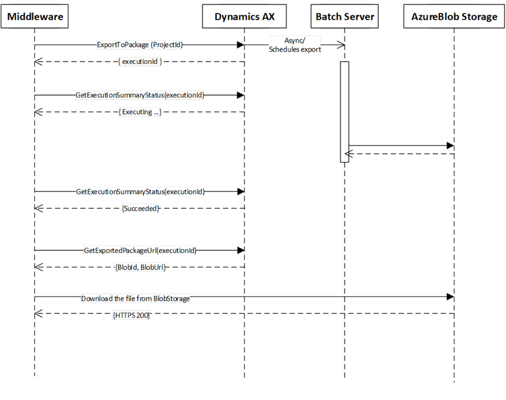

---
# required metadata

title: Data management package integration API
description: This topic describes the data management package REST API for working with files in Microsoft Dynamics 365 for Finance and Operations, Enterprise edition.
author: Sunil-Garg
manager: 09/11/2017
ms.topic: article
ms.prod: 
ms.service: dynamics-ax-platform
ms.technology: 

# optional metadata

# ms.search.form: 
# ROBOTS: 
audience: Developer
# ms.devlang: 
ms.reviewer: margoc
ms.search.scope: AX 7.0.0, Operations, UnifiedOperations
# ms.tgt_pltfrm: 
ms.search.region: Global
# ms.search.industry: 
ms.author: sunilg
ms.search.validFrom: 2016-02-28
ms.dyn365.ops.version: AX 7.0.0

---

# Data management package API 

[!include[banner](../includes/banner.md)]

This topic describes the data management package REST API in Microsoft Dynamics 365 for Finance and Operations, Enterprise edition, and when to use it.

## Choosing an integration API
There are two APIs in Finance and Operations that support file-based integration scenarios: the data management package API and the recurring integrations API. Both APIs support both data import and data export. The following table describes key decision points to use when deciding which API to use. 

| Decision point |    Recurring integrations API                                         |    Data management package API                                                               |
|----------------------------|-------------------------------------------------------------|-------------------------------------------------------------------|
| Scheduling                 | Scheduling within Finance and Operations   | Scheduling external to Finance and Operations |
| Format                     | Files and data packages                                     | Only data packages                                                |
| Transformation             | Supports XSLT transformation if the data file format is XML | Transformations are external to the system                  |

If the recurring integrations API better meets your needs, see [Recurring integrations](recurring-integrations.md).

## Authentication and authorization
The data management API uses OAuth for authentication. The API must be called with a valid OAuth authentication token. The user context in which the API is called should also be established so that the proper security and user access rights can be established. 

When authenticating from the web client, a client ID is assigned to a specific user in **System administration** > **Setup** > **Azure Active Directory Applications**.

When authenticating from native clients, the user context is embedded in the authentication flow. 

## Import APIs
The following APIs are used for imports.

### GetAzureWritableUrl

This API is used to get a writable blob URL. Using this method, which has shared access token embedded in the URL, a data package can be uploaded to the Finance and Operations Azure Blob Storage container.

```
       DataManagementDefinitionGroups.GetAzureWriteUrl(string uniqueFileName)
	Return object: 
{
	string BlobId,
	String BlobUrl,
}

```

Input parameters:
**string uniqueFileName** A unique file name to track blob IDs. You can include a GUID to ensure a unique file name.

Output parameters:
**string BlobId**  The blob ID of the allocated blob conainer.
**string BlobUrl** A writable blob URL with an embedded shared access token to write to blob storage.		
     	
### ImportFromPackage

This API is used to initiate an import from the data package that is uploaded to the Finance and Operations blob storage.

```
DataManagementDefinitionGroups.ImportFromPackage(string packageUrl, 
                                              string definitionGroupId, 
                                              string executionId, 
                                              bool execute, 
                                              bool overwrite, 
                                              string legalEntityId)
```
Return object: 
**string executionId**

Input parameters: 

| **Parameter**                | **Description**                                                                                      |
|--------------------------|--------------------------------------------------------------------------------------------------|
| **string packageUrl**        | The URL of the data package within the Azure Blob Storage associated with Finance and Operations |
| **string definitionGroupId** | The name of the data project for import                                                          |
| **string executionId**       | The ID to use for the job. If an empty ID is assigned, a new execution ID will be created.       |
| **bool execute**             | Set to True to run the target step, otherwise False.                                             |
| **bool overwrite**           | Set to True if data should be overwritten, otherwise False.                                      |
| **string legalEntityId**     | The legal entity for the data import.                                                            |                                                         |

Output parameters:
**string executionId**	The execution ID of the data import.

## Export APIs
The following APIs are used for exports.

### ExportToPackage
This API is used to initiate an export of a data package.

```
DataManagementDefinitionGroups.ExportToPackage(string definitionGroupId, 
      string packageName,
      string executionId, 
      bool reExecute, 
      string legalEntityId)
```

Return object: 
**string executionId**

Input parameters: 

| **Parameter**                | **Description**                                                                                |
|--------------------------|--------------------------------------------------------------------------------------------|
| **string definitionGroupId** | The name of the data project for export.                                                    |
| **string packageName**       | The name of the exported data package.                                                     |
| **string executionId**       | The ID to use for the job. If an empty ID is assigned, a new execution ID will be created. |
| **bool reExecute**           | Set to True to run the target step, otherwise False.                                       |
| **string legalEntityId**     | The legal entity for the data import.                                                      |
	
Output parameters:
**string executionId**	The execution ID of the data export.


### GetExportedPackageUrl

This API is used to get the URL of the exported data package that was exported by called ExportToPackage.

```
DataManagementDefinitionGroups.GetExportedPackageUrl(string executionId)
```

Return object: 
**string BlobUrl**

Input parameters:
**string executionId**	The execution ID of the export data project.

Output parameters:
**string BlobUrl**	A blob URL with an embedded shared access token to download the exported data package.

## Status check APIs	
The following APIs are used to check status.

### GetExecutionSummaryStatus

```
DataManagementDefinitionGroups.GetExecutionSummaryStatus(string executionId)
```

Output Object: 
**DMFExecutionSummaryStatus executionStatus**

Input parameters:
**string executionId**	The execution ID of the data project.

Output parameters:
**DMFExecutionSummaryStatus executionStatus** 

Possible values for execution status:
- Unknown
- NotRun
- Executing
- Succeeded
- PartiallySucceeded
- Failed
- Canceled

## Import and export processes 
The following diagram shows how the data management package methods can be used to import data packages.


 
The following diagram shows how the data management package methods can be used to export data packages.


 
A sample console application is available on GitHub to showcase the data import and data export methods.

For more information, see: 
https://github.com/Microsoft/Dynamics-AX-Integration/tree/master/FileBasedIntegrationSamples/ConsoleAppSamples

The following example demonstrates how to set up file-based import and export using the data package APIs.


