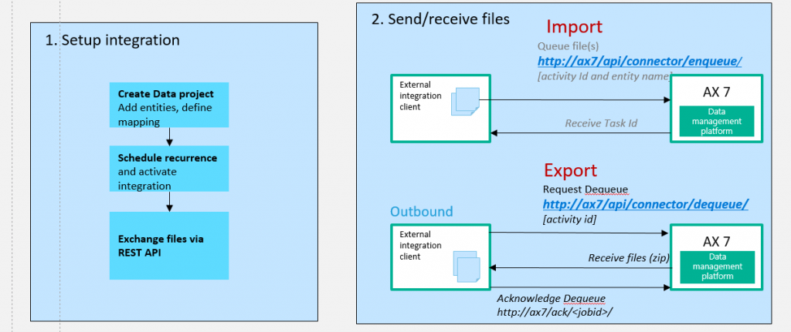
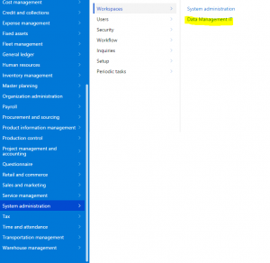
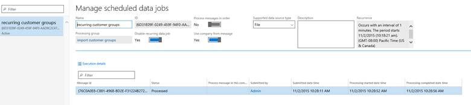

---
# required metadata

title: Recurring integrations
description: This article provides information about recurring integrations. The process of data migration, and movement into and out of any enterprise system, is a critical piece that any platform must support. For the current version of Microsoft Dynamics 365 for Operations, we have tried to simplify this process for all parties who are involved.
author: RobinARH
manager: AnnBe
ms.date: 2015-12-12 19 - 31 - 13
ms.topic: article
ms.prod: 
ms.service: Dynamics365Operations
ms.technology: 

# optional metadata

# ms.search.form: 
# ROBOTS: 
audience: Developer
# ms.devlang: 
# ms.reviewer: 61
ms.search.scope: AX 7.0.0, Operations
# ms.tgt_pltfrm: 
ms.custom: 24821
ms.assetid: 5e04f613-f44b-458f-bf8d-032f778b0c74
ms.search.region: Global
# ms.search.industry: 
ms.author: kuntalme
ms.dyn365.intro: Feb-16
ms.dyn365.version: AX 7.0.0

---

# Recurring integrations

This article provides information about recurring integrations. The process of data migration, and movement into and out of any enterprise system, is a critical piece that any platform must support. For the current version of Microsoft Dynamics 365 for Operations, we have tried to simplify this process for all parties who are involved.

The process of data migration, and movement into and out of any enterprise system, is a critical piece that any platform must support. Considerable effort and planning go into building third-party integrations between an enterprise line of business (LOB) system such as Dynamics 365 for Operations and various source systems. Microsoft Dynamics AX 2012 enables these scenarios through Application Integration Framework (AIF). For the current version, we have tried to simplify this process for all parties who are involved, from integration solution builders to customer end users.

## Architecture
In Dynamics 365 for Operations, the integration does the following:

-   It builds on data entities and the rich data management platform (Data Import/Export Framework \[DIXF\]).
-   It enables the exchange of documents/files between Dynamics 365 for Operations and any third-party application or service.
-   It supports several document formats, source mapping, Extensible Stylesheet Language Transformations (XSLT), and filters. 
-   It uses secure REST application programming interfaces (APIs) and authorization mechanisms to receive data from and send data back to integration systems. 

## Authorization for the integration REST API
The integration REST API uses the same OAuth 2.0 authentication model as the other service endpoints. Before the integrating client application can consume this endpoint, you must create an application ID in Microsoft Azure Active Directory (AAD) and give it appropriate permission to Dynamics 365 for Operations . When you create and enable a recurring job, you'll be prompted to enter the AAD application ID that will be interacting with that recurring job. Therefore, be sure to note down the application ID.

## Set up a data project and recurring data jobs
### Create a data project

1.  On the main dashboard, click the **Data management** tile to open the data management workspace.
2.  Click the **Import or Export** tile to create a new data project. **Note:** If you have an existing data project, click **Load project** on any data project card on the **Data projects** tab.
3.  Enter a valid job name, data source, and entity name.
4.  Upload a data file for one or more entities. Make sure that each entity is added, and that no errors occur. **Note:** You can click each entity data card to set up, review, or modify field maps, and to set up XSLT-based transforms that must be applied to inbound data. For export data projects, the entity card also shows a filter link, so that you can set up filters to filter out data. Currently, all recurring data jobs in a data project use the same filter.
5.  Click **[Save](https://ax.help.dynamics.com/wp-admin/post.php?post=265921&action=edit)**.

### Create a recurring data job

1.  On the **Data project** page, click **Create recurring data job**.
2.  Enter a valid name and a description for the recurring data job.
3.  On the **Set up authorization policy** tab, enter the application ID that was generated for your application, and mark it as enabled.
4.  Expand **Advanced options**, and specify either **File** or **Data package**.
    -   Specify **File** to indicate that your external integration will push individual files for processing via this recurring data job. In this case, the format of the file that is expected is the same as the format that was specified when the entity was added to the data project.
    -   Specify **Data package** to indicate that you can push only data package files for processing. A data package is a new format for submitting multiple data files as a single unit that can be used in integration jobs.

5.  Click **Set processing recurrence**, and set a valid recurrence for your data job. 
6.  Optional: Click **Set monitoring recurrence**, and provide a monitoring recurrence. **Note:** Currently, the monitoring recurrence enables load monitoring only on your recurring data job queue. No additional policies are supported via this service. You can use this feature to fine-tune the processing recurrence as required by load demand.
7.  Click **OK**, and then click **Yes** in the confirmation dialog box.

## Manage recurring data jobs
Use the administration workspace for Data Management.  In this workspace, on the **Recurring data job** tab, click the recurring job to view more details for. The **Management** page contains a grid that lists any messages that are waiting in the queue. This view helps you monitor messages and processing status. 

## Submitting data to recurring data jobs
You can use well-known integration REST endpoints to integrate with the client, submit documents (import), or poll available documents for download (export). These endpoints support OAuth.

## Integration REST APIs
The following set of APIs is used to exchange data between the integration client and Dynamics 365 for Operations.

### For import (enqueue)

Make an HTTP POST call against the following URL.

    https://<baseurl>/api/connector/enqueue/<activity id>?entity=<entity name>

In the message body, you can the pass the data as a memory stream. **Example**

    POST https://usncax1aos.cloud.onebox.dynamics.com/en/api/connector/enqueue/%7B6D31E09F-0249-459F-94F0-AAD9C2C47B64%7D?entity=Customer%20Groups

To get the activity ID, go to the manage recurring job view, and copy and paste the GUID (highlighted in the following screen shot). 

### For export (dequeue)

To return a data package that contains all the data entities that were defined in that data project, and that the client application can unzip and consume, use the following structure.

    https://<baseurl>/api/connector/enqueue/<activity id>

**Example**

    GET https://usncax1aos.cloud.onebox.dynamics.com/en/api/connector/dequeue/%7BC03BB937-09ED-46DE-86EE-4520D7D7E373%7D

After the client downloads the data, an acknowledgment must be sent back to Dynamics 365 for Operations, so that we can mark the data as received.

### For acknowledging

Use the API.

    https://<baseurl>/api/connector/ack/<activity id>

**Example**

    POST https://usncax1aos.cloud.onebox.dynamics.com/en/api/connector/ack/%7BC03BB937-09ED-46DE-86EE-4520D7D7E373%7D

