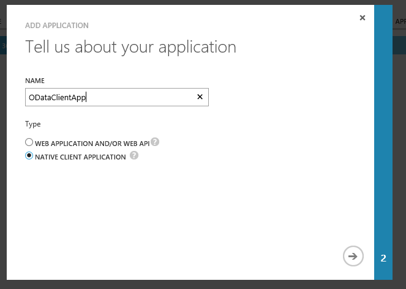
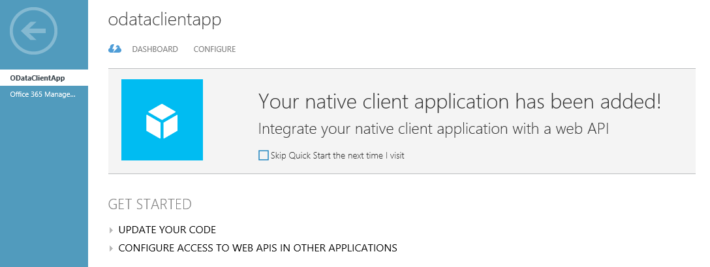
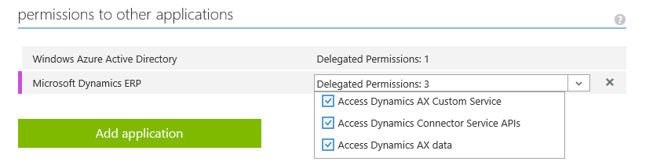

---
# required metadata

title: Service endpoints
description: This topic describes the service endpoints that are available in Microsoft Dynamics 365 for Operations.
author: RobinARH
manager: AnnBe
ms.date: 2015-12-09 14 - 54 - 35
ms.topic: article
ms.prod: 
ms.service: Dynamics365Operations
ms.technology: 

# optional metadata

# ms.search.form: 
# ROBOTS: 
audience: Developer
# ms.devlang: 
ms.reviewer: RobinARH
ms.search.scope: AX 7.0.0, Operations
# ms.tgt_pltfrm: 
ms.custom: 21311
ms.assetid: 5ff7fd93-1bb8-4883-9cca-c8c42ddc1746
ms.search.region: Global
# ms.search.industry: 
ms.author: kuntalme
ms.search.validFrom: 2016-02-28
ms.dyn365.ops.version: AX 7.0.0

---

# Service endpoints

This topic describes the service endpoints that are available in Microsoft Dynamics 365 for Operations.

This article describes the service endpoints that are available.

## List of services
The following table lists all the service endpoints that were available in Microsoft Dynamics AX 2012 and the service endpoints in Dynamics 365 for Operations.

| Service endpoint            | Dynamics AX 2012 | Dynamics 365 for Operations    |
|-----------------------------|------------------|--------------------------------|
| Document Services (AXDs)    | Yes              | No – Replaced by data entities |
| SOAP-based Metadata Service | Yes              | No – Replaced by REST metadata |
| SOAP-based Query Service    | Yes              | No – Replaced by OData         |
| OData Query Service         | Yes              | No – Replaced by OData         |
| SOAP-based Custom Service   | Yes              | Yes                            |
| JSON-based Custom Service   | No               | Yes (**New**)                  |
| OData Service               | No               | Yes (**New**)                  |
| REST Metadata Service       | No               | Yes (**New**)                  |

## Custom services
### SOAP-based Custom Service

The SOAP-based services remain the same as they were in Dynamics AX 2012.

#### Key changes

-   All the service groups under the **AOTService group** node are automatically deployed.
-   All services that must be deployed must be part of a service group.

The SOAP endpoint is at https://&lt;host\_uri&gt;/soap/Services/&lt;service\_group\_name&gt;. **Example:** https://usnconeboxax1aos.cloud.onebox.dynamics.com/soap/services/UserSessionService?wsdl The following documentation is from the Dynamics AX 2012 X++ Custom SOAP Services, and it will help you design and write services:

-   [Using Custom Services \[AX 2012\] (TechNet)](http://technet.microsoft.com/en-us/library/hh509052.aspx)
-   [Walkthrough: Exposing an X++ Class as a Data Contract \[AX 2012\] (TechNet)](http://technet.microsoft.com/en-us/library/gg844225.aspx)

**Code examples -** We have some sample code examples for consuming Custom services at <https://github.com/Microsoft/Dynamics-AX-Integration/tree/master/ServiceSamples/SoapConsoleApplication>

### JSON-based Custom Service

This feature enables X++ classes to be consumed as JSON services. In other words, the return data set is in JSON format. JSON, which stands for JavaScript Object Notation, is a compact, lightweight format that is commonly used communicate data between the client and the server. In Dynamics 365 for Operations, after the developer has written the services under service groups, the service groups are always deployed on two endpoints:

-   SOAP endpoint (mentioned in the previous section)
-   JSON endpoint

The JSON Endpoint is at https://&lt;host\_uri&gt;/api/Services/&lt;service\_group\_name&gt;/&lt;service\_group\_service\_name&gt;/&lt;operation\_name&gt;. **Example:** https://usnconeboxax1aos.cloud.onebox.dynamics.com/en/api/services/UserSessionService/AifUserSessionService/GetUserSessionInfo You can find a Microsoft Office Mix presentation about this topic [here](https://mix.office.com/watch/12e4fejbgj429). **Code examples -** We have some sample code examples for consuming Json services at <https://github.com/Microsoft/Dynamics-AX-Integration/tree/master/ServiceSamples/JsonConsoleApplication>

## OData Services
Dynamics 365 for Operations has an OData REST endpoint. This endpoint exposes all the data entities that are marked as **IsPublic** in the Application Object Tree (AOT). It supports complete CRUD (create, retrieve, update, and delete) functionality that users can use to insert and retrieve data from the system. Detailed labs for this feature are on the LCS methodology. You can find an Office Mix presentation about OData Services [here](https://mix.office.com/watch/1aym08mqyjghi).

### Supported features from the OData specification

The following table lists the high-level features that are enabled the OData, per the [OData specification](http://docs.oasis-open.org/odata/odata/v4.0/odata-v4.0-part1-protocol.html).

OData v4 feature

Details

OData v4 specification reference

CRUD

HTTP Verb support for POST, PATCH, PUT, and DELETE

Query options

-   $filter
-   $count
-   $orderby
-   $skip
-   $top
-   $expand
-   $select

Server-driven paging

The maximum page size that is served is 1,000.

Actions that are bound to entities

<http://docs.oasis-open.org/odata/odata/v4.0/errata02/os/complete/part1-protocol/odata-v4.0-errata02-os-part1-protocol-complete.html#_Toc406398355>

Actions that are bound to entity sets

Built-in operators for $filter

-   Equals
-   Not Equals
-   Greater Than
-   Greater Than or Equal
-   Less Than
-   Less Than or Equal
-   And
-   Or
-   Not
-   Addition
-   Subtraction
-   Multiplication
-   Division

<http://docs.oasis-open.org/odata/odata/v4.0/errata02/os/complete/part2-url-conventions/odata-v4.0-errata02-os-part2-url-conventions-complete.html#_Toc406398096>

**Contains** option in $filter

Implemented as a wildcard character** Example:** http://host/service/EntitySet?$filter=StringField eq '\*retail\*'

Batch requests

<http://docs.oasis-open.org/odata/odata/v4.0/errata02/os/complete/part1-protocol/odata-v4.0-errata02-os-part1-protocol-complete.html#_Toc406398359>

Metadata annotations

/data/$metadata has out-of-box annotations.

**EnumType** support

Example of how EnumType is supported in $metadata: 

**Code examples -** We have some sample code examples for consuming Odata services at <https://github.com/Microsoft/Dynamics-AX-Integration/tree/master/ServiceSamples/ODataConsoleApplication>

### Cross-company behavior

By default, OData returns only data that belongs to the user's default company. To see data from outside the user's default company, specify the **?cross-company=true** query option. This option will return data from all companies that the user has access to. **Example:** http://\[baseURI\]/data/FleetCustomers?cross-company=true To filter by a particular company that isn't your default company, use the following syntax: http://\[baseURI\]/data/FleetCustomers?$filter=dataAreaId eq 'usrt'&cross-company=true

### Validate methods

The following table summarizes the validate methods that the OData stack calls implicitly on the corresponding data entity.

<table>
<colgroup>
<col width="50%" />
<col width="50%" />
</colgroup>
<thead>
<tr class="header">
<th>OData</th>
<th>Methods (listed in the order in which they are called)</th>
</tr>
</thead>
<tbody>
<tr class="odd">
<td>Create</td>
<td><ol>
<li><strong>Clear()</strong></li>
<li><strong>Initvalue()</strong></li>
<li><strong>PropertyInfo.SetValue()</strong> for all specified fields in the request</li>
<li><strong>Validatefield()</strong></li>
<li><strong>Defaultrow</strong></li>
<li><strong>Validatewrite()</strong></li>
<li><strong>Write()</strong></li>
</ol></td>
</tr>
<tr class="even">
<td>Update</td>
<td><ol>
<li><strong>Forupdate()</strong></li>
<li><strong>Reread()</strong></li>
<li><strong>Clear()</strong></li>
<li><strong>Initvalue()</strong></li>
<li><strong>PropertyInfo.SetValue()</strong> for all specified fields in the request</li>
<li><strong>Validatefield()</strong></li>
<li><strong>Defaultrow()</strong></li>
<li><strong>Validatewrite()</strong></li>
<li><strong>Write()</strong></li>
</ol></td>
</tr>
<tr class="odd">
<td>Delete</td>
<td><ol>
<li><strong>Forupdate()</strong></li>
<li><strong>Reread()</strong></li>
<li><strong>checkRestrictedDeleteActions()</strong></li>
<li><strong>Validatedelete()</strong></li>
<li><strong>Delete()</strong></li>
</ol></td>
</tr>
</tbody>
</table>

## REST Metadata Service
The REST metadata service is a read-only service. In other words, users can make only GET requests. The main purpose of this endpoint is to provide metadata information for elements. It is an OData implementation. This endpoint is hosted at http://\[baseURI\]/Metadata. Currently, this endpoint provides metadata for the following elements:

-   **Labels** – This gets labels from the system. They have a dual pair key, language, and ID, so that you can retrieve the value of the label. **Example:** https://\[baseURI\]/metadata/Labels(Id='@SVC\_ODataLabelFile:Label1',Language='en-us')
-   **Data entities** – This returns a JSON-formatted list of all the data entities in the system. **Example:** https://\[baseURI\]/Metadata/DataEntities

We will support more sets of metadata as new scenarios require it.

## Authentication
OData Services, JSON-based Custom Service, and REST Metadata Service support standard OAuth 2.0 authentication. You can read more about OAuth 2.0 [here](//msdn.microsoft.com/en-us/library/azure/dn645545.aspx). We currently support [Authorization Code Grant flow](https://msdn.microsoft.com/en-us/library/azure/dn645542.aspx). Two kinds of application are supported in Microsoft Azure Active Directory (AAD):

-   **Native client application** – This flow uses a user name and password for authentication and authorization.
-   **Web application (Confidential client)** – A confidential client is an application that can keep a client password confidential to the world. The authorization server assigned this client password to the client application. This will be supported post-RTW.

### OAuth – Authorization Code Grant flow

### Register a native application with AAD

Before any clients can communicate with the services, they must be registered in AAD. These steps will help you register an application with AAD. **Note:** These steps don't have to be completed by all the people in your organization. Only one Azure Service Administrator user can add the application and share the client ID with the developers. **Prerequisite:** You must have an Azure subscription and admin access to Active Directory.

1.  In a web browser, go to <http://manage.windowsazure.com/>.
2.  Enter the user name and password of the user who has access to the Azure subscription. After the credentials are authenticated, Azure Portal opens.
3.  In Azure Portal, in the left navigation pane, click **Active Directory**. 
4.  In the grid, select the Active Directory instance that is being used.
5.  On the top toolbar, click **Applications**. 
6.  In the bottom pane, click **Add**. The **Add application** wizard starts.
7.  Add a new native client application. Enter information in the wizard as shown in the following screen shots.   
8.  Click the check mark button to complete the wizard. After you complete the wizard, the new application page opens. 
9.  On the top toolbar, click **Configure**.
10. Scroll down until you see the **Permissions to other applications** section. Click **Add Application** in this section. 
11. Select **Microsoft Dynamics ERP** in the list.
12. Click the **Complete check** button in the right corner of the page.
13. In the **Delegate Permissions** list, select all the check boxes. **Note:** We are working on cleaning up this list. 
14. Make a note of the following two pieces of information:
    -   **Client ID** – As you scroll toward the top of this page, you will see **Client ID** displayed.
    -   **Redirect URI**

After you have these two pieces of information, you're ready to write your client code.

### Client sample code

The following is the sample code for getting the token from AAD. In this flow, the user will be presented with the consent form (for cross-tenant application) and the user/name sign-in form.

    UriBuilder uri = new UriBuilder ("https://login.windows.net/contoso2ax.onmicrosoft.com");
               
    AuthenticationContext authenticationContext = new AuthenticationContext(uri.ToString());

    //request token for the resource - which is the URI for your organization. NOTE: Important do not add a trailing slash at the end of the URI
    AuthenticationResult authenticationResult = authenticationContext.AcquireToken("https://axdynamics1001aos.cloud.dynamics.com", clientId, redirectURI);
                
    //this gets the authorization token, which needs to be passed in the Header of the HTTP Requests
    string authenticationHeader = authenticationResult.CreateAuthorizationHeader();

To pass the user name and password without showing a pop-up, you can use the following overload of **AcquireToken**.

    UserCredential userCred = new UserCredential (username, password);
    authenticationContext.AcquireToken("https://axdynamics1001aos.cloud.dynamics.com", clientId, userCred);

## Consuming external web services
In previous versions, you could consume web services from X++ code by adding Microsoft Visual Studio projects as a reference and by using **Aif::CreateServiceClient**. This scenario is supported, but the steps have changed. Application Integration Framework (AIF) is no longer supported. The following steps show how to consume an external StockQuote service from X++.

1.  Create a new Class Library project in Visual Studio, and name it **ExternalServiceLibrary.csproj**.
2.  In the Visual Studio project, add a service reference to the external web service: **http://www.webservicex.net/stockquote.asmx**
3.  Create a new static class, and wrap the StockQuote service operation as shown in the following example.

              public static string GetQuote(string s)
                {
                    var binding = new System.ServiceModel.BasicHttpBinding();
                    var endpointAddress = new EndpointAddress("http://www.webservicex.net/stockquote.asmx");
                    ServiceLibrary.QuoteReference.StockQuoteSoapClient client = new ServiceLibrary.QuoteReference.StockQuoteSoapClient(binding, endpointAddress);

                    //GetQuote is the operation on the StockQuote service
                    return client.GetQuote("MSFT");
                }

4.  Build the project. The binary ExternalServiceLibrary.dll is created.
5.  Create a new Dynamics project in Visual Studio.
6.  Add **ExternalServiceLibrary.dll** as a reference.
7.  In the X++ class, you can use the external web services that were referenced in ExternalesrviceLibrary.dll.

           public static void main(Args _args)
            {
                info(ServiceLibrary.StockQuoteClass::GetQuote("MSFT"));
            }

For more information, see [Troubleshoot service authentication](troubleshoot-service-authentication.md).

See also
--------

[Troubleshoot service authentication](troubleshoot-service-authentication.md)

