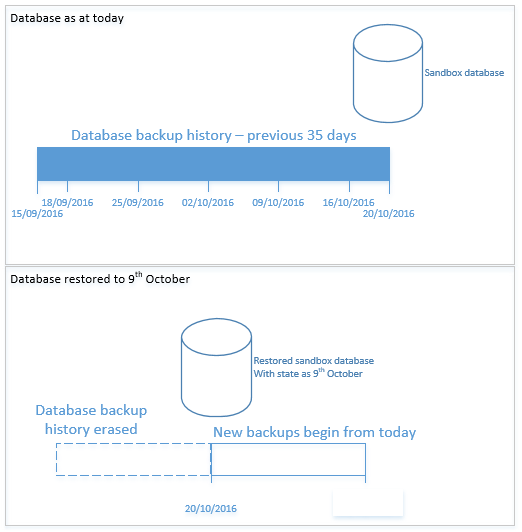

---
# required metadata

title: Restore a database on a non-production environment
description: Microsoft Dynamics 365 for Operations lets you request that a database be restored to a specific point in time that is within 35 days of your request. This topic describes how to request a point-in-time restore.
author: MargoC
manager: AnnBe
ms.date: 04/04/2017
ms.topic: article
ms.prod: 
ms.service: Dynamics365Operations
ms.technology: 

# optional metadata

# ms.search.form: 
# ROBOTS: 
audience: IT Pro
# ms.devlang: 
# ms.reviewer: 11
ms.search.scope: AX 7.0.0, Operations
# ms.tgt_pltfrm: 
ms.custom: 257614
ms.assetid: 558598db-937e-4bfe-80c7-a861be021db1
ms.search.region: Global
# ms.search.industry: 
ms.author: tabell
ms.search.validFrom: 2016-02-28
ms.dyn365.ops.version: AX 7.0.0

---

# Restore a database on a non-production environment

Microsoft Dynamics 365 for Operations lets you request that a database be restored to a specific point in time that is within 35 days of your request. This topic describes how to request a point-in-time restore.

Overview
--------

Point-in-time restore is a Microsoft Azure SQL Database feature that can be used with Microsoft Dynamics 365 for Operations. A point-in-time restore resets a non-production environment to a known good state after destructive testing. In an emergency, you can also do a point-in-time restore on a production environment. However, to request a production restore, don't use the process that is described in this topic. Instead, you should use Microsoft Support. **Important:** The point-in-time restore feature always creates a new database. To uptake the new database into the Dynamics 365 for Operations environment, you must replace the original database with the new database. Therefore, after you uptake the new database, all backup history is gone. History tracking will begin again from that moment. 

## Code versioning
When you're trying to determine which restore point in time to select, it's important that you consider code versioning, because the current version of the code might be incompatible with the state of the database at the restore point. For example, today's database is running Microsoft Dynamics 365 for Operations Platform Update 2, plus some customizations. However, 10 days ago, the environment was running the Microsoft Dynamics AX February 2016 release, plus customizations that were created for that build. If you try to restore the database to the state that it was in 10 days ago, but the environment is still running the most recent version of the code, the environment might not work as you expect, because the database has been upgraded. Although you might be able to mix a version of the database and a version of the code without encountering issues, it's important that you be aware that issues can occur. We recommend that, as a rule, you not mix major version releases from Microsoft, or major versions of customizations. Here is the most common scenario where you will require a point-in-time restore:

-   User tests that are run in the sandbox environment identify some bugs.
-   The bugs are fixed in a development environment, and a new build is deployed to the sandbox environment.
-   You request a point-in-time restore to restore the database to a time before the tests were run, so that the database can be retested in exactly the same way. In this case, there is mismatch of the code version and the database, because the bug fixes were deployed. However, this mismatch is unlikely to cause an issue. Consult the developers who make the customizations to verify that you can proceed.
-   After the database is restored, synchronize it.

## Point-in-time restore process
The Microsoft Service Engineering team will take your environment offline, complete the point-in-time restore, and then bring the environment back online. You can expect the downtime period to be less than two hours. The period after you enter your request and before our Service Engineers take action will be longer than your environment downtime. In the future, we will provide a self-service method that you can use to perform your own point-in-time restores.

1.  Click the hamburger icon in the upper left of the Microsoft Dynamics Lifecycle Services (LCS) window, and then select **Work items** in the list. 
2.  On the **Work items** page, click **Add** on the toolbar, and then click **Database point-in-time restore request**. 
3.  In the **Request for database point-in-time restore** dialog box, follow these steps:
    1.  In the **Environment name** field, select the environment to restore. **Note:** Only Azure SQL Database environments can be restored. Therefore, you can't select one-box environments that are based on Microsoft SQL Server.
    2.  In the **Database** field, the database to restore is always Microsoft Dynamics AX or Microsoft Dynamics 365 for Operations. Other databases, such as Entity store or Management Reporter, aren't currently supported for point-in-time restores.
    3.  Enter information in the **Restore point time** fields. Azure SQL Database lets you restore a database to a point in time that is up to 35 days before the date when you make the request. If the environment is less than 35 days old, or if it has previously been restored, the maximum amount of time will be less.
    4.  Enter information in the **Preferred downtime start date** and the **Preferred downtime end date** fields. The end date must be at least one hour after the start date. Requests must be submitted least 24 hours before the preferred downtime window, to help guarantee that resources are available to complete the request.
    5.  Carefully read and acknowledge the three statements that have check boxes next to them.

    
4.  After you submit your request, you will be redirected to the list of work items. Here, you can view the status of the request, or reschedule or cancel the request.
5.  When the Microsoft Service Engineering team has acknowledged that it can complete your request, the status of the request changes to **Request accepted**. At this point, you can follow any of these steps:
    -   Wait for the Service Engineering team to complete the restore. When restore is completed, the status changes to **Succeeded**.
    -   Reschedule the request by clicking the ID, or by selecting the request and then clicking **Reschedule** on the toolbar. You can then change the downtime windows dates and times, and the point in time to restore to.
    -   Cancel the request by selecting the request and then clicking **Cancel** on the toolbar.

## Conditions of a point-in-time restore
Here is the list of requirements and conditions of operation for a point-in-time restore:

-   Requests must be submitted 24 hours before the desired downtime window, to help guarantee that resources will be available to complete the request.
-   A point-in-time restore erases the existing database in the target environment. The existing database can't be recovered after the restore is completed.
-   The target environment will be unavailable until the refresh process is completed.
-   The point-in-time restore will affect only the Dynamics 365 for Operations database.
    -   Document handling documents that are stored in Azure blob storage won't be changed and will remain in their current state. The same rule applies to any documents that are stored in Azure blob storage through X++ customization.
    -   The Management Reporter database will also remain in the current state and must be reset after the restore is completed.
-   The Dynamics 365 for Operations database will be left at the precise state that it was in at the requested point in time. We do **not** withhold batches or restrict access to the restored database.
-   LCS users who have a role of **Project Owner** or **Environment Manager** in LCS will have access to the Azure SQL Database and machine credentials for all non-production environments. To help guarantee security of the data that is copied to non-production environments, restrict membership in these roles.

