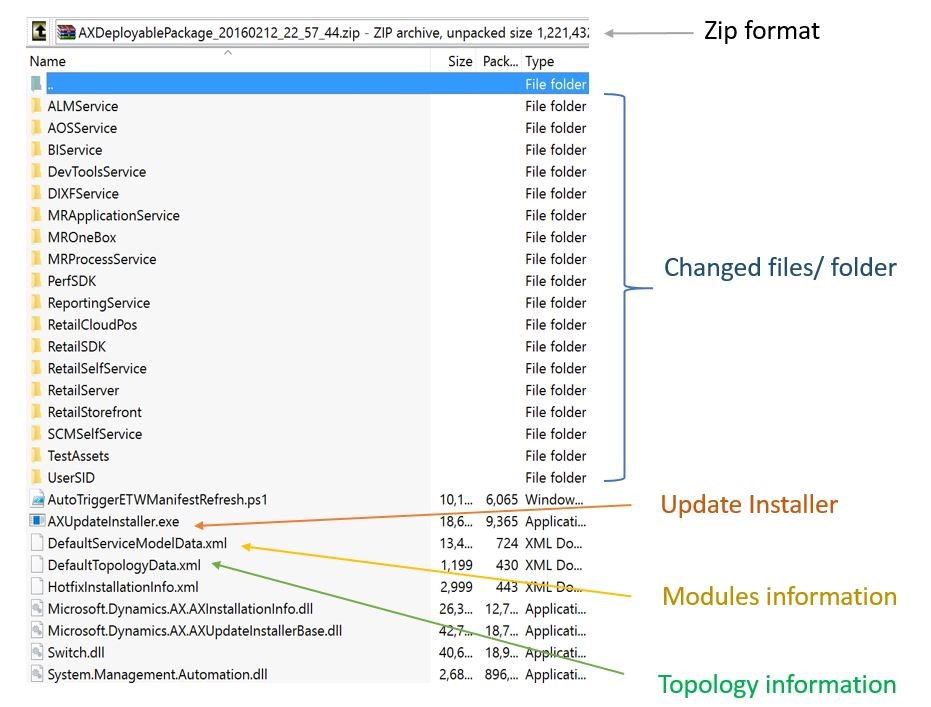
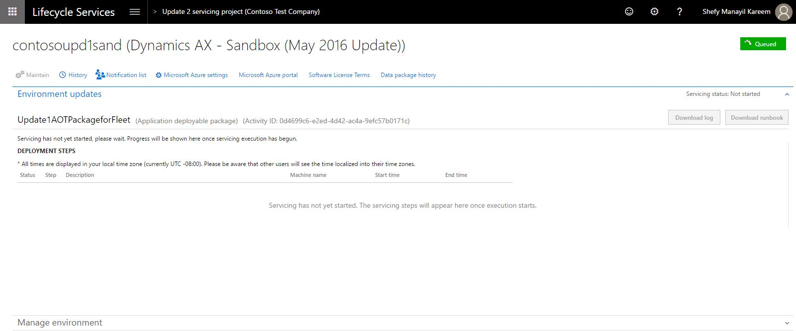
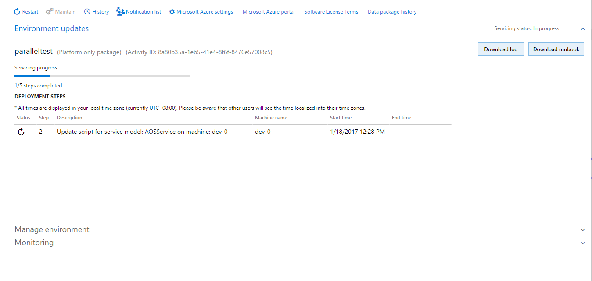
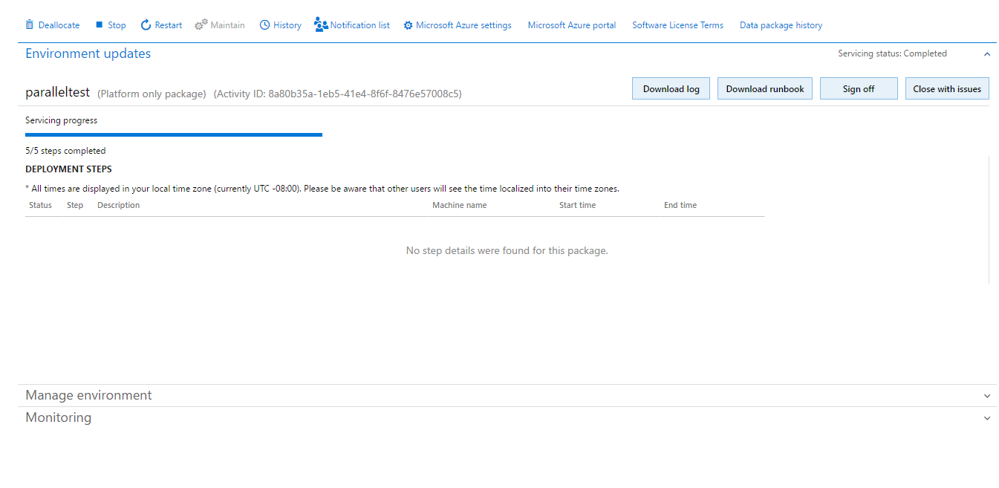
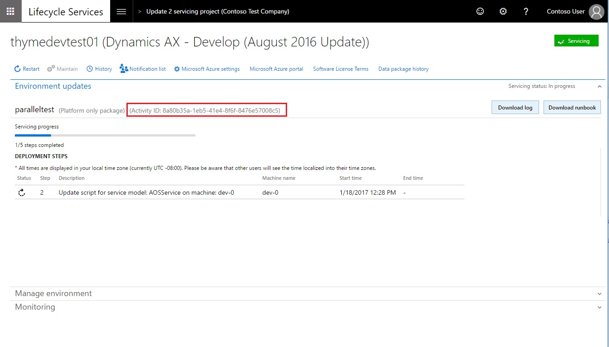
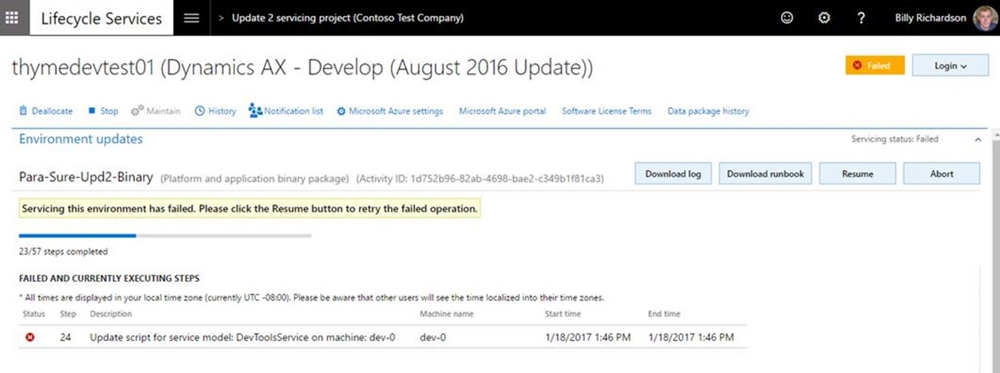
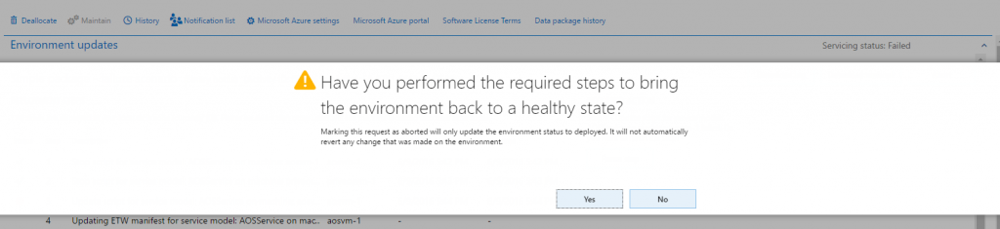
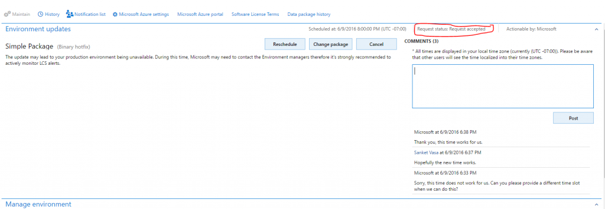
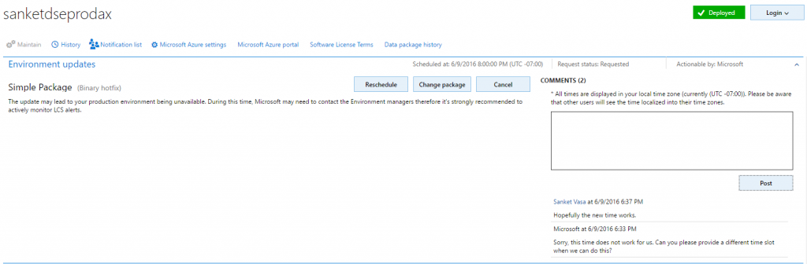
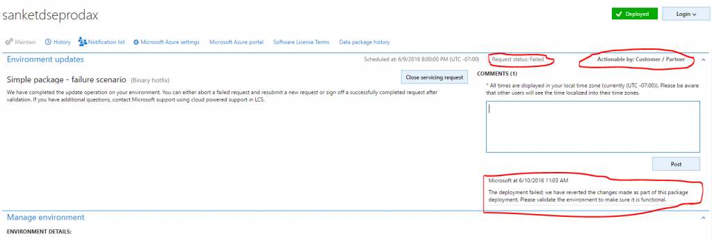

---
# required metadata

title: Apply a deployable package on a Dynamics 365 for Operations system
description: This tutorial walks you through the steps for applying a deployable package on a Microsoft Dynamics 365 for Operations system. This package can be either a binary hotfix for Application Object Server (AOS) or a deployable package that was created in your development environment.
author: kfend
manager: AnnBe
ms.date: 2016-08-10 23 - 27 - 58
ms.topic: article
ms.prod: 
ms.service: Lifecycle Services
ms.technology: 

# optional metadata

# ms.search.form: 
# ROBOTS: 
audience: Developer, IT Pro
# ms.devlang: 
# ms.reviewer: 51
ms.search.scope: Operations, Platform, AX Platform
# ms.tgt_pltfrm: 
ms.custom: 107013
ms.assetid: 341a229f-d9c3-4678-b353-d08d5b2c1caf
ms.search.region: Global
# ms.search.industry: 
ms.author: manado
ms.search.validFrom: 2016-05-31
ms.dyn365.ops.version: Platform update 1

---

# Apply a deployable package on a Dynamics 365 for Operations system

This tutorial walks you through the steps for applying a deployable package on a Microsoft Dynamics 365 for Operations system. This package can be either a binary hotfix for Application Object Server (AOS) or a deployable package that was created in your development environment.

Supported environments
----------------------

Package deployment using automated flows in LCS are supported on the following topologies:

-   **Implementation Project**: All environments (Dev, Test, Build, Demo, Sandbox, and Production) are now supported. Automated package application is self-serve on all environments except Production. For Production environments, customers must submit a request through LCS to the Service Engineering team to apply packages.
-   **Partner Projects**: Demo- and single-box Dev/Test environments are supported.

Manual package deployment must be used for the following topologies. For information about manual package deployment, see [Install a deployable package in Microsoft Dynamics 365 for Operations](install-deployable-package.md).

-   Downloadable VHD
-   Partner Projects: Multi-box Dev/Test topology deployments.

## Key concepts
-   **Deployable package** – A deployable package is a unit of deployment that can be applied in any Dynamics 365 for Operations environment. A deployable package can be a binary hotfix to the Application Object Server (AOS) runtime components, an updated Dynamics 365 for Operations customization package, or a new Dynamics 365 for Operations customization/application module package. 
-   **Runbook** – The deployment runbook is a series of steps that are generated for applying the deployable package to the target environment. Some of the steps are automated, and some are manual. AXUpdateInstaller lets you run these steps one at a time and in the correct order. 
-   **AXUpdateInstaller** – When you create a customization package from Microsoft Visual Studio or a Microsoft binary hotfix, the installer executable is bundled together with the deployable package. The installer generates the runbook for the specified topology. The installer can also run steps in order, according to the runbook for a specific topology.

## Supported package types
-   **AOT deployable package** – A deployable package that is generated after the application source code is applied, any conflicts are resolved, and the code is compiled.
-   **Binary package** – A deployable package that contains binary dynamic-link libraries (DLLs) that the platform and application depend on.
-   **Combined Retail deployable package** – A combined deployable package is a combination of various retail packages that are generated after the Retail code is combined.
-   **Merged package** –** **A package that is created by merging one package of each type. For example, one Binary package, one AOT package, and one Retail package. The packages are merged in the Asset Library for the project in LCS.

## Prerequisite steps
-   **Ensure that the package to be applied is valid**: When a package is uploaded to the Asset Library, it is not analyzed and selecting on the package shows the package state to be Not Validated in the right hand pane. Once a package has been validated and it passes the validation, only then can it be applied to an environment using the below flows. The state of the package will be updated in the Asset Library to indicate whether it is valid or not. This is important to ensure that the Production environment does not get affected by packages that don't meet the guidelines.
    -   Kind of validations:
        -   Basic package format validations
        -   Platform version checks
        -   Types of packages
-   **Ensure that the package is first applied on sandbox environment before being applied on the Production environment**: In order to ensure that the Production environment is always in a good state, we want to make sure that the package is tested on a sandbox environment before it gets applied to Production. Hence, make sure the package is first applied using the automated flows in sandbox before it is applied in Production.
-   **If you want to apply multiple packages, then create a merged package that can be applied first on a sandbox, followed by the Production**: Applying a single package on an average environment takes about 5 hours of downtime. Instead of taking additional hours of downtime for multiple packages, we have added a feature that enables you to combine a single package of each type. So if you select a binary package and an application deployable package in the asset library, it enables a button called **Merge** in the toolbar. Clicking on this button will allow you to merge these two packages into a single package reducing the total downtime to half.

## Apply package on demo/dev/test/build/sandbox environments by using LCS
**Note:** Package application causes system downtime. All the relevant services will be stopped, and you won't be able to use your environments while the package is being applied.

1.  Download a hotfix from LCS. For information about how to download a hotfix from LCS, see [Download hotfixes from Lifecycle Services](../servicing/..\servicing\download-hotfix-lcs.md).
    -   For a binary hotfix, upload the hotfix directly to the Asset library.
    -   For an application/X++ hotfix, apply the package in a dev environment. After you resolve any conflicts, generate a deployable package from Visual Studio, and upload the package to the Asset library. For information about how to upload to the Asset library and create a deployable package, see [Create and apply a deployable package](create-apply-deployable-package.md).

2.  Open the **Environment details** view for the environment where you want to apply the package.
3.  Click **Maintain** &gt; **Apply updates** to apply an update.
4.  Select the package to apply. The filter at the top helps filtering through the list.
5.  Click **Apply**. Notice that the status in the upper right of the **Environment details** view changes to **Queued**, and that an **Environment updates** section now shows the progress of the package. 
6.  Refresh the page to see the progress of the package application. Notice that the servicing status is **In Progress**, and the environment status is **Servicing**. 
7.  Continue to refresh the page to see the status updates for the package application request. When the package has been applied, the environment status changes to **Deployed**, and the servicing status changes to **Completed**. 
8.  To sign off on the package application, click **Sign off** if there are no issues. If issues occurred when you applied the package, click **Sign off with issues**.

### Troubleshooting

#### General troubleshooting/diagnostics

If package application isn't successful, you can download either the logs or the runbook to see the detailed logs. You can also use Remote Desktop Protocol (RDP) to establish a remote connection to an environment to fix issues. If you must report the issue to Microsoft, be sure to include the activity ID that is reported in the **Environment updates** section. [ ](./media/applypackage_sandbox_10.png)

#### Using the logs

1.  Download the logs.
2.  Unzip the log files.
3.  Select the role that had the step failure, such as AOS or BI.
4.  Select the virtual machine (VM) where the step failed. This information appears in the **Machine name** column in the **Environment updates** section.
5.  In the logs for the VM, select the folder that corresponds to the step where the issue occurred. The folder name identifies the step that each folder corresponds to. For example, if the issue occurred in the executing a step, select the **ExecuteRunbook\*** folder.

For example, if the folder name is ExecuteRunbook-b0c5c413-dae3-4a7a-a0c4-d558614f7e98-1\_I0\_R0, the step number is highlighted and is the number after the GUID.

#### Package failure

If package application fails, you have two options:

-   Click **Resume** to retry the failed operation.

-   Click **Abort** to stop package application. **Note:** If you click **Abort**, you don't roll back the changes that have already been made to your environment. To proceed, you must fix the issue. 

## Apply package on a Production environment by using LCS
In a Production environment, package application through LCS is not self-serve like it is for a Sandbox or other environment types. Customers and partners must submit a request to the Service Engineering team to apply a package when the customer is ready to take the downtime. 

1.  Download a hotfix from LCS. For information about how to download a hotfix from LCS, see [Download hotfixes from Lifecycle Services](..\servicing\download-hotfix-lcs.md).
    -   For a binary hotfix, upload the hotfix directly to the Asset library.
    -   For an application/X++ hotfix, apply the package in a dev environment. After you resolve any conflicts, generate a deployable package from Visual Studio, and upload the package to the Asset library. For information about how to upload to the Asset library and create a deployable package, see [Create and apply a deployable package](create-apply-deployable-package.md).

2.  On the LCS **Asset library** page, on the tab that corresponds to the asset type (**Software deployable package**), select a package, and then click **Release candidate**.
3.  Apply the package on a Sandbox environment using the instructions above.
4.  After the package is successfully applied and signed off in sandbox, open the Asset Library and mark the package as** Release Candidate**.
5.  Open the **Environment details** view for the production environment where you want to apply the package.
6.  Click **Maintain** &gt; **Apply updates** to apply the package.
7.  Select the type of package to apply.
8.  Select the package to apply in your production environment, and then click **Schedule** to submit a request to the Service Engineering team to apply it. **Note:** The list of packages includes only the packages that have been successfully signed off in the sandbox environment, and that have been marked as release candidates.
9.  Specify the date and time when you want to schedule package application, click **Submit**, and then click **OK** to confirm. Note that your environments will be down and unavailable to perform business while the package is being applied.
10. Refresh the page. Two fields on the page indicate the status of the request.
    -   **Request status** – This field indicates the status of the request that you submitted to Microsoft.
    -   **Actionable by** – This field indicates who needs to take action.

    
11. The Service Engineering team can either accept or deny the request.
    -   If the request is accepted, the Service Engineering team begins to update the environment. 
    -   If the request is denied, Microsoft informs the customer about the reason for the denial and the action that the customer must take. The customer can then reschedule the request, change the package, or cancel the request. 

    At any time, the customer can use the **Comments** field to post comments to the request. 
12. After the environment is serviced, you can monitor the status. The **Servicing status** field indicates the status of the package application.  You can also see the number of steps that have been run, out of the total number of steps that are available. 

### Successful package application

-   After the deployment is successfully completed, the **Servicing** **status** field is set to **Completed**, but the **Request status** is still set to **In progress**, because the request hasn't yet been closed. 
-   After the Service Engineering team has finished applying the request, you must close the request by clicking **Close servicing request**.
-   When you're closing a successful request, in the **Edit work item details** dialog box, set the **Service request status** field to **Succeeded**, and then click **Submit**.

### Unsuccessful package application

-   If package application fails, Microsoft will investigate the issue. The **Servicing status** will indicate that package application has failed. 
-   When the deployment fails, Microsoft can abort the package, revert the environment to a good state, and send the request back to the customer, so that the customer can validate the environment and close the request. If there is an issue in the package, the customer must submit a new request with the new package. 
-   When you're closing a failed request, in the **Edit work item details** dialog box, set the **Service request status** field to **Aborted**.

See also
--------

[Install a deployable package in Microsoft Dynamics AX](install-deployable-package.md)

