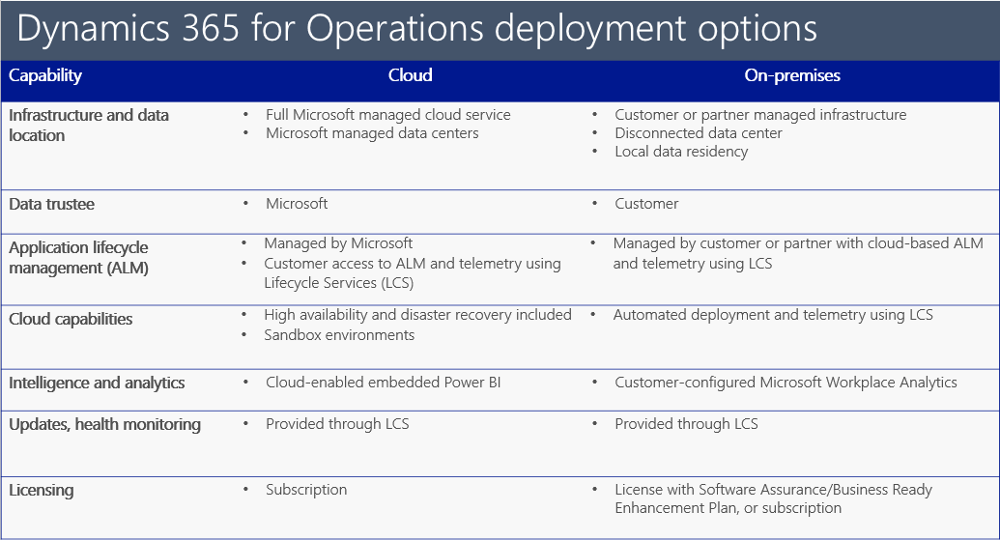

---
# required metadata

title: Choose your deployment type 
description: Microsoft Dynamics 365 for Finance and Operations, Enterprise edition now supports running business processes in the cloud or on-premises. This topic provides information about the different deployment options. 
author: kfend
manager: AnnBe
ms.date: 06/29/2017
ms.topic: article
ms.prod: 
ms.service: dynamics-ax-platform
ms.technology: 

# optional metadata

# ms.search.form: 
# ROBOTS: 
audience: Developer, IT Pro
# ms.devlang: 
# ms.reviewer: 51
ms.search.scope: AX 7.2.0, Operations
# ms.tgt_pltfrm: 
ms.custom: 60373
ms.assetid: 
ms.search.region: Global
# ms.search.industry: 
ms.author: kfend
ms.search.validFrom: 2016-02-28
ms.dyn365.ops.version: Platform Update 8

---
# Choose your deployment type
Microsoft Dynamics 365 for Finance and Operations, Enterprise edition is now available to deploy in the cloud or on-premises. 

A cloud deployment offers an ERP service that is fully managed by Microsoft. Cloud deployments also include high availability (H/A), disaster recovery (D/R), sandbox environments, and application lifecycle management combined with cloud-based systems of intelligence, infrastructure, compute, and database services in a single offering. 

On-premises deployments are deployed locally within a customer’s data center. These deployments serve as a system of record and support running an organization’s business processes locally, supporting local transactions and storage of local business data. There is no replication of that business data to the cloud, unless otherwise configured by (or on behalf of) the customer. Application lifecycle management of this scenario requires connectivity to Microsoft Dynamics Lifecycle Services (LCS) in the cloud. 

### Functionality not available in on-premises deployments 
Functions like, embedded Power BI, and Azure Machine Learning services are not available in the on-premises option. Integration to PowerBI.com is in progress. 

### Why cloud
Customers can leverage their existing data center investments and support their enterprise preferences to help meet certain regulatory compliance needs of their business, comply with data sovereignty rules in regions where there are no Azure Data Centers, or ensure business continuity in areas with limited public infrastructure. 

Customer’s business data and processes are disconnected from the cloud and are stored and run locally in the customer’s or their partner’s data center. Some connectivity is required for system management and updates enabled through Microsoft Dynamics Lifecycle Services (LCS), a cloud-based application lifecycle management service. Customer data related to configuration and application customization may be stored in the cloud. 

For those customers that do choose to run Finance and Operations in their own data center, the on-premises deployment option will have a similar UI and application functionality as the other deployment options. However, customers, or their partners, must take steps to 

configure the following capabilities in their own environments: 1) configuration of high-availability and disaster recovery solutions and 2) sand-box environments. The additional costs to deploy and manage these features could lead to higher deployment costs and a greater Total Cost of Ownership (TCO). Unlike the Cloud deployment option, Azure Machine Learning services and embedded Power BI are not included in the on-premises deployment option. The customer or their partner must also manage the infrastructure and software packages for the on-premises deployments. This includes standing up their own Windows 2016 and SQL Server 2016 environments and servicing them. Tools for deploying the Finance and Operations software and updates will be available to partners and customers via Lifecycle Services. 

