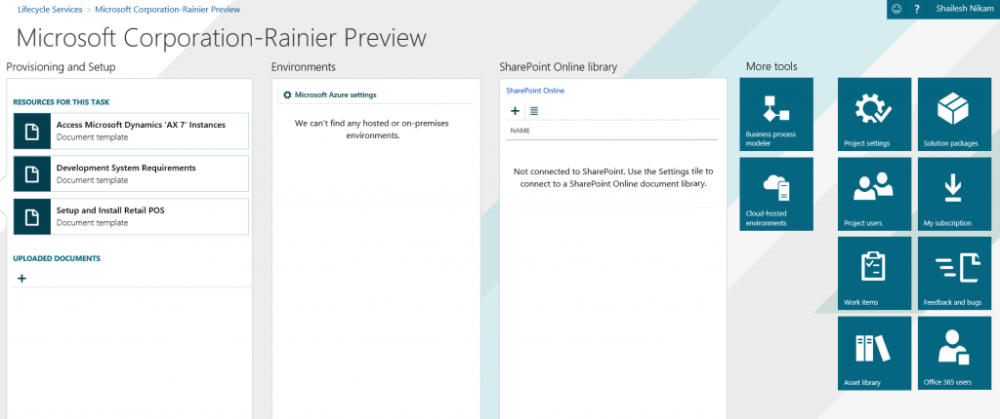

---
# required metadata

title: Create and apply a deployable package | Microsoft Docs
description: This wiki describes the workflow for creating and applying a deployable package.
author: RobinARH
manager: AnnBe
ms.date: 2015-12-11 23:50:23
ms.topic: article
ms.prod: 
ms.service: Dynamics365Operations
ms.technology: 

# optional metadata

# keywords: 
# ROBOTS: 
audience: Developer
# ms.devlang: 
ms.reviewer: 61
ms.suite: Released- Dynamics AX 7.0.0
# ms.tgt_pltfrm: 
ms.custom: 24211
ms.assetid: 85536e69-a10f-48f4-94cc-d2c300559a66
ms.region: Global
# ms.industry: 
ms.author: shailesn

---

# Create and apply a deployable package

This wiki describes the workflow for creating and applying a deployable package.

Overview of the packaging and deployment process
------------------------------------------------

The following diagram shows the workflow for creating and applying a deployable package.  **Note:** The manual steps that are described in this article will be automated as part of the servicing features that are being developed.

## Create a deployable package
After you have completed the development of the modules, follow these steps to create and upload a deployable package.

1.  In Microsoft Visual Studio, select **Dynamics 365** &gt; **Deploy** &gt; **Create Deployable Package**.
2.  Select the package that contains your model, and then select a location in which to create the deployable package.  
3.  After a deployable package is created, sign in to Microsoft Dynamics Lifecycle Services (LCS), and then, in your LCS project, click the **Asset Library** tile. 
4.  Upload the deployable package that you created earlier. 

## Apply a deployable package
For information about how to apply a deployable package in an environment, see [Installing a deployable package](https://docs.microsoft.com/en-us/dynamics365/operations/dev-itpro/deployment/installing-deployable-package-in-ax7).

