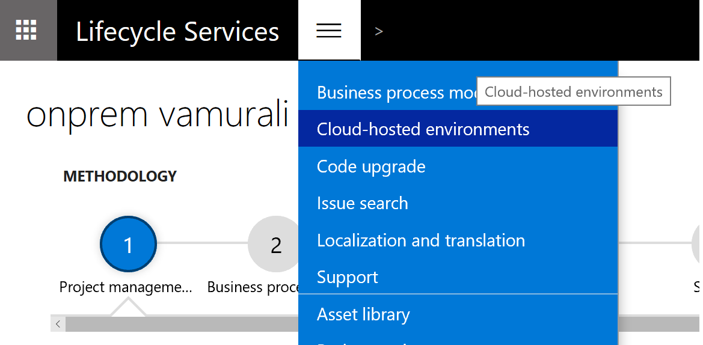
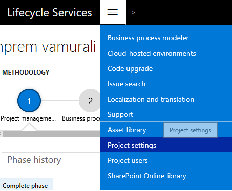
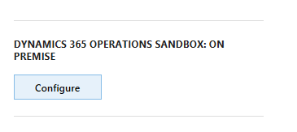
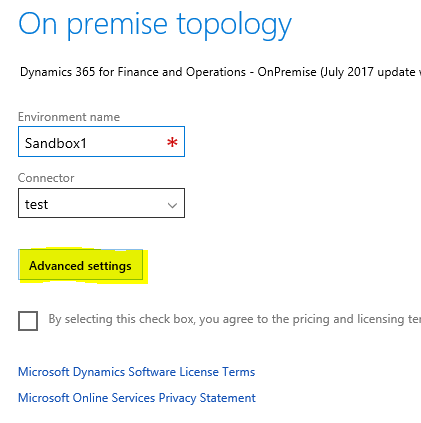

---
# required metadata

title: Develop and deploy custom models to on-premises environments
description: This topic describes the process of developing customizations and extensions, and deploying them to an on-premises environment. 
author: kfend
manager: AnnBe
ms.date: 06/09/2017
ms.topic: article
ms.prod: 
ms.service: Dynamics365Operations
ms.technology: 

# optional metadata

# ms.search.form: 
# ROBOTS: 
audience: Developer, IT Pro
# ms.devlang: 
# ms.reviewer: kfend
ms.search.scope: Operations, Platform, AX Platform
# ms.tgt_pltfrm: 
ms.custom: 107013
ms.assetid: 
ms.search.region: Global
# ms.search.industry: 
ms.author: robadawy
ms.search.validFrom: 2016-05-31
ms.dyn365.ops.version: Platform update 8

---

# Develop and deploy custom models to on-premises environments
This topic describes how to develop customizations and extensions, and deploy them to an on-premises environment. On-premises environments are also referred to as local business data (LBD) environments. This topic focuses on the ways that the development and deployment process in an on-premises environment differs from the process in a cloud environment.

The process has the following main steps:

1. Deploy your development and build environments.
2. Create a deployable package of your code and customizations.
3. Upload the deployable package to your project in Microsoft Dynamics Lifecycle Services (LCS).
4. Configure and deploy an on-premises runtime environment that includes your deployable package. This environment can be either a sandbox environment or a production environment.

The following sections provide more information about this process.

## Development tools and platform
Whether you're developing, extending, or customizing cloud applications or on-premises applications, the development platform, tools, and environments (virtual machines [VMs]) are the same. Your custom code is developed on the same development VMs, regardless of whether your target runtime environments are in a cloud environment or an on-premises environment.

For detailed information about development, see the [Developer home page](../dev-tools/developer-home-page.md). For information about extensibility and customization, see the [Extensibility home page](../extensibility/extensibility-home-page.md). For information about building, testing, and continuous delivery, see the [Continuous delivery homepage](../dev-tools/continuous-delivery-home-page.md).

## Deploy development and build environments
You can use an on-premises LCS project to deploy build and development environments on Microsoft Azure by using your own Azure subscription. Alternatively, you can download a virtual hard disk (VHD) for local development.

To deploy a development or build environment in your Azure subscription, or to download a development VHD, open the **Cloud-hosted environments** page in LCS.

Then follow these steps.
    
1. Click **Add**. 

    
  
2. Select **Azure** or **Locally**. If you select **Locally**, find and download a development VHD. If you select **Azure**, you're prompted to select one of three topologies: **Build and Test**, **Demo**, or **Development**.
3. Complete the deployment steps, and deploy a VM in your Azure subscription.

For more information about how to configure a local development VHD, see [Access instances](./dev-itpro/dev-tools/access-instances#vm-that-is-running-onpremises).

> [!NOTE]
> To deploy environments in your own Azure subscription, you must set up at least one Azure Connector. To set up an Azure Connector, in LCS, open the **Project settings** page, and then click the **Azure connectors** tab. Then follow the instructions to add an Azure Connector. To complete the steps, you must be the tenant administrator of the organization.  
> 

## Create and upload a deployable package to the LCS Asset library
When you complete a phase of development, and are ready to deploy your code to a sandbox or production on-premises environment, you must create an application deployable package from your models. This process doesn't differ from the process for cloud environments.

If you're using automated builds (a build environment), the build process creates an application deployable package for you. You can also create an application deployable package from Microsoft Visual Studio in your development environment. For more information on how to create an application deployable package in your development environment, see [Create and apply a deployable package](../deployment/create-apply-deployable-package.md).

When your deployable package is ready, follow these steps to upload it to your LCS project’s Asset library.

1. Open the **Asset library** page.

    

2. Click the **Software deployable package** tab.

    

3. Click the plus sign (**+**) to upload the deployable package. 

## Configure an on-premises runtime environment that uses your code
As of the July 2017 release of Microsoft Dynamics 365 for Finance and Operations, Enterprise edition (on-premises), you can apply your customizations and extensions only during the deployment of a sandbox or production environment.

1. In your LCS project, click **Configure** to deploy your environment.

    

2. In the deployment tool, when you must enter the environment name, click **Advanced settings**.

    

3. Click the **Customize solution assets** tab. 

    

4. In the **Select the AOT packages to be deployed** field, select the application (AOT) deployable package that contains your customizations. This field lists all the AOT packages in your Asset library.
5. Click **Done** to close the **Deployment settings** page, and then continue with the environment deployment process.
