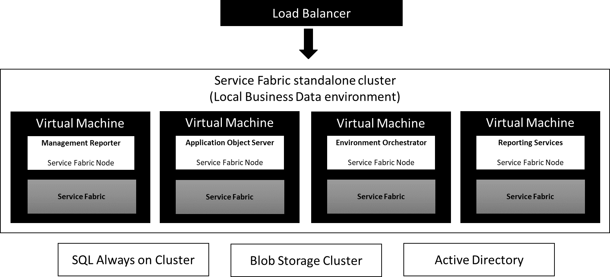
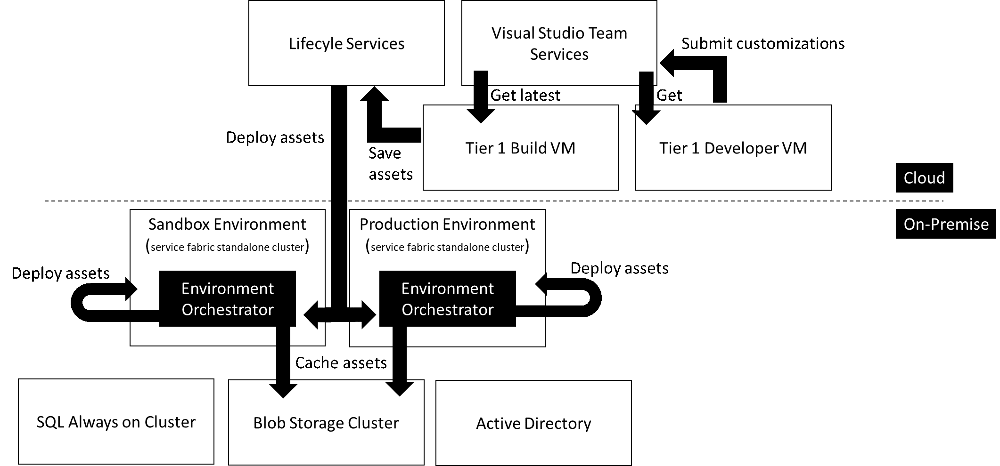

---
# required metadata

title: Dynamics 365 for Finance and Operations, Enterprise edition On Premises Overview 
description: Dynamics 365 for Finance and Operations now supports On-premises deployments to support running business processes in customer data centers with the Local Business Data (LBD) deployment option. 
author: kfend
manager: AnnBe
ms.date: 06/013/2017
ms.topic: article
ms.prod: 
ms.service: dynamics-ax-platform
ms.technology: 

# optional metadata

# ms.search.form: 
# ROBOTS: 
audience: Developer, IT Pro
# ms.devlang: 
# ms.reviewer: 51
ms.search.scope: AX 7.2.0, Operations
# ms.tgt_pltfrm: 
ms.custom: 60373
ms.assetid: 
ms.search.region: Global
# ms.search.industry: 
ms.author: arifk
ms.search.validFrom: 2016-02-28
ms.dyn365.ops.version: Platform Update 8

---
# Dynamics 365 for Finance and Operations, Enterprise edition On Premises Overview 

Dynamics 365 for Finance and Operations now supports on premises deployments to support running business processes in customer data centers with the “Local Business Data” deployment option. With this deployment option, application servers and the SQL database will run in a customer’s (or its partner’s) data center. Customers and partners will manage the application lifecycle through Lifecycle Service (LCS) in the Microsoft Cloud. LCS features such as business process modeling, software deployment and patching, and monitoring and diagnostics are available for on premises deployments. 

## Architecture 

The Local Business Data deployment option uses proven Dynamics 365 for Finance and Operations cloud components deployed on premises using an Windows Server Service Fabric standalone clusters.  Service Fabric is Microsoft’s next-generation middleware platform for building and managing enterprise-class high-scale applications. Service Fabric standalone clusters can be deployed on any computer running Windows Server. 

The Local Business Data deployment defines two types of Service Fabric standalone clusters: clusters for production environments and clusters for sandbox environments. The following services or node types are deployed into these clusters (Figure 1): 

1. Application Object Servers – Provides the ability to run the Dynamics 365 for Finance and Operations application functionality in Client, Batch and Import / Export scenarios 

2. Management Reporter – Provides financial reporting functionality 

3. SQL Server Reporting Services – Provides document reporting functionality 

4. Local Business Data Environment Orchestrator – Enables remove environment management from Lifecycle Services 

Note: Retail Server is currently not supported in Local Business Data deployments. 

Application lifecycle management scenarios for Local Business Data deployments use Lifecycle Services like the cloud service. Customers can use proven tools and methodologies to manage their on-premise deployments (Figure 2). 

## Data Storage 
The Local Business Data deployment option stores core customer data on premises. Local Business Data deployments depend on cloud services to manage the application lifecycle and support scenarios.  These services enable initial onboarding, initiation and tracking of support incidents, or service updates and upgrades.  Data supplied to supporting services is stored at rest in the United States.  See the table below for details. 

| Supporting services                   | Data at rest in the United States                                                                                                                                                                                                                                                            |
|---------------------------------------|----------------------------------------------------------------------------------------------------------------------------------------------------------------------------------------------------------------------------------------------------------------------------------------------|
| Microsoft Dynamics Lifecycle Services | Project content and files stored within a project. This includes application configuration data, code, metadata, and data assets that comprise the application, and business process models.  Anonymized user activity logs and information that is collected during the onboarding process. |
| Microsoft Office signup portal        | Customer information collected during the onboarding process                                                                                                                                                                                                                                 |
| Microsoft Azure Active Directory      | Authentication for Dynamics Lifecycle Services and Visual Studio Team Services                                                                                                                                                                                                               |
Customers can configure additional services or components, at their discretion, to extend Dynamics 365 for Operations – Local Business Data deployments. These configuration choices may cause core customer data to be transferred outside of the customer’s data center.  Examples include:  

· Data management: Configuration of data management features used to integrate external services with Dynamics 365 for Operations – Local Business Data deployments may result in the transfer of core customer data outside the on premise deployment.   
