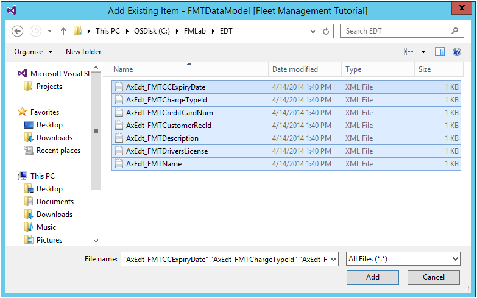

---
# required metadata

title: Create a model and data model elements
description: In this tutorial, you'll use Visual Studio's Dynamics AX menu to create a new model named Fleet Management tutorial. You'll also create and edit new model elements.
author: RobinARH
manager: AnnBe
ms.date: 04/04/2017
ms.topic: article
ms.prod: 
ms.service: Dynamics365Operations
ms.technology: 

# optional metadata

# ms.search.form: 
# ROBOTS: 
audience: Developer
# ms.devlang: 
ms.reviewer: annbe
ms.search.scope: AX 7.0.0, Operations
# ms.tgt_pltfrm: 
ms.custom: 23421
ms.assetid: 1b7789f4-12c1-480b-bb39-c354b5b03276
ms.search.region: Global
# ms.search.industry: 
ms.author: robadawy
ms.search.validFrom: 2016-02-28
ms.dyn365.ops.version: AX 7.0.0

---

# Create a model and data model elements

In this tutorial, you'll use Visual Studio's Dynamics AX menu to create a new model named Fleet Management tutorial. You'll also create and edit new model elements.

Prerequisites
-------------

This tutorial requires you to access the Dynamics AX environment using Remote Desktop, and that you be provisioned as an administrator on the Dynamics AX instance.

## Keywords
-   **Model** - You configure your model to refer to two other models. This enables your model to reference metadata and code elements that are in other packages.
-   **Project **-** **You create a **Dynamics AX** project, and you associate your project to your new model. You add elements to your project, which are also added to your model. Specifically, you add an extended data type (EDT). You also add a table that you populate with fields and a method.
-   **Designer **-**** ****Each time you add an item to your project, a designer is displayed that is tailored to the item type you choose. The **Properties** window adjusts each time a different node of the designer is highlighted. You make updates in the designers and in the **Properties** window.
-   **EDT **-**** ****Extended data type.

## Create the Fleet Management tutorial model
1.  Start Visual Studio using **Run as administrator**.
2.  From the **Dynamics AX** window, select **Model Management &gt; Create model** to open the **Create model** wizard.
3.  Enter the following values for model parameters.

    | **Property**           | **Value**                                                                                                                |
    |------------------------|--------------------------------------------------------------------------------------------------------------------------|
    | **Model name**         | FleetMgmntTutorial                                                                                                       |
    | **Model publisher**    | Microsoft Corp                                                                                                           |
    | **Layer**              | isv                                                                                                                      |
    | **Model description**  | This tutorial shows how to build the Fleet Management application by using the Microsoft Dynamics AX  development tools. |
    | **Model display name** | Fleet Management Tutorial                                                                                                |

    **Note**: Your model name must be **FleetMgmntTutorial**. Don't use any other name. In other tutorials, you'll overwrite model elements in this model by importing a project. If the model you create in this tutorial isn't named **FleetMgmntTutorial**, you may not be able to correctly import the project in other tutorials.
4.  Click **Next** to advance to the next page, and then select **Create New Package**. The model you're creating will have its own package and build its own .NET assembly. 

    

5.  Click **Next** to advance to the **Select referenced models** step.
6.  Select **Application Platform** and **Application Foundation** as referenced models.

     

    **Important**: Verify that you've selected the correct referenced models.
7.  Click **Next** to advance to the **Summary** step.
8.  Verify the information on the summary page, and then select the **Create new project** and **Make this my default model for new projects** check boxes. 

    

9.  Click **Finish**. The **New Project** dialog box opens.
10. Under **Templates**, select **Dynamics AX**.
11. Select the **Dynamics AX Project** template.
12. Enter the following values in the fields in the dialog box.

    | **Property** | **Value**       |
    |--------------|-----------------|
    | **Name**     | FMTDataModel    |
    | **Location** | C:\\FMLab       |
    | **Solution** | Add to solution |

    

13. Click **OK** to create the project.

## Create the FMTAddress extended data type
1.  In **Solution Explorer**, right-click **FMTDataModel**, point to **Add**, and then click **New Item**.
2.  Under **AX Artifacts**, select **Data Types**.
3.  Click **EDT String** to select the new item type.
4.  In the **Name** field, enter **FMTAddress**, and then click **Add**. 

     
    
    This adds a new EDT model element to the project, and opens the EDT designer for the new element, as shown in the following illustration. 
    
    

5.  Select the root node of **FMTAddress** in the designer.
6.  In the **Properties** window, in the **Appearance section**, set the following properties.

    | **Property**    | **Value**          |
    |-----------------|--------------------|
    | **Help Text**   | Check online help. |
    | **Label**       | Address            |
    | **String Size** | 75                 |

    

7.  Press **Ctrl+S** to save the EDT.

## Add existing model
Add the other required model element files to the current model and project. You can do this quickly by using the **Add existing item** feature.

1.  In the **Solution Explorer**, right-click **FMTDataModel**, point to **Add**, and then click **Existing Item**.
2.  Browse to C:\\FMLab\\EDT\\. 

    

3.  Press **Ctrl+A** to select all of the files, and then click **Add**.

## Create the FMTCustomer table
1.  In **Solution Explorer**, right-click **FMTDataModel**, and then click **Add &gt; New Item**.
2.  In the left pane, expand **Installed**, expand ****AX Artifacts**,** and then click ****Data Model**.**
3.  In the list of artifacts, select **Table**.
4.  In the **Name** field, enter **FMTCustomer**, and then click **Add**. The table designer opens. 

    

### Add fields to the FMTCustomer table

In the table designer for FMTCustomer, you now add several fields to the table. 

1.  To add each field, right-click **Fields**, click **New**, and then select a type. As you add each field, you must specify the field name and certain other values in the **Properties** window, as described in the following table.

    | **Type**   | **Field name** | **Property values**                                                         |
    |------------|----------------|-----------------------------------------------------------------------------|
    | **Date**   | CCExpiryDate   | Extended Data Type = FMTCCExpiryDate                                        |
    | **String** | Address        | Extended Data Type = FMTAddressHelp Text = Help text for the address field. |
    | **String** | CellPhone      | Extended Data Type = Phone                                                  |
    | **String** | CreditCardNum  | Extended Data Type = FMTCreditCardNum                                       |
    | **String** | DriversLicense | Extended Data Type = FMTDriversLicense                                      |
    | **String** | Email          | String Size = 80Label = Email                                               |
    | **String** | FirstName      | Extended Data Type = FirstName                                              |
    | **String** | LastName       | Extended Data Type = LastName                                               |
    | **String** | License        | String Size = 100Label = License                                            |
    | **String** | Thumbnail      | String Size = 100Label = Thumbnail                                          |

    **Tip**: For all new fields in the table that reference an EDT, you can create the field by simply dragging the EDT element from **Solution Explorer** or **Application Explorer** and dropping it on the **Fields** node of the **FMTCustomer** table in the designer. 
    
    
    
2.  Press **Ctrl+S** to save the new fields on the table.

### Add fields to field groups

1.  Prepare to add some of the fields to the **AutoSummary** field group by selecting the fields in the following list. To select multiple fields, hold down the Ctrl key while you click each field:
    -   **Address**
    -   **CCExpiryDate**
    -   **CellPhone**
    -   **CreditCardNum**
    -   **DriversLicense**
    -   **Email**
    -   **FirstName**
    -   **LastName**

2.  Expand the **Field Groups** node.
3.  Drag the selected fields to the **AutoSummary** node
4.  Use the same technique to add the fields **FirstName**, **LastName**, and **CellPhone** to the **AutoReport** field group.
5.  Save the table.

### Add a method

1.  Add the X++ method named **fullName** to the **FMTCustomer** table by right-clicking the **Methods** node, and then clicking **New Method**.
2.  In the code editor, replace the default method code with the following code. **Tip**: When you type “this.”, choose the field from the IntelliSense list.

        public display FMTName fullName()
        {
            return this.FirstName + ' ' + this.LastName;
        }

3.  Save the code.

## Update the FMTAddress EDT
1.  In **Solution Explorer**, expand the **FMTDataModel** project.
2.  Right-click **FMTAddress**, and then click **Open**. The **EDT designer** opens.
3.  In the **EDT designer**, select **FMTAddress**.
4.  In the **Properties** window, in the **Reference Table** field, select **FMTCustomer**. **Tip:** Click the drop-down list, and then type the prefix "FMT" in the search box. This filters the drop-down list to only show tables that contain "FMT" in their name. Select the **FMTCustomer** table from the list of filtered entries. 
5.  Save the EDT.

## Build the FMTDataModel project and the Fleet Management tutorial model
1.  In **Solution Explorer**, right-click **FMTDataModel**, and then click **Rebuild**.
2.  To do a full build of the entire model, on the **Dynamics AX **menu, click **Build models.**
3.  Clear the check box for all models except for **Fleet Management Tutorial**.
4.  On the **Options** tab, select the **Run Best practice checks** check box. Note that other options available.
5.  On the **Models** tab, click **Build**.
6.  Click **Close**  in the dialog box.
7.  On the **Window** menu, click **Close All Documents**, to close all open documents.

