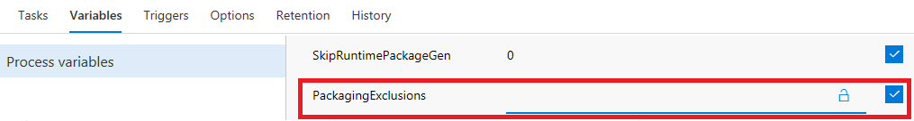
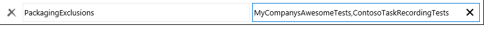
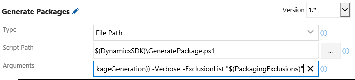

---
# required metadata

title: Exclude test packages from the build output
description: The automated build process supports excluding certain packages from being included in the deployable package in the build output.
author: jorisdg
manager: AnnBe
ms.date: 05/15/2017
ms.topic: article
ms.prod: 
ms.service: Dynamics365Operations
ms.technology: 

# optional metadata

# ms.search.form: 
# ROBOTS: 
audience: Developer
# ms.devlang: 
ms.reviewer: robinr
ms.search.scope: AX 7.0.0, Operations
# ms.tgt_pltfrm: 
ms.custom: 26731
ms.assetid:
ms.search.region: Global
# ms.search.industry: 
ms.author: jorisde
ms.search.validFrom: 2017-02-28
ms.dyn365.ops.version: AX 7.0.0

---

# Exclude test packages from the build output

With the release of Platform Update 4, the automated build process supports excluding certain packages from being included in the deployable package in the build output. This can be important for customers using automated testing who wish to build and execute their tests, but exclude them from being added in the build's deployable package output.

Customers with an existing build definition from Platform Update 3 or prior who are upgrading will not automatically see their build definitions updated, and will have to perform a few manual edits to the build definition if they wish to use this new capability. See [Update an existing build definition after upgrading to Platform Update 4 or newer](#update-an-existing-build-definition-after-upgrading-to-platform-update-4-or-newer) for instructions on how to add this capability to an existing build definition.

The new feature exposes a new optional parameter to the package creation step in the build process. The parameter is managed by a build variable so it can be adjusted easily.

1. In Visual Studio Team Services (VSTS), open the **Build & Release** page. Under **Builds** and **All Definitions** find your build definition. Click on the ellipsis (…) and select **Edit**.

    

1. Under the **Variables** tab, the new build definition has a variable named **PackagingExclusions**.

    

To use this new feature, specify a comma separated list of the names of packages you wish to exclude from packaging into the deployable package. For example, if you have a package named "MyCompanysAwesomeTests" as well as a package named "ContosoTaskRecordingTests" the value for your exclusion variable should look as follows:

Note that the name of the package is not necessarily the name of the model, but typically is the name of the folder it resides in. Alternatively, you can copy/paste the package name from one of its models' descriptor files (found in the **ModelModule** field in the XML).

Once set, the build process will still build the code and still execute any tests contained in those packages. However, the deployable package created by the build will not include these packages.

# Update an existing build definition after upgrading to Platform Update 4 or newer
Any existing build definitions deployed before Platform Update 4 will need to be manually updated to use this new feature.

> [!NOTE]
> This feature can only be added to a build definition after updating the build VM to Platform Update 4 or later.

1. Under the **Variables** tab, click **+ Add** at the bottom of the page. Enter "PackagingExclusions" in the name column, and check the **Settable at queue time** checkbox in the last column.
2. Open the **Tasks** tab. Find the **Generate Packages** step and select it by clicking on it. On the right side of the page, find the **Arguments** parameter. Click in the textbox and hit the 'End' key or scroll all the way over to the end of the textbox. The new build definition will have a new argument that passes the previously defined variable. On an existing build definition, add a space and the following text to the end of the parameter: *-ExclusionList "$(PackagingExclusions)"*

Your **Arguments** textbox should now look like this:

    

3. Click the **Save** button.
4. You can now use the feature as described.
