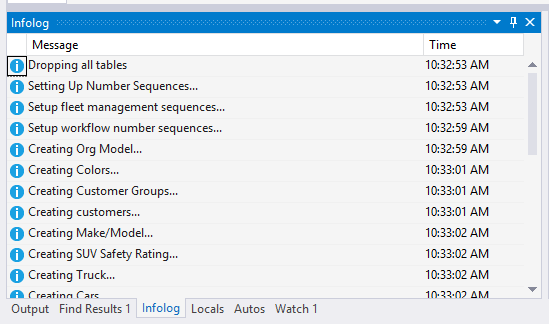

---
# required metadata

title: X++ and debugger features
description: This tutorial is for developers to use advanced constructs of the X++ language and take advantage of productive debugger features. This is a walkthrough of the new features with exercises included to practice using these features. 
author: pvillads
manager: AnnBe
ms.date: 04/04/2017
ms.topic: article
ms.prod: 
ms.service: dynamics-ax-platform
ms.technology: 

# optional metadata

# ms.search.form: 
# ROBOTS: 
audience: Developer
# ms.devlang: 
# ms.reviewer: 2051
ms.search.scope: AX 7.0.0, Operations
# ms.tgt_pltfrm: 
ms.custom: 26801
ms.assetid: 27c65e79-df74-4249-b684-97e1d40da753
ms.search.region: Global
# ms.search.industry: 
ms.author: pvillads
ms.search.validFrom: 2016-02-28
ms.dyn365.ops.version: AX 7.0.0

---

# X++ and debugger features

[!include[banner](../includes/banner.md)]

This tutorial is for developers to use advanced constructs of the X++ language and take advantage of productive debugger features. This is a walkthrough of the new features with exercises included to practice using these features. 

In previous versions, the X++ code was compiled into pseudo-code, or p-code, that was interpreted on the server or on the client application. This code was then subject to further compilation into CIL. Today the story is much simpler--only CIL is supported, and this code is generated from a new compiler. In this tutorial, we’ll be discussing some of the new features that have been added to the X++ language. As we run through the scenarios, you’ll also see some of the new features in the debugger.

## Declare anywhere
Previously, all local variables had to be placed at the start of the method in which they’re used. Now, you have fine-grained control over the scope of your variables. With this new feature, it’s possible to provide smaller scopes for variables, outside of which the variables can’t be referenced. The lifetime of the variable is the scope in which it’s declared. Scopes can be started at the block level (inside compound statements), in for statements, and in using statements as we will see below. There are several advantages to making scopes small.

-   Readability is enhanced.
-   You can reduce the risk of reusing a variable inappropriately during long-term maintenance of the code.
-   Refactoring becomes much easier. You can copy code in without having to worry about variables being reused in contexts they shouldn’t.

### Example

In this example, we declare the loop counter inside the 'for' statement in which it's used.

      void MyMethod()
      {
        for (int i = 0; i < 10; i++)
        {
          info(strfmt("i is %1", i));
        }
      }

The scope of the variable is the for statement itself, including the condition expression and the loop update parts. The value can’t be used outside this scope. If you attempt to do that, you will get the following.

      void MyMethod()
      {
        for (int i = 0; i < 10; i++)
        {
          if (i == 7)
          {
            break;
          }
        }
        info(strfmt("Found: %1", i));
      }

The compiler will issue an error message in the info call: 'i' is not declared.

### Example

There's another place where scopes can be established: the using statement, which is another newcomer to the X++ language.

      static void AnotherMethod()
      {
        str textFromFile;

        using (System.IO.StreamReader sr = new System.IO.StreamReader("c:\\test.txt"))
        {
          textFromFile = sr.ReadToEnd();
        }
      }

As a rule, when you use an IDisposable object, you should declare and instantiate it in a using statement. The using statement calls the Dispose method on the object in the correct way, even if an exception occurs while you are calling methods on the object. You can achieve the same result by putting the object inside a try block, and then explicitly calling Dispose in a finally block; in fact, this is how the using statement is translated by the compiler. Declarations can now be provided anywhere statements can be provided-- a declaration is syntactically a statement, a declaration statement. You can, therefore, provide declarations immediately prior to the usage. You don’t have to declare the variables all in one place.

### Example

The following sample shows some of the features described above.

      // loop variable declared within the loop: It will
      // not be misused outside the loop
      for(int i = 1; i < 10; i++)
      {
      // Because this value is not used from outside the loop,
      // its declaration belongs in this smaller scope.
        str s = int2str(i);
        info(s);
      }

To avoid confusion, the X++ compiler will issue an error if you attempt to introduce a variable that would hide another variable in an enclosing scope or even in the same scope. For instance, the following code will cause the compiler to issue the following diagnostic message: A local variable named 'i' cannot be declared in this scope because it would give a different meaning to 'i', which is already used in a parent or current scope to denote something else.

      {
        int i;
        {
          int i;
        }
      }

This aligns well with the rules that are known from C\#, but is different from the rule in C++ where shadowing is not diagnosed.

### Exercise

Adapt the code in FMVehicleInventoryServiceClass to use smaller scopes.

## Static constructors and static fields
Static constructors and static fields are new features in the X++ language. Static constructors are guaranteed to run before any static or instance calls are made to the class. In C\#, the concept of static relates to the whole executing application domain. The execution of the static constructor is relative to the user’s session. The static constructor has the following profile.

    static void TypeNew() 

You’ll never call the static constructor explicitly; the compiler will generate code to ensure that the constructor is called exactly once prior to any other method on the class. A static constructor is used to initialize any static data, or to perform a particular action that needs to be performed only once. No parameters can be provided for the static constructor, and it must be marked as static. Static fields are fields that are declared using the static keyword. Conceptually they apply to the class, not instances of the class.

### Example

We'll show how a singleton, called instance in the example below, can be created by using the static constructor.

    public class Singleton
    {
      private static Singleton instance;

      private void new()
      {
      }

      static void TypeNew()
      {
        instance = new Singleton();
      }

      public static Singleton Instance()
      {
        return Singleton::instance;
      }
    }

The singleton will guarantee that only one instance of the class will ever be called, which is consumed by the following.

    {
        …
        Singleton i = Singleton::Instance();
      }

## Assignment of field members inline
It's now possible to assign a value to a field inline, i.e. along with the declaration of the field itself. This applies to both static and instance fields. In the following code, the values of field1 and field2 are defined in this fashion.

    public class MyClass2
    {
      int field1 = 1;
      str field2 = "Banana";

      void new()
      {
        // …
      }
    }

The code above has the same semantic meaning as: public class MyClass2 { int field1; str field2; void new() { this.field1 = 1; this.field2 = "Banana"; // … } } The inline assignments work for both static and instance members.

## Consts/Readonly
The concept of macros continues to be fully supported in X++. However, using constants instead of \#defines has a number of benefits.

-   You can add a documentation comment to the const, not to the value of the macro. Ultimately, the language service will pick this up and provide good information to the user.
-   The const is known by IntelliSense.
-   The const is cross referenced, so you can find all references of a particular constant. This is not the case for a macro.
-   The const is subject to access modifiers, either private, protected, or public. The accessibility of macros is not well understood or even rigorously defined.
-   Consts have scope, while macros do not.
-   You can see the value of consts and readonly variables in the debugger.

Macros that are defined in class scopes (in class declarations) are effectively available in all methods of all derived classes. This was originally a bug in the legacy compiler macro implementation, but this loophole is now massively exploited by application programmers. The new X++ compiler still honors this, but no new code that uses this should be written. This particular feature also considerably impacts compiler performance. Constants can be declared at the class level as suggested below.

    private const str MyContant = 'SomeValue';

The constants can then be referenced by using the double-colon syntax.

      str value = MyClass::MyContant;

If you're in the scope of the class where the const is defined, you can omit the type name prefix (MyClass in the example above). You can easily implement the concept of a macro library this way. The list of macro symbols becomes a class with public const definitions.

### Exercise

The fleet application contains the FMDataHelper class that contains the following macro defintions.

    public class FMDataHelper
    {
      #define.FMSvcTechUserId('FMSvcTec')
      #define.FMClerkUserId('FMClerk')
      #define.FMManagerUserId('FMMgr')
      #define.FMSvcTechUserGrpId('FMSvcTech')
      #define.FMClerkUserGrpId('FMClerk')
      #define.FMManagerUserGrpId('FMManager')
    …
    }

Change these to const definitions and update the places where the macros are used accordingly.

You can also define consts solely as variables. The compiler will maintain the invariant that the value can't be modified.

    {
      const int Blue = 0x0000FF;
      const int Green = 0x00FF00;
      const int Red = 0xFF0000;
    }

Read-only fields can only be assigned a value once, and that value never changes; the field can be assigned its value either inline, at the place where the field is declared, or in the constructor. Currently, that's the only difference between const and read-only.

Var
---

You can now declare a variable without explicitly providing the type of the variable, if the compiler can determine the type from the initialization expression. Note that the variable is still strongly-typed into one, unambiguous type. It's only possible to use var on declarations where an initialization expressions are provided (from which the compiler will infer the type). There are situations where this can make code easier to read, but this feature shouldn't be misused. You should consider the following rules:

-   Use var to declare local variables when the type of the variable is obvious from the right side of the assignment, or when the precise type is not important.

         
        // When the type of a variable is clear from the context, use var 
        // in the declaration. 
        var var1 = "This is clearly a string.";
        var var2 = 27; // This is an integer (not a real).
        var i = System.Convert::ToInt32(3.4);

-   Don't use var when the type isn't apparent from the initialization expression.

        // When the type of a variable is not clear from the context, use an 
        // explicit type. 
            int var4 = myObject.ResultSoFar();

-   Use var for the declarations of for loop counters.
-   Use var for disposable objects inside using statements.

## Private and protected member variables
Previously, all member variables defined in a class were invariably protected. It's now possible to make the visibility of member variables explicit by adding the private, protected, and public keywords. The interpretation of these modifiers is obvious and aligns with the semantics for methods:

-   A private member can only be used within the class where it's defined.
-   a protected member can be used in the class where it's defined, and all subclasses thereof.
-   A public member can be used anywhere: it's visible outside the confines of the class hierarchy in which it's defined.

The default for member variables that aren't adorned with an explicit modifier is still protected. You should make it a habit of explicitly specifying the visibility. As described, when a member variable is defined as public, it may be consumed outside of the class in which it's defined. In this case, a qualifier designating the object hosting the variable has to be specified, using the dot notation (as is the case for method calls). Reusing the code from above:

    public class MyClass2
    {
      int field1;
      str field2;

      void new()
      {
        this.field1 = 1;   // Explicit object designated
        field2 = "Banana";  // 'this' assumed, as usual
      }
    }

In this case, field1 is accessed using the explicit 'this.' qualifier. **Note**: Making a member variable public may not be a good idea since it exposes the internal workings of the class to its consumers, creating a strong dependency between the class implementation and its consumers. You should always strive to only depend on a contract, not an implementation.

## Finally in try/catch statements
Try/catch statements can now include an optional finally clause. The semantics are the same as they are in C\# and other managed languages. The statements in the finally clause are executed when control leaves the try block, either normally or through an exception.

      try
      {
        // ...
      }
      catch
      {
        // Executes when any exception is thrown in the dynamic
        // scope in the try block.
      }
      finally
      {
        // Executed irrespective of how the try block exits.
      }

## Event handlers and Pre/Post methods
In legacy X++, it was possible to prescribe in metadata that certain methods were to be executed prior to and after the execution of a method. The information about what subscribes call was recorded on the publisher, which isn't useful in the environment. It's now possible to provide Pre and Post handlers through code, by providing the SubscribesTo attribute on the subscribers.

### Example

    [PreHandlerFor(classStr(MyClass2), methodstr(MyClass2, publisher))]
      public static void PreHandler(XppPrePostArgs arguments)
      {
        int arg = arguments.getArg("i");
      }

      [PostHandlerFor(classStr(MyClass2), methodstr(MyClass2, publisher))]
      public static void PostHandler(XppPrePostArgs arguments)
      {
        int arg = arguments.getArg("i");
        int retvalFromMethod = arguments.getReturnValue();
      }

      public int Publisher(int i)
      {
        return 1;
      }

This example shows a publishing method called Publisher. Two subscribers are enlisted with the PreHandlerFor and PostHandlerFor. The code shows how to access the variables, and the return values. **Note**: This feature is provided for backward compatibility and, because the application code doesn't have many delegates, to publish important application events. Pre and Post handlers can easily break as the result of added or removed parameters, changed parameter types, or because methods are no longer called, or called under different circumstances. Attributes are also used for binding event handlers to delegates:

      [SubscribesTo(
        classstr(FMRentalCheckoutProcessor),  
        delegatestr(FMRentalCheckoutProcessor, RentalTransactionAboutTobeFinalizedEvent))]
      public static void RentalFinalizedEventHandler(
        FMRental rentalrecord, Struct rentalConfirmation)
      {
      }

      delegate void RentalTransactionAboutTobeFinalizedEvent(
        FMRental fmrentalrecord, struct RentalConfirmation)
      {
      }

In this case, the SubscribesTo attribute specifies that the method RentalFinalizedEventHandler should be called when the FmRentalCheckoutProcessor.RentalTransactionAboutToBeFinalizedEvent delegate is called. Since the binding between the publisher and subscribers is done through attributes, there's no way of specifying the sequence in which subscribers are called.

## Extension methods
The extension method feature lets you add extension methods to a target class by writing the methods in a separate extension class. The following rules apply:

-   The extension class must be static.
-   The name of the extension class must end with the ten-character suffix \_Extension. However, there's no restriction on the part of the name that precedes the suffix.
-   Every extension method in the extension class must be declared as public static.
-   The first parameter in every extension method is the type that the extension method extends. However, when the extension method is called, the caller must not pass in anything for the first parameter. Instead, the system automatically passes in the required object for the first parameter.

It's perfectly valid to have private or protected static methods in an extension class. These are typically used for implementation details and are not exposed as extensions. The example below illustrates an extension class holding a few extension methods:

    public static class AtlInventLocation_Extension
    {
      public static InventLocation refillEnabled(
        InventLocation _warehouse, 
        boolean _isRefillEnabled = true)
      {
        _warehouse.ReqRefill = _isRefillEnabled;
        return _warehouse;
      }

      public static InventLocation save(InventLocation _warehouse)
      {
        _warehouse.write();
        return _warehouse;
      }
    }

### Why use extension methods?

The extension method technique doesn't affect the source code of the class it extends. Therefore, the addition to the class can be done without over-layering. Upgrades to the target class are never affected by any existing extension methods. However, if an upgrade to the target class adds a method that has the same name as your extension method, your extension method becomes unreachable through objects of the target class. Extension methods are easy to use. The extension method technique uses the same dot-delimited syntax that you routinely use the call regular instance methods. Extension methods can access all public artifacts of the target class, but they can't access things that are protected or private. In this way, extension methods can be seen as a kind of syntactic sugar.

### Where can extension methods be applied?

The target of an extension method must be one of the following application object types:

-   Class
-   Table
-   View
-   Map

Regardless of the target type, an extension *class* is used to add extension methods to the type. For example, an extension table is *not* used to add methods to a table, and there's no such thing as an extension table.

## Using clauses
Previously, all references to managed artifacts that weren't authored in X++ was done using fully qualified names, including the namespace for each type. This is still possible, but you can now provide using clauses to make the use of such artifacts less onerous. As opposed to a using statement, each using clause precedes the class in which the clause is applied. It's also possible to provide aliases that introduce a short name for a fully qualified name. Aliases can denote namespaces and classes as shown below.

### Example

Consider the following code:

     using System;
    using IONS=System.IO; // Namespace alias
    using Alist=System.Collections.ArrayList; // Class alias

    public class MyClass2
    {
      public static void Main(Args a)
      {
        Int32 I; // Alternative to System.Int32
        Alist al; // Using a class alias

        al = new Alist();
        str s;

        al.Add(1);

        s = IONS.Path::ChangeExtension(@"c:\tmp\test.xml", ".txt");
      }
    }

## Differences between legacy X++ and new X++
In this section, we'll see some of the differences between legacy X++ and the new X++.

### Reals are Decimals

The type used to represent real values has changed from interpreted X++. This won't require you to rewrite any code, because the new type can express all of the values that the old one could. We provide this material in the interest of full disclosure only. All instances of the real type are now implemented as instances of the .NET decimal type (System.Decimal). Just as the real type in previous versions, the decimal type in a binary coded decimal type that, unlike floating point type, is resilient to rounding errors. The range and resolution of the decimal type are different from the original types. The original X++ real type supported 16 digits and an exponent that defined where the decimal point is placed. The new X++ real type can represent decimal numbers ranging from positive 79,228,162,514,264,337,593,543,950,335 (2⁹⁶-1) to negative 79,228,162,514,264,337,593,543,950,335 (-(2⁹⁶-1)). The new real type doesn't eliminate the need for rounding. For example, the following code produces a result of 0.9999999999999999999999999999 instead of 1. This is readily seen when using the debugger to show the value of the variables below.

    public class MyClass2
    {
      public static void Main(Args a)
      {
        real dividend = 1.0;
        real divisor = 3.0;
        str stringvalue;
        System.Decimal valueAsDecimal;

        real value = dividend/divisor * divisor;

        valueAsDecimal = value;
        info(valueAsDecimal.ToString("G28"));

      }
    }

No number of decimals will suffice to represent the value of 1/3 accurately. The discrepancy obtained here is due to the fact that only a finite number of decimals are provided. You should use the Round function to round to the number of decimals required.

      value = round(value, 2);

## Internal representation
A decimal number is a floating-point value that consists of a sign, a numeric value where each digit in the value ranges from 0 to 9, and a scaling factor that indicates the position of a floating decimal point that separates the integral and fractional parts of the numeric value. The binary representation of a real value consists of a 1-bit sign, a 96-bit integer number, and a scaling factor used to divide the 96-bit integer and specify what portion of it is a decimal fraction. The scaling factor is implicitly the number 10, raised to an exponent ranging from 0 to 28. Therefore, the binary representation of a decimal value represents ((-2⁹⁶ to 2⁹⁶)/10(0\\ to\\ 28)), where -(2⁹⁶-1) is equal to the minimum value and 2⁹⁶-1 is equal to the maximum value that can be expressed.

## String truncation
String truncation is not a new feature. However, when code is executed in IL in previous versions, the automatic string truncation described here doesn’t take place. String values can be declared in X++ to contain a maximum number of characters. Typically, this is achieved by encoding this information in an extended data type, as shown below: Credit card numbers cannot exceed 20 characters.  It's also possible to specify length constraints directly in the X++ syntax:

    str 20 creditCardNumber;

All assignments to these values are implicitly truncated to this maximum length.

### Exercise

Run the following code in the debugger by including it in a static main method:

    creditCardNumber = "12345678901234567890Excess string";

## Casting
The previous version of X++ was very permissive in its treatment of type casting. Both up-casting and down-casting were allowed without intervention from the programmer. Some of the casting permitted in legacy X++ can’t be implemented in the confines of the .NET runtime environment. In object oriented programming languages, including X++, casting refers to assignments between variables whose declared types are both in the same inheritance chain. A cast is either a down-cast or an up-cast. To set the stage for this discussion, we introduce a few self-explanatory class hierarchies:  As you can see, the MotorVehicle class isn't related to the Animal cast. An **up-cast** happens when assigning an expression of a derived type to a base type:

      Animal a = new Horse();

A **down-cast** happens when assigning an expression of a base type to a derived variable.

    Horse h = new Animal();

Both up-casts and down-casts are supported in X++. However, down-casts are dangerous and should be avoided whenever possible. The example above will fail with an InvalidCastException at runtime, since the assignment doesn't make sense. X++ supports late binding on a handful of types, like object and formrun. This means that the compiler won't diagnose any errors at compile-time when it sees a method being called on those types, if that method isn't declared explicitly on the type,. It's assumed that the developer knows what they're doing. For instance, the following code may be found in a form.

    Object o = element.args().caller();
      o.MyMethod(3.14, “Banana”);

The compiler can't check the parameters, return values, etc. for the MyMethod method, since this method isn't declared on the object class. At runtime, the call will be made using reflection, which is orders of magnitude slower than normal calls. note that calls to methods that are actually defined on the late binding types will be naturally checked. For example, the call to ToString():

    o.ToString(45);

will cause a compilation error:

    'Object.toString' expects 0 argument(s), but 1 specified.

because the ToString method is defined on the object class. There's one difference from the implementation of previous version of X++, related to the fact that methods could be called on unrelated objects, as long as the name of the method was correct, even if the parameter profiles weren't entirely correct. This isn't supported in CIL.

### Example

    public class MyClass2
    {
      public static void Main(Args a)
      {
        Object obj = new Car();
        Horse horse = obj; // exception now thrown
        horse.run();    // Used to call car.run()!
      }
    }

You should use the IS and AS operators liberally in your code. The IS operator can be used if the expression provided is of a particular type (including derived types); the AS operator will perform casting into the given type and return null if a cast isn't possible.

## Compiler diagnoses attempts to store objects in containers
In previous incarnations of the X++ compiler, it was possible to store object references into containers, even though this would fail at runtime. This is no longer possible. When the compiler sees an attempt to store an object reference into a container:

    container c = [new Query()];

It will issue the error message:

    Instances of type 'Query' cannot be added to a container.

If the type of the element that is added to the container is anytype the compiler can't make the determination of whether or not the value is a reference type. The compiler will allow this under the assumption that the user knows what they're doing. The compiler won't diagnose the following code as erroneous:

    anytype a = new Query();
            container c = [a];

but an error will be thrown at runtime.

## Cross company clause can contain arbitrary expressions
The crosscompany clause can be used on select statements to indicate the companies that the search statement should take into account. The syntax hasn't been enhanced to allow arbitrary expressions (of type container) instead of a single identifier, which is a variable of type container.

      private void SampleMethod()
      {
        MyTable t;
        container mycompanies = ['dat', 'dmo'];
        select crosscompany: mycompanies t;
      }

Now, it's possible to provide the expression without having to use a variable for this purpose.

      private void SampleMethod()
      {
        MyTable t;
        container mycompanies = ['dat', 'dmo'];
        select crosscompany: (['dat'] + ['dmo']) t;
      }

## The mkDate predefined function no longer accepts shorthand values
In legacy systems, it was possible to use "shorthand" values for the year argument of the mkDate function. The effect can be seen in the following code sample.

    static void Job16(Args _args)
    {
      int y;
      date d;
      
      for (y = 0; y < 150; y++)
      {
        d = mkDate(1,1,y);  
        info(strFmt("%1 - %2", y, year(d)));
      }
    }

Running this code in the legacy system will produce the following values: 0 – 2000 1 – 2001 2 – 2002 … 27 – 2027 28 – 2028 29 – 2029 **30 – 2030** **31 – 1931** 32 – 1932 33 – 1933 … 97 – 1997 98 – 1998 **99 – 1999** **100 – 1900** We no longer support these values. Attempts to use such values will cause the mkDate function to return the null date (1/1/1900).

## Obsolete statement types
The following statements are no longer supported.

### Pause and Window statements

The X++ pause statement is no longer supported because the pop-up **Print Window** that it affected has been removed. the pause and window statement were mainly used for debugging within the MorphX development environment, which was the same as the execution environment. Since the two are now separated, with Visual Studio taking the place of the MorphX environment, these statements are no longer relevant.

### Print statement

The X++ print statement is another statement that existed only for debugging purposes. It still exists, and its basic idea is unchanged. But print now outputs through System.Diagnostics.WriteLine. The product configuration determines the detail of the written information is sent.  You may find that using the Infolog is more compelling, since its output appears in the debugger and the running form.

## The Ignore list
Since the legacy environment was all interpreted, it was possible to have some parts not compile, and use the rest. As long as you only called methods that compiled correctly, you were fine; however, you would run into trouble if you tried to call methods that weren't successfully compiled. This way of working doesn't work in CIL. Assemblies are generated from successful compilations and the runtime system can't load incomplete assembles. However, there are legitimate scenarios when porting legacy applications into the new environment where it's beneficial to get things running in a staged fashion and where parts of the application need to be tested before everything is ported. While this is useful for this very limited scenario, it shouldn't be used once the application is ready for production, since you would be hiding problems that will occur at runtime, after the system has been deployed. This is how it currently works: You can specify a method in an XML by selecting, "Edit Best Practice Suppressions," from the context menu on the project. This will open an XML document where the exclusions are maintained.

## New Debugger features
This section provides information about the new features that we've added to the debugging experience in Visual Studio.

### Adding ToString methods to your classes

It's often a benefit to add ToString() methods to your classes. The effort spent doing this comes back many times and it's easy to do. This advice also holds true for legacy X++. **Note**: Since ToString methods can be called at unpredictable times, it isn't a good idea to change the state of the object here.

### Identifying unselected fields

It's a common source of bugs to use fields from a table when these fields don't appear in the field list in a select statement. Such fields will have a default value according to their type. It's now possible in the debugger to see if a value has been selected or not.

#### Exercise

Consider the following code:

    class MyClass
    {
      public static void Main(Args a)
      {
        FMRental rental;

        select EndMileage, RentalId from rental;

        rental.Comments = "Something";
      }
    }

Set a breakpoint on the assignment statement. Make your class the startup object in your project, and start by pressing F5. When the breakpoint is encountered, view the rental variable by expanding it in the locals window. You'll see something similar to the following graphic.  You can see that the fields that have been selected (EndMileage and RentalId) appear with their selected values, while the unselected fields appear as null. This signifies their value wasn't fetched from the database. Obviously, this is a debugging artifact. The values of the unselected fields will be the default value for the type of the field. Step over this and notice how the debugger changes the rendering to the actual value. **Note**: If the table is set to Cache, the system will always fetch all fields from the entire table, irrespective of the field list provided in the code.

### The Auto and Infolog Windows

The debugger will allow you to easily access certain parts of the state of the application easily. This information is available in the autos window, where the current company, the partition, the transaction level, and the current user id are listed.  There is also a window showing the data that is written to the Infolog. 

### New breakpoint features

The Visual Studio debugger supports conditional breakpoints and breakpoints that are triggered by hit count. You can also have the system perform specific actions for you as you hit the breakpoint. None of these features were available in the legacy debugger. These are explained below:

-   Hit count enables you to determine how many times the breakpoint is hit before the debugger breaks execution. By default, the debugger breaks execution every time that the breakpoint is hit. You can set a hit count to tell the debugger to break every 2 times the breakpoint is hit, or every 10 times, or every 512 times, or any other number you choose. Hit counts can be useful because some bugs don't appear the first time your program executes a loop, calls a function, or accesses a variable. Sometimes, the bug might not appear until the 100th or the 1000th iteration. To debug such a problem, you can set a breakpoint with a hit count of 100 or 1000.
-   Condition is an expression that determines whether the breakpoint is hit or skipped. When the debugger reaches the breakpoint, it'll evaluate the condition. The breakpoint will be hit only if the condition is satisfied. You can use a condition with a location breakpoint to stop at a specified location only when a certain condition is true. For example, suppose you're debugging a banking program where the account balance is never allowed to go below zero. You might set breakpoints at certain locations in the code and attach a condition such as balance &lt; 0 to each one. When you run the program, execution will break at those locations only when the balance is less than zero. You can examine variables and program state at the first breakpoint location, and then continue execution to the second breakpoint location, and so on.
-   Action specifies something that should occur when the breakpoint is hit. By default, the debugger breaks execution, but you can choose to print a message or run a Visual Studio macro instead. If you decide to print a message instead of breaking, the breakpoint has an effect very similar to a Trace statement. This method of using breakpoints is called tracepoints

#### Exercise

Consider the following code:

    class PVsClass
    {
      public static void Main(Args a)
      {
        int i;
        for (i = 0; i < 10; i++)
        {
          print i;
        }
      }
    }

Put a breakpoint on the print statements by pressing F9 while that statement is selected. This will create a normal, unconditional breakpoint. Now, use the mouse to open the context menu for the breakpoint and select **Condition**. Put in a condition that indicates that the breakpoint should happen when the value of the 'i' variable exceeds 5. Set the class as a startup project, and the class containing the code as the startup item in the project. Run the code. Feel free to modify the value of 'i' using the debugger. Now, remove this breakpoint, and use the Hit count feature to accomplish the same thing. **Note**: A breakpoint can have several conditions. It's often helpful to hover the cursor over the breakpoint, causing an informative tooltip to appear. Tracepoints are often useful tot race execution. Insert a tracepoint on the line in question and log the value of the variable. The trace output will appear in the output window in the debugger.

### The immediate window

The immediate window is a useful feature in the VS debugger that allows the user to enter expression and statements to evaluate at any given time. This feature isn't currently implemented in the X++ stack, as is the case for many other languages, notably F\#. However, that doesn't mean that the savvy user can't benefit from the immediate window. It just means that snippets must be expressed in C\#, not in X++. There's a separate document that describes the details of how this can be done to great effect.

