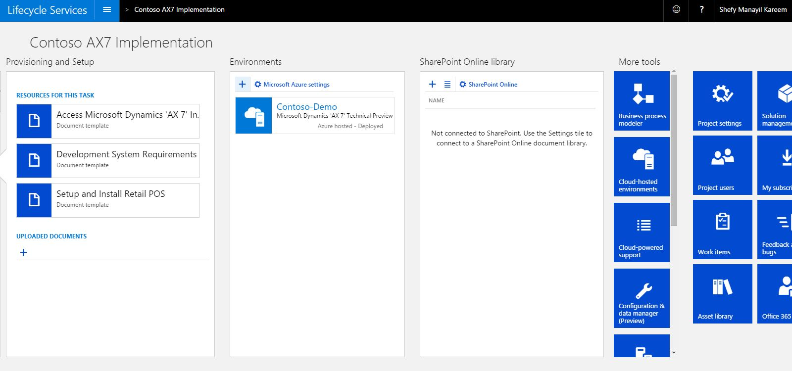
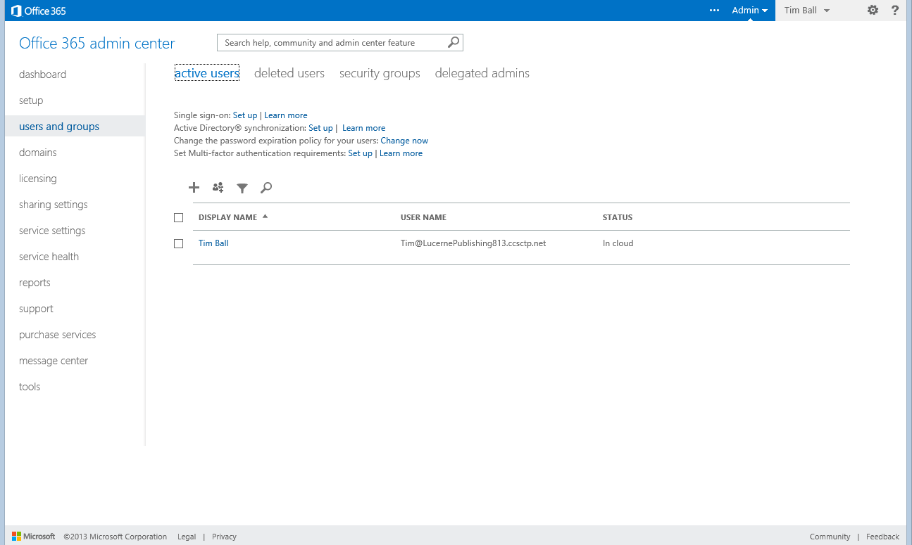

---
# required metadata

title: Sign up for a subscription
description: In this tutorial, you will learn how to subscribe to the preview/partner offer and deploy an environment.
author: RobinARH
manager: AnnBe
ms.date: 2015-12-02 01 - 03 - 11
ms.topic: article
ms.prod: 
ms.service: Dynamics365Operations
ms.technology: 

# optional metadata

# ms.search.form: 
# ROBOTS: 
audience: Developer, IT Pro
# ms.devlang: 
# ms.reviewer: 61
ms.search.scope: AX 7.0.0, Operations
# ms.tgt_pltfrm: 
ms.custom: 13211
ms.assetid: 96e019e1-1809-496c-88c0-8846f2513ff4
ms.search.region: Global
# ms.search.industry: 
ms.author: robadawy
ms.dyn365.intro: Feb-16
ms.dyn365.version: AX 7.0.0

---

# Sign up for a subscription

In this tutorial, you will learn how to subscribe to the preview/partner offer and deploy an environment.

Introduction
------------

In this tutorial, you will learn how create a subscription. This subscription will give you a Microsoft Online test tenant and a Microsoft Dynamics Lifecycle Services project where you can deploy an environment. You will also set up additional users in your Microsoft Online tenant and gain experience with the following service administration capabilities. Here are the skills that you will learn:

-   Subscribing and creating a new Microsoft Online test tenant
-   Navigating to Lifecycle Services projects
-   Using features on Lifecycle Services
-   Adding additional users to Microsoft Azure Active Directory and the client
-   Viewing resources in your subscription email

## Key terms
-   **Microsoft Online Services tenant** – A tenant is the group of all subscriptions and users for your organization. The tenant is created at the same time as your first subscription in Microsoft Online Services.
-   **Subscription** – A subscription provides you with an online environment. This environment lets you experience Dynamics 365 for Operations in the cloud and also lets you see how customizations that you develop can be deployed to the cloud.
-   **Microsoft Azure Active Directory** – The cloud environment includes Azure Active Directory (AD), which helps you manage users, groups, security roles, and licenses for online applications, similarly to the way that you manage them for on-premise environments.
-   **Users** – Users of the services that your organization has subscribed to are managed in Azure AD. Any users in your tenant can be added and assigned to security roles.
-   **Developers and administrators** – Developers and administrators are users who also have access to Lifecycle Services that lets them manage projects and environments. These users are also end users.
-   **Organizational account** – Users receive Azure AD credentials, which are separate from other desktop or corporate credentials. The Azure AD credentials are used to sign in to Microsoft Office 365 and other Microsoft cloud services. Users sign in by using their organizational account. **Important:** For this release, we ask that you not use any existing credentials that are associated with other online services, such as Office 365 or Microsoft Dynamics CRM Online.
-   **Microsoft account** – Microsoft accounts, which were formerly known as Passport accounts or Windows Live ID accounts, can't currently be used with Dynamics 365 for Operations or other Microsoft Online Services. However, Microsoft accounts are still required for Microsoft Connect and other Microsoft Business Solutions sites, such as CustomerSource, PartnerSource, Lifecycle Services, Information Source, and Microsoft Dynamics Community. You will continue to use your Microsoft account to access these services.
-   **Office 365 admin center** – The subscription management portal that Office 365 provides for administrators. Dynamics 365 for Operations uses Office 365 admin center to provide user and subscription management functions.
-   **Environments** – Dynamics 365 for Operations can deploy as many single virtual machine (VM) instances of itself as you require. We call these instances *environments*.

## Prerequisites
1.  You've received an email that invites you to participate in the preview.
2.  If your company has an organizational account with Microsoft Online Services, and you're signed in, you must sign out before you continue. Alternatively, you can use **InPrivate Browsing** mode.
3.  If you're not sure whether you're signed in, delete your browser cookies, and close your browser before you continue.

## Subscribe
**Important:** Only one person (tenant administrator) in an organization needs to perform this activity. If you're not the person who is subscribing to this release, wait until your organization has been signed up and you've received your user credentials. Then continue with the [Deploy environments](#_Deploy_environments) procedure.

1.  Microsoft Dynamics 365 for Operations is available only to existing Microsoft Dynamics 365 channel partners and customers who are currently enrolled in the Business Ready Enhancement Plan (BREP) service plan. Existing customers can find details on how to get access to trials [here](https://mbs.microsoft.com/customersource/global/AX/news-events/news/Microsoft_Dynamics_AX_Public_Preview), and partners can find the details [here](https://mbs.microsoft.com/partnersource/global/news-events/news/Microsoft_Dynamics_AX_Public_Preview).
2.  On the **Account setup** page, in the **Country or region** field, select the country. 
3.  Follow the wizard and prompts to complete the sign-up, until you get to the last step. 

## Start a new project in Lifecycle Services
To use Lifecycle services to manage your environments, you need to create a new project.

1.  Go to <https://lcs.dynamics.com/Logon/Index>
2.  Click **Sign in**.
3.  **Login** with the account you used to subscribe.
4.  Click the **+ **icon to create a new project. 
5.  Select the project type. 
6.  Enter the project information and then click **Create**.The new project for managing your instance is now created.

## 
Add users to Lifecycle Services
-------------------------------

You're already set up as a user of your Lifecycle Services project. If you've also added other Office 365 users you must add them to this project. Other administrators and developers will then be able to deploy their own environments. These Lifecycle Services users are team members who will actively work on the implementation. Don't confuse them with end users. Start on the **Lifecycle Services Project** page.

1.  On the far right of the page, click the **Project users** tile. 
2.  In the upper left, click the plus sign (**+**) to add a new user.
3.  In the **Email** field, enter the email address of the user to add. This should be the Office 365 organization email address that you created earlier.
4.  In the **Project role** field, select **Project Owner**.
5.  Click **Invite**.
6.  Repeat steps 2 through 5 for all users in your organization.

## Deploy environments
Environments should be deployed to an existing Azure subscription. **Note:** Each developer of an environment must deploy his or her own system to Azure. However, only the first project user must set up the Azure subscription for deployment. You can create environments in two ways:

-   Deploy to Microsoft cloud services (Azure)
-   Download a local VHD

Start on the **Lifecycle Services Project** page. 

1.  In the **Environments** section, click the plus sign (**+**). The **Microsoft Azure setup** dialog box opens. 
2.  Enter your Azure subscription ID. This is available on Azure Management Portal (<https://manage.windowsazure.com/>), under the **Settings** button in the lower left.
3.  Click **Next**.
4.  Download the Azure Management Certificate to a local folder on your computer, and then upload it to Azure Management Portal (go to **Settings** &gt; **Management Certificates**). This certificate will enable Lifecycle Services to communicate with Azure on your behalf.
5.  Return to Lifecycle Services, and click **Next**.
6.  Select the Azure region to deploy in. **West US** will have the fastest deployments, but it's important that you select a data center that is close to where you plan to use this system.
7.  Click **Connect**.
8.  In the list of available topologies, select the topology to deploy. You can click either the **Download** link to download the VHD or **Next** to deploy on Azure. Azure is the preferred path.
9.  Enter the environment name.
10. Read the terms, and then select the check box to indicate you understand them. 
11. Click **Next**.
12. Confirm the details, and then click **Deploy**. **Note:** Developers and administrators who will use their own environments must sign in and repeat these steps. After you deploy your environment, it will be available in the **Environments** list. 
13. Click the environment to view details about the deployment status. The first deployment will take a few hours, but each subsequent deployment will be much faster.
14. When the deployment status changes to **Deployed**, click **Login **to connect to the client, or click the VM name to the development machine by using Remote Desktop. After the deployment is completed, you can find the base URL, and also the information that you require to connect to the environment via Remote Desktop.

## Use the features of Lifecycle Services
Lifecycle Services is the starting point for performing online administrative activities. Here are some of these activities:

-   Deploying VMs on Azure
-   Accessing materials
-   Accessing downloads of tools and resources

### Explore the Lifecycle Services project

1.  Review the methodology, and complete the tasks and phases as you progress through the life cycle.  **Phases and tasks** – Lets you view tools and resources that are available throughout your ERP experience.
2.  Scroll to the right, and review the tiles.The available tiles include various tools and services in Lifecycle Services. They also include the following additional tiles:
    -   **My subscription** – The Office 365 subscription management portal is where you can view and work with your online subscriptions. By clicking **User and Groups** in the left navigation section of the page, you can also manage your online users. **Note:** You must be a member of the **Global Administrator** role for your organization’s Microsoft Online tenant to access this link.
    -   **Feedback and bugs** – This tile opens the **General Feedback** page in Microsoft Connect. Use this page to record bugs, design change requests, feature requests, and suggestions.
    -   **Office 365 users** – This tile opens the **Users and groups** page in Office 365 admin center. You can add, update, and remove users, reset passwords, and assign licenses for other services. **Note:** You must be a member of the **Global Administrator** role for your organization’s Microsoft Online Services tenant to access this link. The installing user is always a global administrator, but others must be added to this role. 

