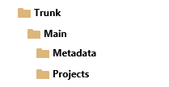
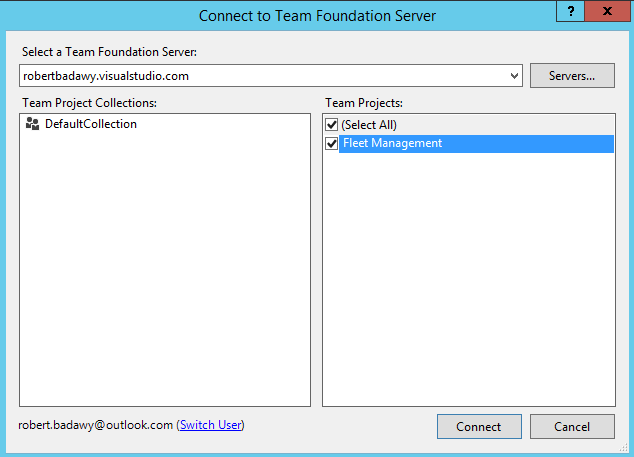
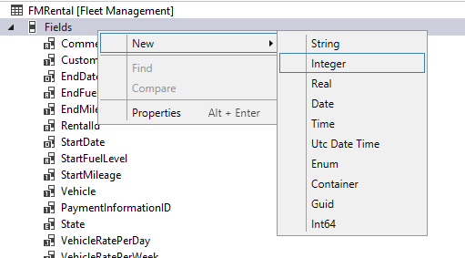
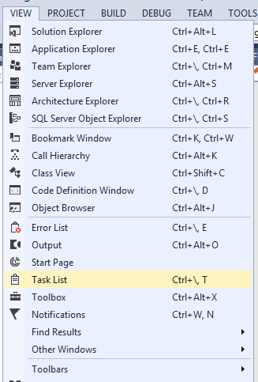
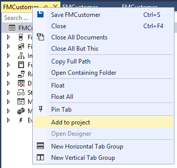
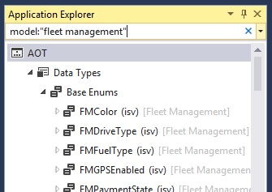

---
# required metadata

title: Version control, metadata search, and navigation
description: This tutorial will walk you through configuring Visual Studio Team Systems (previously known as Visual Studio Online) to enable source control on your models. It’ll also help you learn about other productivity features in the development tools, including the ability to create and organize TODO task, search metadata and source code, navigate between related model elements, and create a project from a model.
author: RobinARH
manager: AnnBe
ms.date: 04/04/2017
ms.topic: article
ms.prod: 
ms.service: dynamics-ax-platform
ms.technology: 

# optional metadata

# ms.search.form: 
# ROBOTS: 
audience: Developer
# ms.devlang: 
# ms.reviewer: 61
ms.search.scope: AX 7.0.0, Operations
# ms.tgt_pltfrm: 
ms.custom: 23401
ms.assetid: 46ed0115-6f8b-4757-b8d2-d4ccb76c733d
ms.search.region: Global
# ms.search.industry: 
ms.author: robadawy
ms.search.validFrom: 2016-02-28
ms.dyn365.ops.version: AX 7.0.0

---

# Version control, metadata search, and navigation

[!include[banner](../includes/banner.md)]

This tutorial will walk you through configuring Visual Studio Team Systems (previously known as Visual Studio Online) to enable source control on your models. It’ll also help you learn about other productivity features in the development tools, including the ability to create and organize TODO task, search metadata and source code, navigate between related model elements, and create a project from a model.

Configure your Visual Studio Online account and project
-------------------------------------------------------

In this section, you'll create a new project in Visual Studio Online. This project will host the source code of your model. You'll use the Fleet Management model as an example. If you don't have a Visual Studio online account, you'll create one.

### Sign up to Visual Studio Online, create an account, and create a new project

Navigate to <http://www.visualstudio.com/> to sign up for Visual Studio Online. Click **Sign up**. If you already have an account in Visual Studio Online, go to the Create a Visual Studio Online project section later in this topic. 

1.  Sign in with your Microsoft account. **Note**: You can also use an organizational account (Microsoft Office 365 domain).
2.  Create a Visual Studio Online account, and select a URL for your account. This is the URL that you'll connect to from your development computer when you're configuring source control in Visual Studio. The following is an example of the account URL. 

     
    
    When the account is created, you're directed to your account main page where you're prompted to create your first project.
3.  Create a demo **Fleet Management** project. 
    
    

### Create a Visual Studio Online team project

If you already have a Visual Studio Online account, go to your account using Internet Explorer. This topic uses **.visualstudio.com** as the example URL for illustration purposes.

1.  Go to http://.visualstudio.com.
2.  Under **Recent projects & teams**, click **New** to create a new project. 

    

3.  In the **Project name** field, enter **Fleet Management**, enter a **Description**, and then click **Create project**.

### Create the recommended folder structure in your team project

If you have migrated your code from a previous version using the Lifecycle Services (LCS) automated code upgrade tool, the following folder structure is automatically created in your Visual Studio Online team project. 

The **Metadata** folder contains your source XML files organized by packages and models and the **Projects** folder contains Visual Studio projects. If you are not migrating code and are starting from scratch, create a similar folder structure on the server in your team project before you start development.

### Configure Visual Studio to connect to your team project

1.  Start Visual Studio 2013 as Administrator.
2.  Click **Project &gt; Options &gt; Source Control &gt; Plug-in Selection**.
3.  In the Current source control plug-in field, select **Visual studio Team Foundation Server**.
4.  Select **Team &gt; Connect to Team Foundation Server**.
5.  In **Team Explorer**, click **Select Team Projects**.
6.  In the **Select a Team Foundation Server** drop-down list, select the **Visual Studio Online account** that hosts the Fleet Management project, or click **Servers** if it isn't in the menu.
    1.  When the **Add/Remove Team Foundation Server** dialog opens, click **Add**.
    2.  Enter the URL of your Visual Studio Online account.
    3.  Click **OK**.
    4.  If prompted, enter your Microsoft Account username and password.

7.  Select the **Fleet Management** check box under **Team projects**, and then click **Connect**. 

    

### Map your Visual Studio Online project to your local model store and projects folder

Your model store root folder contains source files of all packages and models that are part of your application. During deployment, you'll probably use source files from more than one model across more than one package. Because of this, we recommend that you map your model store root folder to the Visual Studio Online team project metadata folder.

1.  In Visual studio **Team Explorer**, connect to the team project as described earlier in this document.
2.  Open **Source Control Explorer** from **Team Explorer**.
3.  Map the **Metadata** folder of your team project to the root folder of the model store on your local drive (Typically c:\\packages), an example is shown in the image below. **Note**: Your model store may be located under I:\\AosService\\PackagesLocalDirectory or another drive, depending on your machine configuration.

    

4.  Click **Map**, and on the next dialog, click **No**.
5.  Similarly, map the **/Trunk/Main/Projects **server folder to the **local projects folder** that will hold your Visual Studio solution and project files.

## Scenario 1: Open the fleet management solution and add it to Visual Studio Online source control
This section describes the steps needed to add a solution to Visual Studio Online source control. This scenario is relevant when you have started development on a new model and you are adding it to source control for the first time. For code migration scenarios or in the case you are synchronizing new models that have been created by another developer, refer to scenario 2 below.

### Open the FleetManagement solution

Note: This is only an example. You can open any project/solution to learn about the process of adding a solution to source control.

1.  On the **File** menu, point to **Open**, and then click **Project/Solution**.
2.  Browse to the desktop and open the **FleetManagement** folder.
3.  Select the solution file named **FleetManagement**. The file type listed is Microsoft Visual Studio Solution. If the solution file is not on your computer, the steps to create it are listed in [Tutorial: Create a Fleet Management solution file out of the Fleet Management models in the AOT](https://community.dynamics.com/ax/b/newdynamicsax/archive/2016/05/19/tutorial-create-a-fleet-management-solution-file-out-of-the-fleet-management-models-in-the-aot).
4.  Click **Open**. Loading the solution may take some time.

### Add the FleetManagement solution to source control

1.  In **Solution Explorer**, right-click the Fleet Management solution, and select **Add Solution to Source Control.**
2.  On the next dialog, select **Team Foundation Version Control**, and then click **Next**.
3.  In the **Team Project Location**, select **Projects**, as shown in this image (**Note**: If you have already mapped the server Projects folder to a local folder that contains the FleetManagement solution, steps 2 and 3 are omitted)

    

4.  Click OK.
5.  Go to **Team Explorer &gt; Pending changes**, and then click **Check-in** to check-in your solution and its model element to the Visual Studio Online source control.

### Add the model descriptor file to source control

All Visual Studio projects belong to models. Models are source code distribution and deployment units that are typically larger in scope than a Visual Studio project. In the previous section, you added element files of the fleet management solution to source control. Because this was the first time that you added elements of the Fleet Management models to source control, you'll also need to check-in the model descriptor file.

1.  In Visual Studio, in **Team Explorer**, open **Source Control Explorer**, and then select the root folder.
2.  In the **Source Control Explorer** toolbar, click **Add Item to Folder**.
3.  Select your model descriptor file. The model descriptor file is the XML file manifest of your model. It's located in the **Descriptor** folder of the package that the model belongs to. The following image shows an example of where the model descriptor file of the Fleet Management model exists (c:\\packages\\FleetManagement\\Descriptor\\FleetManagement.xml). **Note**: Your model store may be located under h:\\package or another drive depending on your machine configuration.

    

4.  Click **Finish**. **Note**: Because your solution contained elements from two models, you'll need to add an additional model descriptor file to source control: C:\\Packages\\FleetManagementExtension\\Descriptor\\FleetManagementExtension.xml
5.  Check-in your pending items. Your item is now ready for development of the fleet management application using a state-of-the-art, cloud-based source control system and many other application lifecycle features of Visual Studio Online.

### Experiment with source control

In this section, you'll make minor changes to the **FMRental** table and compare your changes with the latest version in your source code repository.

1.  In **Solution Explorer**, click **Fleet Management Migrated &gt; Data model &gt; Tables &gt; FMRental**.
2.  Double-click **FMRental** to open the designer.
3.  Right-click the **Fields** node, and then click **New &gt; Integer**. 

    

4.  Right-click **Methods**, and add a new method.
5.  In the X++ code editor, enter a comment in the new method.
6.  Enter a comment in any existing method.
7.  Save the **FMRental**.
8.  In **Team Explorer**, right-click **FMRental.xml**, and select **Compare with Latest Version**. 

    

9.  Browse through the differences in the **comparison (Diff)** window.
10. In **Solution Explorer**, right-click on the **FMRental** table, and select **Source control &gt; Undo &gt; Pending Changes** to revert your changes. 

    

11. Confirm the undo on the next dialog and close the **diff** window.

## Scenario 2: Synchronize models from source control
In this section, you will synchronize existing models and model elements from your Visual Studio Online project. This is relevant in the following cases: 1) You have migrated your code from a previous version via LCS, or 2) another developer has checked-in a new model or new model elements and you would like to synchronize them to your development environment.

1.  In Source Control Explorer, right-click on Metadata and select **Get Latest Version**. This will synchronize you local packages folder with the latest code.
2.  Alternatively you can use the **Advanced** menu to synchronize specific build version or change sets.

    

3.  Once synchronization is complete, and if this leads to synchronizing new models to your environment, you need to refresh your metadata from Visual Studio.
4.  Go to **Dynamics 365 &gt; Model Management &gt; Refresh models**

## Organize TODO tasks in a project
This section describes how you can create a Visual Studio project out of tasks (TODO comments) embedded in your X++ code.

1.  In **Solution Explorer**, click **Fleet Management Migrated &gt; Code &gt; Classes &gt; FMDataHelper**, and then double-click **FMDataHelper**. This will open the X++ code editor.
2.  Enter a TODO comment (//TODO: my comment) inside any method. 

    

3.  Open other Fleet Management classes or tables and add more TODO comments.
4.  Rebuild the **FleetManagement Migrated** project.
5.  Click **View &gt; Task List**, to open the Visual Studio **Task List** window. 

    

6.  Select **Comments** from the drop-down list. 

    

7.  Select all TODO items, right-click, and select **Add to new project**. 

    

8.  This will open the **New project** dialog and enable you to create a new project that contains all of your TODOs.
9.  You can save this project as a working project to manage your TODO list.
10. When you're finished, undo all of your pending changes in **Team Explorer**. 

    

11. Click **File &gt; Close Solution**, to close the FleetManagement solution.

## Use metadata search and navigation tools to find elements and create projects
This section demonstrates how you can perform meta-data based searches throughout your application.

### Use the Metadata search window

1.  Click **Dynamics 365 &gt; Metadata search**.
2.  In the **Metadata search** window, in the **Search** field, enter the following text to find all of the table insert methods in the Application Suite model that contain a cross-company query. *type:table,method name:insert code:"crosscompany" model:"Application Suite"*
3.  Wait for the search to complete. It may take a while. 

    []    (./media/metadatasearchresults_usingdevotools.png)

4.  Double-click a result in the list. The code editor will open and place the cursor at the line that matches your search criteria.
5.  Select several elements in the results list by holding down the Ctrl key for multiple selections, right-click, and then select **Add to new project**. This will let you to create a new solution and project containing the selected elements.

### Try other search examples

**Tip**: You don't need to wait for the search to complete before you interact with search results. You can double-click results at any time to view the metadata or source code that matches your search criteria. The following are some suggested search examples:

-   Find vertical tab controls defined in view mode and auto-width mode in the model Application Suite. *type:form,formtabcontrol property:arrangeMethod=Vertical,ViewEditMode=view,WidthMode=Auto model:"Application Suite"*
-   Find all grid controls in forms that aren't editable and with the property heightmode = column. *type:form,formgridcontrol:allowedit=no,heightmode=column*
-   Find all SimpleListDetail forms in the Application Suite model. *type:formdesign property:style=simplelistdetail model:"Applicaiton Suite"*
-   Find all tables that have an index field name that contains the keyword xpNum. *type:table,tableindexfield anem: xpNum*
-   Use the search bar drop-down menu to access previous searches. 

    

## Navigate to related elements
This section highlights a feature that enables you to move from one element to a related element without having to find the related elements in **Application Explorer** or **Solution Explorer**.

1.  Open **Application Explorer**, and switch the view to **Model View**. 

    

2.  Under the **Fleet Management** model, click **User Interface &gt; Menu items &gt; Display Menu Items &gt; FMCustomer**. 

    

3.  Right-click **FMCustomer**, and then select **Open designer**.
4.  In the **FMCustomer** menu item designer, right-click the root node, and then select **Go to Form FMCustomer**. 

     
    
    The **FMCustomer** form designer will open.
5.  In the designer of the **FMCustomer** form, expand **Data sources**, right-click **FMCustomer**, and then select **Go to Table FMCustomer** 

    
    
    The **FMCustomer** table designer will open.
6.  Using the same methodology, you can navigate to the EDT element that a table field references. **Tip**: Press F9 instead of opening the context menu. F9 will open the designer of the referenced element. **Tip**: You can add an element to the current project by right-clicking on the document tab and selecting **Add to project**.

Use Application Explorer to create a project from a model
---------------------------------------------------------

You can use Application Explorer to search for all or some elements of a model and create a project out of the search results.

1.  Make sure the option to organize a project by element type is on. Go to **Dynamics 365** &gt; **Options** &gt; **Projects**.
2.  Go to Application Explorer and search for elements in the desired model. For example, enter* model:"fleet management"* and click **Enter**.

    

3.  When the search is complete, right-click the AOT root node and select *Add search results to new project.

    *
    
4.  Specify your project properties in the new project dialog and click **OK** to create the project.

**Tip:** To create a project from search results, you can add any type, name, or other filters to your search as long as all results are in the same model. For example: *model:"Fleet Management" type:Table name:^FM* will return all tables in the Fleet Management model with a name starting with the letters FM.

