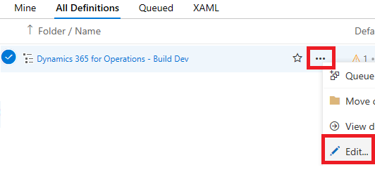

---
# required metadata

title: Version models in the automated build
description: You can update the models in a source package and deployable package of the build output with the version of the build that produced them.
author: jorisdg
manager: AnnBe
ms.date: 05/25/2017
ms.topic: article
ms.prod: 
ms.service: Dynamics365Operations
ms.technology: 

# optional metadata

# ms.search.form: 
# ROBOTS: 
audience: Developer
# ms.devlang: 
ms.reviewer: robinr
ms.search.scope: AX 7.0.0, Operations
# ms.tgt_pltfrm: 
ms.custom: 26731
ms.assetid:
ms.search.region: Global
# ms.search.industry: 
ms.author: jorisde
ms.search.validFrom: 2017-02-28
ms.dyn365.ops.version: AX 7.0.0

---

# Version models in the automated build
With Platform Update 6, the automated build definition contains a new step that updates the models in the source package and deployable package of the build output with the version of the build that produced them.

Build definitions that were created before Platform Update 6 need to be manually updated to add this step. See the [Updating an existing build definition](#updating-an-existing-build-definition) topic in this article.

## Version numbers 
Even though models are compiled into one package, the metadata information of all models is retained inside the binary package, and can be reviewed from Lifecycle Services (LCS) or inside the client.

To find the version numbers of models installed on an environment from LCS:

1. Open the **Full details** page for the environment. 
1. Under **Environment Version Information** click the **View detailed version information** link. 
1. On the **Installed updates** page, select an Application Object Server (AOS) machine from the **Machine name** dropdown. 
1. In the table list, find the **Publisher name** of the model and expand the list by clicking the arrow icon. A full list of all models from that publisher will be listed, along with the version number in the **Version** column.

To find the version numbers of models installed on an environment from the Dynamics 365 for Operations clien:
1. Launch the web URL for the environment and login to Dynamics 365 for Operations. 
1. Once the dashboard loads, click the gear icon at the top right of the page, and select **About**. 
1. On the slide-out, expand the **Loaded Packages and their Models**. Find the package in which the model resides, and expand the list by clicking the arrow icon. The list of models for the package will be shown with their version.

All versions are in .NET assembly format, consisting of 4 numbers separated with a dot ('.'), for example "1.2.3.4"

## The purpose of versioning models
As code is being updated, the build is used to produce new packages to deploy to environments. Visual Studio Team Services tracks the changes included in each build compared to the previous one. If the models produced contain the version of the build, it provides end-to-end traceability of which code changes are available in a specific environment by finding the build number and reviewing the changes included in that build in VSTS. For customers and partners using builds on different branches or using different build definitions for nightly builds, gated check-in or deployment builds, each build can have a different versioning scheme to differentiate the model metadata in the deployable packages and tie them back to their originating build definition.

## Setting up the versioning
For build definitions created by Platform Update 6 or newer deployments, the task to version the models will automatically be added and active. The default build number of a new build definition in VSTS consists of the year, month, day and incremental number of the build of that day. For more information on build numbers in VSTS and the options available, see [Build definition options](https://www.visualstudio.com/en-us/docs/build/define/options#Buildnumberformat) on the Visual Studio docs site.
The Dynamics 365 for Operations automated build will take the build version number and apply it to the models being built.

## Excluding models from being updated
By default, the build task will only assign versions to models in layers above ISP. This allows customers to consume code models from third-party vendors without overwriting the version numbers supplied in their models. To exclude other models from having their versions overwritten during the build, regardless of layer, you can optionally supply a comma-separated list of model names to be excluded in the **ModelVersionExclusions** variable. You can find this variable on the **Variables** tab when editing the build definition.

## Updating models in lower layers
For third parties developing solutions in ISV or ISP, a manual change has to be made to the build definition to automatically set model versions in those layers. 

1. Edit the build definition, and on the **Tasks** tab, click on the **Set Model Versions** task. 
1. In the **Arguments** field, add the following option at the end of the existing list of arguments: *-UpdateLayersAbove 7*

# Updating an existing build definition
For build definitions created prior to Platform Update 6, a new task needs to be manually added to the build definition.

> [!NOTE]
> This feature can only be added to a build definition after updating the build VM to Platform Update 6 or later.

1. In Visual Studio Team Services (VSTS), open the **Build & Release** page. 
1. Under **Builds** and **All Definitions** find your build definition. 
1. Click on the ellipsis (…) and select **Edit**.

  

1. On the **Tasks** tab, click **+ Add Task** at the bottom of the page.
1. On the right-hand side in the **Add tasks** pane, click the **Utility** tab and scroll down to find the **PowerShell** task. 
1. Hover the mouse over the task and click the **Add** button that appears.

  

1. On the left-hand side a **PowerShell Script** task is now added to the list of tasks. Select it by clicking on it.
1. On the right hand side, change the properties **Display name**, **Script Path** and **Arguments**  to reflect the need settings:

  

1. In the list of tasks on the left-hand side, drag the **Set Model Versions** task to the top of the list in between the **Prepare for build** and **Build the solution** tasks.

  

1. Open the **Variables** tab and click **+ Add** at the bottom of the list of variables. In the first column for **Name**, enter "ModelVersionExclusions".
1. Finally, hit **Save** to save the new task.
