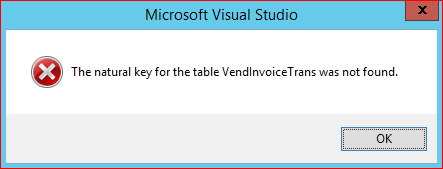
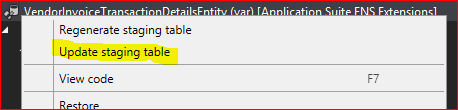

---
# required metadata

title: Build a read-only entity that exposes financial dimensions
description: In this topic, we describe how to build an entity for transactions that are registered in Microsoft Dynamics 365 for Operations. 
author: margoc
manager: AnnBe
ms.date: 04/10/2017
ms.topic: article
ms.prod: 
ms.service: Dynamics365Operations
ms.technology: 

# optional metadata

# ms.search.form: 
# ROBOTS: 
audience: Developer
# ms.devlang: 
ms.reviewer: annbe
ms.search.scope: Operations
# ms.tgt_pltfrm: 
ms.custom: 273653
ms.assetid: 119610df-3975-43ce-830b-84fe58266321
ms.search.region: Global
# ms.search.industry: 
ms.author: pbj
ms.dyn365.ops.intro: Version 1611
ms.search.validFrom: 2016-11-30

---

# Build a read-only entity that exposes financial dimensions
"[!include[banner](../includes/banner.md)]"

In this topic, we describe how to build an entity for transactions that are registered in Microsoft Dynamics 365 for Operations. 

> [!NOTE] 
> This topic comes from Per Baarsoe Jorgensen of the Microsoft Dynamics 365 for Operations Solutions Architecture team. It describes a real-world scenario that we have encountered as we work with customers. 
magine a scenario where we must expose all vendor invoice line transactions together with the financial dimensions that were applied through the distributions. Because easy consumption by a third-party tool is essential, we will create an entity for this scenario. As a result, the entity should not have to be joined with other related entities but should be able to provide value on its own.

We will walk through the process of creating a sample entity to meet these requirements. (We will leave out instructions for integrating with Microsoft Visual Studio Team Services, because those steps are already well documented.)

## Create a basic entity
The first step is to create a new element in a project by selecting **New Item**. 

[]

In the form that opens, under Data Model, we select the **Data Entity** element type.

[]

> [!NOTE] 
> Be careful when you name the entity, because you can’t rename it later.

Next, in the Data Entity wizard, we select the appropriate primary data source. For our scenario, this data source is VendInvoiceTrans.

[]

The wizard doesn’t accept tables that don’t have a natural key, as is the case with VendInvoiceTrans. Therefore, we receive the following error message.

[]

The workaround is to select any other primary data source that has a natural key associated, such as VendGroup.

Because we don’t really need this data source, we also don’t need any fields for it. Therefore, we clear the **Select all** check box.

[]

Finally, we create the template for our entity by clicking **Finish**.

## Customize the basic entity
The entity, staging table, and security assets have been created, and we can now produce our custom entity. In the project, we open the VendorInvoiceTransactionDetailsEntity entity in the designer. 

[]

In the designer, we replace the dummy table (VendGroup) that we applied in the wizard with the transaction table VendInvoiceTrans. Because we didn't choose to add the fields, we don't have to remove fields in the entity.

[]
> [!NOTE] 
> Because we are exposing transactional data by using this entity, it's important that we mark the entity as read-only. Therefore, we set the **Is read only** property to **Yes** on the top node. Because accounting distributions are versioned, it's important that only the current version be returned when we query. Therefore, we create a view that makes this part easily reusable across multiple entities. 

[]

In the properties, we assign **ReferenceDistribution** a range filter value of **0** and **ReferenceRole** a range filter value of **1**. The join mode property for the AccountDistributionReverse data source must be **NoExistsJoin**. After the new view is in place, we can add it to the VendorInvoiceTransactionDetailsEntity entity that we are currently building. 

[]

## Expose financial dimensions as fields
The next important step is to expose the financial dimensions as separate fields on the entity. Because our scenario builds on top of a posted transaction, we must add the fields to the DimensionCombinationentity entity. We want to make the adjustments in a resilient manner by using the extension approach, so that minimal maintenance will be required when we upgrade the code base to newer versions in the future.

### Dynamics 365 for Operations version 1611

For Microsoft Dynamics 365 for Operations version 1611 or later, you should use the wizard that is available in Microsoft Visual Studio (at **Dynamics 365** &gt; **Addins** &gt; **Add financial dimensions for Odata**). For instructions, see [Add dimensions to the Microsoft Excel template](dimensions-overview).

### Earlier versions of Dynamics 365 for Operations

If you're working with earlier versions of Dynamics 365 for Operations, you must complete the steps that are outlined here. First, we add the entity extension itself. Select **Create extension** on the context menu (shortcut menu). Next, we create the code that retrieves the data. Because the entity extension is already in place, we must create a new class. The following example adds code for an arbitrary dimension that is named **ProductLine**.

  [ExtensionOf(dataentityviewstr(DimensionCombinationentity))]
    public final class DimensionCombinationentity_Extension
    {
        private static server str getEmptyOrDimensionValueSqlString(str _attributeName)
        {
            str sqlStatement;

            DimensionAttribute dimensionAttribute = DimensionAttribute::findByName(_attributeName);

            if (!dimensionAttribute)
            {
                sqlStatement = SysComputedColumn::returnLiteral('');
            }
            else
            {
                sqlStatement = strFmt('SELECT TOP 1 T1.%1 ', dimensionAttribute.DimensionValueColumnName);
            }

            return sqlStatement;
        }

        /// Generates the sql to populate the FOTA view field.
        public static server str ProductLineValue()
        {
            return DimensionCombinationentity::getEmptyOrDimensionValueSqlString('ProductLine');
        }
    }

We now add fields to the newly created entity extension by using custom fields that reference these methods. 

[]

Next, we set the property values to reflect the fact that the field is unmapped and should be retrieved through the code that we made for the extension class. When you create the relation, also set the following values:

-   Cardinality: **ZeroMore**
-   Related data entity: **DimensionCombinationentity**
-   Related data entity cardinality: **ZeroOne**
-   Relationship type: **Association**

[]

> [!Note]
> We must fully qualify the data method with the class name. 

We are now ready to add the DimensionCombinationentity entity to our new VendInvoiceTransactionentity entity. 

[] 

Notice that both the AccountingDistributionCurrent and the DimensionCombinationentity entity should be outer-joined. 

[]

Now, we just have to drag the required fields from the various data sources to the **Fields** node on the new entity (that is, to our newly created ProductLine). 

[]

We should add a key to the entity to enable the incremental update functionality during the export configuration. Therefore, we must make sure that RecId from the VendInvoiceTrans data source is part of the fields named e.g. VendInvoiceTransRecId. After the field is in the field list, we can drag it to the **EntityKey** node. 

[]

To make sure that the staging table is associated with the fully configured entity, we must update it. On the context menu for the entity, we select **Update staging table**. 

[]

The entity work is now complete, and we can build it. 

> [!NOTE]
> In this scenario, a LedgerDimension was associated with the DimensionCombinationentity entity. In scenarios where there is a DefaultDimension, we must associate it with the DimensionSetentity entity. The improvements and extensions that are required are identical to the improvements and extensions that we made to the DimensionCombinationentity entity.

See also
--------

[Export Dynamics AX 7 Entities to your own Azure SQL Database](https://blogs.msdn.microsoft.com/dynamicsaxbi/2016/07/27/export-dynamics-ax7-entities-to-your-own-azure-sql-database/)

