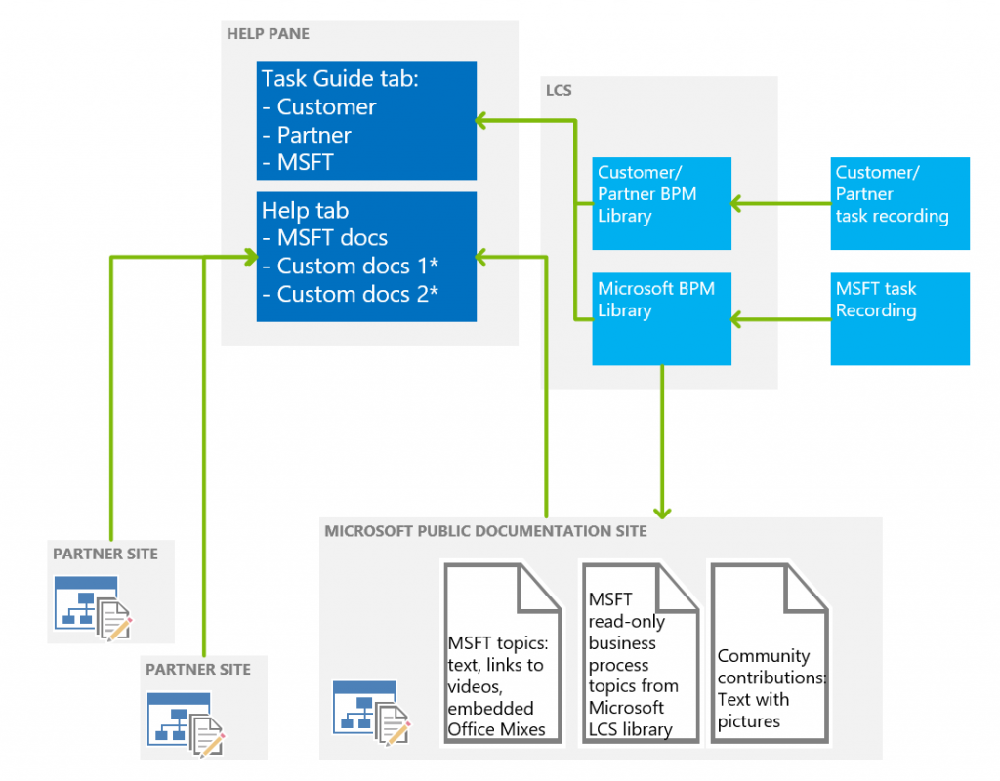

---
# required metadata

title: Connect the Help system
description: This topic describes the components of the Help system for Microsoft Dynamics 365 for Operations, and provides an overview of how to connect them and a summary of how to create custom help. 
author: margoc
manager: AnnBe
ms.date: 2015-12-03 22 - 12 - 49
ms.topic: article
ms.prod: 
ms.service: Dynamics365Operations
ms.technology: 

# optional metadata

ms.search.form: SystemParameters
# ROBOTS: 
audience: Application User, Developer, IT Pro
# ms.devlang: 
ms.reviewer: annbe
ms.search.scope: AX 7.0.0, Operations, Core
# ms.tgt_pltfrm: 
ms.custom: 16141
ms.assetid: 0b9c8630-9474-4473-80fd-7db5d54b2275
ms.search.region: Global
# ms.search.industry: 
ms.author: margoc
ms.search.validFrom: 2016-02-28
ms.dyn365.ops.version: AX 7.0.0

---

# Connect the Help system

This topic describes the components of the Help system for Microsoft Dynamics 365 for Operations, and provides an overview of how to connect them and a summary of how to create custom help. 

Help architecture
-----------------

The following illustration shows the parts of the Dynamics 365 for Operations help system. The in-product help system pulls articles from the Dynamics 365 for Operations Help Wiki, as well as task guides stored in Business Process Modeler in Microsoft Dynamics Lifecycle Services (LCS). **Note** The features listed in the diagram with an asterisk (\*) are on our roadmap, but are not available yet. 

## Connecting the help system
Using the System Parameters form, system administrators connect the pieces of the help system for an implementation.  On the **System parameters** page, follow these steps:

1.  **Important:** The first time you open the Help tab, you must connect to Lifecycle Services. Be sure to click the link in the middle of the form, wait for the connection, close the dialog box, and then click OK to get to the parameters form.
2.  Select the Lifecycle Services project to connect to.
3.  Select the BPM libraries (within the selected project) to retrieve task recordings from.
4.  Set the display order of the BPM libraries. This determines the order in which task recordings from the libraries will appear in the **Help** pane.

After you complete these steps, you can open the Help pane and click the Task guides tab. You'll now see the task guides that apply to the page that you’re currently on in Dynamics 365 for Operations. If no task guides are found, you can enter keywords to refine your search.

### Showing translated task guides

Translated task guides were shipped in the May APQC Unified Library, and the Getting Started library. In Dynamics 365 for Operations, to see localized task guide help, make sure that you are connected to the May library. The language that a task guide appears in is controlled for each user by the Language settings under **Options** &gt; **Preferences**. **Note:** Even though many task guides have been translated, right now the Dynamics 365 for Operations client is not showing the translated task guide names. Also, only the task guides that were released in February are available in translation in the May library at this point. We will release an updated library with additional translations.

-   If a task guide has been translated, when you open that task guide all the text of the task guide will appear in your selected language.
-   If a task guide has not yet been translated, when you open it, only some of the text (the text of the controls) will appear in your selected language.

## Creating custom help
You can create custom help for your Dynamics 365 for Operations implementation by creating task recordings that reflect your implementation, and saving them to an LCS Business Process Library. For partners, if you promote a library to be a corporate library, and include it in a solution, it will be available to your customers. You can also make a copy of the APQC Unified global library, and then open your copy, open task recordings from it, modify them, and save the recordings with your changes. For more information, see the topic [How to create a task recording to use as documentation or training](../user-interface/task-recorder.md).

See also
--------

[Microsoft Dynamics AX Help – Getting started](help-overview.md)

[How to create a task recording to use as documentation or training](../user-interface/task-recorder.md)

[Creating New Training Libraries for Dynamics AX within Lifecycle Services using the Task Recorder (External link)](https://docs.com/mufife/163372c6-f366-4c5a-94fa-93e2c25f878a/creating-new-training-libraries-for-dynamics-ax)

