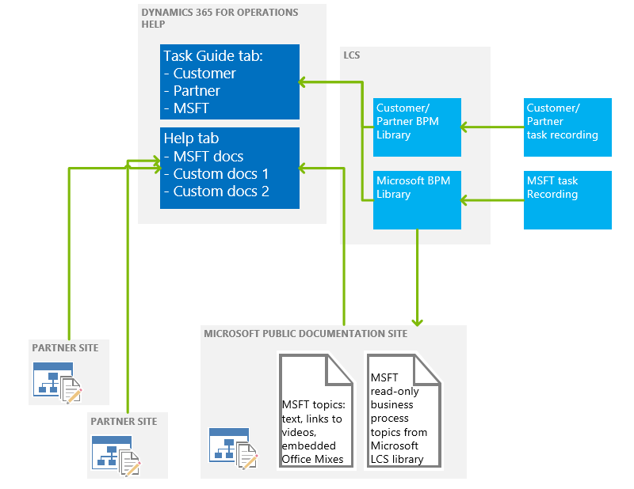

---
# required metadata

title: Connect the Help system
description: This topic describes the components of the Help system for Microsoft Dynamics 365 Unified Operations, and provides an overview of how to connect them and a summary of how to create custom help. 
author: margoc
manager: AnnBe
ms.date: 06/16/17
ms.topic: article
ms.prod: 
ms.service: dynamics-ax-platform
ms.technology: 

# optional metadata

ms.search.form: SystemParameters
# ROBOTS: 
audience: Application User, Developer, IT Pro
# ms.devlang: 
ms.reviewer: annbe
ms.search.scope: AX 7.0.0, Operations, Core
# ms.tgt_pltfrm: 
ms.custom: 16141
ms.assetid: 0b9c8630-9474-4473-80fd-7db5d54b2275
ms.search.region: Global
# ms.search.industry: 
ms.author: margoc
ms.search.validFrom: 2016-02-28
ms.dyn365.ops.version: AX 7.0.0

---

# Connect the Help system

[!include[banner](../includes/banner.md)]

This topic describes the components of the Help system for Microsoft Dynamics 365 for Unified Operations. It provides an overview of how to connect these components and a summary of how to create custom help. 

Help architecture
-----------------

The following illustration shows the parts of the Dynamics 365 Unified Operations Help system. The in-product Help system pulls articles from the Dynamics 365 Unified Operations site on https://docs.microsoft.com, as well as task guides stored in Business Process Modeler in Lifecycle Services (LCS). 

 [!NOTE]
> The features listed in the diagram with an asterisk (\*) are planned, but are not available yet. 

## Connecting the Help system
> [!IMPORTANT]
> This section does not apply to Dynamics 365 for Talent. The Help system for Talent is automatically connected to task guides for the product. Also, you cannot create custom task guides for Talent. 

Using the **System Parameters** page, system administrators connect the pieces of the Help system for an implementation.  On the **System parameters** page, follow these steps:

> [!IMPORTANT]
> The first time that you open the **Help** tab, you must connect to Lifecycle Services. Be sure to click the link in the middle of the form, wait for the connection, close the dialog box, and then click **OK** to get to the **System Parameters** page.

1.  Select the Lifecycle Services project to connect to.
2.  Select the BPM libraries (within the selected project) to retrieve task recordings from.
    - For Finance and Operations, for Microsoft content, select the February 2017 QPC Unified Library for Microsoft Dynamics 365 for Operations. 
    - For Retail, we will be releasing a library in July. 
    - You do not need to select a library for Talent--the connection to the correct library is established for you. 

3.  Set the display order of the BPM libraries. This determines the order in which task recordings from the libraries will appear in the **Help** pane.

After you complete these steps, you can open the **Help** pane and click the **Task guides** tab. You'll now see the task guides that apply to the page that you’re currently on. If no task guides are found, you can enter keywords to refine your search.

### Showing translated task guides

Translated task guides were first shipped in the May 2016 APQC Unified Library, and the Getting Started library. In Dynamics 365 for Operations, to see localized task guide help, make sure that you are connected to the May library. The language that a task guide appears in is controlled for each user by the Language settings under **Options** &gt; **Preferences**. 

> [!NOTE]
> Even though many task guides have been translated, right now our clients are not showing the translated task guide names. Also, only the task guides that were released in February 2016 are available in translation in the May library. We will release an updated library with additional translations.
> -   If a task guide has been translated, when you open that task guide all the text of the task guide will appear in your selected language.
> -   If a task guide has not yet been translated, when you open it, only some of the text (the text of the controls) will appear in your selected language.

## Creating custom help
You can create custom help for Finance and Operations, and for Retail by creating task recordings that reflect your implementation, and saving them to an LCS Business Process Library. For partners, if you promote a library to be a corporate library, and include it in a solution, it will be available to your customers. You can also make a copy of the APQC Unified global library, and then open your copy, open task recordings from it, modify them, and save the recordings with your changes. For more information, see [How to create a task recording to use as documentation or training](../user-interface/task-recorder.md).

See also
--------

[Help overview](help-overview.md)

[Task recorder overview](../user-interface/task-recorder.md)

[How to create a task recording to use as documentation or training](../user-interface/task-recorder-training-docs.md)

