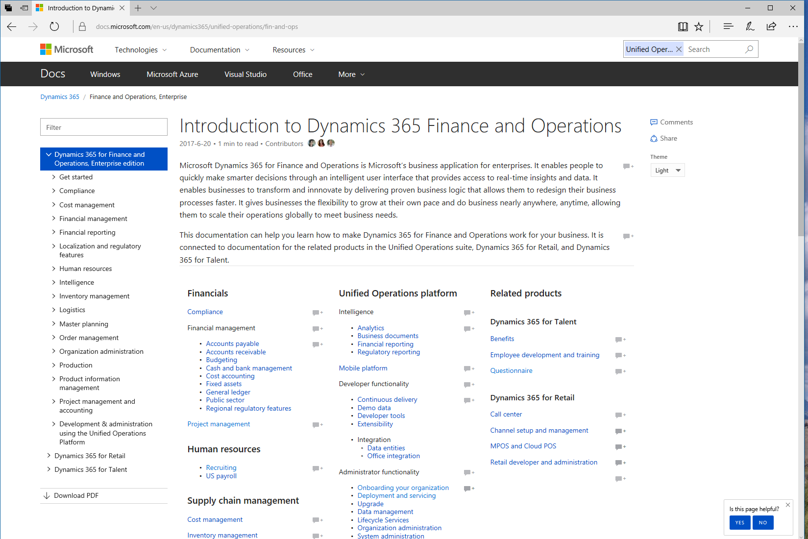
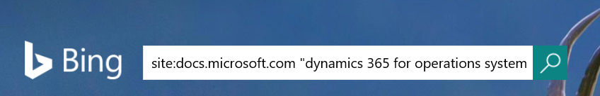
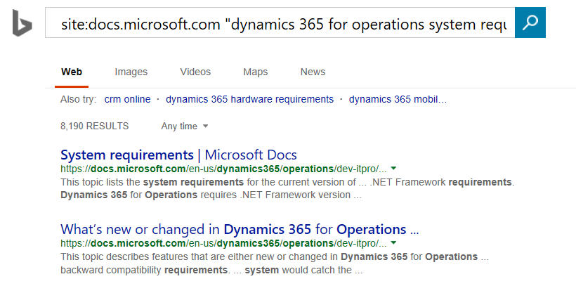

---
# required metadata

title: Help overview
description: This topic provides an overview of the components of the Microsoft Dynamics 365 Unified Operations Help system. It also explains how you can provide custom documentation and training to your organization. 
author: margoc
manager: AnnBe
ms.date: 06/16/17
ms.topic: article
ms.prod: 
ms.service: dynamics-ax-platform
ms.technology: 

# optional metadata

# ms.search.form: 
# ROBOTS: 
audience: Application User, Developer, IT Pro
# ms.devlang: 
ms.reviewer: annbe
ms.search.scope: AX 7.0.0, Operations, Core
# ms.tgt_pltfrm: 
ms.custom: 16381
ms.assetid: 018c148c-9cbd-41e0-8186-d75dbf66288f
ms.search.region: Global
# ms.search.industry: 
ms.author: margoc
ms.search.validFrom: 2016-02-28
ms.dyn365.ops.version: AX 7.0.0

---

# Help overview

[!include[banner](../includes/banner.md)]

This topic provides an overview of the components of the Microsoft Dynamics 365 Unified Operations Help system. It also explains how you can provide custom documentation and training to your organization. 

Dynamics 365 Unified Operations includes a Help system that is based on two main components:

-   A documentation site
-   Task guides

The following products are closely related: Dynamics 365 for Finance and Operations, Enterprise edition; Dynamics 365 for Retail; and Dynamics 365 for Talent. The same functionality may appear in all 3 products. As a result, in topics that are primarily related to Retail, the product name will be Dynamics 365 for Retail; in topics that are primarily related to Talent, the product name will be Dynamics 365 for Talent; and in topics that are related to the core product, the product name will be Dynamics 365 for Finance and Operations. Topics that are written for one product may apply to the same functionality in a related product. 

The Help system is shared by all Unified Operations products:
- Dynamics 365 for Finance and Operations, Enterprise edition
- Dynamics 365 for Retail
- Dynamics 365 for Talent

You can access both help topics and task guides from the Help pane in whichever product you are using. The following screenshot shows Dynamics 365 for Finance and Operations

This topic describes the Help system, and explains how you can create custom documentation and training resources for your organization.

## Help on docs.microsoft.com
The docs.microsoft.com site ([docs.microsoft.com/dynamics365/operations](/dynamics365/#pivot=solutions&panel=solutions_operations)) is the primary source of product documentation for Dynamics 365 Unified Operations. The site offers the following features:

-   **Access to the most up-to-date content** – The site gives us a faster and more flexible way to create, deliver, and update product documentation. Therefore, it helps to ensure that you have access to the latest technical information.
-   **Content that is written by experts** – The site provides a richer set of product documentation that can be enhanced by community members both inside and outside Microsoft.
-   **Access to different types of content** – The site lets you quickly access different types of content about all Unified Operations products, such as Microsoft Office Mix presentations, task guides, videos, and topics.
-   **Content that supports your business processes** – The site includes business process–focused content that takes advantage of the Business Process Modeler (BPM) in Microsoft Dynamics Lifecycle Services (LCS).

### Searching on docs.microsoft.com
We get a lot of questions about how to search for our content. On our site, if you start from a page about Dynamics 365 Unified Operations, we scope your search to just be for Dynamics 365 Unified Operations content. You can remove the scoping by clicking the X next to Unified Operations in the search box. 

You can also find our content with any search engine. We recommend that for best results, you use a site search, such as 
site:docs.microsoft.com dynamics 365 "search term".  

### The docs.microsoft.com table of contents for Unified Operations
All products share a single table of contents on the docs site, which enables customers to see the context of the topic they are in. It also enables you to use the Filter control to find topics that you are looking for.

### How can I contribute? 

Leave us a comment! 

1 Click **Comments** to get to the comments at the bottom of the page.

2 Start typing your comments, and then click **Post comment**.

3 Select the type of account that you want to sign in with:  
Click one of the icons on the left to associate this site with an existing account, such as a Twitter, Facebook, or Microsoft account. 

Or 

On the right, enter an email address, and a new password to create a new account for the site. 

## Task guides
A Task guide is a controlled, guided, interactive experience that leads you through the steps of a task, or business process. You can open (play) a Task guide from the Help pane. When you first click a Task guide, the Help pane will show the step-by-step instructions for the task. Localized Task guides are now available. 

We will provide different sets of task guides for each Unified Operations product. The section Accessing Task guides from the Help pane describes how to find the correct task guides for your product. 

To begin the guided, interactive experience, click **Start task guide** at the bottom of the Help pane. A black pointer opens and indicates the action that you must perform. Follow the directions that appear in the UI, and enter data as directed. 

> [!IMPORTANT] 
> The data that you enter when you play a Task guide is real. If you're in a production environment, the data will be entered in the company that you’re currently using.

### It all begins with Task Recorder

Task guides are created by using Task Recorder. When you use Task Recorder, all the actions that you perform in the Unified Operations UI (such as clicking menus, changing settings, and entering data) are recorded. The steps that you record are collectively called a task recording. As note in the previous section, task recordings can be displayed in the Help pane and played as Task guides. However, there are other ways that you can use task recordings:

-   **Save task recordings to BPM** – You can save a task recording to a line of a hierarchy in a BPM library in LCS. When you save a task recording to BPM, a flowchart diagram is generated and displayed, together with the steps of the recording. **Note:** To display a task recording in the Unified Operations Help pane and play it as a Task guide, you'll have to save the recording to a BPM library.
-   **Save task recordings as Word documents** – By saving a task recording as a Microsoft Word document, you can easily produce printable training guides for your organization.

For more information about Task Recorder, see [Task recorder in Dynamics 365 for Operations](../user-interface/task-recorder.md).

### Creating customized task recordings

You can create your own task recordings, or you can download and customize task recording that Microsoft provides. Therefore, you can create customized Help for your organization that reflects your specific implementation. To display a task recording in the Dynamics 365 for Operations Help pane and play it as a Task guide, you'll have to save the recording to a BPM library in LCS. If you're a partner, and you promote a library to a corporate library and include it in a solution, it will be available to your customers. For complete instructions, see [Using task recordings to create documentation or training](../user-interface/task-recorder.md).

## In-product Help
To access Help content within the Unified Operations products, either click the **Help** (**?**) icon and then choose Help or press Ctrl+Shift+?. In both cases, the Help pane opens. From the Help pane, you can access help topics or task guides. 

### Accessing help topics from the Help pane

From the Help pane, you can access topics that apply to Unified Operations. When you first open the Help pane and click the **Wiki** tab, you’ll see the topics that apply to the page that you’re currently on. If the page appears in more than one Unified Operations product, you may see topics for all of the products. 

If no topics are found, you can enter keywords to refine your search. When you select a topic in the Help pane, a new tab opens in your browser and displays the topic. 

### Accessing Task guides from the Help pane

> [!IMPORTANT]
> This section does not apply to Dynamics 365 for Talent. The Help system for Talent is automatically connected to Task guides for the product. Also, you cannot create custom Task guides for Talent. 

Before you can access Task guides from the Help pane, a System administrator has to go to the **System parameters** page and configure some settings. 

> [!NOTE]
> -   To configure help, you must be signed in with an account in the same tenant as the tenant in which the product was deployed from LCS.
> -   It is not possible to connect to an LCS library from an instance of Finance and Operations or Retail running in a local virtual hard drive (VHD).

On the **System parameters** page, follow these steps:

1.  **Important:** The first time that you open the Help tab, you must connect to Lifecycle Services. Be sure to click the link in the middle of the form, wait for the connection, close the dialog box, and then click **OK** to get to the parameters form.

2.  Select the Lifecycle Services project to connect to.
3.  Select BPM libraries (within the selected project) to retrieve task recordings from.
    - For Finance and Operations, for Microsoft content, select the February 2017 QPC Unified Library for Microsoft Dynamics 365 for Operations. 
    - For Retail, we will be releasing a library in July. 
    - You do not need to select a library for Talent—the connection to the correct library is established for you. 

4.  Set the display order of the BPM libraries. This determines the order in which task recordings from the libraries will appear in the Help pane.

After a System administrator has completed these steps, you can open the Help pane and click the **Task guides** tab. You'll now see the Task guides that apply to the page that you’re currently on. If no Task guides are found, you can enter keywords to refine your search. After you click a Task guide in the Help pane, the Help pane shows the step-by-step instructions, and you can play the Task guide. 

### Where are the translated Task guides?

Translated Task guides are released in libraries with "All languages" in the title. To see localized Task guide help, make sure that you are connected to an appropriate library. The language that a Task guide appears in is controlled for each user by the Language settings under **Options** &gt; **Preferences**. The titles of translated Task guides are still showing in English. 
-   If a Task guide has been translated, when you open that Task guide all the text of the Task guide will appear in your selected language.
-   If a Task guide has not yet been translated, when you open it, only some of the text (the text of the controls) will appear in your selected language.

## Additional resources
The following table lists websites that provide Unified Operations content. Our content websites are organized to support the customer life cycle. Each phase is supported by a different set of sites. Sites that have an asterisk (\*) next to the name require that you sign in by using an account that is associated with a service plan.

| Site                                                                     | Description                                                                                                                                                                                                                                |
|--------------------------------------------------------------------------|--------------------------------------------------------------------------------------------------------------------------------------------------------------------------------------------------------------------------------------------|
| [Docs.microsoft.com](/dynamics365/) | Hosts or links to all product documentation for Dynamics 365.                                                                                                                                                               |
| [Lifecycle Services](http://lcs.dynamics.com/en/)\*                      | Provides a cloud-based collaborative workspace that customers and partners can use to manage Dynamics 365 for Operations projects from pre-sales to implementation and operations. This site is useful in all phases of an implementation. |
| [CustomerSource](http://www.customersource.com/)\*                       | Hosts extensive training resources and is the primary support site for Dynamics 365 for Operations. Sign in may be required to access specific resources on the site.                                                                      |
| [Support blog](http://aka.ms/AXSupportBlog)                              | Provides tips and tricks that are posted by the Dynamics 365 for Operations Support team.                                                                                                                                                  |
| [MSDN](http://aka.ms/AXMSDN)                                             | Hosts content from previous releases that is written for developers.                                                                                                                                                                       |
| [TechNet](http://aka.ms/TechNet)                                         | Hosts content from previous releases that is written for IT professionals and application users.                                                                                                                                           |
| [Dynamics Community](http://community.dynamics.com/)                  | Hosts blogs, forums, and videos.                                                                                                                                                                                                           |
| [Microsoft.com/Dynamics/](http://www.microsoft.com/dynamics/)                 | Provides evaluation and sales information.                                                                                                                                                                                                 |

See also
--------

[Dynamics 365 for Finance and Operations help system (downloadable fact sheet)](https://mbs.microsoft.com/files/public/CS/AX2012R3/DynamicsAXHelpSystemFactSheet.pdf)

[Task Recorder](../user-interface/task-recorder.md)

[Create documentation or training using Task recordings](../user-interface/task-recorder.md)

[New or updated Task guides (February 2017)](new-task-guides-february-2017.md)
[New or updated Task guides (November 2016)](new-task-guides-november-2016.md)
[New or updated task guides (August 2016)](new-updated-task-guides-available-august-2016.md)
[New or updated task guides (May 2016)](new-updated-task-guides-available-may-2016.md)
[New task guides (February 2016)](new-task-guides-available-february-2016.md)

