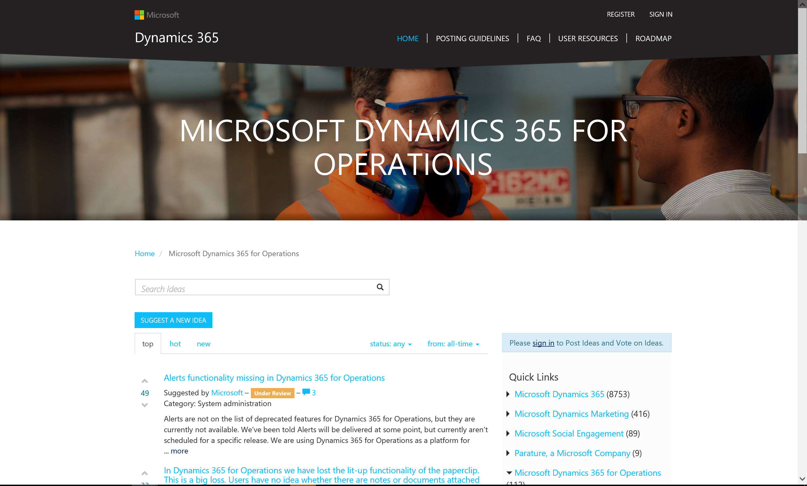

---
# required metadata

title: What's new or changed in Dynamics 365 for Operations platform update 6 (April 2017)
description: This topic describes features that are either new or changed in Dynamics 365 for Operations platform update 6. This version was released in April 2017 and has a build number of XXX.
author: tonyafehr
manager: AnnBe
ms.date: 04/21/2017
ms.topic: article
ms.prod: 
ms.service: Dynamics365Operations
ms.technology: 

# optional metadata

# ms.search.form: 
# ROBOTS: 
audience: Developer, IT Pro
# ms.devlang: 
# ms.reviewer: 
ms.search.scope: Operations, Platform
# ms.tgt_pltfrm: 
ms.custom: 
ms.assetid: 13d2b8a5-c2e0-4f32-a43b-7726ae20392c
ms.search.region: Global
# ms.search.industry: 
ms.author: tonyafehr
ms.search.validFrom: 
ms.dyn365.ops.version: Platform update 6

---

# What's new or changed in Dynamics 365 for Operations platform update 6 (April 2017)

This topic describes features that are either new or changed in Dynamics 365 for Operations platform update 7. This version was released in April 2017 and has a build number of XXX.

# What's new or changed in Dynamics 365 for Operations platform update 6 (April 2017)

This topic describes features that are either new or changed in Dynamics 365 for Operations platform update 7. This version was released in April 2017 and has a build number of XXX.

## Browser framework - PowerApps Host control ##
Dynamics 365 for Operations introduces a new control for developers, the PowerApps Host control. This control allows a developer to host or embed a PowerApp within a Dynamics 365 for Operations form.   

## Browser client - Ability to model toolbar actions in the overflow menu ##
You can now provide a cleaner action story on forms by designating certain buttons in toolbars to always render in overflow. This makes it easier to differentiate actions that users will commonly use versus those that are infrequently or rarely used. To utilize this feature, try the new **AlwaysInOverflow** metadata property on Button groups inside Toolbars.

## Ideas portal ##
Dynamics 365 for Operations Ideas forum is now available on our common [Ideas portal.](https://ideas.dynamics.com/ideas/) With the Ideas portal, all Dynamics 365 for Operations users can submit new ideas, vote on existing ideas, and track status of their ideas in a consistent manner. This can now be achieved from both outside of the product ([http://ideas.dynamics.com](http://ideas.dynamics.com/)) and from within the application. The screenshot shows how to navigate to the Ideas portal from within Dynamics 365 for Operations.  Click the **Ideas** link to go to the Dynamics 365 for Operations forum.<ul> <li> The forums are pre-populated with existing ideas, so customers and partners can immediately vote or suggest new ideas.<li>You can filter ideas by using status and time. You can also quickly view top, hot, and new ideas.<li>You can either vote up or down on a specific idea (one vote per idea). To vote or suggest a new idea, you need to sign in using a Microsoft account.<li>The **My Feedback** feature allows you to see a detailed view of your submitted ideas, the status of your ideas, and the total votes received.  
