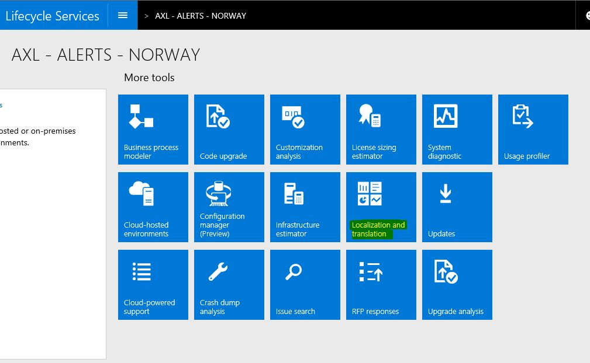

---
# required metadata

title: Inform about country/region regulatory features
description: This article describes how to use Microsoft Dynamics Lifecycle Services (LCS) to submit alerts through the Localization and translation service. This article also explains how to track planned and released regulatory features through LCS Issue search. 
author: shylathompson
manager: AnnBe
ms.date: 04/04/2017
ms.topic: article
ms.prod: 
ms.service: Dynamics365Operations
ms.technology: 

# optional metadata

# ms.search.form: 
# ROBOTS: 
audience: Developer, IT Pro
# ms.devlang: 
# ms.reviewer: 51
ms.search.scope: AX 7.0.0, Operations, Core
# ms.tgt_pltfrm: 
ms.custom: 27791
ms.assetid: b37140b4-5d6f-460f-ae36-f0d7bd90c0d3
ms.search.region: global
# ms.search.industry: 
ms.author: janeaug
ms.search.validFrom: 2016-02-28
ms.dyn365.ops.version: AX 7.0.0

---

# Inform about country/region regulatory features

[!include[banner](../includes/banner.md)]

This article describes how to use Microsoft Dynamics Lifecycle Services (LCS) to submit alerts through the Localization and translation service. This article also explains how to track planned and released regulatory features through LCS Issue search. 

Accessing the regulatory alert submission service
-------------------------------------------------

1.  In Microsoft Dynamics Lifecycle Services (LCS), in your project, scroll to the right side of the page, and then, under **More tools**, click the **Localization and translation** tile. 
2.  Under **Dynamics Regulatory Alert Submission**, click **Enter**. 

The **Dynamics regulatory alert submission** page appears. You can use this page to view any alerts that have previously been submitted by you or your organization.

## Submitting a regulatory alert
To enter a new regulatory alert, click the plus sign (**+**) at the top of the **Dynamics regulatory alert submission** page, above the filter. The **Alert submission** wizard starts. You can complete the following tasks in this wizard:

1.  Search for existing regulatory items.
2.  Attach business processes.
3.  Describe an alert.
4.  Confirm submissions.

### Search for existing regulatory items

Use Issue search to identify whether a regulatory feature that is related to the alert already exists.

1.  Enter a search term, such as a keyword, country/region, Microsoft Knowledge Base (KB) number, or Application Object Tree (AOT) object. Then click the search button. Any items that include the search term, in either product issues or regulatory features, appear in the search results. You can narrow the search by using the filters that are available.
2.  If you don't find the regulatory feature that you're looking for, you can submit a regulatory alert by clicking **Submit regulatory alert** at the bottom of the browser window. 

### Attach business processes

1.  In the **Global business process libraries** list, select business process libraries.
2.  Enter search criteria to find business processes that are related to the search term. These business processes are highlighted in yellow.
3.  In the list on the right side of the page, select one or more related business processes, and drag them into the field on the left side. After you've finished, you can edit them further by clearing the selection of business processes.
4.  Add the selected business processes to the alert. 

### Describe the alert

1.  Enter information about the alert in the appropriate fields. Required fields are indicated by a red asterisk (**\***). The following table provides more information about the fields on the **Describe the alert** page.
    | Field name                                                                                                                                                                                                     | Field type                  | Description                                                                                                                                                                                                                                                                                                                                                                                                                               |
    |----------------------------------------------------------------------------------------------------------------------------------------------------------------------------------------------------------------|-----------------------------|-------------------------------------------------------------------------------------------------------------------------------------------------------------------------------------------------------------------------------------------------------------------------------------------------------------------------------------------------------------------------------------------------------------------------------------------|
    | Title                                                                                                                                                                                                          | Text                        | Enter a descriptive title to identify the area of impact. For example, enter **Changes in invoice document as of January 1, 2014**.                                                                                                                                                                                                                                                                                                       |
    | Description                                                                                                                                                                                                    | Text                        | Enter a brief overview of the law. Your description should focus on issues that are relevant to enterprise resource planning (ERP), so that users can understand the requirements at a high level without having to read the legislation first.                                                                                                                                                                                           |
    | Country                                                                                                                                                                                                        | List of valid values        | Select the country or region that the legislation applies to.                                                                                                                                                                                                                                                                                                                                                                             |
    | Industry                                                                                                                                                                                                       | List of valid values        | Select the industry, if the requirement applies only to specific industries. For example, select **Public sector**, **Retail**, or **Manufacturing**.                                                                                                                                                                                                                                                                                     |
    | Link to legislation                                                                                                                                                                                            | Text in URL format          | Enter one or more links to the published law, interpretation guideline, implementation guidance, or any other useful documentation that will help users understand or implement the requirement.                                                                                                                                                                                                                                          |
    | Feature reference                                                                                                                                                                                              | Text                        | Enter the ID of the feature reference, if you know it.                                                                                                                                                                                                                                                                                                                                                                                    |
    | Law enforcement date                                                                                                                                                                                           | Date                        | Select the date when affected customers must start to comply with the law.                                                                                                                                                                                                                                                                                                                                                                |
    | Government announcement date                                                                                                                                                                                   | Date                        | Select the date when the authority announced the change.                                                                                                                                                                                                                                                                                                                                                                                  |
    | Latest filing date                                                                                                                                                                                             | Date                        | Select the deadline for the first submission of the new or changed report.                                                                                                                                                                                                                                                                                                                                                                |
    | Company name                                                                                                                                                                                                   | Text                        | Enter the company name for the person who is submitting the alert.                                                                                                                                                                                                                                                                                                                                                                        |
    | Contact name                                                                                                                                                                                                   | Text                        | Enter the name of the person who is submitting the alert.                                                                                                                                                                                                                                                                                                                                                                                 |
    | Contact email                                                                                                                                                                                                  | Email address               | Enter the email address of the person who is submitting the alert.                                                                                                                                                                                                                                                                                                                                                                        |
    | Business processes                                                                                                                                                                                             | List of prepopulated values | The business processes that you selected through the **Alert submission** wizard.                                                                                                                                                                                                                                                                                                                                                         |
    | Comments                                                                                                                                                                                                       | Text                        | Enter any additional information that might be help users understand or implement the requirement. Click **Submit** to save your comment. Multiple comments can be added and should be submitted separately. Comments are saved in the order that they are added.                                                                                                                                                                         |
    | Attachments                                                                                                                                                                                                    | List of linked files        | Click the **Upload** button, and then browse to select a file to add as an attachment. After you select the file, it's uploaded and appears as a linked file. You can add up to three files that have a size 5 MB each. To delete files that have been attached, click **Remove** under the title of the file. **Note:** Attachments must be publicly available materials. They can't be propriety or customer-specific/partner-specific. |
    | By creating this alert I allow Microsoft to contact me in the future for any further information related to this alert. Read the Microsoft Dynamics Lifecycle Services privacy statement for more information. | Check box                   | Select this check box to give Microsoft permission to contact you. You can't submit an alert unless you select this check box.                                                                                                                                                                                                                                                                                                            |

    
2.  After you've finished entering all the information, select the consent check box (**By creating this alert I allow Microsoft to contact me in the future for any further information related to this alert. Read the Microsoft Dynamics Lifecycle Services privacy statement for more information**). When you select the check box, the **Submit** button becomes available.
3.  Click **Submit** to save and submit the alert.

If you don't have all of the required information, or if you're not yet ready to submit the alert, you can save a partially completed alert.

### Confirm your submission

-   When the alert is successfully submitted, you receive a confirmation message. Click **Done** to exit the wizard.
-   If you save the alert before you submit it, an alert ID is generated, and you receive confirmation that the alert has been saved. 

## Track the status of regulatory features in Issue search
You can use Issue search in LCS to find planned and released regulatory features, and also any associated localization documentation, certifications, and reports. To narrow your search to regulatory features, use the following filters:

-   **Category:** Select **Regulatory feature** only.
-   **Country/region:** Click **&gt;** to select the country/region that you're interested in.

To narrow the search even more, you can apply the following additional filters

-   **Product:** Select the products and product versions that you're interested in.
-   **Status:** Select specific statuses.

