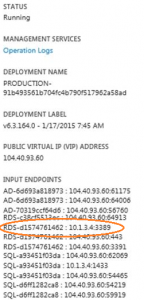

---
# required metadata

title: Deploy a high-availability environment on Azure (AX 2012) | Microsoft Docs
description: This article explains how to deploy a high availability environment on Microsoft Azure. To deploy the environment, you’ll use the Cloud-hosted environments tool in Microsoft Dynamics Lifecycle Services. 
author: kfend
manager: AnnBe
ms.date: 2015-12-09 14:53:28
ms.topic: article
ms.prod: 
ms.service: Lifecycle Services
ms.technology: 

# optional metadata

# keywords: 
# ROBOTS: 
audience: Developer, IT Pro
# ms.devlang: 
ms.reviewer: kfend
ms.suite: AX 2012
# ms.tgt_pltfrm: 
ms.custom: 21231
ms.assetid: da76b9d8-69cf-4594-8b05-f7ee006df1ac
ms.region: Global
# ms.industry: 
ms.author: kfend

---

# Deploy a high-availability environment on Azure (AX 2012)

This article explains how to deploy a high availability environment on Microsoft Azure. To deploy the environment, you’ll use the Cloud-hosted environments tool in Microsoft Dynamics Lifecycle Services. 

Prerequisites
-------------

Before you complete the procedures in this article, make sure that the following prerequisites are in place.

|                |                                                                                                                                                                 |
|----------------|-----------------------------------------------------------------------------------------------------------------------------------------------------------------|
| **Category**   | **Prerequisite**                                                                                                                                                |
| Required tasks | [Plan your Microsoft Dynamics AX 2012 R3 deployment on Azure](https://docs.microsoft.com/en-us/dynamics365/operations/dev-itpro/lifecycle-services/ax-2012/plan-your-microsoft-dynamics-ax-2012-r3-deployment-on-azure) |

 

## 1. Use Azure premium storage
Azure Premium Storage delivers high-performance, low-latency disk support for I/O intensive workloads running on Azure virtual machines (VMs). With Premium Storage, your applications can have up to 32 TB of storage per VM, achieve 50,000 IOPS (input/output operations per second) per VM, and have extremely low latencies for read operations. Premium Storage is recommended for running AX 2012 R3 in Azure to ensure predictable performance. For more information about using Premium Storage, see [Plan your Microsoft Dynamics AX 2012 R3 deployment on Azure](https://docs.microsoft.com/en-us/dynamics365/operations/dev-itpro/lifecycle-services/ax-2012/plan-your-microsoft-dynamics-ax-2012-r3-deployment-on-azure).

## 2. Log on to Lifecycle Services
Microsoft Dynamics Lifecycle Services provides a cloud-based collaborative workspace that customers and partners can use to manage Microsoft Dynamics AX projects. You’ll use this website to deploy AX 2012 R3 on Azure. Lifecycle Services is available to customers and partners as part of their support plans. You can access it with your CustomerSource or PartnerSource credentials. [Log on to Lifecycle Services](https://lcs.dynamics.com/en/)

## 3. Create a project
After you log in to Lifecycle Services, open an existing project, or create a new project. Projects are the key organizer of your experience in Lifecycle Services. The methodology associated with a project determines which phases and tasks are included in the project by default.

## 4. Connect the project to your Azure subscription
Connect the Lifecycle Services project to your Azure subscription. This will enable Lifecycle Services to deploy an AX 2012 R3 environment to the subscription. To connect the project to your Azure subscription, complete the following procedure. Keep in mind that a project can be connected to only one Azure subscription. If you have multiple Azure subscriptions, be sure to identify which subscription you want to use before you complete this procedure.

1.  Click **Cloud-hosted environments**. The **Cloud-hosted environments** page is displayed.
2.  The **Microsoft Azure setup** panel is displayed on the side of the screen. If it is not displayed, click **Microsoft Azure settings**.
3.  Enter your Azure subscription ID. If you need to find your subscription ID, complete the following steps:
    1.  Open another instance of your browser.
    2.  Log on to the Azure management portal.
    3.  In the navigation pane on the left, click **Settings**. (You may have to scroll to the bottom of the navigation pane to see the **Settings** link.) The **Settings** page is displayed.
    4.  Copy your subscription ID, and then paste it into the **Azure subscription ID** field in Lifecycle Services (which is currently displayed in another browser instance).

4.  Click **Next**.
5.  Click **Download** to download a management certificate. This management certificate enables Lifecycle Services to communicate with Azure on your behalf. By default, the management certificate is saved to the Downloads folder on your computer and is named LifecycleServicesDeployment.cer.
6.  Upload the management certificate to Azure. To do so, complete the following steps:
    1.  Open another instance of your browser. (Or, go to the browser instance that you may have opened in step 3.)
    2.  Log on to the Azure management portal.
    3.  In the navigation pane on the left, click **Settings**. The **Settings** page is displayed.
    4.  Click **Management certificates**.
    5.  Click **Upload** at the bottom of the page.
    6.  In the **Upload a management certificate** window, browse to the management certificate that you downloaded in step 5. Then click the check mark.

7.  Go back to the browser that displays the **Microsoft Azure setup** panel in Lifecycle Services. Click **Next**.
8.  Select the region that is closest to you. The AX 2012 R3 environment will be deployed to a datacenter in this region.
9.  Click **Connect**. The project is now connected to the Azure subscription that you specified. If you discover that you connected the project to the wrong Azure subscription (that is, assuming you have multiple Azure subscriptions), you’ll need to delete the project, create a new project, and then repeat this procedure to connect the new project to the appropriate Azure subscription.

## 5. Connect your corporate network to the Azure virtual network
The following sections provide information about how to configure the Azure virtual network and domain so that your corporate users can access AX 2012 R3. It is recommended that if you require login to these systems using corporate credentials that you set up the connectivity before you deploy the environment. This will require using Azure networking capabilities to extend you corporate network to one or more Azure virtual networks. It will additionally require you to deploy an Active Directory into the Azure virtual network, which will be set up for trust to your corporate Active Directory. This Active Directory will be used to manage VM-related resources in the Azure virtual network. This Active Directory will not be used for single sign-on, and should not be set up to sync the corporate directory. Single sign-on capabilities will be provided through the domain trust.

### Create a site-to-site VPN connection

To enable corporate users to access resources on the virtual machines in the Azure virtual network, you’ll need to create a site-to-site VPN connection between the Azure virtual network and your on-premises, corporate network. For information about how to do this, see:

-   [Virtual network overview](https://msdn.microsoft.com/en-us/library/windowsazure/jj156007.aspx)
-   [Virtual network configuration tasks](https://msdn.microsoft.com/en-us/library/jj156206.aspx)
-   [Set up a simulated hybrid cloud environment for testing](http://azure.microsoft.com/en-us/documentation/articles/virtual-networks-setup-simulated-hybrid-cloud-environment-testing/)
-   [Site-to-site VPN in Azure virtual network using Windows Server 2012 Routing and Remote Access Service (RRAS)](https://msdn.microsoft.com/library/dn636917.aspx)
-   [Configure a virtual network gateway in the management portal](https://msdn.microsoft.com/en-us/library/azure/jj156210.aspx)

### Create an active directory in Azure

An Active Directory is required in the Azure virtual network. An Active Directory can be deployed to the Azure virtual network. Please follow [Guidelines for Deploying Windows Server Active Directory on Azure Virtual Machines](https://msdn.microsoft.com/en-us/library/azure/jj156090.aspx). Please note that Active Directory Federation Services is not presently supported with AX 2012 R3. If you are providing the Active Directory, you will need to create the following service accounts within it that can be used by LCS deployment services when you deploy the environment.

<table>
<colgroup>
<col width="50%" />
<col width="50%" />
</colgroup>
<tbody>
<tr class="odd">
<td><strong>Account</strong></td>
<td><strong>Description</strong></td>
</tr>
<tr class="even">
<td>&lt;DomainName&gt;AXServiceUser</td>
<td>AX 2012 R3 service account</td>
</tr>
<tr class="odd">
<td>&lt;DomainName&gt;AOSServiceUser</td>
<td>AOS service account</td>
</tr>
<tr class="even">
<td>&lt;DomainName&gt;BCProxyUser</td>
<td>Business Connector proxy account</td>
</tr>
<tr class="odd">
<td>&lt;DomainName&gt;SPServiceUser</td>
<td>SharePoint service account</td>
</tr>
<tr class="even">
<td>&lt;DomainName&gt;SqlServiceUser</td>
<td>SQL Server service account</td>
</tr>
<tr class="odd">
<td>&lt;DomainName&gt;RetailServiceUser</td>
<td>Retail service account</td>
</tr>
<tr class="even">
<td>&lt;DomainName&gt;DynamicsInstallUser</td>
<td>AX 2012 R3 installation account<strong>Note:</strong> This account must have permission to join computers to the domain. To give this account permission, complete the following steps:
<ol>
<li>Click <strong>Start</strong>, click <strong>Run</strong>, type dsa.msc, and then click <strong>OK</strong>.</li>
<li>In the task pane, expand the domain node.</li>
<li>Locate and right-click the organizational unit that you want to modify, and then click <strong>Delegate Control</strong>.</li>
<li>In the <strong>Delegation of Control</strong> Wizard, click <strong>Next</strong>.</li>
<li>Click <strong>Add</strong> to add a specific user or a specific group to the list, and then click <strong>Next</strong>.</li>
<li>In the <strong>Tasks to Delegate</strong> page, click <strong>Create a custom task to delegate</strong>, and then click <strong>Next</strong>.</li>
<li>Click <strong>Only the following objects in the folder</strong>, and then from the list, click to select the <strong>Computer objects</strong> check box. Then, select the check boxes below the list, <strong>Create selected objects in this folder</strong> and <strong>Delete selected objects in this folder</strong>.</li>
<li>Click <strong>Next</strong>.</li>
<li>In the <strong>Permissions</strong> list, click to select the following check boxes:
<ul>
<li><strong>Reset Password</strong></li>
<li><strong>Read and write Account Restrictions</strong></li>
<li><strong>Validated write to DNS host name</strong></li>
<li><strong>Validated write to service principal name</strong></li>
</ul></li>
<li>Click <strong>Next</strong>, and then click <strong>Finish</strong>.</li>
<li>Close the <strong>Active Directory Users and Computers MMC</strong> snap-in.</li>
</ol></td>
</tr>
</tbody>
</table>

You will need to provide the passwords for these accounts when you deploy the environment.

### Create a domain trust

To enable corporate users to access resources on the virtual machines in your Azure domain, you must create an Active Directory trust between the domains. For information about how to create a trust, see [Create a Forest Trust](https://technet.microsoft.com/en-us/library/cc754626.aspx). This process is the same process you would use to create a trust between two on-premises domains.

### Give the Administrators group the right to log on as a batch group

Log in to the Active Directory domain controller and complete the following steps to give the built-in Administrators group the right to log on as a batch job.

1.  Click **Start**, click **All Programs**, and then click **Administrative Tools**.
2.  In the **Administrative Tools** menu, select **Group Policy Management**.
3.  In the **Group Policy Management console** tree, click **Forest: &lt;ServerName&gt;**, and then click **Domains**.
4.  Click the name of your server, expand **Domain Controllers**, right-click **Default Domain Controllers Policy**, and then click **Edit**.
5.  In the G**roup Policy Management Editor**, click **Default Domain Controllers Policy &lt;ServerName&gt; Policy**, expand **Computer Configuration**, and then click **Policies**.
6.  In the **Policies** tree, expand **Windows Setting**, and then click **Security Settings**.
7.  In the **Security Settings** tree, expand **Local Policies**, and then click **User Rights Assignment**.
8.  In the results pane, scroll to and then click **Log on as a batch job**.
9.  In the **Log on as a batch job Properties** dialog box, click **Add User or Group**.
10. In the **Add User or Group** dialog box, click **Browse**.
11. In the **Select Users, Computers, or Groups** dialog box, type Administrators.
12. Click **Check Names** to verify that the built-in Administrators account appears, and then click **OK** three times.

### Change the default organizational unit

If you want virtual machines to be added to Active Directory in a custom organizational unit—versus the default organizational unit—you can change the default organizational unit in your Active Directory prior to starting deployment. For more information, click [here](http://pc-addicts.com/server-2012-change-default-ou/).

## 6. Deploy a high availability environment on Azure
Complete the following procedure to deploy a high availability environment on Azure.

1.  On the **Cloud-hosted environments** page, click the Add (+) icon.
2.  In the **Select environment topology** panel, select **High availability**.
3.  Click **High availability**.
4.  In the **Environment name** field, enter a name for the environment that will be deployed.
5.  If you’ve created an estimate for a production environment using the Infrastructure estimator tool in Lifecycle Services, you’ll see the **Estimation** list. Select the estimate from this list. The number and size of virtual machines to be deployed will change based on the selected estimate. For more information about how to create an estimate, see [Infrastructure estimator (Lifecycle Services, LCS)](https://docs.microsoft.com/en-us/dynamics365/operations/dev-itpro/lifecycle-services/ax-2012/infrastructure-estimator-lifecycle-services-lcs).
6.  Click **Advanced settings**.
7.  To customize domain settings, click **Customize domain settings**. Then use the following table to enter information.
    <table>
    <colgroup>
    <col width="50%" />
    <col width="50%" />
    </colgroup>
    <tbody>
    <tr class="odd">
    <td><strong>If you want to:</strong></td>
    <td><strong>Do this:</strong></td>
    </tr>
    <tr class="even">
    <td>Create a new domain in Azure for the environment</td>
    <td><ol>
    <li>Click <strong>New domain</strong>.</li>
    <li>Enter a name for the domain. By default, the domain is named <em>contoso.com</em>.</li>
    </ol></td>
    </tr>
    <tr class="odd">
    <td>Add the environment to an existing domain in Azure</td>
    <td><ol>
    <li>Click <strong>Existing domain</strong>.</li>
    <li>Enter the name of the domain. For example, <em>contoso.com</em>.</li>
    </ol></td>
    </tr>
    </tbody>
    </table>

8.  To customize the service accounts that will be created in the domain, click **Customize service accounts**. Service accounts and/or service account passwords may be specified through the **Advanced Settings** option for a deployment. If neither is provided, default accounts are used and random passwords are selected. Use these features when you want to maintain account naming and password rules for your corporation. Account and password rules:
    -   A valid service name must be less than 20 characters with no special characters.
    -   A valid password must be more than 8 characters and contain uppercase letters, lowercase letters, numbers, and at least one of the following characters: \['@', '!', '=', '\*'\] You can’t use common passwords, such as: pass@word1

9.  To select the version of AX 2012 R3 that you want use, click **Supported version**. By default, the AX 2012 R3 CU8 version of this environment will be deployed. If you don’t want to use the CU8 version, select **Dynamics ERP 2012 R3 RTM** from the list.
10. To customize virtual machine names, click **Customize virtual machine names**. In order to support common IT naming guidelines, the ability to name virtual machines is provided through the **Advanced settings** option on most deployment topologies. In addition to defining the name, a starting index can be selected for each virtual machine type. The index is incremented for each instance of the virtual machine type that is deployed. Virtual machine names must be 13 characters or less. The index is separated from the machine name by a hyphen (-), followed by the index that supports a maximum of 2 digits. Example: ACustomVMName-99 When virtual machine instances are added to an environment after the initial deployment, the deployment service will start incrementing the virtual machine name where it left off. For example, if you deployed four AOS virtual machines with a starting index of 2, then the last AOS instance name will be AOS-6. If you add two more AOS instances, they will be AOS-7 and AOS-8. If one of the virtual machine types in your deployment is customized, then all of the virtual machine names must be customized. This is done to ensure that a long deployment does not occur because a virtual machine name was accidentally missed.
11. To enter SQL Server configuration options, click **Customize SQL Server configuration**. Select the SQL Server image you want to use, as well as the number and size of disks that will be attached to the SQL Server virtual machines. For more information, see [Plan your Microsoft Dynamics AX 2012 R3 deployment on Azure](https://docs.microsoft.com/en-us/dynamics365/operations/dev-itpro/lifecycle-services/ax-2012/plan-your-microsoft-dynamics-ax-2012-r3-deployment-on-azure).
12. If you have selected to deploy a Remote Desktop Services virtual machine, click **Customize remote desktop services** to specify how your users will access AX 2012 R3 via the web. Select one of the following options:
    -   **Remote Desktop:** This option enables users to login to a full remote desktop.
    -   **RemoteApp Programs:** This option enables users to login in to AX 2012 R3 directly, without having the experience of a full desktop window. RemoteApp is enabled by default.

    After the environment has been deployed, the following links are available to you on the **Cloud-hosted environments** page:
    -   **RDS Web Access certificate**: This is a self-signed certificate that is provided to allow secured access to the RDS Web Access site. Click the link and open this certificate and install it into the **Local Machine** &gt; **Trusted Root Certification Authorities** node before attempting to access the RDS Web Access site. It is recommended that before this environment be placed into a production capacity that you install your own certificate to the RDS cluster.
    -   **RDS Web Access**: This allows users to gain access to the AX 2012 R3 environment over the web. If you chose the **Remote Desktop** option, users will be offered the ability to login to a full remote desktop. If you chose **RemoteApp Programs**, users will be able to log in directly to AX 2012 R3.
    -   **RDS Farm Access**: This allows users to gain access to the AX 2012 R3 environment over a VPN connected network. This feature is only available if you have:
        1.  Joined this AX deployment to a VPN connected corporate domain.
        2.  Configured the RDS Gateway to accept connections from the VPN connected network.

    **Note:** For both **RDS Web Access** and **RDS Farm Access**, when joining a deployment to an existing Active Directory domain you must add the RDS Farm to your AD/DNS with the IP address of the Internal Load Balancer. See the following steps:
    1.  Get the name of your RDS Farm: This can be obtained from the RDS Farm Access link in LCS. In this case, it should be **RdsFarm0c0fa75**.

        

    2.  Get the IP of the Internal Load Balancer from the Cloud Service dashboard in Azure Portal. Inspect the RDS machine that has an internal IP next to port **3389**. In the below example, the Internal Load Balancer IP is 10.1.3.4.

        

    3.  Add the RDS Farm as a Computer in your AD, using the information obtained above.

        

    Failure to do these steps results in the following error when going through RD Web Access: *Remote Desktop can't find the computer "RdsFarm0c0fa75.contoso.com". This might mean that " RdsFarm0c0fa75.contoso.com" does not belong to the specified network. Verify the computer name and domain that you are trying to connect to.*
13. To customize virtual network settings, click **Customize virtual network**. Then use the following table to enter information.
    <table>
    <colgroup>
    <col width="50%" />
    <col width="50%" />
    </colgroup>
    <tbody>
    <tr class="odd">
    <td><strong>If you want to:</strong></td>
    <td><strong>Do this:</strong></td>
    </tr>
    <tr class="even">
    <td>Create a new virtual network in Azure for the environment</td>
    <td><ol>
    <li>Click <strong>New virtual network</strong>.</li>
    <li>Enter a name for the virtual network.</li>
    </ol></td>
    </tr>
    <tr class="odd">
    <td>Add the environment to an existing virtual network in Azure</td>
    <td><ol>
    <li>Click <strong>Existing virtual network</strong>.</li>
    <li>In the <strong>Virtual network name</strong> field, select the name of the existing virtual network that you want to use.
    <table>
    <colgroup>
    <col width="100%" />
    </colgroup>
    <tbody>
    <tr class="odd">
    <td><strong>Note</strong></td>
    </tr>
    <tr class="even">
    <td>To view details about a virtual network, complete the following steps:
    <ol>
    <li>Log on to the <a href="https://manage.windowsazure.com/">Azure management portal</a>.</li>
    <li>In the navigation pane on the left, click <strong>Networks</strong>.</li>
    <li>Click the name of the virtual network that you want to view details about.</li>
    <li>Click <strong>Configure</strong>. Details about the virtual network are listed on the page.</li>
    </ol></td>
    </tr>
    </tbody>
    </table></li>
    <li>In the <strong>Address space</strong> field, select the appropriate address space for your deployment.</li>
    <li>In the <strong>Application subnet name</strong> field, select the appropriate address space for application VMs.</li>
    <li>In the <strong>SQL Server High Availability subnet name</strong> field, select the appropriate address space for SQL Server VMs. <strong>Note</strong> Note the following:
    <ul>
    <li>You can select the same address space that you selected in the <strong>Application subnet name</strong> field.</li>
    <li>This subnet must have 4 IP addresses available in it.</li>
    </ul></li>
    <li>In the <strong>Active Directory subnet</strong> field, do the following:
    <ul>
    <li>If you chose to create a <strong>new domain</strong> in Azure for your environment: Enter an IP address and subnet mask for the new Active Directory subnet. Lifecycle Services will create this subnet for you.</li>
    <li>If you chose to add the environment to an <strong>existing domain</strong> in Azure: Enter the IP address of the existing Active Directory subnet. <strong>Note</strong> : This subnet must have 3 IP addresses available in it.</li>
    </ul></li>
    </ol></td>
    </tr>
    </tbody>
    </table>

14. Click **Done**. The **Deploy environment** panel is redisplayed.
15. The number and size of each virtual machine that will be deployed is listed. Change the number and size of the virtual machines, as needed.
    -   For information about the software installed on each virtual machine in this environment, see the High availability environment section in the article, [Plan your Microsoft Dynamics AX 2012 R3 deployment on Azure](https://docs.microsoft.com/en-us/dynamics365/operations/dev-itpro/lifecycle-services/ax-2012/plan-your-microsoft-dynamics-ax-2012-r3-deployment-on-azure).
    -   For sizing and pricing details about virtual machines, see [Virtual machines pricing details](http://azure.microsoft.com/en-us/pricing/details/virtual-machines/).

16. Click **Software License Terms** to review the licensing terms and conditions. Then select the check box to indicate that you agree to the terms.
17. Click **Next**.
18. Click **Deploy to confirm** that you’re ready to deploy the environment. The deployment may take a few hours to complete. When the deployment is done, the **Deployment Status** column on the **Cloud-hosted environments** page will display **Deployed**. (You may need to refresh your browser to see this.) If the deployment fails, you may see an error message right away. If the error occurs later in the deployment process, error details will be displayed in the details pane on the right-side of the page.

## 7. Prepare AX 2012 R3 for use
Now that the environment has been deployed on Azure, you must set up and configure AX 2012 R3 for use. See the following sections for more information.

### Log on to an AOS virtual machine

Log on to an AOS- virtual machine using the DynamicsInstallUser account. For instructions, see the “How do I log on to a virtual machine?” section of the [Manage your Microsoft Dynamics AX 2012 R3 deployment on Azure](https://docs.microsoft.com/en-us/dynamics365/operations/dev-itpro/lifecycle-services/ax-2012/manage-your-microsoft-dynamics-ax-2012-r3-deployment-on-azure) article.

### Compile AX 2012 R3

Compile AX 2012 R3 by using AxBuild.exe. For instructions, see [AxBuild.exe for Parallel Compile on AOS of X++ to p-code](https://technet.microsoft.com/en-us/library/dn528954.aspx).

### Initialize AX 2012 R3

Open the AX 2012 R3 client and complete the initialization checklists. For instructions, see [Initialization checklists](https://technet.microsoft.com/en-us/library/aa497061.aspx).

### Install sample data

If you want sample data installed in your environment, complete the following steps.

1.  Log on to a SQL-&lt;GUID&gt; virtual machine. Log on to the virtual machine using the DynamicsInstallUser account. For instructions, see the “How do I log on to a virtual machine?” section of the [Manage your Microsoft Dynamics AX 2012 R3 deployment on Azure](https://docs.microsoft.com/en-us/dynamics365/operations/dev-itpro/lifecycle-services/ax-2012/manage-your-microsoft-dynamics-ax-2012-r3-deployment-on-azure) article.
2.  Go to the following location on the virtual machine: F:TestTransferTool
3.  Install the Test Data Transfer Tool. For instructions, see [Install the Test Data Transfer Tool (beta) for Microsoft Dynamics AX](https://docs.microsoft.com/en-us/dynamics365/operations/dev-itpro/lifecycle-services/ax-2012/install-the-test-data-transfer-tool-beta-for-microsoft-dynamics-ax).
4.  Open a command prompt and navigate to the following location: C:Program Files (x86)Microsoft Dynamics AX 2012 Test Data Transfer Tool (Beta)
5.  Run the following command: dp.exe import F:DemoData MicrosoftDynamicsAx

**Note:** The sample data includes trial license keys for AX 2012 R3. If you choose not to install the sample data, you can download trial license keys—for development or testing purposes—from [CustomerSource](https://mbs.microsoft.com/downloads/customer/AX/AXDemoTools/MicrosoftDynamicsAX2012R2v4DemoLicense.zip) or [MSDN](https://msdn.microsoft.com/en-us/subscriptions/securedownloads/hh442898#FileId=57028).

### Give users access

To enable your users to access AX 2012 R3, complete the following tasks:

-   Add each user’s domain account to the Remote Desktop Users group on the CLI- virtual machine.
-   Give users access to AX 2012 R3. For instructions, see [Create new users in Microsoft Dynamics AX](https://technet.microsoft.com/en-us/library/aa548139.aspx).

**Note:** If you don’t want to create a VPN connection and a domain trust, you can still give users access to AX 2012 R3. To do so, you’ll need to log on to the virtual machine that serves as the domain controller, and create domain accounts for each user. Then, you’ll need to complete the two tasks mentioned above.

### Set up and configure AX 2012 R3

The procedures for setting up and configuring AX 2012 R3 on Azure are the same procedures used for setting up and configuring on-premises deployments. See the following resources for more information.

<table>
<colgroup>
<col width="50%" />
<col width="50%" />
</colgroup>
<tbody>
<tr class="odd">
<td><strong>Task</strong></td>
<td><strong>Resources</strong></td>
</tr>
<tr class="even">
<td>See the instructions on TechNet</td>
<td><ul>
<li><a href="https://technet.microsoft.com/en-us/library/gg732218.aspx">System setup for Microsoft Dynamics AX</a></li>
<li><a href="https://technet.microsoft.com/en-us/library/gg732158.aspx">The Microsoft Dynamics AX client</a></li>
<li><a href="https://technet.microsoft.com/en-us/library/gg731868.aspx">Application Object Servers</a></li>
<li><a href="https://technet.microsoft.com/en-us/library/ee873263.aspx">Reporting in Microsoft Dynamics AX</a> <strong>Note:</strong> Be default, reports are deployed to one business intelligence (BI) virtual machine. For each additional BI virtual machine in your environment, you’ll need to:
<ol>
<li><a href="https://technet.microsoft.com/EN-US/library/dd309703.aspx">Deploy the default reports.</a></li>
<li><a href="https://technet.microsoft.com/EN-US/library/aa496432.aspx">Grant users access to the reports.</a></li>
<li>Open the <a href="https://technet.microsoft.com/EN-US/library/aa548504.aspx">Report servers form</a> to connect each AOS instance with each SSRS instance. To see a step-by-step procedure of how to this is done, see <a href="https://technet.microsoft.com/en-us/library/hh389773.aspx">Connect Microsoft Dynamics AX to the new Reporting Services instance</a>.</li>
</ol></li>
<li><a href="https://www.microsoft.com/en-us/download/details.aspx?id=5916">Management Reporter 2012</a></li>
<li><a href="https://technet.microsoft.com/en-us/library/ee873272.aspx">Analytics in Microsoft Dynamics AX</a> <strong>Note:</strong> To process the cubes that are included with AX 2012 R3, we recommend that you increase the ExternalCommandTimeout value to 7200. For more information, see <a href="http://www.basarat.com/2011/04/ssas-error-in-processing-dimension.html">SSAS Error in processing a dimension: HYT00, Query Timeout Expired</a> on the <a href="http://www.basarat.com/">Coding Rocks!</a> blog.</li>
<li><a href="https://technet.microsoft.com/en-us/library/gg866975.aspx">Help server</a></li>
<li><a href="https://technet.microsoft.com/en-us/library/gg751374.aspx">Enterprise Portal and Role Centers</a> <strong>Note:</strong> Enterprise Portal is configured to run on port 81, so be sure to exclude that port in your firewall settings.</li>
<li><a href="https://technet.microsoft.com/en-us/library/gg731850.aspx">Enterprise Search</a></li>
<li><a href="https://technet.microsoft.com/en-us/library/gg731810.aspx">Services and Application Integration Framework (AIF)</a></li>
<li><a href="https://technet.microsoft.com/en-us/library/jj710398.aspx">Microsoft Dynamics AX Retail for IT pros and developers</a></li>
<li><a href="https://technet.microsoft.com/en-us/library/aa834453.aspx">.NET Business Connector</a></li>
<li><a href="https://technet.microsoft.com/en-us/library/gg731779.aspx">Security</a></li>
</ul></td>
</tr>
<tr class="odd">
<td>View printable guides and white papers</td>
<td><ul>
<li><a href="https://technet.microsoft.com/en-us/library/gg732268.aspx">Printable guides</a></li>
<li><a href="https://technet.microsoft.com/en-us/library/gg188985.aspx">White papers for system administrators</a></li>
</ul></td>
</tr>
<tr class="even">
<td>Use the Microsoft Dynamics AX web search tool</td>
<td><ul>
<li><a href="http://go.microsoft.com/fwlink/?LinkID=212924">Web search for developers</a></li>
<li><a href="http://go.microsoft.com/fwlink/?LinkID=212925">Web search for system administrators</a></li>
<li><a href="http://go.microsoft.com/fwlink/?LinkID=212922">Web search for application users</a></li>
<li><a href="http://go.microsoft.com/fwlink/?LinkID=194311">Combined web search</a></li>
</ul></td>
</tr>
</tbody>
</table>

## 8. Prepare the whole environment for use
The following sections provide information to help you configure this environment for use.

### Understand the high availability architecture

To provide redundancy, virtual machines are grouped in *availability sets*. Availability sets ensure that during a planned or unplanned maintenance event, at least one virtual machine in the availability set is running. Each virtual machine in an availability set is assigned an **update domain** and a **fault domain** by the underlying Azure platform.

-   **Update domain:** An update domain defines the group of virtual machines that share a same update schedule.
-   **Fault domain:** A fault domain defines the group of virtual machines that share a common power source and network switch.

The high availability environment includes an availability set for each tier of virtual machines. For example, there is an availability set for the domain controllers, the database servers, the AOS servers, and so on.

### Install the data import/export framework and RapidStart Connector

For high availability, the **Data import/export framework** and the **RapidStart Connector** should be installed on all virtual machines that are AOS servers. You may need to install these components. For instructions, see: • [Install the Data import/export framework (DIXF, DMF)](https://docs.microsoft.com/en-us/dynamics365/operations/dev-itpro/lifecycle-services/ax-2012/install-the-data-importexport-framework-dixf-dmf) • [Install the RapidStart Connector](https://technet.microsoft.com/en-us/library/hh771574.aspx)

### Configure Microsoft SQL Server Reporting Services for load balancing

The BI servers in the environment host Microsoft SQL Server Reporting Services. To configure Reporting Services for load balancing, see the [Configure SSRS for load balancing in your Azure deployment](http://blogs.msdn.com/b/axsupport/archive/2015/06/25/configure-ssrs-for-load-balancing-in-your-azure-deployment.aspx) blog post.

### Join Enterprise Portal servers in a single server farm

When Lifecycle Services deploys Enterprise Portal servers, each server is deployed into its own server farm. To join all Enterprise Portal servers in a single server farm, see [Join Enterprise Portal servers in a single server farm](https://docs.microsoft.com/en-us/dynamics365/operations/dev-itpro/lifecycle-services/ax-2012/join-enterprise-portal-servers-in-a-single-server-farm).

### Configure the environment for optimal performance

Configure the environment for optimal performance by completing the following tasks: • [Initialize database files](https://msdn.microsoft.com/en-us/library/ms175935.aspx) • [Enable lock pages](https://technet.microsoft.com/en-us/library/ms190730.aspx) • [Improve client startup times by configuring clients to use roaming profiles](https://technet.microsoft.com/en-us/library/dn479031.aspx)

### Learn more about the high availability configuration

To learn more about how we’ve configured this environment for high availability, see the following resources:

-   [FSMO placement and optimization on Active Directory domain controllers](http://support.microsoft.com/kb/223346)
-   [Configure SQL Server and storage settings](https://technet.microsoft.com/en-us/library/dd309734.aspx)
-   [WSFC Quorum Modes and Voting Configuration](https://msdn.microsoft.com/en-us/library/hh270280.aspx)
-   [Remote Desktop Cmdlets in Windows PowerShell](https://technet.microsoft.com/en-us/library/jj215451.aspx)

## 9. Learn more about the service accounts for this environment
The following sections provide information about the service accounts that were created when you deployed the environment.

### Domain accounts

The following table lists the domain accounts that were created when you deployed the environment.

**Domain account**

**Description**

**Password**

&lt;DomainName&gt;AOSServiceUser

The account used to run the following services:

-   Microsoft Dynamics AX Object Server

The passwords are displayed on the Cloud-hosted environments page in [Lifecycle Services](https://lifecycleservices.dynamics.com/en/).

&lt;DomainName&gt;SQLServiceUser

The account used to run the following services:

-   SQL Server Analysis Services (MSSQLSERVER)

&lt;DomainName&gt;DynamicsInstallUser

The account used to install AX 2012 R3.

&lt;DomainName&gt;SPServiceUser

The account used to run the following services:

-   AppFabric Caching Service
-   SharePoint Search Host Controller
-   SharePoint Server Search 15
-   SharePoint Timer Service
-   SharePoint User Code Host

&lt;DomainName&gt;BCProxyUser

The account used as the Business Connector proxy.

&lt;DomainName&gt;AXServiceUser

The account used to run the following services:

-   Microsoft Dynamics AX Data Import/Export Framework Service
-   Microsoft Dynamics ERP RapidStart Connector

&lt;DomainName&gt;RetailServiceUser

The account used to run the following services:

-   Microsoft Dynamics AX for Retail Commerce Data Exchange Async Client

### Local administrator accounts

Each virtual machine that you deployed has a local administrator account. This account is: builtinaxlocaladmin. The passwords for the local administrator accounts are displayed on the **Cloud-hosted environments** page in Lifecycle Services.

