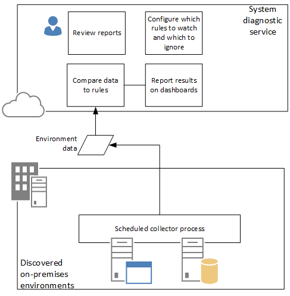

---
# required metadata

title: System diagnostics 
description: 
author: kfend
manager: AnnBe
ms.date: 04/04/2017
ms.topic: article
ms.prod: 
ms.service: Dynamics365Operations
ms.technology: 

# optional metadata

# ms.search.form: 
# ROBOTS: 
audience: Developer, IT Pro
# ms.devlang: 
ms.reviewer: annbe
ms.search.scope: AX 2012
# ms.tgt_pltfrm: 
ms.custom: 19061
ms.assetid: 9a217373-f72b-4a28-adef-79900e40c872
ms.search.region: Global
# ms.search.industry: 
ms.author: murtazac
ms.search.validFrom: 
ms.dyn365.ops.version: 2012

---

# System diagnostics (AX 2012)

[!include[banner](../includes/banner.md)]

In Microsoft Dynamics Lifecycle Services, the System diagnostics helps administrators monitor and understand the health of one or more Microsoft Dynamics AX environments. It is a cloud-based tool that has a locally-installed component that can be configured to perform the following tasks:
-   Discover on-premises Microsoft Dynamics AX environments (database instances and Microsoft Dynamics AX Application Object Server (AOS) instances).
-   Collect data from the environments that were discovered.
-   Run rules on the collected data.
-   Report rule violations on a dashboard.
-   Provide reports.

Data is collected by using jobs that run on predefined schedules. The following diagram describes how System diagnostics and the locally-installed components interact.
System diagnostic service

 System diagnostics supports the following versions of Microsoft Dynamics AX:
-   Microsoft Dynamics AX 2012 R2
-   Microsoft Dynamics AX 2012 Feature Pack
-   Microsoft Dynamics AX 2012
-   Microsoft Dynamics AX 2012 R3

## Prerequisites
Before you can use the System diagnostics, you must complete the following tasks:
-   Download and run the installer for the Diagnostic service.
-   Run the Discovery wizard.
-   Schedule or run data collection.

## Getting started
The following topics explain how to install and use System diagnostics.
-   [Install and run System diagnostics (Lifecycle Services)](install-run-system-diagnostics-lcs.md)
-   [Use System diagnostics (Lifecycle Services)](system-diagnostics-lcs.md)

