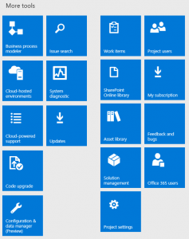

---
# required metadata

title: Set up technical support for Dynamics 365 for Operations
description: This article provides information about the support experience in the current version of Microsoft Dynamics AX. It describes the setup that is required in Dynamics AX, Microsoft Visual Studio Online, and Microsoft Dynamics Lifecycle Services, and also explains how to create and work with support issues.
author: kfend
manager: AnnBe
ms.date: 2016-01-14 23 - 38 - 09
ms.topic: article
ms.prod: 
ms.service: Dynamics365Operations
ms.technology: 

# optional metadata

# ms.search.form: 
# ROBOTS: 
audience: Developer, IT Pro
# ms.devlang: 
ms.reviewer: annbe
ms.search.scope: AX 7.0.0, Operations
# ms.tgt_pltfrm: 
ms.custom: 29531
ms.assetid: 3734bd06-6d4c-42f5-8f2b-30a451189002
ms.search.region: Global
# ms.search.industry: 
ms.author: anupams
ms.dyn365.ops.intro: 01-02-2016
ms.dyn365.ops.version: AX 7.0.0

---

# Set up technical support for Dynamics 365 for Operations

This article provides information about the support experience in the current version of Microsoft Dynamics AX. It describes the setup that is required in Dynamics AX, Microsoft Visual Studio Online, and Microsoft Dynamics Lifecycle Services, and also explains how to create and work with support issues.

 Prerequisites
--------------

A Microsoft Azure Active Directory (AAD) account. This account is created during the setup of the Microsoft Dynamics 365 for Operations subscription.

## Create a Visual Studio Team Services project
The **Support** tile in a Lifecycle Services project uses Microsoft Visual Studio Team Services (VSTS) to store issues that are submitted through the Dynamics AX client and issues that are manually created from the **Support** tile. This functionality requires that a VSTS project be configured in the Lifecycle Services (LCS) project that you want to use for CPS. All users who need to use the **Support** tile to submit an issue must have access to the VSTS project, and must authorize LCS to access VSTS on his or her behalf. Most Dynamics 365 for Operations users don't have access to LCS or VSTS. Therefore, in the VSTS project, you should create a special system account that Dynamics 365 for Operations can use to submit issues.

### Create a new VSTS project

1.  Go to <https://www.visualstudio.com/>.
2.  Click **Sign in** in the upper-right corner.
3.  Sign in by using an AAD account that is in the tenant that your Dynamics 365 for Operations subscription is linked to. If the browser already has your credentials, you won't see the sign-in page and should instead click your name in the upper-right corner.
4.  On the right side of the page, under **Accounts**, click **Create a free account now**.
5.  Specify an account URL, and then click **Create Account**.
6.  Name your project, and specify a process template. Your project should now be created.

### Add users to the VSTS project

1.  In the upper-left corner, click **Team Services**.
2.  On the **Users **tab, click **Add**, and invite users who will use the Support experience to the VSTS account. For each user that you invite, select either **Basic** or **Stakeholder**.
3.  In the upper-left corner, click **Team Services**.
4.  Click **Browse**, and browse to the project that you created in the previous procedure.
5.  In the **Members** section of the project home page, click **Add**, and add the users that you invited in step 2.

### Create the Support system user

1.  Create a new user in your AAD tenant, and enter a descriptive name, such as **LcsCpsSystemAccount**.
2.  In the upper-left corner, click **Team Services**.
3.  On the **Users **tab, click **Add**, and invite the system user that you created in step 1. For this user, select **Stakeholder**.
4.  In the upper-left corner, click **Team Services** again.
5.  Click **Browse**, and browse to the project that you created earlier.
6.  In the **Members** section of the project home page, click **Add**, and add the system user.

### Retrieve the personal access token for the CPS system user

1.  Sign out of Team Services by clicking the user name in the upper-right corner and then clicking **Sign out**.
2.  Sign in to Team Services by using the Support system account that you created in the previous procedure.
3.  In the upper-right corner, click the user name, and then click **My profile**.
4.  On the **Security** tab, on the **Personal access tokens** tab, click **Add**.
5.  Enter a description, such as **LCS Support system account**.
6.  Select an expiry of one year.
7.  Click **Selected scopes**, and the select **Work items (read and write)**.
8.  Click **Create token**.
9.  Copy the token and paste it in a safe location, because it won't be accessible after you move away from the page.

## Configure LCS
1.  Sign in to LCS by using an account that has the **Owner** role for the LCS project that Dynamics AX is deployed in.
2.  Open the project in LCS.
3.  Click **Project settings**, and then click the **Visual Studio Team Services** link.
    |                                                                                                                                                                                          |                                                                                                                                                                                                                |
    |------------------------------------------------------------------------------------------------------------------------------------------------------------------------------------------|----------------------------------------------------------------------------------------------------------------------------------------------------------------------------------------------------------------|
    |  |  |

4.  Click **Setup Visual Studio Team Services.**
5.  In the **Visual Studio Team Services site URL** field, enter the URL of the VSTS project that you created in the previous section.
6.  In the **Personal access token** field, enter the personal access token that you created in the previous section. 
7.  Click **Continue**.
8.  Select the VSO project to use, and then click **Continue**.
9.  Click **Save**.
10. Click **Authorize**.
11. In the confirmation message box, click **OK**.
12. Sign in to Visual Studio Online.
13. Click **Accept**.

## Create an issue in the Dynamics 365 for Operations client (Microsoft Dynamics AX 7.0, Microsoft Dynamics AX Platform update 1 or update 2, or Microsoft Dynamics 365 for Operations platform update 3)
If you are on Microsoft Dynamics 365 for Operations platform update 4, or if you have consumed KB 4010473 for Platform update 3, skip to the next section.

1.  In the Dynamics AX client, click the **Help** menu, or question mark icon, in the upper right corner. 
2.  Click **Contact your support team**.
3.  Enter information in the **Issue** and **Description** fields.
4.  Optional: Enter time when issue occurred (Platform Update 3 feature)
5.  Optional: Set the work stoppage fields to **Yes**.
6.  Optional: Upload a Dynamics AX task recording.
7.  Set the option to share your email address with LCS to **Yes**. The **Submit** button won't be available unless you share your email address.
8.  Click **Submit**. 

                                          You should receive a confirmation message that states that the issue has been submitted to LCS. Users who are in the **Operations users** role are notified that a new issue has been submitted to LCS. To view the issue that was submitted, click the **Support** tile in the LCS project that is associated with this Dynamics AX instance.

## Create an issue in the Dynamics 365 for Operations client (Microsoft Dynamics 365 for Operations platform update 4 and platform update 3 KB 4010473)
If you have not taken platform update 4 for Microsoft Dynamics 365 for Operations, or if you have not consumed KB 4010473 for platform update 3, complete the procedure in the previous section. The Support experience has been updated to show updates that are published by Microsoft within the Dynamics 365 for Operations client. In Dynamics 365 for Operations, on the top bar, click **?**, and then click **Support**.  **Note:** If you haven’t already connected to Lifecycle Services (LCS) before you will see a dialog to connect to LCS. Click the link to connect before proceeding. 

### Search for a fix

After you connect to LCS, you can search for existing Microsoft published updates (fixes). Enter your issue in the Search box and press Enter. **Note:** If you don't want the functionality to search for existing fixes enabled for all users, you can remove the **SearchExistingFixes** duty from the System user role and add it to only those roles which you want to have this functionality. Search results are based on the Microsoft Issue Search data that is relevant to your environment. Fixes you have already installed** **will not be included in your search results. To view a specific result, click on the link to view the details. Based on the duties which are assigned to you in Microsoft Dynamics 365 for Operations, you will see either the **Download view **or the **Request view**. **Download View: **By default, this view is only available to system administrators . From this view, you can directly download the hotfix. **Note:** The duty **DownloadHotfix** controls the ability to directly download fixes from LCS rather than requesting them. Only System Administrators will have access to it by default. If you want to assign this duty to users other than System Administrators, you can do so by adding the duty to the selected roles. **Request View:** By default, this view is available to all users who are not system administrators. From this view, you can make a request to download the hotfix. After you submit your request to download the hotfix, a work item will be created in the VSTS project that is associated to your LCS project. The customer IT admin can view all requested hotfixes by clicking the **Support** tile in LCS and then clicking on the **Hotfix requests** tab. .

#### Create and submit a new issue

If you don’t see a fix in the search results, you can create a new issue by clicking **Create**. This is same functionality that is available for previous releases and is documented in earlier procedures.

### 

## Work with issues in LCS
### View issues

In LCS Support tile for Dynamics AX, issues are stored as work items in the VSTS project that is associated with the LCS project. Specifically, issues are stored as work items of the **Issue** or **Impediment** type, depending on the type of VSTS project, in the **AxAndLcsGeneratedIssues** area. Every work item of one of those types in that area will be included in the list of issues in Support tile. If an issue is modified in VSTS, the changes will be reflected in Support issues. Issues can be assigned to any user in the VSTS project. Users don't have to have access to LCS to work with issues in VSTS.

1.  Go to [lcs.dynamics.com,](https://lcs.dynamics.com/en/) and sign in.
2.  Open the LCS project that is associated with the Dynamics AX environment to view issues for.
3.  Click the **Support** tile. A list of the issues that have been created appears.

### Edit issues

1.  In the issue grid, click the title of an issue.
2.  If necessary, sign in to Visual Studio Team Services by using an account that has access to the VSTS project that you set up in the Set up a Visual Studio Team Services account and project" section. **Note:** There is an issue in VSTS, where the link to edit work items doesn't work correctly if sign-in is required. If you see the **Assigned to me** query after you sign in to VSTS, go back to LCS, and click the title of the issue in the issue grid again.
3.  The VSTS editor opens. Edit the issue, and then save your changes. The changes will be reflected in Support tile.

### Troubleshoot issues

Issues that are created through the Dynamics AX client contain metadata about the Dynamics AX environment. When those issues are selected in the issue grid, the **Troubleshoot** button becomes available. When you click **Troubleshoot**, the **Event monitoring** page opens. This page lets you access events and logs that are related to the issue. The page shows activities, error messages, and other information that has occurred within the last two hours since an issue was reported.  

### Submit an issue to Microsoft

You can submit issues to Microsoft support. When you submit an issue to Microsoft, the information and attachments in the issue can be included in the Microsoft support incident. **Note:** LCS users must have a **valid Microsoft support plan** to submit issues to Microsoft. If you have trouble submitting issues to Microsoft, work with your administrator to make sure that your LCS credentials are added to or associated with your organization's support plan with Microsoft Partner Source Business Center.

1.  In the issue grid, select the issue to submit to Microsoft, and then click **Submit to Microsoft**.
2.  If your account is associated with multiple support organizations, select the organization to use to create the Microsoft support incident.
3.  Use Issue Search to verify that your issue hasn't already been solved.
4.  If Issue Search doesn't provide a solution to your issue, click **Create incident** at the bottom of the page.
5.  Share diagnostic data with the Microsoft support team. By providing information about your Dynamics AX version, your issues can be resolved more quickly.
6.  Describe your issue, and provide contact information.
7.  Click **Submit**.

## Support settings in Dynamics AX
When you deploy Dynamics AX from Microsoft Dynamics Lifecycle Services (LCS), no configuration is required, because Support tool automatically saves any issues to the same LCS project that Dynamics AX was deployed from. To verify the LCS project that CPS uses, go to **System administration** &gt; **Setup** &gt; **System parameters**, and then click **Help** &gt; **Support Contact**. 

## Prevent users from creating issues from the AX client
By default, the System User role has the privilege, *SysLCSCPSIssueEntry* assigned. This privilege controls access to the **Contact your support team** menu item on the help menu. If you want to prevent users from being able to create and submit issues from the AX client, remove this privilege from the System User role.

