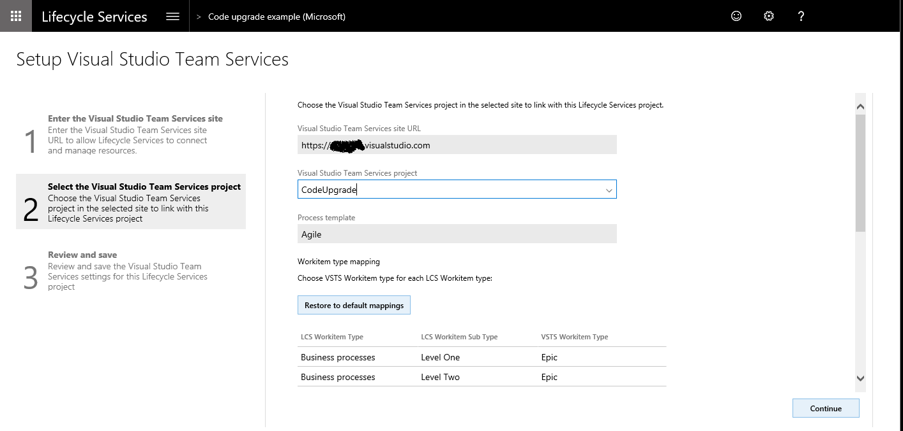

---
# required metadata

title: Configure the code upgrade service in Lifecycle Services
description: This topic explains how to configure the <strong>Code upgrade </strong>tile in Lifecycle Services (LCS) to migrate your solution to the latest version of Dynamics 365 for Operations.
author: MargoC
manager: AnnBe
ms.date: 04/04/2017
ms.topic: article
ms.prod: 
ms.service: Dynamics365Operations
ms.technology: 

# optional metadata

# ms.search.form: 
# ROBOTS: 
audience: Developer, IT Pro
# ms.devlang: 
# ms.reviewer: 61
ms.search.scope: AX 7.0.0, Operations
# ms.tgt_pltfrm: 
ms.custom: 265594
ms.assetid: 964b5a15-9b9c-434c-a4c2-e14406ebfaeb
ms.search.region: Global
# ms.search.industry: 
ms.author: tabell
ms.search.validFrom: 2016-02-28
ms.dyn365.ops.version: AX 7.0.0

---

# Configure the code upgrade service in Lifecycle Services

This topic explains how to configure the <strong>Code upgrade </strong>tile in Lifecycle Services (LCS) to migrate your solution to the latest version of Dynamics 365 for Operations.

Overview
--------

The code upgrade tool operates by connecting to Visual Studio Team Services (VSTS), locating your Trunk\\Main branch, branching to a new branch, and then performing the code upgrade there. After this process is complete you can synchronize your Dynamics 365 for Operation developer environment to this new branch and resolve conflicts. When you compile and test your upgraded code you can merge the new branch back into Trunk\\Main, and the process is complete.

## Process
### To create a personal access token

To connect to a VSTS project, LCS is authenticated using a personal access token. Use the following steps to create a personal access token in VSTS. If you have already configured your LCS project to connect to your VSTS project, you can skip this section.

1.  Sign in to visualstudio.com and locate your VSTS project.
2.  In the top right corner, hover over your name, a menu appears, select **Security**.
3.  Click **Add** to create a new personal access token, give it a name, and then enter the amount of time that you want the token to last for. Click **Create Token**. 
4.  Copy the token to your clipboard. You will not be able to find the token details after this step is completed, so be sure that you have copied the token before navigating away from this page.

### Configure your Lifecycle Services project to connect to VSTS

1.  In your LCS project, go to the **Project settings** tile, select **Visual Studio Team Services**, and then select the **Setup Visual Studio Team Services** button. This configuration is needed by many LCS tools, if you have already configured LCS to connect to your VSTS project, you can skip this section. 
2.  Enter the root URL for your VSTS account and the access token created earlier, and then click **Continue**.
3.  Select the project within your VSTS account that you want to connect to, and select **Continue**. 
4.  On the **Review and save** page, click **Save**.

### Create an ax7.version file

The code upgrade tile in LCS automatically finds the version of Dynamics 365 for Operations that you are migrating from, by reading the ax7.version file under the Main folder in your source control. You must create this file manually, either in Visual Studio or through the VSTS portal, as shown below. This file is not needed if you migrated your code from Dynamics AX 2012 R3 or an earlier version. The version number entered here must be the application version (not the platform version). 

 

For more information about how to identify which application version you have, see [Overview of Microsoft Dynamics AX build numbers](https://blogs.msdn.microsoft.com/axsupport/2012/03/29/overview-of-microsoft-dynamics-ax-build-numbers/).

### Execute the code upgrade tile

1.  In your LCS project, select the **Code upgrade** tile. 

2.  In the bottom left corner of the screen, click **Add**, and then enter a name and description. Select the version you are upgrading from as Microsoft Dynamics AX 7, and then click **Create**.
    -   If you are upgrading your code from Dynamics AX 2012 R3, select the version you are upgrading from. You will be prompted to upload a zipped version of your Dynamics AX 2012 R3 model store file.
    -   If the **Estimation Only** check box is selected, the tool only generates a report and does not check in or create a new code branch in VSTS for you. You should use this option if you want to evaluate the potential size of the work involved in upgrading before you commit to the actual upgrade.

    
3.  Click **Analyze code** in the bottom right corner. The code upgrade process will start. This typically takes 40 minutes for a large solution to complete. When complete, return to the **Code upgrade** tile in LCS to view the results.
4.  The code upgrade service creates a new branch and checks in the upgraded code to your VSTS project. After the upgrade process is complete, your code will exist in a new branch under the **Releases** folder. The branch name is suffixed with the date and time of the upgrade. 

