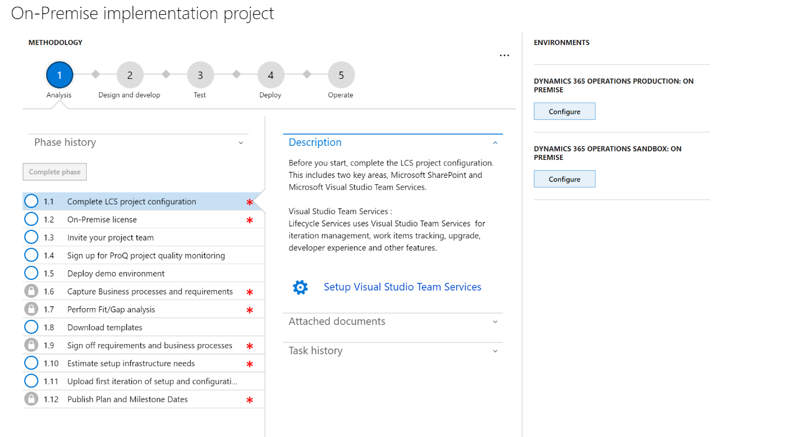

---
# required metadata

title: Create an on-premise project in Lifecycle Services
description: This topic provides informaton about the process of setting up an on-premise project in Lifecycle Services (LCS). 
author: kfend
manager: AnnBe
ms.date: 06/09/2017
ms.topic: article
ms.prod: 
ms.service: dynamics-ax-platform
ms.technology: 

# optional metadata

# ms.search.form: 
# ROBOTS: 
audience: Developer, IT Pro
# ms.devlang: 
# ms.reviewer: 51
ms.search.scope: AX 7.0.0, Operations
# ms.tgt_pltfrm: 
ms.custom: 60373
ms.assetid: 
ms.search.region: Global
# ms.search.industry: 
ms.author: manado
ms.search.validFrom: 2016-02-28
ms.dyn365.ops.version: AX 7.0.0

---
# Create an on-premise project in Lifecycle Services
Lifecycle Services is required to deploy and update a Microsoft Dynamics 365 for Finance and Operations Enterprise Edition on-premise instance. After you purchase a server and user license through the **Volume Licensing** or **Dynamics Purchase List** flow, you will receive an email with instructions to log on to Lifecycle Services. Follow the instructions in the topic, <TODO – link to Shelly/Matthews doc>, to create or use an existing Azure Active Directory account, a pre-requisite for logging onto LCS, and then complete all the sign-up steps. You will be redirected to Lifecycle Services and a On-premise implementation project will be provisioned for you.

 

The On-premise project has all of the tools necessary to implement, maintain, and operate an on-premise solution. Tools available in the On-premise project include:
 - **Methodology**: The On-premise methodology provides best practices to help customers implement and manage On-premise projects.
 - **Business Process Modeler**: Business Process Modeler (BPM) is used to capture requirements and do fit gap analysis. 
 - **Cloud-hosted environments**: Cloud-hosted environments are used to deploy developer and build topologies and complete Dev ALM for on-premise solutions. 
 - **Code upgrade**: Tools that assist with upgrading code to a newer release. 
 - **Issue search**: Search for published KBs related to application and platform issues. 
 - **Localization and translation**: Localize and translate assets. 
 - **Support**: File and track support incidents. 
 - **Project users**: Assign users to a project.
 - **Project settings**: Edit project-level settings such as connectors, project name, organization users, and license number. 
 - **Asset library**: Library for various assets, such as packages.
 - **SharePoint online library**: Connect to an online SharePoint library.

To start your on-premise implementation, you must follow the steps in the methodology to correctly set up the project, deploy the developer and build environments, and then deploy Sandbox and Production environments. The On-premise project has two environment slots which are pre-allocated to assist with deployments. There is one for Sandbox and one for Production and they will be used during the Servicing flow to ensure that packages are tested on Sandbox before applying packages in Production. 
