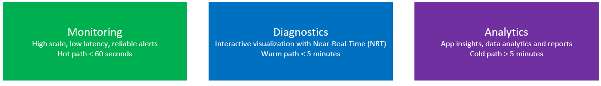

---
# required metadata

title: Monitoring and diagnostics (Lifecycle Services, LCS)
description: This topic describes the various tools that Microsoft Dynamics Lifecycle Services (LCS) provides to help you monitor, diagnose, and analyze the health of the Microsoft Dynamics 365 for Operations environments that you manage.
author: kfend
manager: AnnBe
ms.date: 04/04/2017
ms.topic: article
ms.prod: 
ms.service: Dynamics365Operations
ms.technology: 

# optional metadata

# ms.search.form: 
# ROBOTS: 
audience: Developer, IT Pro
# ms.devlang: 
# ms.reviewer: 51
ms.search.scope: Operations
# ms.tgt_pltfrm: 
ms.custom: 267184
ms.assetid: eb056816-ccf4-43a5-aed3-cf72543353de
ms.search.region: Global
# ms.search.industry: 
ms.author: manado
ms.search.validFrom: 2016-11-30
ms.dyn365.ops.version: Version 1611

---

# Monitoring and diagnostics (Lifecycle Services, LCS)

[!include[banner](../includes/banner.md)]

This topic describes the various tools that Microsoft Dynamics Lifecycle Services (LCS) provides to help you monitor, diagnose, and analyze the health of the Microsoft Dynamics 365 for Operations environments that you manage.

To have a successful onboarding experience to the cloud service for Microsoft Dynamics 365 for Operations, you must know the health of your environments at all times. You must also be able to troubleshoot any health issues that occur. Microsoft Dynamics Lifecycle Services (LCS), which is the administration center for Dynamics 365 for Operations, contains a collection of monitoring and diagnostics tools that can help guarantee that you have an accurate view of the environments that you manage.

## Telemetry data
The telemetry data that is the basis of the Monitoring and diagnostics portal in LCS has three primary use cases: monitoring, diagnostics, and analytics. 

### Monitoring

In business operations software, you should always know whether your environment is up and running, so that it can perform business operations. You should also be able to easily view the health of the environment through LCS. Microsoft supports two types of monitoring capabilities:

-   **Availability monitoring** – This type of monitoring performs a check against the environment to make sure that it's available at all times. If the check fails, the Microsoft Service Engineering team is immediately notified.
-   **Health monitoring** – In addition to availability checks, some basic health checks must be performed. These basic health checks include CPU level, memory consumption of the virtual machines (VMs), and the total number of deadlocks in a five-minute period. Microsoft Telemetry Infrastructure collects lots of health metrics from the environments. If a metric cross a threshold value, the Microsoft Service Engineering term is alerted so that it can investigate the issue.

### Diagnostics

When a user reports an issue, you can use various tools in LCS for troubleshooting. The rich set of telemetry data helps you build a storyboard view that shows what that user and other users were doing when the issue was reported. In addition to user activity tracking, a rich set of SQL data is available for performance troubleshooting.

### Analytics

Analytics is another critical use case for the telemetry data that is collected. Currently, only Microsoft can perform analytics, so that it can gauge and understand feature usage and performance through Microsoft Power BI.

## Responsibilities
For a managed cloud service such as Dynamics 365 for Operations, Microsoft is responsible for actively monitoring the health of production environments at all times. If a customer's environment is affected by an issue, the Microsoft Service Engineering team is immediately alerted. The team will start to investigate the issue and will work with you to find a resolution. However, you're responsible for proactively or reactively monitoring and troubleshooting the health of non-production environments.

## Access the Monitoring and diagnostics portal
1.  Open LCS, and navigate to the appropriate project.
2.  In the **Environments** section, select the environment to view, and then click **Full details**.
3.  On the **Environment details** page, click **Environment monitoring** to open the Monitoring and diagnostics portal. 

## Tools
Several tools and resources are available in the Monitoring and diagnostics portal. **Note:** Not all environments contain all the tools. The following table shows the tools that are available for each type of environment.

<table>
<colgroup>
<col width="50%" />
<col width="50%" />
</colgroup>
<thead>
<tr class="header">
<th>Environment type</th>
<th>Tools</th>
</tr>
</thead>
<tbody>
<tr class="odd">
<td>Production systems</td>
<td><ul>
<li>Activity monitoring</li>
<li>Environment monitoring</li>
<li>SQL insights</li>
<li>System diagnostics</li>
</ul></td>
</tr>
<tr class="even">
<td>User acceptance testing (UAT)/sandbox</td>
<td><ul>
<li>Activity monitoring</li>
<li>SQL insights</li>
<li>System diagnostics</li>
</ul></td>
</tr>
<tr class="odd">
<td>Demo/build</td>
<td><ul>
<li>Activity monitoring</li>
<li>System diagnostics</li>
</ul></td>
</tr>
</tbody>
</table>

### Monitoring dashboard

In the Monitoring and diagnostics portal, click the **Environment** tab to view the Monitoring dashboard. On the dashboard, a green check marks indicate that the environment is available to perform business operations. Health metrics are collected for every machine and component. These health metrics include CPU usage, errors logged per second, and batch heartbeat. For some metrics, Microsoft has set up threshold values. If a metric crosses the threshold, an alert is triggered. For example, an alert is triggered if CPU usage exceeds 70 percent. You can view the health monitors for a specific area to see what is occurring.

### Activity monitoring

In the Monitoring and diagnostics portal, click the **Activity** tab to use the Activity monitoring tool. This tool provides a storyboard view that shows what you or another user was doing during a specific period. 

-   The **User interaction** chart shows a user's activities on various machines in the environment and the SQL utilization trend.
-   The **User load** section shows all the system users. Each chart shows the time that the user spent on a specific machine.
-   The **Activity load** section shows the activities that were performed on each machine. If you hover over an activity, you see the Form:Control:Action as a tuple. For example, if you look at LedgerJournal:New:Click in this section, you can see that user A opened the **LedgerJournals** page and clicked the **New** button to create a new journal entry.
-   The **User activity** grid shows the various activities that users performed, based on their session timestamp.

You can use the filters on this page to narrow the information logs. Here are some of the filters that are available:

-   **Time duration** – Go back 60 minutes from the selected date and time.
-   **User** – View a specific user's activities.
-   **Search terms** – Create a search that is based on the issue that is being investigated.

**Important:** The Activity monitoring tool retains data for only 30 days.

### Raw information logs

For advanced troubleshooting, you can view raw information logs. You can use a set of predefined queries to get raw logs for an issue. You can then export the logs to do more advanced analysis. The following types of queries are available:

-   Slow queries
-   Deadlocks
-   Crashes
-   Financial reporting issues

### SQL insights

The Monitoring and diagnostics portal also includes advanced SQL troubleshooting tools to enable performance analysis. Some of these tools resemble the DynPerf tool that was used for SQL troubleshooting in Microsoft Dynamics AX 2012.

#### Performance metrics

The **Performance metrics** page shows the most expensive queries that were run in the system during the selected period, based on logical I/O, execution count, duration, CPU time, and wait count. This data is queried from the SQL query store. The data is retained for 30 days, and the tool runs its data collection every day at 10 PM Coordinated Universal Time (UTC).  To use the tool, follow these steps.

1.  Select a period during the last 30 days.
2.  When the query results appear, select the first bar in the duration chart to highlight where the query falls on other metrics.
3.  On the **Statement** tab, view the query, or download the query execution plan.

#### SQL now tool

You can use the SQL now tool for just-in-time diagnostics. For example, a report is running slowly, and you want to see whether there are any locking/blocking issues and what SQL statements are running in the background. In this case, you can open this page and refresh it while the report is being run.

#### Index analysis

The Index analysis tool shows aggregated index and table information, based on user scans, user seeks, user updates, and row count. Like performance metrics, this tool shows the trend for the selected index together with additional table metrics.

### System diagnostics

The System diagnostic tool is a rule-based framework that runs a predefined set of rules against the environment and provides a report about the status of the rules. If failures occur, this tool provides recommendations for addressing the issue. To start the System diagnostics tool, on the LCS project dashboard, click the hamburger icon, and then click **System diagnostic**.

